# 建立一个安卓黑客实验室

> 原文：<https://infosecwriteups.com/manager-from-hackthebox-b93aecbd46dd?source=collection_archive---------3----------------------->

Android 开发简介的一部分

你好，了不起的黑客们，我是 Hac，今天我们将建立我们的 android 黑客实验室，我们将做 [**经理**](https://app.hackthebox.com/challenges/283) 来自**黑客盒子**这是一个简单的 **android** **挑战**，你必须利用 android 应用程序来获得旗帜。这也是了解更多 android 黑客的好机会。

## 如果你知道基本的网络黑客，这是一个简单的挑战，但最困难的部分是建立一个合适的实验室。所以把这篇文章看作是建立适当的环境，我知道有很多很酷的东西，比如 SSL pin 等等，但是这篇文章是为那些不熟悉 android 开发的人写的。

为了完成这个挑战，我们需要安装[**GENYMOTION**](https://www.genymotion.com/download/)**(这是一个 android 模拟器)，并确保安装了虚拟盒子。**

**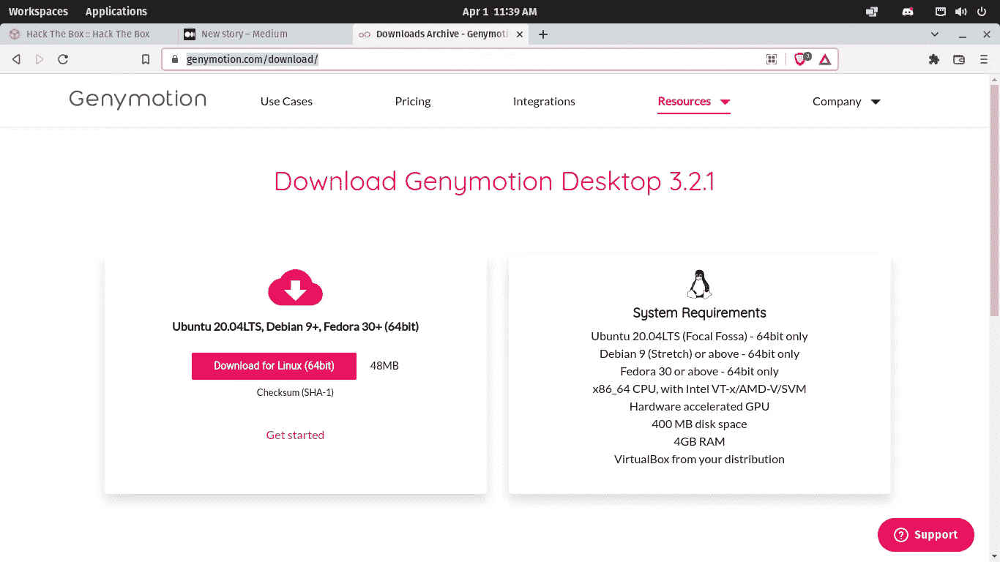**

**成功安装 genymotion 后，您需要创建一个帐户，请继续操作。之后，我们将安装 Android 7.1(它对我来说是有效的)。**

**打开 Genymotion，然后点击+号**

**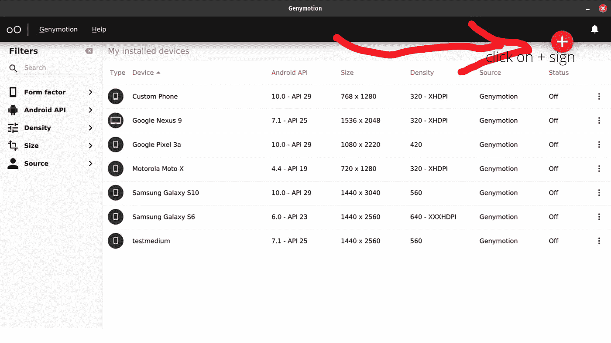**

**然后点击 Android API >然后选择 7.1-API 25 >然后选择谷歌 Nexus 9 >然后选择下一步。(等待几分钟或几秒钟，它就会完成)**

**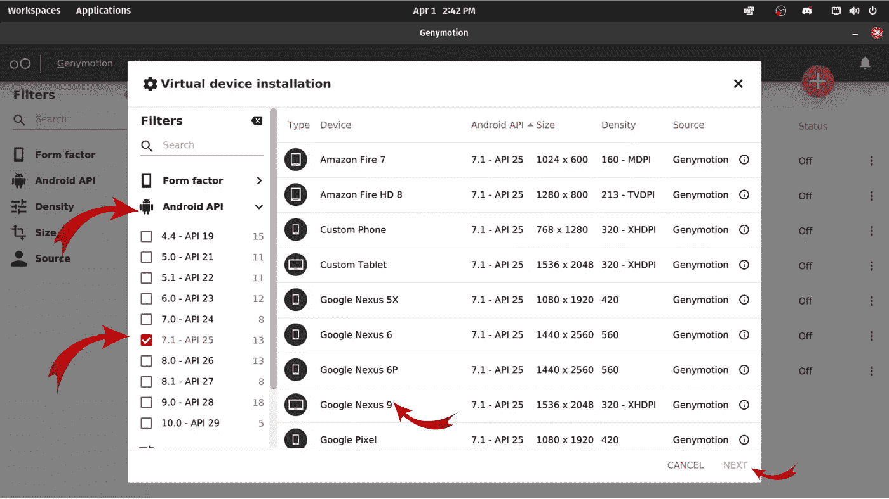**

**现在我们需要设置代理，这样我们就可以拦截我们的 android 设备发送的请求。所以打开你的打嗝套件，然后进入代理>选项。**

**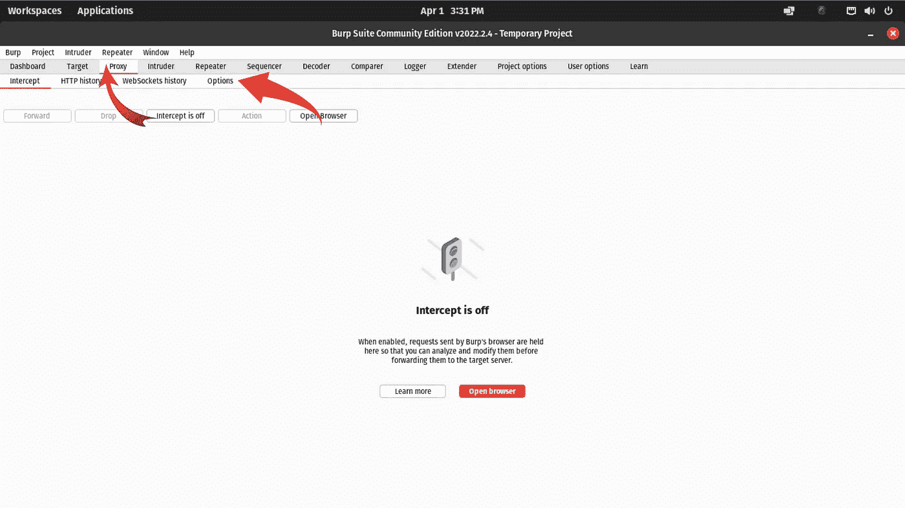**

**之后，在代理监听器下点击添加>添加您的端口号(4444)>所有接口>确定**

**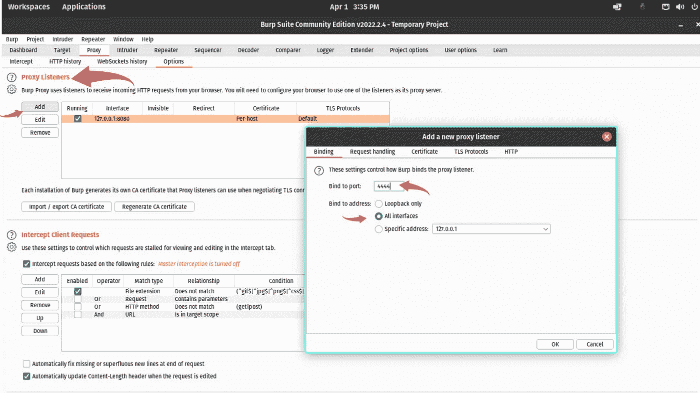**

**我们的打嗝套房准备好摇滚了！！！！！。但是等一下，我们必须为 android 设备配置我们的代理(对不起，我忘记截图了，但是我有屏幕记录)。**

**现在我们需要将我们的挑战文件从我们的机器发送到 android 应用程序**

**摇滚的时间到了。让我们快速检查一下我们是否能够拦截请求和………..**

**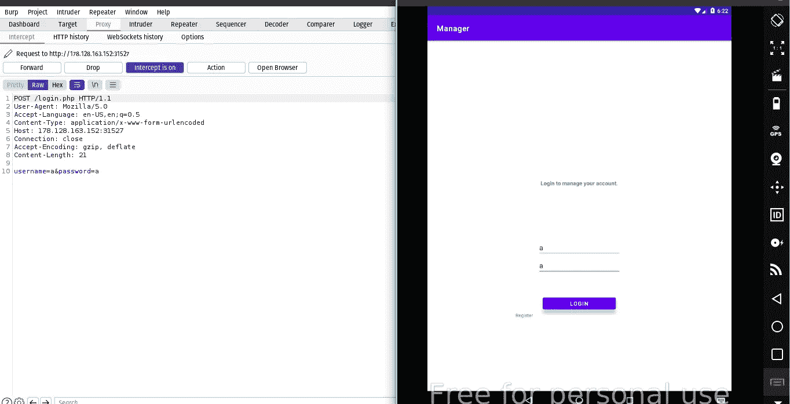**

**我试着用像 admin:admin，admin:password 这样的凭证登录，但是没有成功，但是我们可以创建用户，让我们开始吧。**

**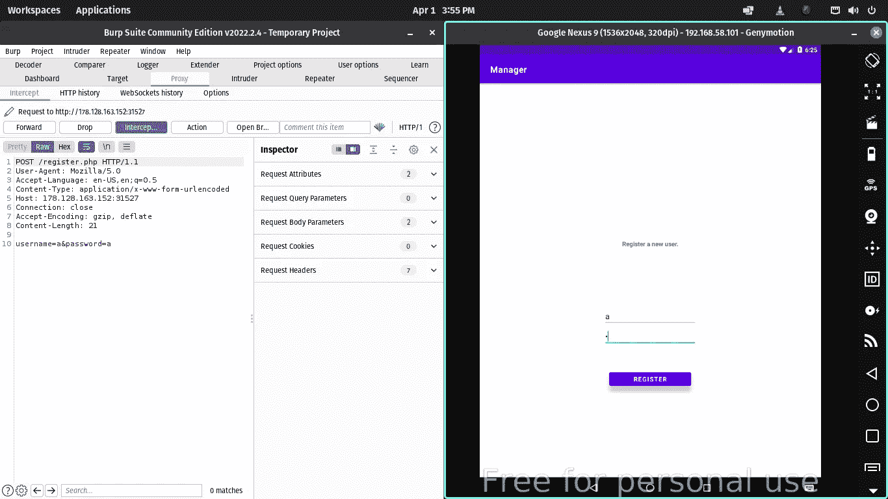**

**现在让我们登录我们的用户帐户**

**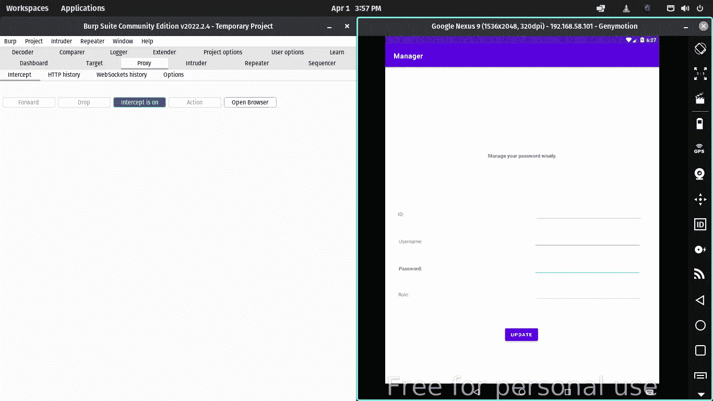**

**我们可以试试把用户名改成 admin？？**

**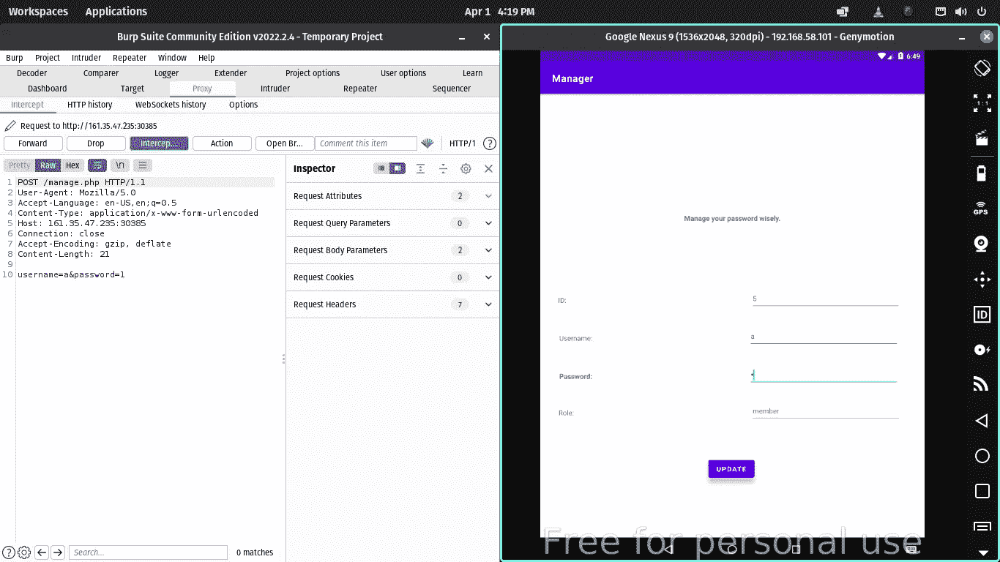**

**还有……..嘣，成功了，我们现在是管理员了(我想用不同的参数来玩，但是这太简单了，哈哈)**

**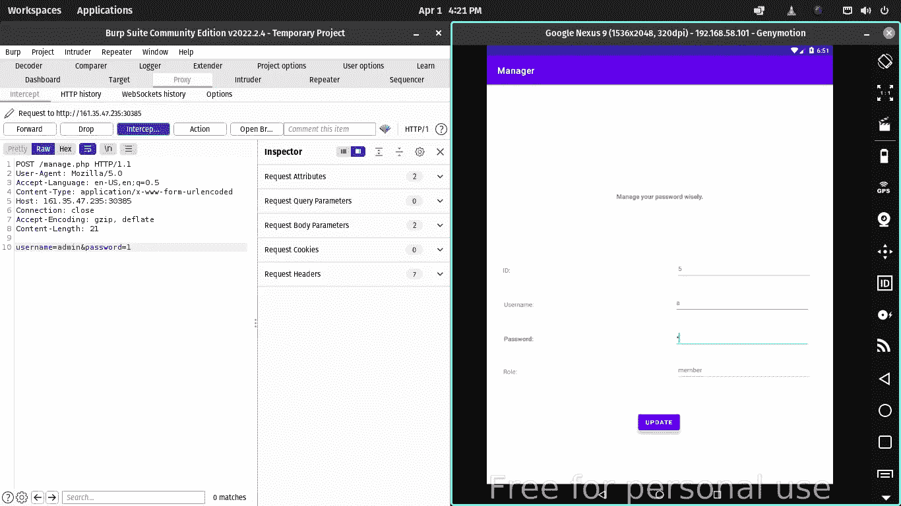****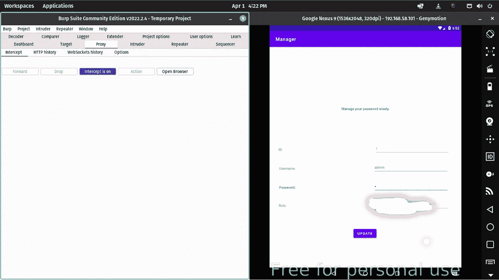**

**我希望你喜欢这个，并且学到了新的东西。如有任何问题请随时 dm 上 [**推特**](https://twitter.com/Hac10101)**