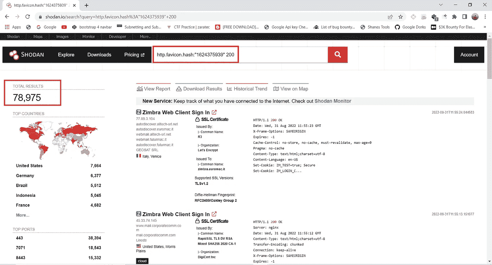
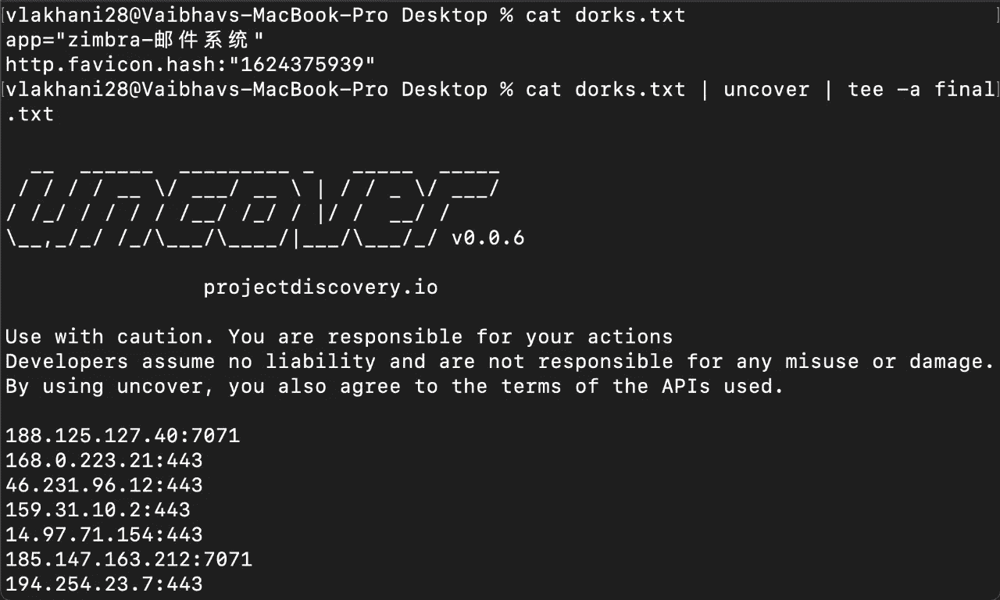
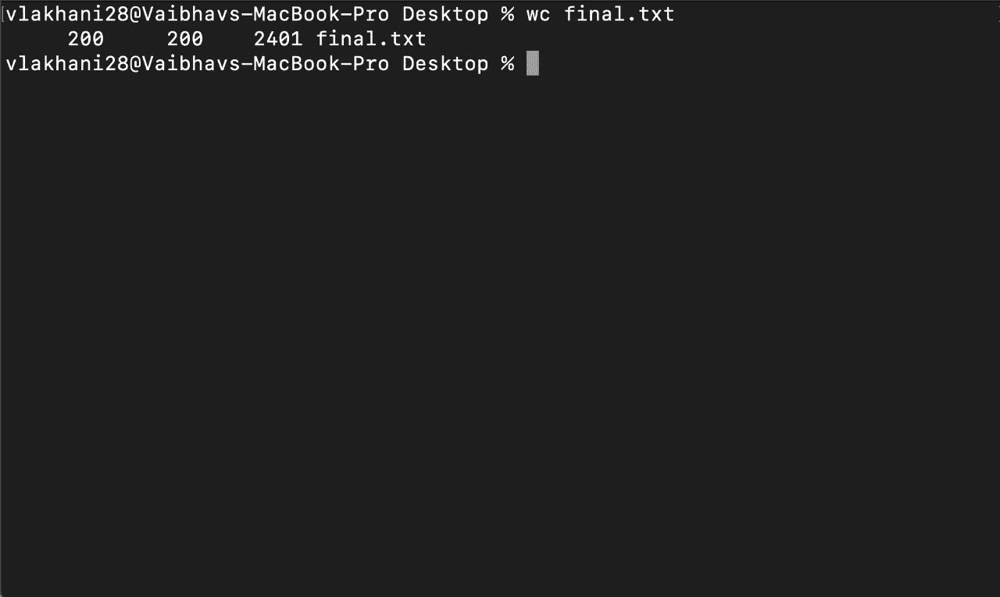
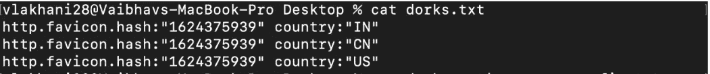
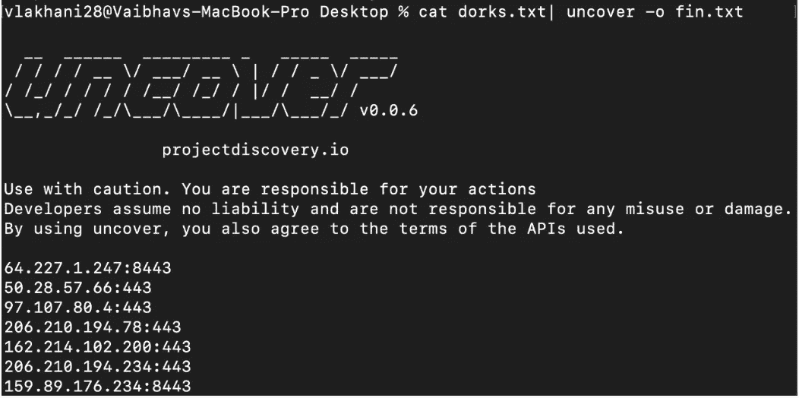
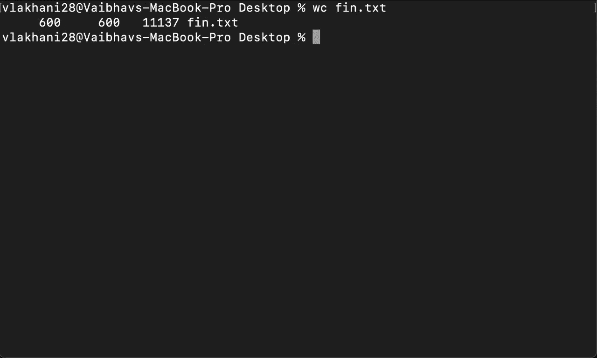
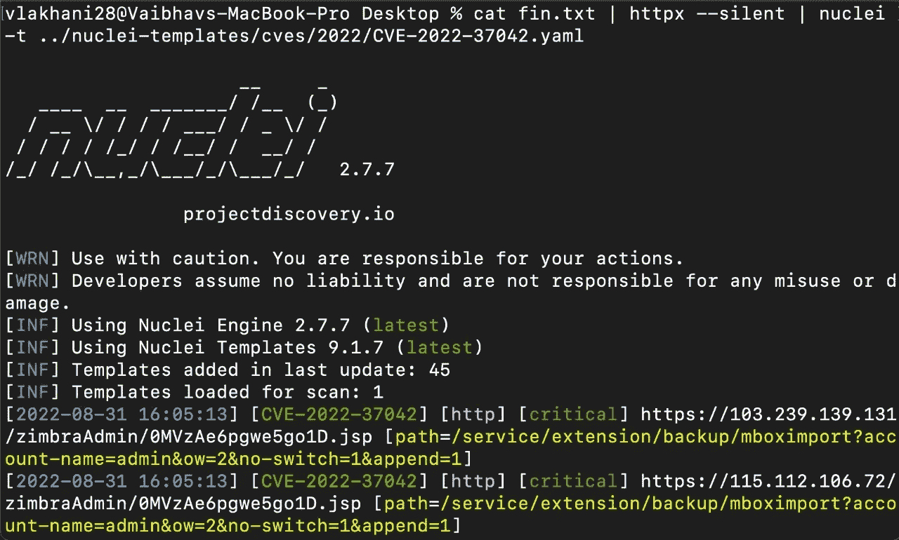

# 大规模狩猎 CVE 的第一部分👀🔥

> 原文：<https://infosecwriteups.com/mass-hunting-cves-part-1-1e162ba6028b?source=collection_archive---------0----------------------->

VE 是“常见漏洞和暴露”的缩写，是公开披露的计算机安全缺陷的列表。CVE 编号唯一地标识列表中的一个漏洞。

第一步是找到你想猎杀的 CVE！我们将以[CVE-2022–37042](https://cve.mitre.org/cgi-bin/cvename.cgi?name=CVE-2022-37042)为例。下一步是找到一些 shodan/fofa 呆子，利用他们我们可以找到多个易受这个特定 CVE 攻击的 IP。你可以创造你自己的呆子，或者谷歌一下。很多研究人员也为同样的事情发帖子。在我们的案例中，它将是:

> **Shodan-query**:**http . favicon . hash:" 1624375939 " 200**
> 
> **fofa-query : app=”zimbra-邮件系统”**

从 Shodan 找到 79K 个结果

下一步是将这个呆子传递给[揭开](https://github.com/projectdiscovery/uncover)以获得所有域的列表。

> **命令:cat dorks . txt | uncover | tee-a final . txt**

现在，在检查我们有多少个 IP 时，我们发现了以下结果:

我们只有 200 个来自 uncover 的结果，而我们从 shodan 找到了将近 79k 个 IP。这是因为 Shodan Api 的限制。

因此，为了扩大我们的范围，我们想通过添加更多的过滤功能来修改我们的 dork，以便通过 uncover 从 shodan 提取更多的 IP。你也可以在 uncover 的配置文件中添加多个 shodan API 键。

使用国家参数修改了 dork:

> **http . favicon . hash:" 1624375939 "国家:"美国"**

现在我们将创建一个这种呆子的小列表:

注意:您可以添加更多的呆子为更多的结果

现在我们将通过这份呆瓜名单来揭开:

让我们看看我们现在有多少个 IP:

所以现在我们终于有了更多的 IP。

你可以用不同的参数创建你自己的呆子，用这种技术从 shodan 获得更多的结果，并在评论区与我们分享。

接下来，将 IP 列表传递给 httpx，以找到启动并运行的 IP。然后将其与模板名称一起提供给 nuclei，以找到有效的模板。

> **命令:cat fin . txt | httpx—silent | nucleus-t../nucleus-templates/cves/2022/CVE-2022–1388 . YAML**

整个过程可以用这个 liner 脚本来转换:

> ***命令:cat dorks . txt | uncover—silent | httpx—silent | nucleus—t../nucleus-templates/cves***

我们希望这项技术可以帮助你大规模搜索 CVE 氏症，并找到许多脆弱的领域。

狩猎愉快！

请继续关注我们的第二部分，将会分享一些更酷更有趣的大规模狩猎方法。

**作者:**

瓦伊巴夫·拉哈尼:

[https://www.linkedin.com/in/vaibhav-lakhani](https://www.linkedin.com/in/vaibhav-lakhani)

https://twitter.com/vlakhani28

[迪尔帕尔马](https://www.linkedin.com/in/dhir-parmar-925b171a4):

[https://www.linkedin.com/in/dhir-parmar-925b171a4](https://www.linkedin.com/in/dhir-parmar-925b171a4)https://twitter.com/dhirparmar

*来自 Infosec 的报道:Infosec 上每天都会出现很多难以跟上的内容。* [***加入我们的每周简讯***](https://weekly.infosecwriteups.com/) *以 5 篇文章、4 个线程、3 个视频、2 个 Github Repos 和工具以及 1 个工作提醒的形式免费获取所有最新的 Infosec 趋势！*