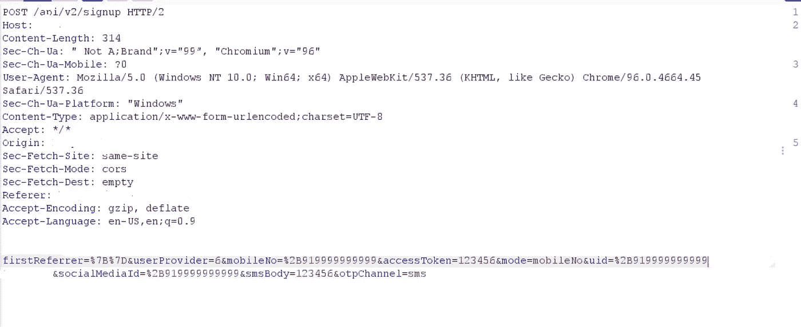

# 大规模用户帐户接管(将漏洞链接到 IDOR)😲

> 原文：<https://infosecwriteups.com/massive-users-account-takeovers-chaining-vulnerabilities-to-idor-ea4e1b6407d2?source=collection_archive---------0----------------------->

*猎人们好👋✌这是我第七次写🧾* ，

在这里，我将展示一个有趣的案例，我能够接管应用程序的任何用户帐户，甚至是管理员/雇员帐户。

让我们移动用例，

考虑网站为 redacted.com**，现在网站使用电话号码供用户登录，现在经过观察，我发现有一些电话号码如*999999999999，88888888888，7777777777 …………111111111 等*。这不需要实际的认证，我可以使用任何 OTP 号码登录，但使用其他电话号码(比如我的号码)，他们实际上正在进行认证。**

****

****但是为什么上述电话号码没有实际认证呢？****

**背后的原因是，在部署到实际的生产环境之前，开发人员有时会使用一些默认的电话号码，如 999999999、8888888888……。*。*用于*即时访问应用程序并测试内部功能*而无需任何实际认证，例如在这种情况下，无需正确的 OTP 即可访问应用程序。**

**现在，无论何时将应用程序部署到生产环境，开发人员都有责任禁用此功能，因为这些帐户仍然包含一些开发人员或员工信息，如地址、电子邮件、银行详细信息和更多元信息。**

**但有时开发人员忘记更改功能，外人可以登录这些默认电话号码。**

***现在，我想报告这个问题，但我没有报告，我想如果我使用这个功能进入其他用户的帐户会怎么样。***

****现在到了链接部分，****

**现在我开始分析请求和响应，它们的参数和令牌。**

**注册帖子请求看起来像下面的截图，**

****

**现在，您可以观察到有许多参数传递给定的电话号码，并且可以评估上述电话号码的任何 OTP 值。**

**现在，我手动检查了所有三个参数 ***mobileNo、uid 和 socialMediaId*** 的响应，方法是将它们更改为受害者的电话号码，**

**现在 ***uid*** 参数被发现易受攻击，下面是我如何查看用户信息并登录其帐户的示例截图。**

****

**响应 JSON 参数"***isExistingUser "***和消息 ***“登录成功”*** 确认用户账号的存在和接管，这样我可以通过知道他们的电话号码登录任何账号。**

**你可以通过侦察(像 google，GitHub dorks，LinkedIn，contact pages)获得很多电话号码，你可以测试漏洞。**

****由于*注册终点没有费率限制，因此影响更大。*****

**由于没有速率限制，我甚至可以暴力破解电话号码，并通过响应 JSON 参数“ ***isExistingUser=true”(这将确认现有用户)*** 使用入侵者和过滤结果，这样我可以进入任何*用户/员工/管理帐户*。**

****因此，这种方式的影响变得至关重要**然后，我向相关组织报告了这个问题，并获得了$$$奖金(由于隐私政策原因，我不能透露目标)。**

****希望你喜欢这篇报道😁，下拉您的意见和建议👇**。**

**订阅我的 youtube 频道寻找 bug 相关的东西: [**redirect _poc**](https://www.youtube.com/channel/UCq7-Qf45etdk0qc35I_n7PQ?sub_confirmation=1)**

**你可以在 Instagram 上关注我**

**在 Linkedin 上关注我: [**我的 _linkedin**](http://linkedin.com/in/anurag-verma-650b771a2)**

**给我买杯咖啡😍:[此处](https://www.buymeacoffee.com/redirectpoc)**