# Meepwn CTF 质量 2018 年综述—第 1 部分

> 原文：<https://infosecwriteups.com/meepwn-ctf-quals-2018-writeup-part-1-ab216bbf0b35?source=collection_archive---------0----------------------->

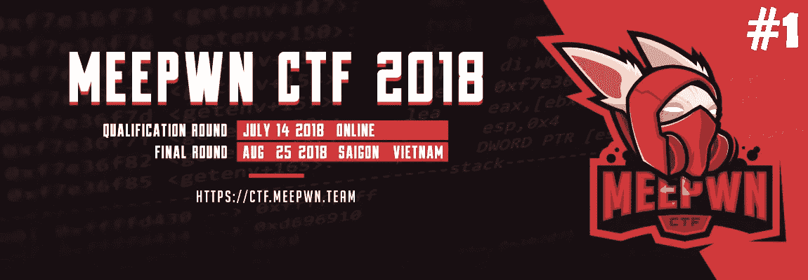

Meepwn CTF 质量 2018 年综述—第 1 部分

本周，我刚刚决定与 [HackXore](https://www.facebook.com/HackXore/) 团队一起参加 Meepwn CTF Quals 2018，因为我们去年在 mee pwn 2017 年第一届 CTF 中获得了前 10 名(第 10 名)，这是一个非常好的挑战。

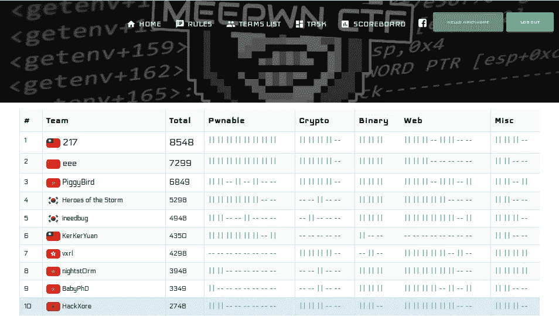

MeePwn 第一届 CTF 2017 决赛记分牌(TOP10)

13/07/2018

CTF 在世界协调时下午 19:00 开始，我在世界协调时下午 20:00 醒来，在世界协调时下午 21:00 去参加一个会议，在世界协调时下午 23:00 结束会议，然后我在世界协调时下午 23:30 加入团队参加 Meepwn CTF Quals 2018，并享受与这样一个酷家伙解决挑战。

当我加入这些家伙时，我发现他们解决了一个任务(MISC [Welcome — 100pts])。杂项类别中有两个挑战，一个任务的解决率为 0(白雪、黑影-1000 分)。

1.  **白雪，黑影**


白色的雪，黑色的影子(杂项-1000 分)

这是 T4 的附件 T5。

第一次，在我发现这是 JPEG 图像后，我尝试了一些隐写工具，如 exiftool，binwalk，foremost …等等，但我不能从这张图像中提取任何有趣的东西。

然后我试着把它串起来，然后我注意到一些有趣的事情:

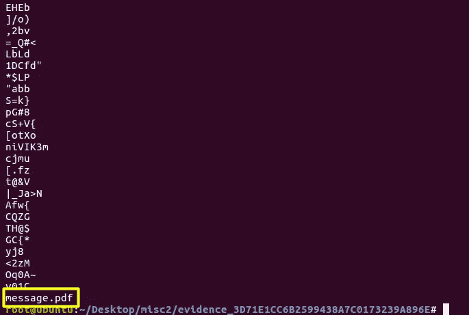

给定图像的字符串

我发现这张图片中有一个 PDF 文件，我必须用另一种不同的方法提取它。

过了一会，队友(@rls1004)给我发消息，告诉我她在十六进制字节中间发现了一个 Eof。

好的，在我检查之后，我发现了这些有趣的字节(FF D9)，这是 Eof(JPEG 图像的结尾):

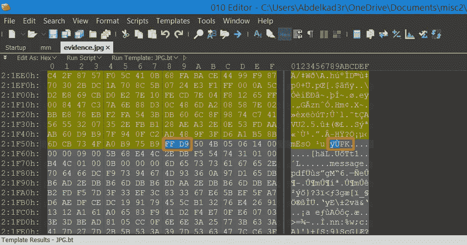

Eof JPEG 图像

这意味着在 JPEG 图像之后还有另一个文件。正如你所看到的，有一个有趣的事情是(PK)；这是 PK 签名！

我在谷歌上搜索了一下，然后我发现了这篇有趣的维基百科文章，它给了我们一个文件签名列表。

从这篇文章中，我了解到 PK 签名可以支持 ZIP 文件，这意味着签名可以是 ZIP 文件签名，这意味着:

> 图像=图像+ ZIP 文件

我们有了图像，需要检查 ZIP 文件，所以我们只提取 ZIP 文件:

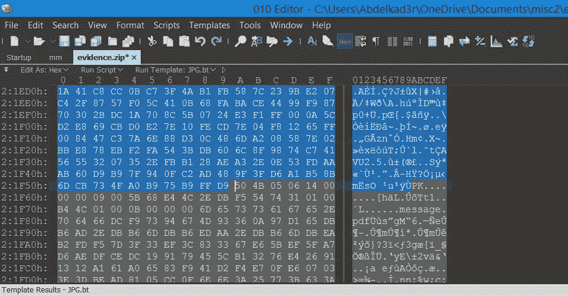

选择图像字节直到 Eof

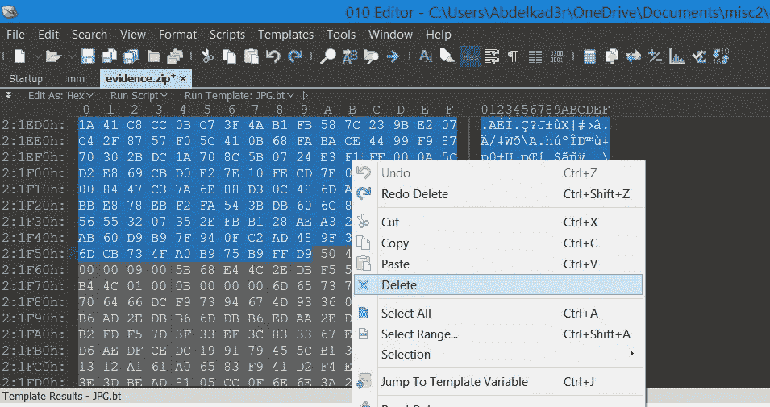

删除选定的字节

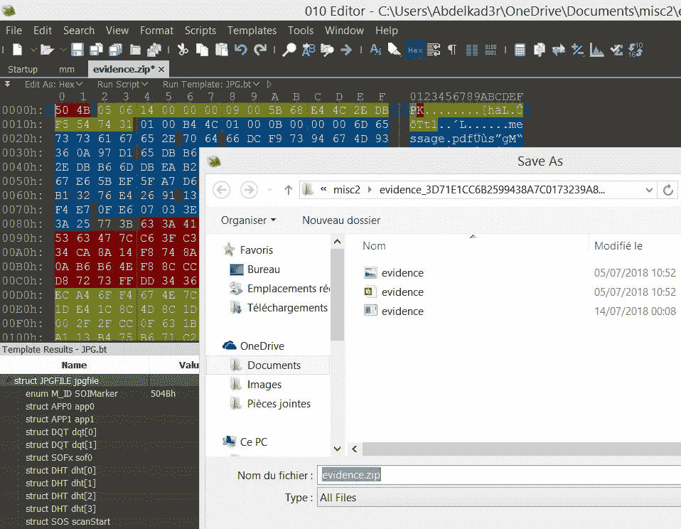

将其保存为 ZIP 文件

通过使用两行 python 代码，还有另一种非常简单快捷的方法:

```
#!/usr/bin/env python
#MeePwn CTF Quals 2018 | MISC [White Snow, Black Shadow - 1000pts]
#@Abdelkader
#@rls1004msg = open("evidence.jpg","rb").read()[0x21f5A:]
open("message.zip","wb").write(msg)
```

但我们无法打开这个 ZIP 文件，这是一个问题，过了一会儿，我的队友告诉我，我们必须修复这个 ZIP 文件的头，错误在两个字节(05 06)中，用于分区压缩的信息，因此要修复它，我们必须将其从分区压缩更改为单次压缩(03 04):

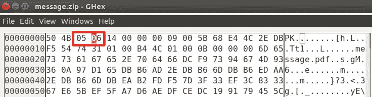

分区压缩字节

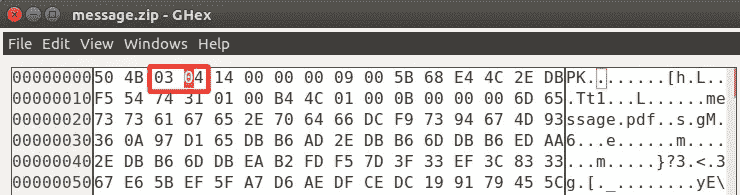

单个压缩字节

然后我把它保存为 message.zip，解压后我找到了(message.zip ),但我无法打开它，因为它是一个损坏的文件。

我用[在线修复 PDF 文件工具](https://www.pdf-online.com/osa/repair.aspx)修复:

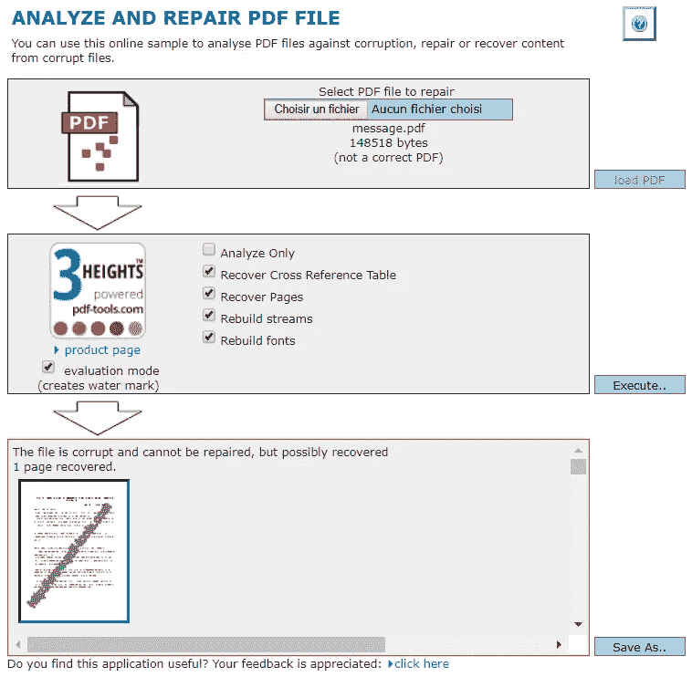

在线修复 PDF 文件工具

然后我保存为(message_recovered.pdf):

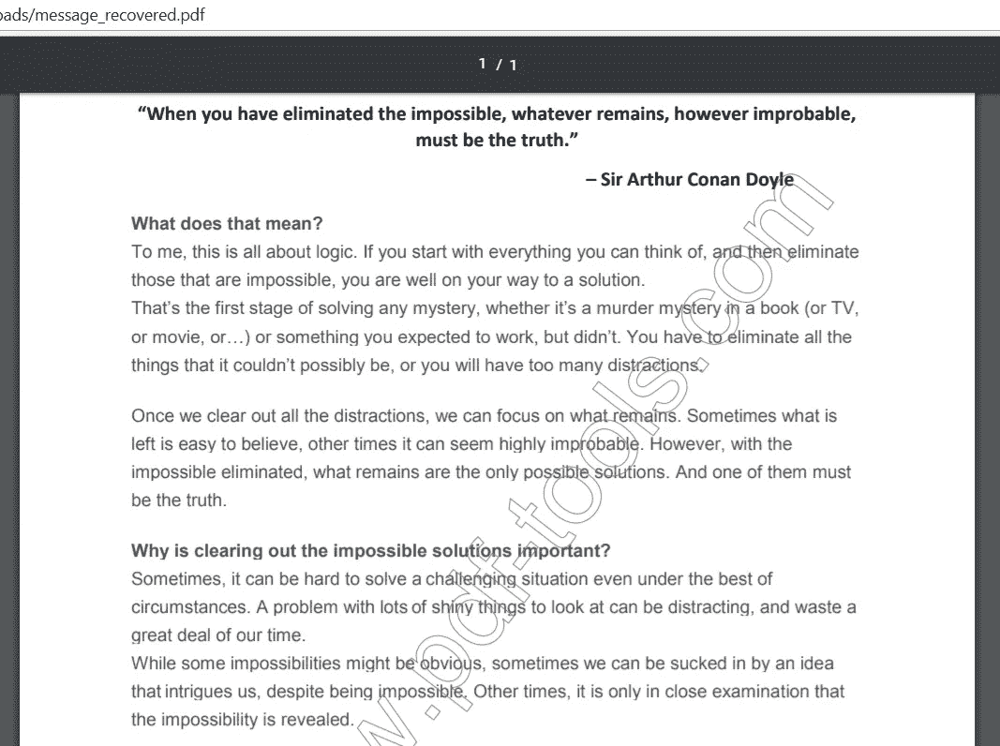

message_recovered.pdf 文件

但是直到现在我还看不到旗子。所以我试着在谷歌上搜索这段引文，以便找到原文:

> "当你排除了不可能，剩下的，不管多么不可思议，一定是事实."
> 
> ——阿瑟·柯南·道尔爵士

我找到了[的原文](https://philosiblog.com/2012/05/22/when-you-have-eliminated-the-impossible-whatever-remains-however-improbable-must-be-the-truth/)，然后我[将它与我的文本](https://www.diffchecker.com/)进行了比较，然后我得到了一些不同的字符:

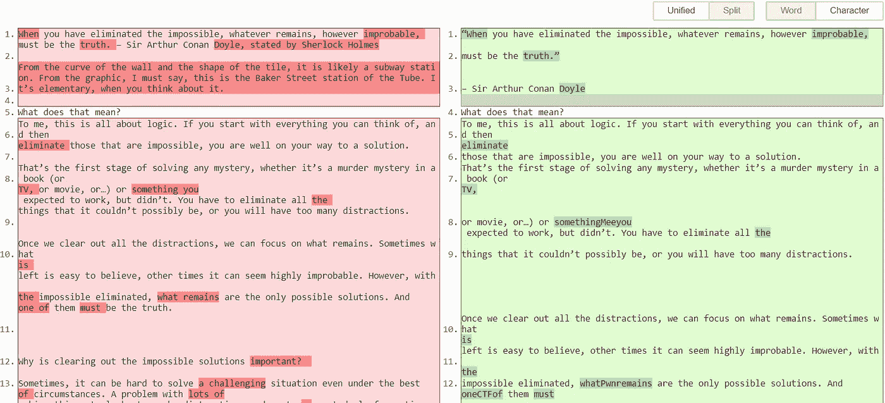

原文和我在 PDF 文件(message.pdf)中找到的文本之间的差异[1]

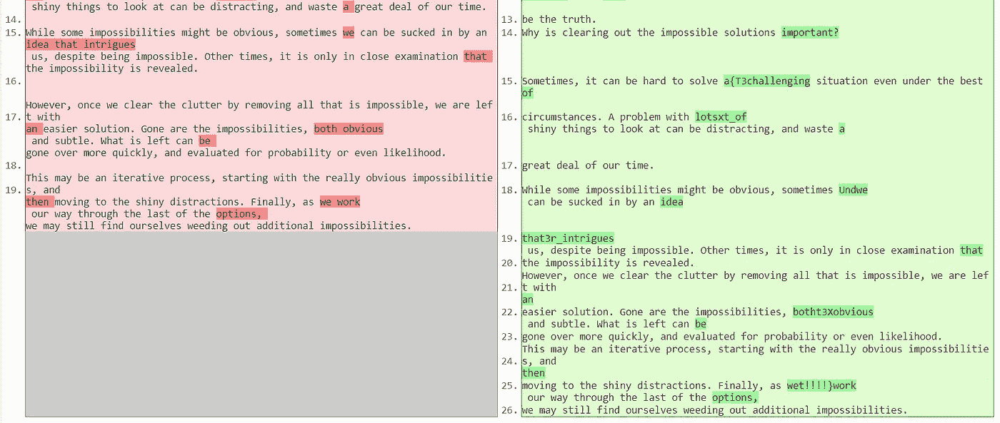

原文和我在 PDF 文件(message.pdf)中找到的文本之间的差异[2]

比较之后，我注意到这两个文本之间有一些不同的字符和单词，为了收集标志，我试着阅读文本，然后对所有离题的单词或字符进行排序，最后我也正确地收集了它。

> 标志为: **MeePwnCTF{T3xt_Und3r_t3Xt！！！！}**

这是一个有趣的任务，我想我花了两个小时和我的队友@rls1004 一起解决它，他们也帮助了我，这是我写的第一部分，还有其他我自己解决的挑战。

我要感谢 MeePwn 团队组织了这次 CTF，并创造了如此酷的任务。