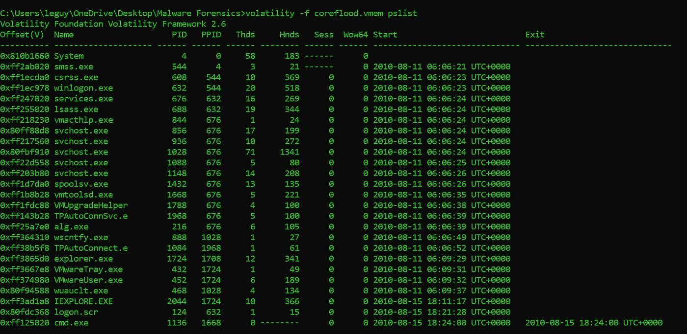
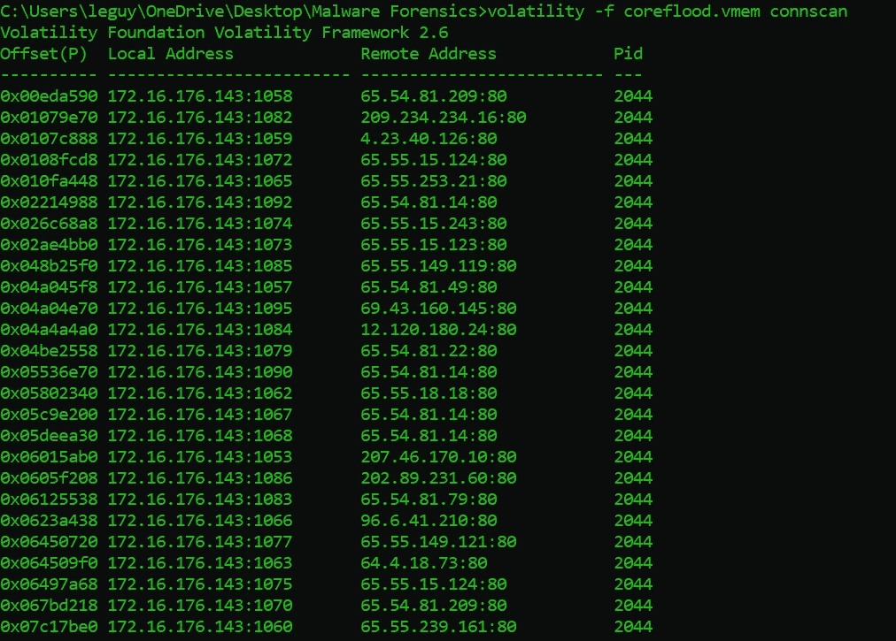
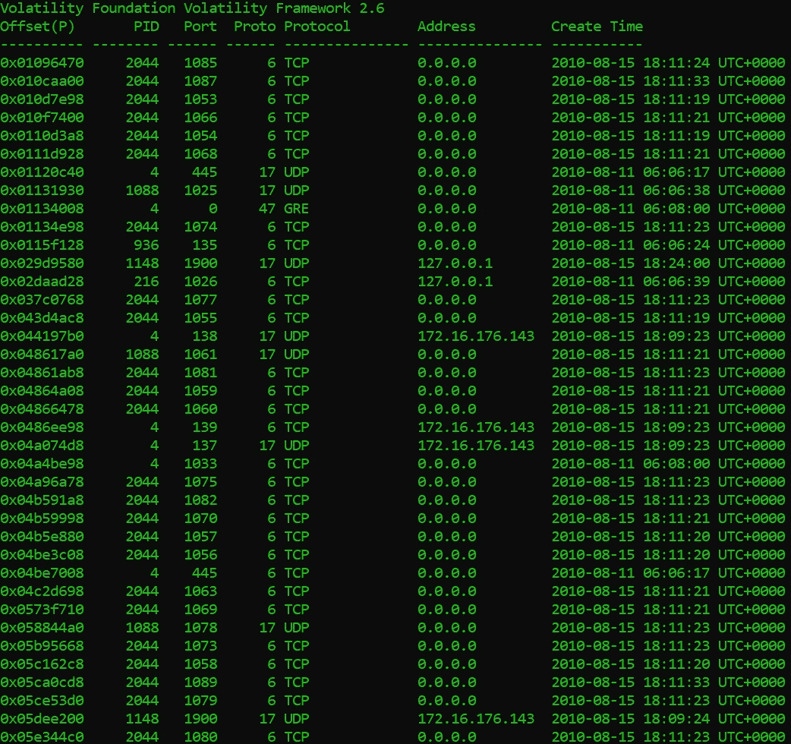
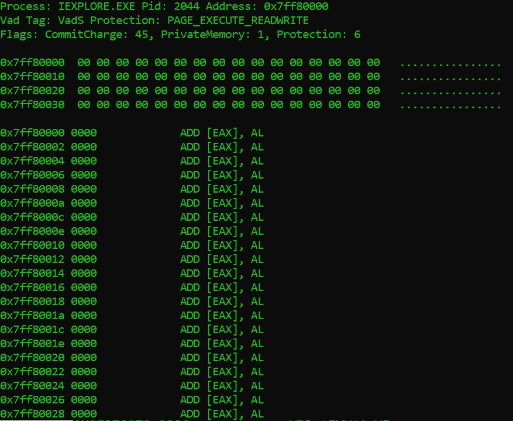
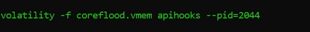
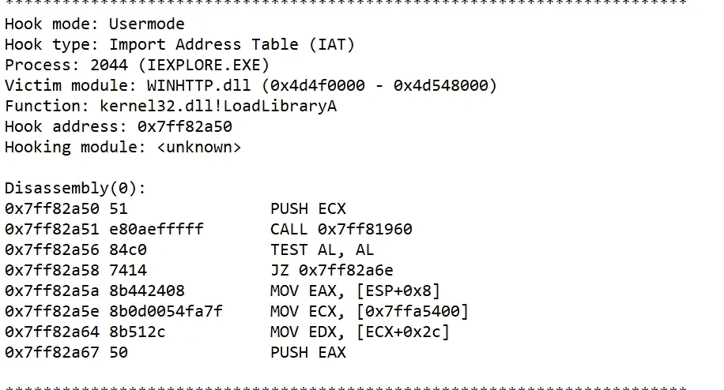
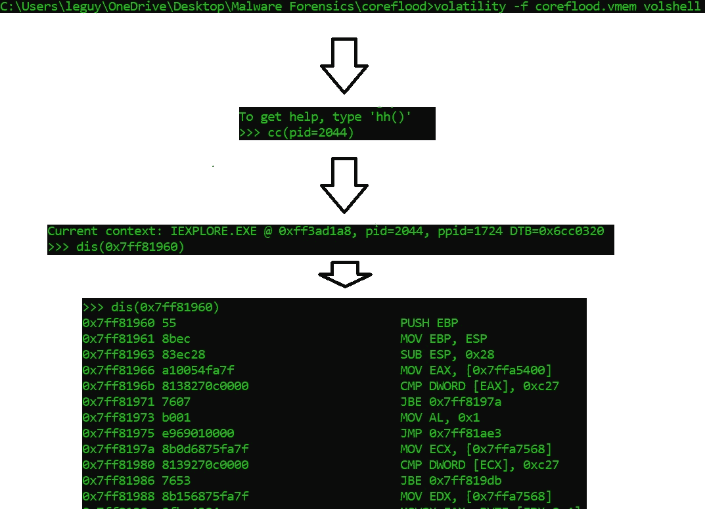
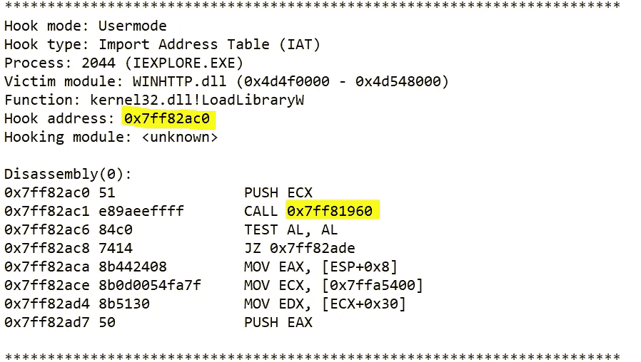

# Volatility Coreflood 特洛伊木马初学者的内存分析:第 1 部分

> 原文：<https://infosecwriteups.com/memory-analysis-for-beginners-with-volatility-coreflood-trojan-part-1-89981433eeb6?source=collection_archive---------0----------------------->

欢迎来到我的挥发性记忆分析系列。在开始这个系列之前，我想确保我们都了解了 Windows 的内部知识。如果你不确定你是否了解这些主题，你应该继续读一点。

您需要了解 Windows 中内存工作原理的基础知识。我会在文章中尽可能多的解释。除此之外，无论你有什么不明白的，都欢迎你去阅读！

阅读列表:

*   核心态
*   用户状态
*   虚拟内存
*   Windows 进程

一点背景知识:

内存取证(有时也称为内存分析)是指对计算机内存转储中的易变数据进行分析。信息安全专业人员进行内存取证，以调查和识别不会在硬盘数据上留下易于检测的痕迹的攻击或恶意行为。

通过内存取证实践，专家可以获得运行时系统活动，如开放的网络连接或最近执行的命令和进程。

在程序在计算机上执行之前，它们被加载到内存中，使用内存取证非常重要。每个被创建、检查或删除的程序或数据都存储在 ram 中。这包括图像、所有网络浏览活动、加密密钥、网络连接或注入的代码片段。在许多情况下，某些人为因素只能在 RAM 中找到，例如崩溃时出现的开放网络连接。攻击者可以开发仅驻留在内存而非磁盘中的恶意软件，使其对标准计算机取证方法几乎不可见。这使得内存取证工具的需求非常大。

Volatility 是一个高级的内存取证框架。它为调查人员提供了许多自动工具，使用高级内存分析技术来揭示主机上的恶意活动。它是用 python 实现的，而且是开源的！我建议查看他们的 git 存储库。

Volatility 的 git 回购和文件:

 [## 波动率基础/波动率

### 一个高级内存取证框架。通过创建一个……

github.com](https://github.com/volatilityfoundation/volatility) 

Volatility 的恶意软件专用命令文档

 [## 波动率基础/波动率

### 尽管所有的 Volatility 命令都可以以某种方式帮助你搜索恶意软件，但是有一些是专门设计的…

github.com](https://github.com/volatilityfoundation/volatility/wiki/Command-Reference-Mal) 

在这个系列中，我想对 Coreflood 特洛伊木马进行取证搜索。

> ***Coreflood*** *是一个由一群俄罗斯黑客创建并于 2010 年发布的* [*木马*](https://en.wikipedia.org/wiki/Trojan_horse_(computing)) *和* [*僵尸网络*](https://en.wikipedia.org/wiki/Botnet) *。联邦调查局在受感染系统的名单上包括“大约 17 个州或地方政府机构，包括一个警察局；三个机场；两家国防承包商；五家银行或金融机构；大约 30 所学院或大学；大约 20 家医院或医疗保健公司；以及数百家企业。”*[*【1】*](https://en.wikipedia.org/wiki/Coreflood#cite_note-1)*它存在于全球超过 230 万台计算机上，截至 2011 年 5 月，它仍然是一种威胁。—维基百科*

在此下载。vmem 文件):

[https://github . com/MgO ffin/malware cookbook/blob/master/16/6/core flood . vmem . zip](https://github.com/mgoffin/malwarecookbook/blob/master/16/6/coreflood.vmem.zip)

本系列的目标是通过使用易失性来理解这种恶意软件正在做什么，并试图解释我的发现和我的内存取证方法。我会尽我所能揭开所有关于 Coreflood 的证据，以了解这个恶意软件背后的动机到底是什么。希望能从这次法医分析中学到一些新的东西，教大家一些新的东西！

为了开始调查，我想从主机上运行的进程的简单列表开始，看看是否有任何明显可疑的进程使用 **pslist** 命令运行。

Windows 使用 _EPROCESS 结构的循环双向链表来跟踪所有活动进程。这个列表位于内核中。Volatility 利用这一事实，寻找指向内核 _EPROCESS 结构列表开始的 PsActiveProcessHead 指针。Volatility 遍历这个列表来枚举正在运行的进程。

主机上运行的进程列表:volatility-f coreflood.exe PS list 命令输出

正如我们所见，似乎一切正常，但有几件事引人注目。Internet explorer 正在运行，cmd 也在运行，似乎正确的做法是检查出站连接，也许恶意软件伪装成 Internet Explorer，并利用 Internet Explorer 定期通信的事实来隐藏自己与 C&C 的通信？

这可能是一个好主意，看看 cmd 在那里做什么，但我们将稍后再做。

一个直观的操作是查看出站连接。如果我们发现没有可疑的出站连接通过 IE，我们可能需要在其他地方寻找恶意活动。

我使用了 **connscan** 命令来检查之前终止的和当前活动的连接。

"要使用池标记扫描找到`_TCPT_OBJECT`结构，请使用 connscan 命令。除了活动的连接之外，它还可以找到以前已经终止的连接中的工件。”—易失性文件

其工作方式是扫描物理内存中的四字节签名 0x 54455054(“TCPT”)，并解析出接下来的 28 个字节作为完整的`_TCPT_OBJECT`。

volatility-f core flood . vmem conns can 输出

看起来主机正在合法地通信，所有的通信都是由 IEXPLORE.EXE 的 pid 2044 创建的。我查了这些 IP 的地理位置。它们都是在一些大公司下注册的，比如微软、美国电话电报公司等等…有可能关于 IPs 的数据已经改变了，因为这是一个正在调查的旧 vmem 文件。也可能是黑客注册的关于这些 IP 地址的一些假数据来欺骗调查人员。

为了确保没有恶意通信，我们应该检查入站连接以确保安全。我将使用 **sockscan** 命令，sockscan 命令扫描内存中的`_ADDRESS_OBJECT`。通过扫描这个内存结构的内存，我们可以深入了解以前打开的和当前打开的套接字。

volatility-f core flood . vmem socks can 的输出

正如我们所见，有一些非常奇怪的入站连接进入 pid 2044，或者我们称之为:IEXPLORE.EXE。这看起来很可疑，我认为是时候拿出我们的大枪了，我怀疑在这个过程中可能隐藏着恶意软件。

是时候拿出 Volatility 的大枪，使用它提供的强大的恶意软件分析工具了。

首先使用的命令是 **malfind** 命令。该命令用于在进程内存中查找注入的代码。它通过寻找已分配内存的部分(通过查看 [VAD 树数据结构](https://www.sciencedirect.com/science/article/pii/S1742287607000503#:~:text=The%20Virtual%20Address%20Descriptor%20tree,entry%20in%20the%20VAD%20tree.))并检查它们是否有未映射到磁盘上任何文件的可执行代码的提示来实现这一点。

“VAD 节点还引用许多可能对调查者有用的其他内核结构……从那里，如果该区域用于映射文件(如加载的 DLL ),则可以引用相应的 _FILE_OBJECT 结构并提取文件名。这可以为调查者提供一种列出进程加载的模块的替代方法，然后可以与其他方法(例如， [Walters，2006](https://www.sciencedirect.com/science/article/pii/S1742287607000503#bib14) 描述的方法)进行比较，以找到库注入和隐藏模块的证据。”——科学指导

用于检查一段内存是否包含注入代码的方法是通过**检查 VAD 的页面权限，比如 execute。**如果内存中的某个部分有**执行**权限，而**它没有映射**到磁盘上的任何可执行文件，这是一个可能是代码注入的明确警告。

volatility-f core flood . vmem malfind—命令输出看起来像是一些误报

正如我们在上面的图片中看到的，看起来命令输出并没有告诉我们太多。看起来似乎 **malfind** 的输出是相当良性的。

可能是恶意软件没有将任何显式 PE(可移植可执行文件)加载到内存中，而只是注入了一些外壳代码，或者图像头被分页。也可能是恶意软件通过调用注入的 DLL 的 ImageBase 上的 VirtualFree 从内存中清除了 PE 的头以避免检测。也可能是因为某种原因，这部分内存被分页或无法访问。无论如何，我们不能确定，因为这里没有恶意活动的具体证据。

我们可以使用的下一个命令是 **apihooks** :

“这发现 IAT，吃，内嵌风格的钩子，和几个特殊类型的钩子。对于内联钩子，它检测对直接和间接位置的调用和 JMPs 以及对内核内存中未知代码页的调用。”—易失性文件

为了理解这里到底发生了什么，我们需要快速回顾一下 IAT 和 EAT。

第一次加载可执行文件时，Windows 加载程序负责读入文件 PE 结构并将可执行文件映像加载到内存中。它需要的另一个步骤是加载应用程序使用的所有 dll，并将它们映射到进程地址空间。

可执行文件还列出了它需要每个 dll 提供的所有函数。因为函数地址不是静态的，所以必须开发一种机制，允许在运行时改变这些变量，而不需要改变所有编译的代码。

这是通过使用导入地址表(IAT)实现的。这是一个函数指针表，在加载 dll 时由 windows 加载程序填充。

EAT 的工作方式与 IAT 相同，除了库会将函数导出到图像可执行文件，其中程序会将函数导入到 IAT 中(我不会深入细节)。

这两种存储器结构可以被恶意软件操纵，以便使可执行文件调用某个其他函数，而不是想要调用的函数。

我想专门在 IEXPLORE.EXE 的 T2 上使用 apihooks，因为根据 T4 足球扫描的输出，我已经怀疑它可能被篡改了。

我们将使用 apihooks 并将输出保存在一个文本文件中

惊喜！为了调用同一个函数，Internet Explorer 被挂了十几次。

我们可以在上面看到保存在文本文件中的 apihooks 命令的输出。这是不同功能挂钩中的一个。都是调用同一个地址 0x7ff82a6e

在这个例子中，我们可以看到恶意软件钩住了 WINHTTP.dll 的 LoadLibrary。

LoadLibrary 可用于将库模块加载到进程的地址空间中，并返回一个句柄，该句柄可在 GetProcAddress 中用于获取 DLL 函数的地址。LoadLibrary 是挂钩的一个非常明显的选择，因为我们知道许多 PE 使用其他 dll，因此导入它们的功能。

我们需要找出恶意软件想要达到的目的。为了做到这一点，我们需要尝试深入恶意软件试图执行的代码。因此，我们将使用 Volatility 的 **volshell** 。Volshell 是一个强大的工具，我们可以用它来浏览我们的记忆。我们可以跳到记忆的某个部分，看看里面有什么，然后丢弃或读取里面的任何东西。

键入 volshell 命令，然后按照流程操作。

在键入 volshell 命令后，我使用了 cc(

The highlighted text above (top to bottom) shows us the address that was hooked and under it, also highlighted is the address the malware wants our code to go to.

As we can see above, the relevant address we want to disassemble in order to find out what are malware is doing. I copied this address as an argument into the volshell command dis(<copied_addres>)，如上面我们的流程图中所示。</copied_addres>

我们的最终输出应该是恶意注入的代码:

您将不得不等待本系列的一部分来尝试并找出这段恶意代码在做什么。也许你可以同时自己试试。

总结一下这部分的内容。我们使用 volatility 来发现在我们的主机上运行的可疑或恶意代码。我们从一些基本操作开始，比如确保没有任何我们可以立即发现的可疑情况，比如可疑进程或流向不寻常 IP 地址的流量。我们最终拿出我们的大枪，试图看看我们的恶意软件是否通过将代码注入无辜的进程而隐藏起来，我们发现了一些有趣的事情。在下一部分中，我将更深入地研究代码，并尝试了解这个恶意软件到底想要达到什么目的。

希望你读得愉快，下期再见。