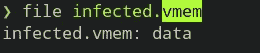
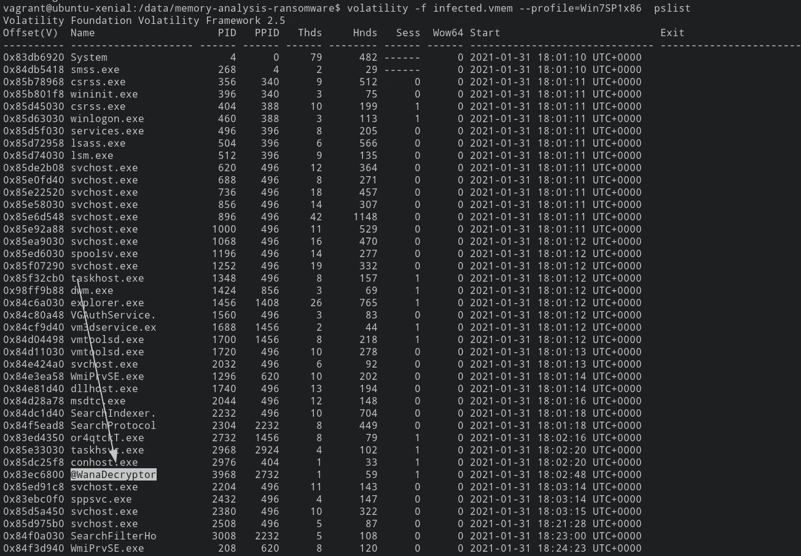
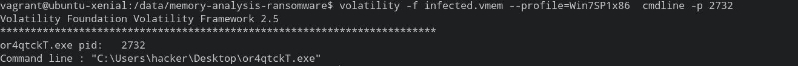
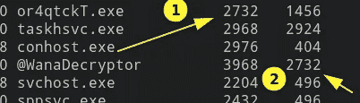
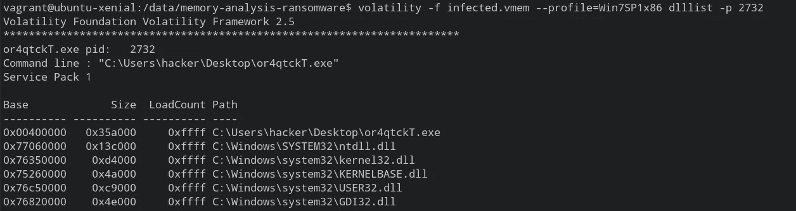
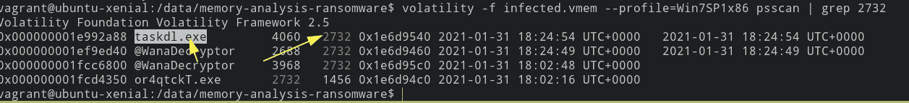
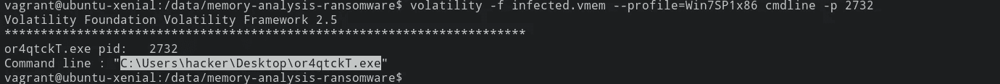
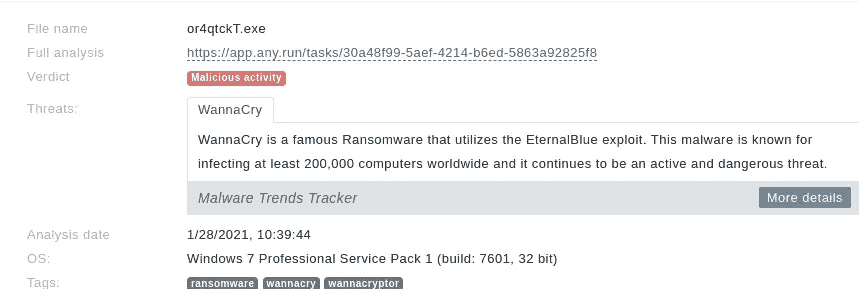
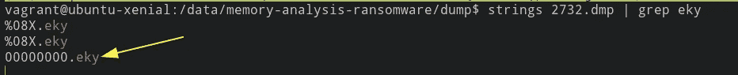

# 内存分析—勒索软件(BlueTeamLabs)

> 原文：<https://infosecwriteups.com/memory-analysis-ransomware-blueteamlabs-f49765cd5b9c?source=collection_archive---------1----------------------->

**挑战描述:** 客户经理之前打电话给 SOC，听起来非常沮丧和愤怒。他说他无法访问他电脑上的任何文件，并不断收到一个弹出窗口，声称他的文件已被加密。你把电脑从网络上断开提取了他机器的内存转储然后开始用波动性分析。继续您的调查，以揭示勒索软件如何工作，以及如何阻止它！

挑战在于调查记忆文件。为此，我们将使用波动性。

**波动**

→这是一个内存取证框架，旨在分析易失性内存以进行内存分析。

**易失性存储器**

→这是一个需要电力来保存[信息的计算机存储器。](http://information.best)最好的例子是 RAM(随机存取存储器)

对于命令参考:[*https://github . com/volatility foundation/volatility/wiki/Command-Reference*](https://github.com/volatilityfoundation/volatility/wiki/Command-Reference)*[*https://book . hack tricks . XYZ/forensics/basic-forensic-methodology/memory-dump-analysis/volatility-examples*](https://book.hacktricks.xyz/forensics/basic-forensic-methodology/memory-dump-analysis/volatility-examples)*

*现在让我们进入这些具有挑战性的问题。*

**

*文件的扩展名是 vmem。它们由存储 RAM 的虚拟系统生成。*

# *1.运行“[vol . py](http://vol.py/)-f infected . vmem—profile = win 7 sp 1x 86 PS scan”将列出所有进程。可疑流程的名称是什么？*

*   *让我们先确定操作系统。*

```
*volatility -f infected.vmem imageinfo*
```

**

*建议的配置文件是 Win7SP0x86 和 Win7SP1x86。*

*根据问题，让我们扫描流程。*

**

*Ans → @WanaDecryptor*

*   *这是一个勒索软件，它加密文件并要求解密赎金*

# *2.可疑进程的父进程 ID 是什么？*

*→ 2732*

**

# *3.创建此进程的初始恶意可执行文件是什么？*

*→or4qtckT.exe*

```
*volatility -f infected.vmem --profile=Win7SP1x86  cmdline -p 2732cmdline - shows the cmd executed by the related proecesses*
```

*这也可以通过查看父进程 id 很容易地猜测出来。*

****

*wannadecryptor 的 ppid 是 2732，or4qtckT.exe 的 pid 也是 or4qtckT.exe。这意味着这个过程背后的原因是通过文件 or4qtckT.exe 运行。*

*我们还可以运行 dllist 插件来查找流程执行路径。*

```
*volatility -f infected.vmem --profile=Win7SP1x86 dlllist -p 2732*
```

**

# *4.如果您深入可疑的 PID([vol . py](http://vol.py/)-f infected . vmem—profile = win 7 sp 1 x 86 PS scan | grep(PID here))，找到用于删除文件的进程*

*→taskdl.exe*

**

# *5.找到恶意文件首次执行的路径*

***→**C:\ Users \ hacker \ Desktop \ or 4 Qt CKT . exe*

*看看问题 3。*

**

# *6.能识别出是什么勒索软件吗？(做好你的调研！)*

*→ WannaCry
快速谷歌搜索会给出答案。*

**

# *7.用于加密私钥的勒索软件公钥文件的文件名是什么？(.eky 扩展)*

*→ 00000000.eky*

*首先转储内存*

```
*volatility -f infected.vmem --profile=Win7SP1x86 memdump --dump-dir dump/ -p 4060*
```

*然后我们可以简单地使用“字符串”和“grep”命令。*

```
*strings 2732.dmp | grep eky*
```

**

*谢谢:-)*

# *🔈 🔈Infosec Writeups 正在组织其首次虚拟会议和网络活动。如果你对信息安全感兴趣，这是最酷的地方，有 16 个令人难以置信的演讲者和 10 多个小时充满力量的讨论会议。[查看更多详情并在此注册。](https://iwcon.live/)*

*[](https://iwcon.live/) [## IWCon2022 - Infosec 书面报告虚拟会议

### 与世界上最优秀的信息安全专家建立联系。了解网络安全专家如何取得成功。将新技能添加到您的…

iwcon.live](https://iwcon.live/)*