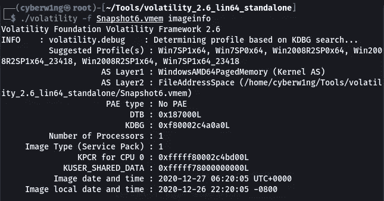
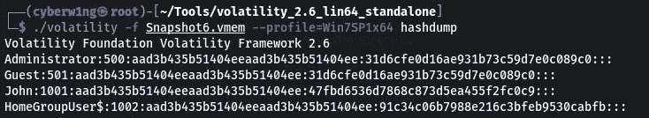
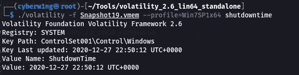
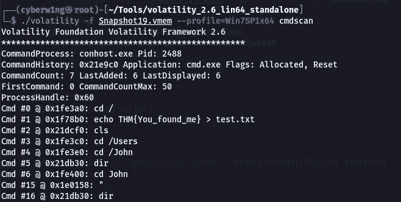
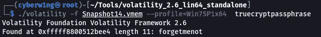

# 内存取证— TryHackMe 书面报告— Cyberw1ng

> 原文：<https://infosecwriteups.com/memory-forensics-tryhackme-write-up-cyberw1ng-945217d0cbc7?source=collection_archive---------2----------------------->


## 完成记忆取证室的记录和走查

在开始写文章之前，下载工具[波动率](http://downloads.volatilityfoundation.org/releases/2.6/volatility_2.6_lin64_standalone.zip)

# 任务 2

1.  约翰的密码是什么？

这里涉及到两个步骤

*   查找 vmem(虚拟内存)的信息
*   正在查找用户 John 的哈希

我们可以使用波动工具找到信息

```
./volatility -f <file> imageinfo
```



现在我们选择第一个轮廓

```
./volatility -f <file> --profile=Win7SP1x64 hashdump
```



```
echo “aad3b435b51404eeaad3b435b51404ee:47fbd6536d7868c873d5ea455f2fc0c9” > john_hash.txtjohn --wordlist=/usr/share/wordlists/rockyou.txt --format=nt john_hash.txt
```


```
Ans: charmander999
```

# 任务 3

1.  机器最后一次关机是什么时候？

```
./volatility -f Snapshot19.vmem --profile=Win7SP1x64 shutdowntime
```



```
Ans: 2020–12–27 22:50:12
```

2.约翰写了什么？

```
./volatility -f Snapshot19.vmem --profile=Win7SP1x64 cmdscan
```



```
Ans: You_found_me
```

# 任务 4

1.  什么是 TrueCrypt 密码短语？

```
./volatility -f Snapshot14.vmem --profile=Win7SP1x64 truecryptpassphrase
```



```
Ans: forgetmenot
```

感谢您的阅读！！！

黑客快乐！！！

## 来自 Infosec 的报道:Infosec 每天都有很多内容，很难跟上。[加入我们的每周简讯](https://weekly.infosecwriteups.com/)以 5 篇文章、4 个线程、3 个视频、2 个 GitHub Repos 和工具以及 1 个工作提醒的形式免费获取所有最新的 Infosec 趋势！