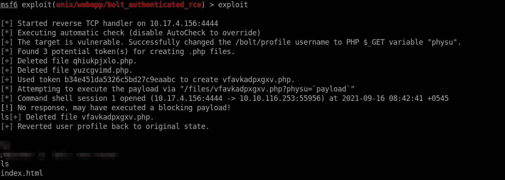
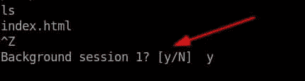
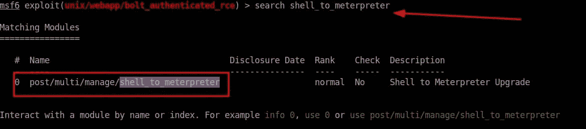
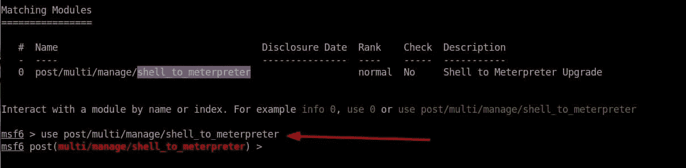
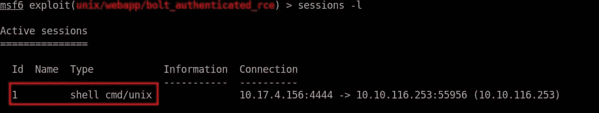
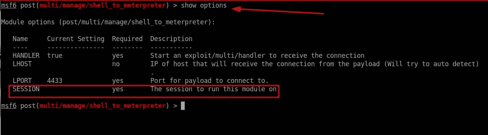
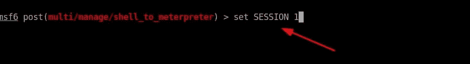
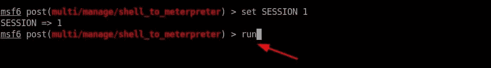
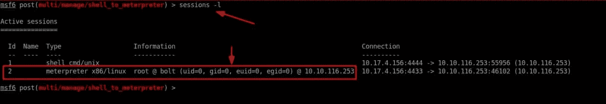
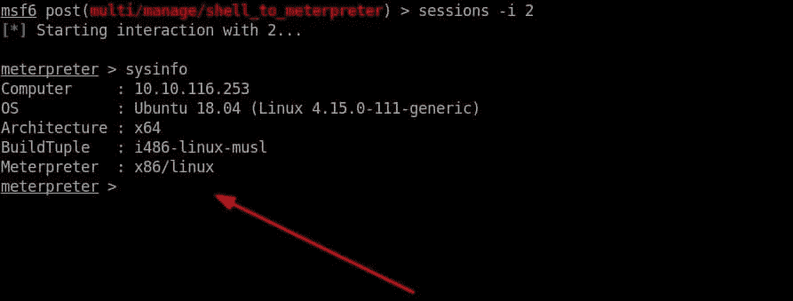

# [Metasploit]将普通 Shell 升级到 Meterpreter Shell

> 原文：<https://infosecwriteups.com/metasploit-upgrade-normal-shell-to-meterpreter-shell-2f09be895646?source=collection_archive---------0----------------------->

在我们访问机器后，有时我们会在开发后立即获得 Meterpreter 外壳。Meterpreter Shell 提供了在被入侵的机器上做一些事情的最简单的方法，因此，我们希望获得这个 Shell 而不是命令 Shell，但是大多数情况下，在我们利用机器后，我们会进入命令 Shell。在这种情况下，我们希望将我们的 shell 升级到 Meterpreter Shell。

## 升级普通命令 Shell ===> Meterpreter Shell 的步骤

在这种情况下，机器被利用后，我们进入正常的命令外壳。

**步骤 1** :后台当前(普通 Shell)会话，我们可以通过按 **CTRL+Z** 来完成

**步骤 2:** 现在运行下面的命令“**search shell _ to _ meter preter**”。

并使用屏幕上显示的模块。

**步骤 3:** 按照命令
"**Use post/multi/manage/shell _ to _ meter preter**使用显示的模块，或者简单地键入
" **use 0** "。这两个命令中的任何一个都可以。

**步骤 4:** 现在我们必须配置要升级的会话 shell。我们可以通过运行以下命令来查看会话，即“ **sessions -l** ”。Id =会话号

**第五步:**我们可以看到选项，通过使用**显示选项**命令。

**步骤 6:** 根据您的会话设置会话 id。我们可以使用以下命令来配置会话，即“**set SESSION<id-of SESSION>**”，在我的例子中为“ **set SESSION 1** ”。

**第 7 步:**配置完会话后，就该执行它了。我们可以通过简单地给出以下命令来执行→ " **run** "

输入 run 命令后，将打开另一个新会话。

新会话打开后，选择该会话并执行该会话。

新会话 2

**第 8 步:**现在通过运行下面的命令"**session-I<New-meter Peter-session>**来执行新的会话，在我的例子中，它是" **session -i 2** "

运行最后一个命令后，您将得到 meterpreter shell。

这样，您就可以将普通的命令 shell 升级到 meterpreter shell。

如果你喜欢我的文章，请在 Twitter 上关注我:- [@Binamra Pandey](https://twitter.com/BinamraPandey)

**谢谢**