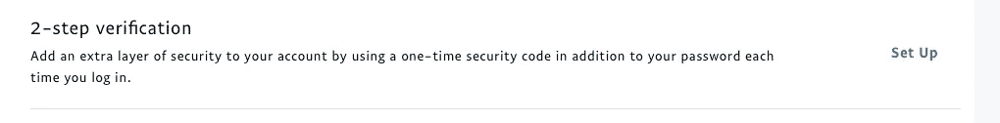
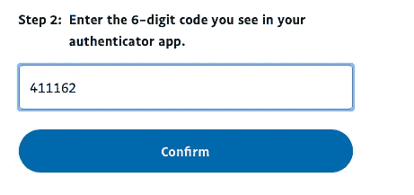
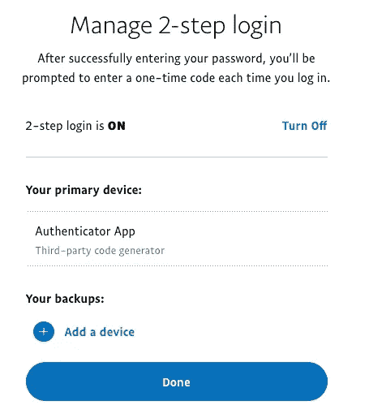

# PayPal 上的 MFA

> 原文：<https://infosecwriteups.com/mfa-on-paypal-5eb7a3eea155?source=collection_archive---------0----------------------->

**#MFAally** 是一个标签，针对那些试图帮助他人在其所有重要应用上启用多重身份验证的人。要了解更多关于什么是 MFA 以及为什么它很重要的信息，[阅读这个](https://medium.com/bugbountywriteup/multi-factor-authentication-mfa-add5009eeb04)。

今天早上我不得不在 PayPal 上给某人汇钱，然后让我*震惊的是*，MFA 没有启用。我立即修复了那个错误。

您可以如此轻松地启用它！登录，进入“设置齿轮”，点击安全，然后找到“两步验证”。

当然我选择[微软认证器](https://www.microsoft.com/authenticator?WT.mc_id=medium-blog-tajanca)。我打开验证器，选择“新账户”，选择“其他类型的账户”，然后拍下屏幕上的二维码。

然后，我把我的代码从认证器输入到贝宝网站，我都设置好了！

看着我！用我的花式 2FA！你也可以！#MFAally

# **欲了解更多，请查看我的书，** [**爱丽丝和鲍勃学习应用安全**](https://aliceandboblearn.com/) **和我的在线培训学院，** [**我们黑紫色**](https://academy.wehackpurple.com/) **！**

## 我 [有一个邮件列表，请订阅，是免费的！](https://newsletter.shehackspurple.ca)