# 微软错误报告在微软 MSRC 季度排行榜上名列前茅(2022 年第三季度)

> 原文：<https://infosecwriteups.com/microsoft-bug-reports-lead-to-ranking-on-microsoft-msrc-quarterly-leaderboard-q3-2022-c6c9f70e2ccd?source=collection_archive---------2----------------------->

## 我提交的安全漏洞报告中的微软 MSRC 季度排行榜。

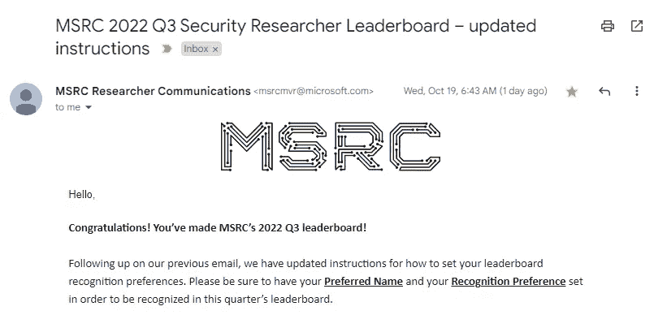

## 目录

— [第 0 部分— Whoami？](#c401)
— [第一部分—选择一个节目](#920d)
— [第二部分—让狩猎开始吧！](#af29)
— [第三部分—举报](#dc93)
— [第四部分—申领奖励](#ae49)
— [披露时间表](#8792)

# 第 0 部分— Whoami？

大家好，我是来自泰国的安全顾问 Supakiad Satuwan。在本文中，我将讲述我在微软 bug bounty 程序上发现的第一个有效 bug 的故事。这让我有机会登上 MSRC 2022 年第 3 季度安全研究排行榜。我们开始吧！

## 什么是 MSRC？

> **Microsoft 安全响应中心(MSRC)** 是 microsoft defender 社区的一部分，处于 Microsoft 安全响应发展的前沿。该平台吸引了致力于保护微软客户和更广泛生态系统的安全研究人员。有关更多详细信息:[微软安全响应中心](https://msrc.microsoft.com/)

# 第 1 部分—选择计划

*   在开始我的 bug 赏金狩猎之旅之前，我导航到[微软赏金项目| MSRC](https://www.microsoft.com/en-us/msrc/bounty) 寻找范围内和正在进行的项目列表。在浏览了列表后，我决定从事[微软动态 365 和 Power 平台](https://www.microsoft.com/en-us/msrc/bounty-dynamics?rtc=1)项目。

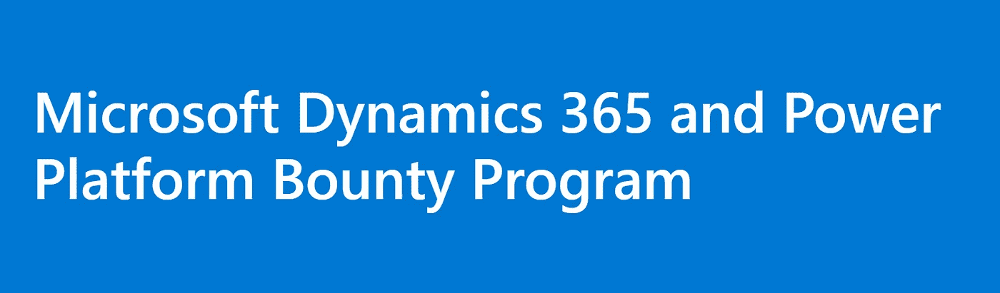

[微软 Dynamics 365 和 Power 平台](https://www.microsoft.com/en-us/msrc/bounty-dynamics?rtc=1)

# 第二部分——让狩猎开始吧！

## 分析目标

*   我在 Power Apps 平台上开始寻找。
*   在分析 Power Apps 平台和其上的应用程序时，我注意到一个应用程序向[https://apps.powerapps.com](https://apps.powerapps.com)发送请求

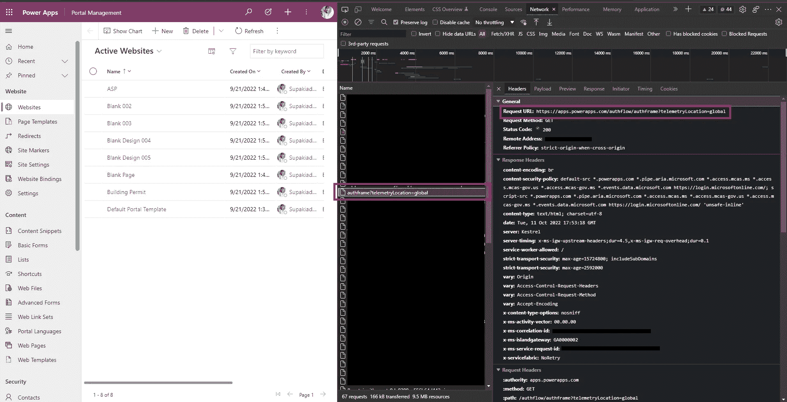

*   它引起了我的注意。因此，我导航到以下 URL:

```
https://apps.powerapps.com/authflow/authframe?telemetryLocation=global
```

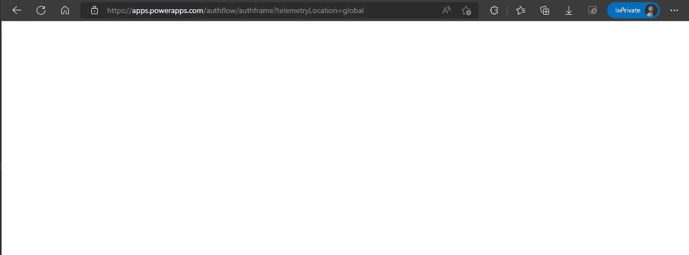

*   此页面未显示任何内容。但是，在查看 HTML 代码后，我注意到 **telemetryLocation** 参数的值反映到了页面上。

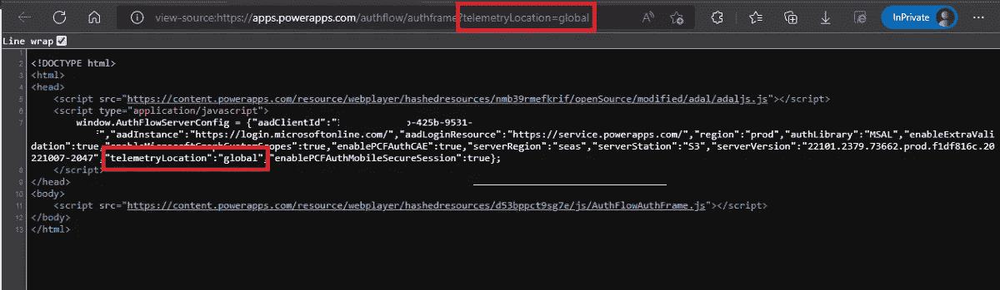

*   我将**遥测定位**参数的值从**全局**修改为 **m3ez** 。结果证明我可以控制遥测值。

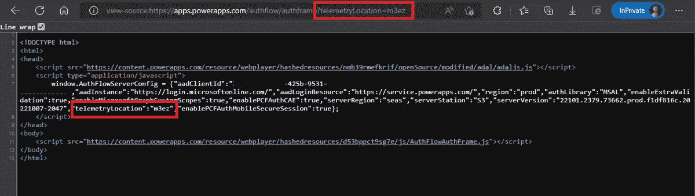

## 利用开始！

*   在分析了这个页面之后，我通过注入以下 JavaScript 有效负载执行了跨站点脚本(XSS)测试:

```
</script>
```

*   结果，我发现页面反映了没有输入验证或净化机制的有效负载。

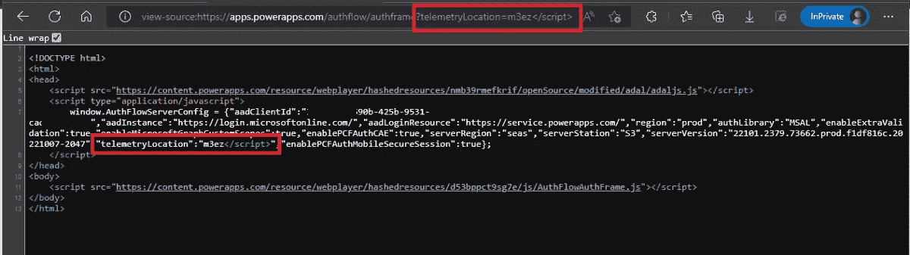

*   我将以下 XSS 有效载荷注入到**遥测定位**参数中:

```
</script><body/onload=alert(`m3ez`)>
```

*   最终的网址是

```
https://apps.powerapps.com/authflow/authframe?telemetryLocation=</script><body/onload=alert(`m3ez`)>
```

*   打开链接后，XSS 负载被执行，如下图所示。

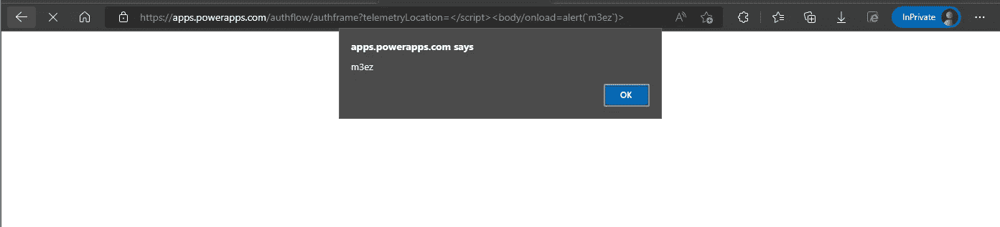

> 验证性测试（Proof of Concept 的缩写）

# 第 3 部分—报告

在发现并确认目标易受跨站点脚本攻击(XSS)后，我立即通过 MSRC 门户网站开始了报告过程。这包括以下步骤:

*   导航至[报告漏洞| MSRC 研究员门户](https://msrc.microsoft.com/report/vulnerability/new)
*   输入漏洞详细信息，包括影响、概念验证和证据。然后，提交了表格。

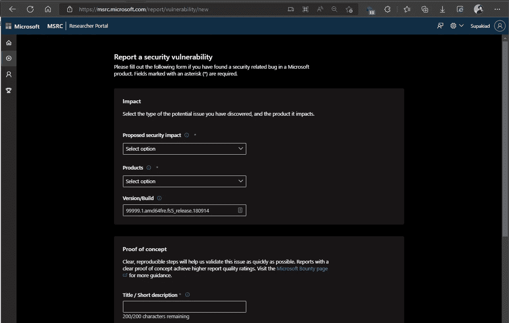

【microsoft.com MSRC 研究员门户

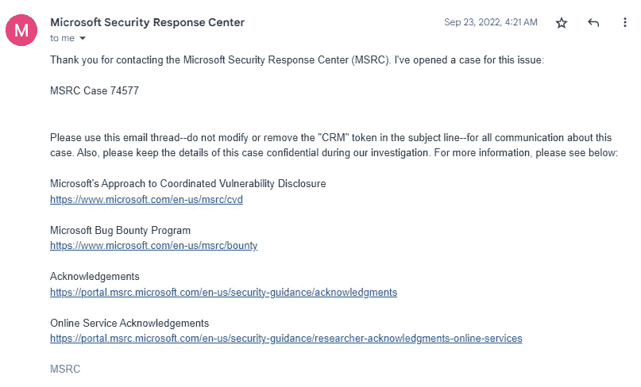

*   4 天后，MSRC 团队回复并确认了我的报告。^_^

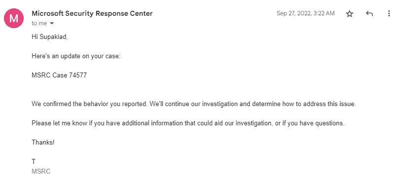

*   同一天，微软奖金团队回复说，他们正在审查我的漏洞报告的可能奖金。

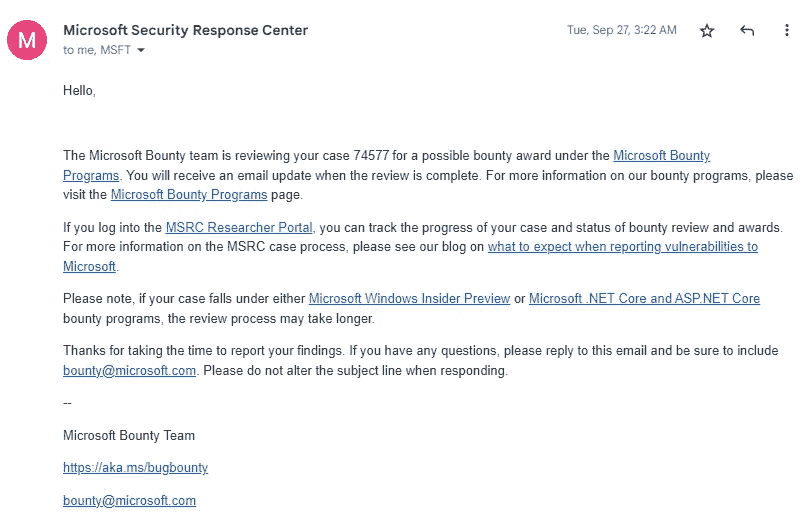

*   几个小时后，我收到了来自微软亚洲研究院^_^团队的好消息

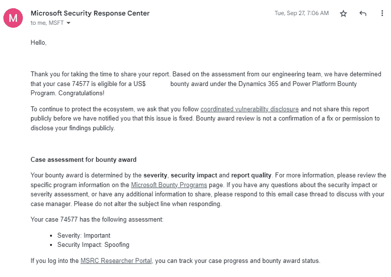

## 第 4 部分—申领奖励

*   在 Microsoft bounty 团队确认我的报告有资格获得奖金后，他们询问了奖金支付提供商的选择。

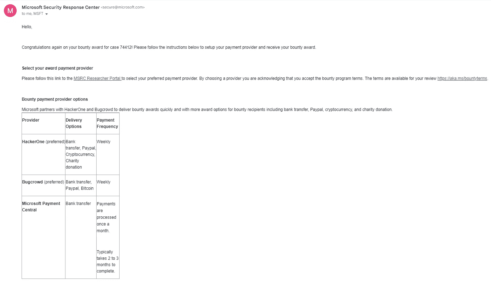

> **注意**:目前，微软仅支持通过 Bugcrowd 或微软支付中心交付奖励，以获得奖金。

*   几周后，我收到了一封来自 Bugcrowd 的电子邮件，其中包含一个来自微软 Bug Bounty 计划的提交声明链接。

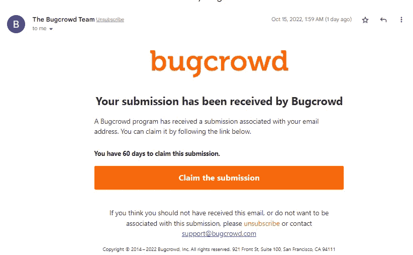

*   认领后，我收到了微软 Bug 赏金计划的第一笔奖励。

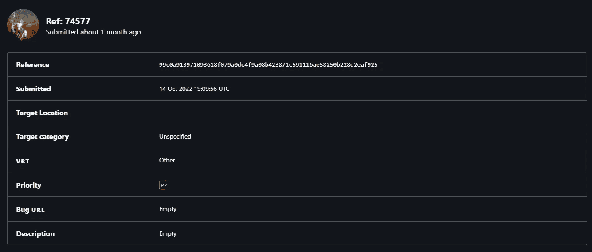

*   几个月后，我的名字已经登上 2022 年 Q3 [排行榜| microsoft.com MSRC 研究员门户](https://msrc.microsoft.com/leaderboard)

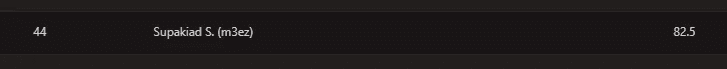

*   我在最近的微软 MSRC 季度排行榜上获得了认可，并将获得一些 MSRC 魔术礼品作为对我成就的奖励！

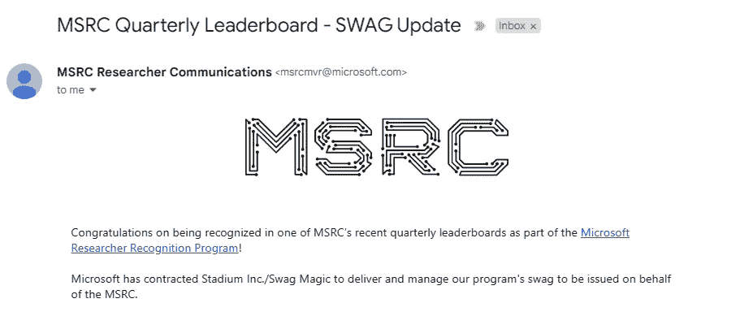

## 披露时间表

*   **2022 年 9 月 23 日** —通过 MSRC 门户发现并报告漏洞。
*   **2022 年 9 月 27 日** — MSRC 团队确认。MSRC 机票已移至审核/重新发布。
*   **2022 年 9 月 27 日**——MSRC 状态从审查/报告变更为开发中
*   **2022 年 12 月 1 日** — MSRC 状态更改为预发布和完成。
*   **2022 年 12 月 23 日** —公开发布安全公告。

> 这是我的第一篇 bug bounty 文章，也是我在微软 bounty 程序上发现的有效 bug 的一部分。我希望你喜欢这个故事。感谢您的阅读。
> 
> 特别感谢 **Suphitcha Worasing** 复习内容和语法。


如有任何意见和建议，^_^将不胜感激

我很感谢你的反馈，也很乐意在我的博客上听到你的想法。如果您有任何意见或建议，请随时通过 LinkedIn 或 Twitter 联系我。

> *LinkedIn:*[*Supakiad s .*](https://www.linkedin.com/in/supakiad-satuwan/)
> 
> *推特:*[*(@ Supakiad _ Mee)*](https://twitter.com/Supakiad_Mee)

*谢谢大家的支持！*