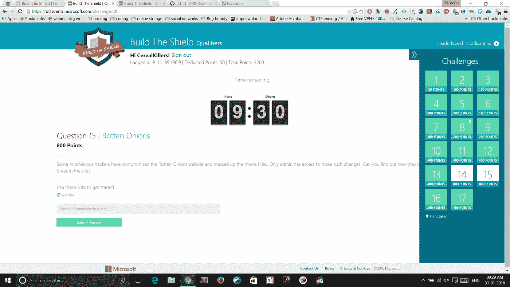
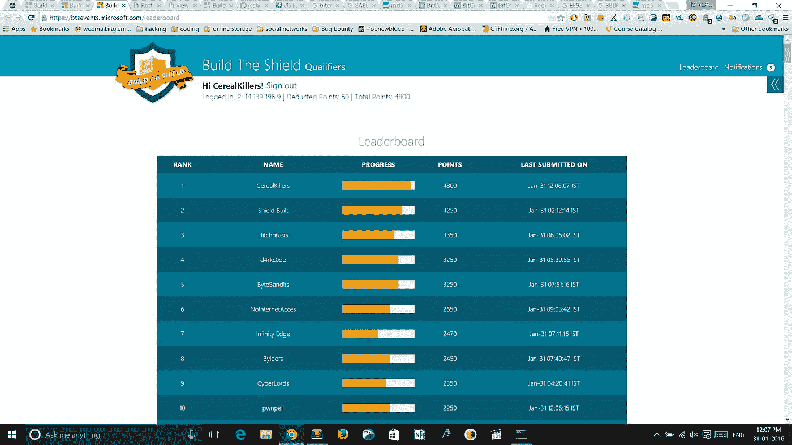
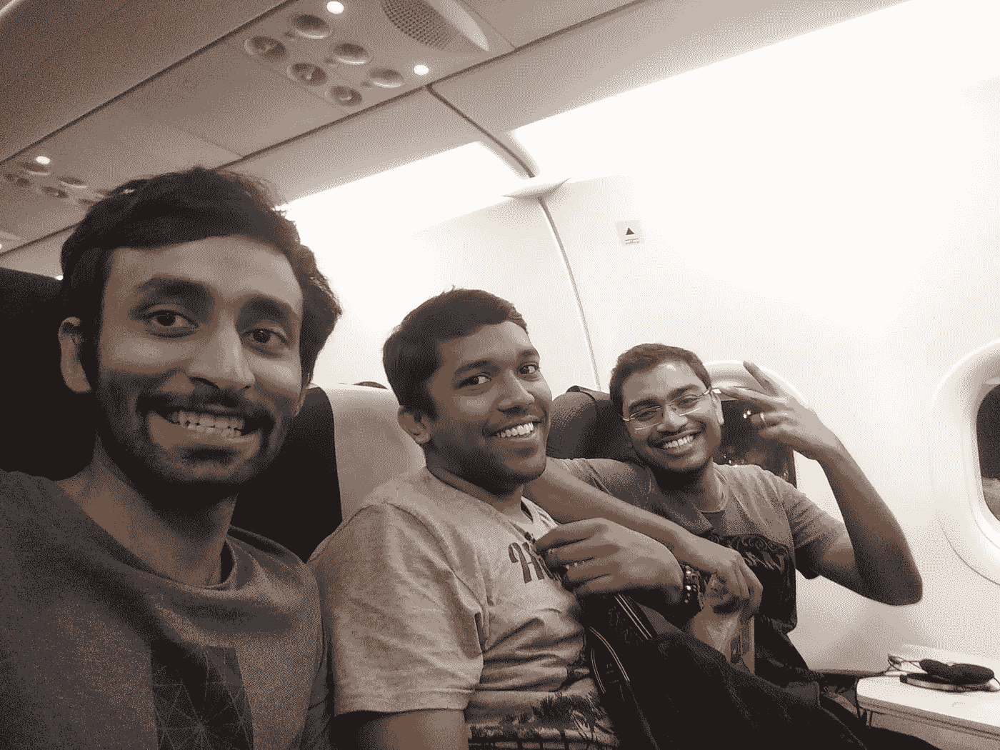
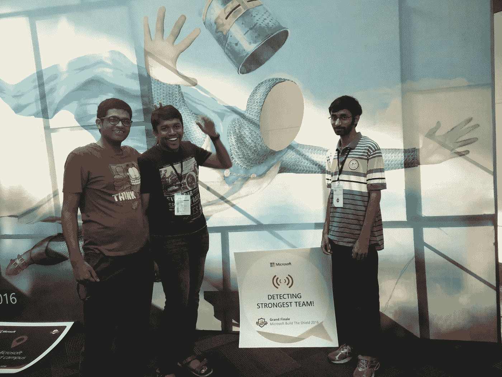
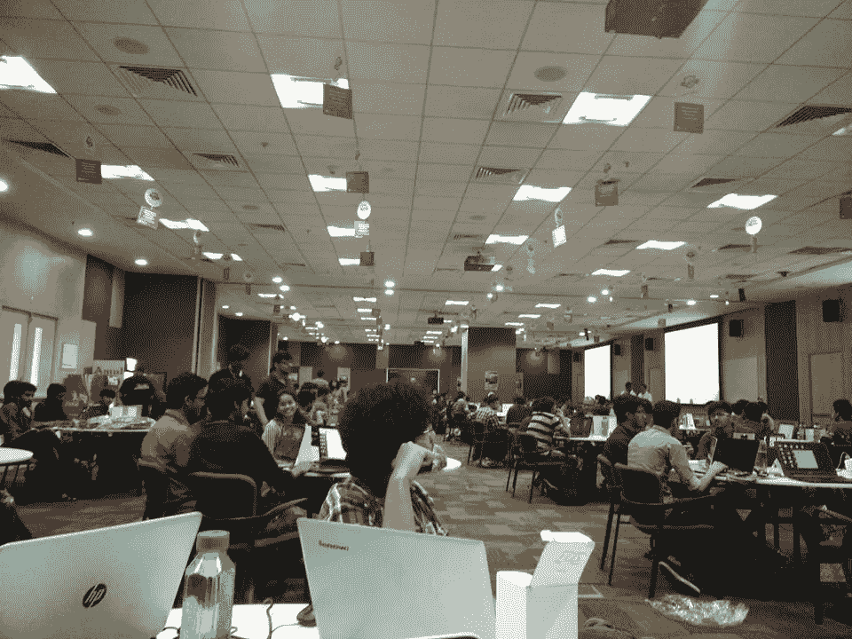
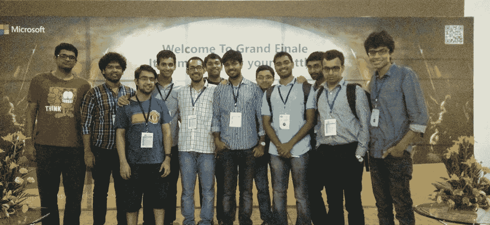

# 从微软“筑盾”到微软“名人堂”

> 原文：<https://infosecwriteups.com/microsoft-build-the-shield-to-microsoft-hall-of-fame-4253b35eb703?source=collection_archive---------0----------------------->

这篇文章将讲述我是如何开始黑客生涯的(感谢微软)，以及随着时间的推移，我如何通过报告他们 web 应用程序中的一些安全漏洞来帮助他们。

故事开始于我的第二年。我完全是个新手——在 YouTube 上查找教程，称自己为黑客。见鬼，我甚至不能正确启动一台电脑。在学校的时候，我不太会用电脑。也许是因为课程或密集的 JEE 教练，但我从来没有真正的动机去探索编程。当我加入 IIT 并拥有自己的笔记本电脑时，事情发生了变化。我的好奇心、探索的渴望和我非常有才华的朋友们确实带我走了很长的路。

回到故事，这一切都是从我在大学校园里看到一个公告板开始的。三个词引起了我的注意: ***黑客大赛，微软*** 和 ***goodies*** 。不用说，这些足以让第二年的我兴奋不已。这是一个集体活动，所以我和我的两个密友合作。规则是这样的:24 小时的预赛，然后是前 50 名团队在微软海得拉巴园区的决赛中决一胜负。这里的问题是每所大学只有三支队伍有资格参赛。

我不记得是怎么回事了，但我们最终排在了第 42 位。但令我心碎的是，已经有三支来自 IIT 古瓦哈蒂的队伍在我们之上。我的希望破灭了——与此同时，我认为自己是一名黑客，但我的团队甚至无法进入决赛。我们确实解决了一些基于网络的挑战，但是逆向工程的挑战却难倒了我们。

> 我把这件事放在心上。

在内心深处，这伤害了我的自尊。那一刻我意识到无论我在做什么都远远不够。也因为 ***造盾*** 事件我被介绍到***CTFs——夺旗*** 大赛。我们仍然记得参加活动时的肾上腺素飙升，迫不及待地想再来一次。

竞赛结束后，我们参加了随机的 CTF 竞赛，并开始阅读相关的文章。这教会了我们很多新东西，慢慢地，我们开始更好地解决挑战。自始至终，我们心中只有一件事——在明年的盾杯赛中做得更好。

# 快进一年。

所以在我第三年的时候，这个时刻又来了。我和我的朋友们[米德胡尔·瓦尔马](https://medium.com/u/9f03520537f8?source=post_page-----4253b35eb703--------------------------------)、[尼基尔·阿拉曼达](https://medium.com/u/ade3936bf35a?source=post_page-----4253b35eb703--------------------------------)和[文卡特·阿伦](https://medium.com/u/a632c0d75995?source=post_page-----4253b35eb703--------------------------------)组成了一个团队。这一次情况完全不同。我们称我们的团队为 **CerealKillers** 。不要问我们是如何想出这个名字的，但是这个名字从那以后就一直沿用下来了。下面的排行榜截图是在比赛开始一个小时后拍摄的——我们在榜首。Midhul 和我决定接受一个愚蠢问题的提示，这个问题给我们扣了 50 分，使我们排在第六位。

所有在我们之上的队到最后一分钟都有相似的分数。

排行榜

我们的努力得到了回报，我们进入了决赛。在海德拉巴的整个经历就是一场爆炸。有如此多的好东西可以赢得，有如此多有趣的人可以互动和学习。CTF 无疑是我学生时代最美好的经历。微软的人非常清楚如何招待本科生和组织一次盛会。

海得拉巴路上的所有微笑

微软校园里尴尬的我们

一些结局场景

我见到了来自 IIT·洛克、IIIT·德里、IIT·坎普尔、IIT·孟买等地的其他优秀团队。在那之前，我不知道有这么多来自其他 IIT 的人才对网络安全感兴趣。虽然我们没有赢得决赛，但我们对整个经历感到满意。

# 现在到了名人堂部分

几个月后，我参加了微软在校园里举办的另一个名为 **Code 的活动。fun . Do**——这是微软组织的黑客马拉松，每年都会在印度大多数著名的大学举行。我们正在使用 Bing 地图构建一些东西，在浏览网站时，我注意到该网站泄露了 Bing 地图门户的所有 API 密钥。这是一个严重的问题。我不是一个 Bug 赏金猎人，但是我能够注意到这个漏洞是因为我为建造盾牌事件做了准备。我马上向微软 Bug 赏金计划举报。

很快就修好了，他们把我的名字加到了他们的名人堂页面上作为感谢。

 [## Bing 地图门户中的 API 密钥泄漏

### 因为我答应写我是如何被列入微软名人堂的。终于来了。

medium.com](https://medium.com/bugbountywriteup/how-i-got-listed-in-microsoft-hall-of-fame-8f96ca4535c2) 

在那之后，我在微软网站上又发现了 6 个漏洞，并在他们的名人堂中出现了 3 次。原来，我真的很擅长找虫子。对我来说，这就像是另一场永远在进行的 CTF 竞赛。

 [## Bing 地图门户中的访问控制被破坏

### 你可以在 binmapsportal 中管理你的 Bing 地图 API 键，当更新一个应用程序的名称时，一些事情引起了我的注意。

medium.com](https://medium.com/bugbountywriteup/broken-access-control-in-bingmapsportal-a012bffd2c43)  [## 单击 Bing 地图门户中的顶举

### 这是一个相当简单的漏洞，但如果使用正确，可能会很危险。

medium.com](https://medium.com/@kmskrishna/click-jacking-in-bingmapsportal-b5ade37b874e)  [## 两个漏洞构成了一个漏洞！！(必应中的 XSS 和 CSRF)

### 你好！！

medium.com](https://medium.com/bugbountywriteup/two-vulnerabilities-makes-an-exploit-xss-and-csrf-in-bing-cd4269da7b69) 

所以我能够向微软报告漏洞的唯一原因是因为 ***微软建造了*** 之盾，我才接触到黑客和 CTFs。

出于某种原因，微软从第二年开始停止组织这项活动。除了作为像我这样的人的垫脚石之外，它也激励了我的许多低年级学生去探索网络安全领域。

这无疑是当时印度举办的规模最大的 CTF 竞赛。

我希望微软能明白，花在这类活动上的所有资源都不会浪费——它们确实激励了很多人。我和其他来参加决赛的同学聊过，他们的故事同样引人入胜。“打造盾牌”在让他们对网络安全领域感兴趣方面发挥了重要作用。

至于其他 CerealKillers，其中一个在微软研究院工作，另一个在亚马逊，而第三个正在麻省理工学院攻读计算机科学博士学位。

我仍然和其他大学的一些人保持联系，他们也在很好的地方，比如在 CMU 攻读博士学位，为脸书、谷歌或微软工作。另一方面，我决定启动自己的网络安全初创公司，目前正在为之努力。这真是太棒了，考虑到这些人有相当多的安全知识，他们在做任何事情时都会牢记在心。

回来时满面笑容

我们还碰巧遇到了一位托利伍德电影明星——Nagachaitanya

Nikhil 的劣质相机

来自 IIT 古瓦哈蒂的三支队伍

大约就在那个时候，我注意到印度的安全形势非常糟糕。为了鼓励负责任的披露，我还帮助启动了 IIT·古瓦哈蒂臭虫奖励计划

 [## its 古瓦哈蒂是如何开始自己的昆虫赏金计划的

### 这篇文章是我对 its 古瓦哈蒂如何成为印度第一个开办自己的 bug 的教育机构的看法…

medium.com](https://medium.com/@kmskrishna/how-did-iit-guwahati-start-its-own-bug-bounty-program-f81a152fecb9) 

我们还有很长的路要走。但是我真的想感谢负责 CTF 事件的微软团队。对于所有潜在的 CTF 爱好者来说，我只希望他们能重新开始。

如果你真的读到这一点，我会告诉你一个小秘密，你可以在介质中留下 50 个拍手😃所以不要犹豫。

和平❤