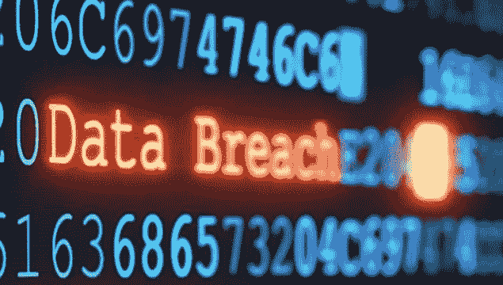
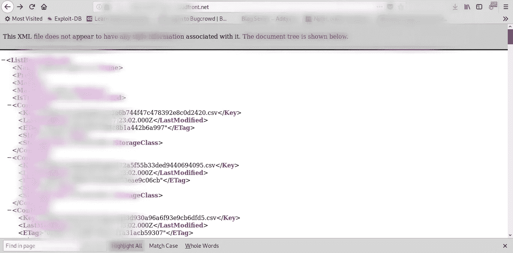
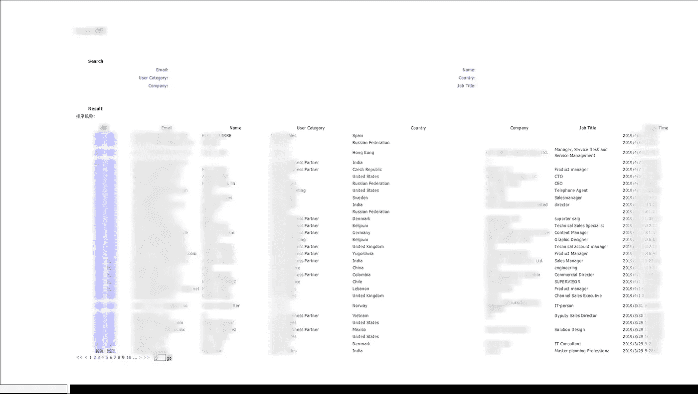

# 百万用户 PII 泄露数据泄露

> 原文：<https://infosecwriteups.com/million-users-pii-leak-attack-288c5e37b283?source=collection_archive---------1----------------------->

大家好

希望你一切都好

今天我将讨论一些流行网站的信息泄露问题。出于隐私考虑，我们不会讨论公司名称。

1:由于 AWS S3 存储桶配置错误，数百万用户的医疗记录和个人信息泄露；

我在网站上测试了一个小时，没有发现任何严重的错误，经过一个小时的重新确认测试，我发现了几个伊多尔和 XSS，但我想找到一些关键问题。

我正要放弃，突然我明白了，他们正在使用亚马逊 Cloudfront 服务来存储公共图像& URL 看起来是这样的

[https://d3e z8 in 977 XYZ . cloudfront . net/avatars/009 AFS 8253 c 47248886 d8ba 021 FD 411 f . jpg](https://d3ez4in977nymc.cloudfront.net/avatars/001abf8253c47248886d8ba021fd411f.jpg)

起初，我认为这只是公开数据，但我试图访问 https://d3ez8in977xyz.cloudfront.net 的[，我发现他们存储公共图像，但在看到其他文件后，我震惊地发现他们已经公开存储了一些个人数据，如:](https://d3ez4in977nymc.cloudfront.net/avatars/001abf8253c47248886d8ba021fd411f.jpg)

***视频聊天、音频通话、短信和一些用户私人文件。***

这些文件包含了病人和医生之间的交流。

不同的领域有不同的存储桶，所以我开始寻找其他领域的图像存储位置，每个桶有成千上万的数据，我没有计算有多少用户信息存储在其中，但在谷歌搜索公司用户后，发现他们有数百万用户。

这是一个桶图片:在 csv 文件，它包含文本信息之间

遗愿清单

所以我很快向他们报告，他们在一个小时内解决了这个问题，并奖励我***【2500 美元奖金和 500 美元奖金*** 。

有趣的是

我听了一些音频文件，我发现了一个共同点，大多数都是关于女朋友/男朋友的问题，他们都哭着说在他/她甩了他/她后，他们是如何焦虑不安，因为他们发现他们的伴侣在欺骗。😄

2:内部管理员帐户访问，泄露业务合作伙伴的详细信息

这是一个关于在大型跨国公司网站上发现的盲存 XSS 的故事，通过这个我可以获得管理员帐户的详细信息[访问令牌和其他个人信息]，同时，我也可以获得商业客户的详细信息。

我在他们的表单中发现了漏洞，这些表单数据存储在本地管理员帐户中。

因此，我没有使用简单的 XSS 有效载荷，而是使用了 XSSHunter 有效载荷，所以每当我的有效载荷执行时，它都会向我发回数据。

PII 数据泄露

为了这一期，他们 ***给了我 1250 美元的赏金***

暂时就这样了

如果你喜欢它，请随意 ***转发*** 它。

有钱人可以在这里捐赠😄

再见..！！

*关注* [*Infosec 报道*](https://medium.com/bugbountywriteup) *获取更多此类精彩报道。*

 [## 信息安全报道

### 收集了世界上最好的黑客的文章，主题从 bug 奖金和 CTF 到 vulnhub…

medium.com](https://medium.com/bugbountywriteup)