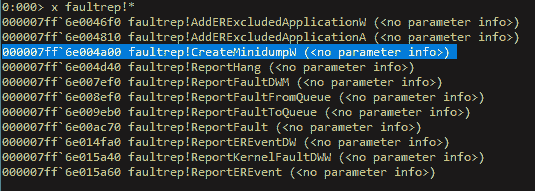
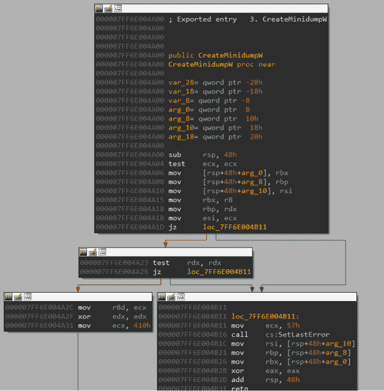
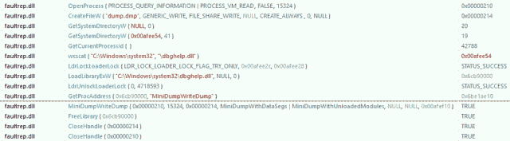
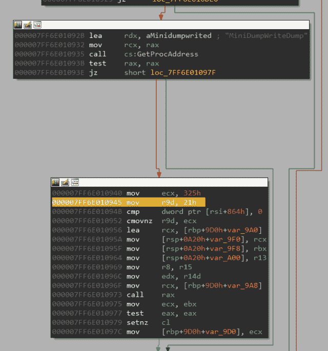

# 通过 Faultrep 的 MiniDumpWriteDump！创建小型转储

> 原文：<https://infosecwriteups.com/minidumpwritedump-via-faultrep-createminidump-497efbafe040?source=collection_archive---------1----------------------->

我在 Windows XP 和 Windows Server 2003 的 faultrep.dll 中发现了这个旧的未记录的 API“CreateMinidumpW”。这个 API 最终调用 dbghelp！通过在运行时动态加载 dbghelp.dll 来转储进程。



该函数有 3 个参数。我真的不知道第三个论点的结构是什么。我将 0 作为指向该结构的指针传递，因此默认情况下，我们最终得到 0x21 作为 MINIDUMP_TYPE。

```
CreateMinidumpW(**DWORD** dwProcessId, **LPCWSTR** lpFileName, **struct** tagSMDumpOptions *)
```



这是调用堆栈

```
dbgcore.dll!_MiniDumpWriteDump@28faultrep.dll!InternalGenerateMinidumpEx(**void** *,unsigned **long**,**void** *,**struct** tagSMDumpOptions *,unsigned **short** **const** *,**int**)faultrep.dll!InternalGenerateMinidump(**void** *,unsigned **long**,unsigned **short** **const** *,**struct** tagSMDumpOptions *,**int**)faultrep.dll!CreateMinidumpW(unsigned **long**,unsigned **short** **const** *,**struct** tagSMDumpOptions *)
```

如您所见，它调用了 dbghelp！通过使用 LoadLibraryExW API 加载 dbghelp.dll 来实现。



但是，这个函数' faultrep.dll！“InternalGenerateMinidumpEx”不提供完全转储。正如你所看到的，它传递了 0x21，或者它比较了第三个参数，这是一个结构，基于这个值，它传递了 0x325。



```
0x21 = MiniDumpWithDataSegs | MiniDumpWithUnloadedModules 0x325 = MiniDumpWithDataSegs | MiniDumpWithHandleData | MiniDumpWithPrivateReadWriteMemory | MiniDumpWithProcessThreadData | MiniDumpWithUnloadedModules
```

你可以做的是，将它修补为 0x2，使其成为“MiniDumpWithFullMemory”。您可以从这里找到 64 位版本的修补 DLL

[](https://github.com/OsandaMalith/WindowsInternals/tree/master/CreateMinidump) [## OsandaMalith/windows 内部

### 此时您不能执行该操作。您已使用另一个标签页或窗口登录。您已在另一个选项卡中注销，或者…

github.com](https://github.com/OsandaMalith/WindowsInternals/tree/master/CreateMinidump) 

这是调用这个 API 的 PoC。您可以从 Windows XP 中复制 DLL，它会工作得很好。不知道这有什么用。只是分享一下我的发现:)

我为 32 位和 64 位 faultrep DLLs 编写了一个热补丁。它将允许您通过将 MiniDumpWithFullMemory 作为 MINIDUMP_TYPE 来获得一个完整的进程转储。已在 Windows XP 32 位和 64 位上测试。在其他系统上，通过将原始 dll 复制到同一个文件夹中就可以了。你可以从这里找到带有 DLL 文件的 repo

[](https://github.com/OsandaMalith/WindowsInternals/tree/master/CreateMinidump/Hot%20Patch) [## OsandaMalith/windows 内部

### 此时您不能执行该操作。您已使用另一个标签页或窗口登录。您已在另一个选项卡中注销，或者…

github.com](https://github.com/OsandaMalith/WindowsInternals/tree/master/CreateMinidump/Hot%20Patch) 

一些用途:)

*关注* [*Infosec 报道*](https://medium.com/bugbountywriteup) *获取更多此类精彩报道。*

[](https://medium.com/bugbountywriteup) [## 信息安全报道

### 收集了世界上最好的黑客的文章，主题从 bug 奖金和 CTF 到 vulnhub…

medium.com](https://medium.com/bugbountywriteup)