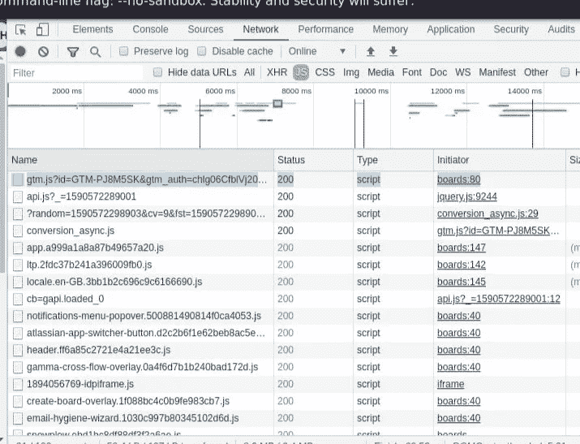
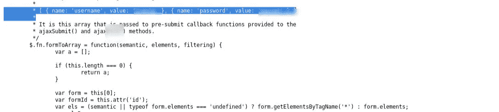
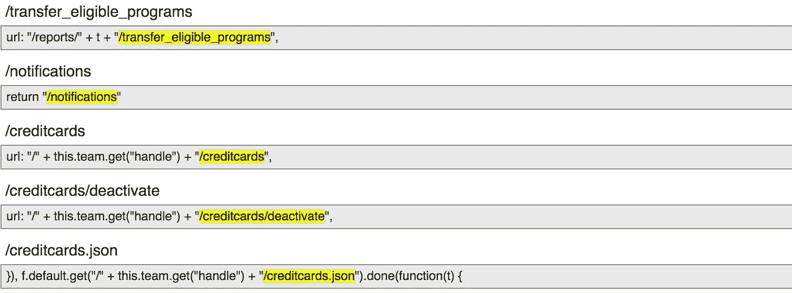
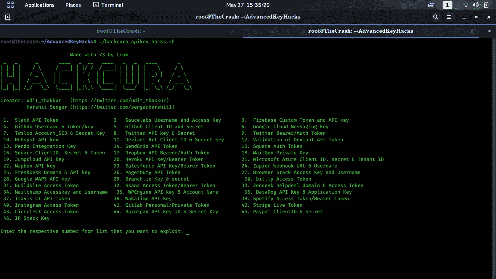
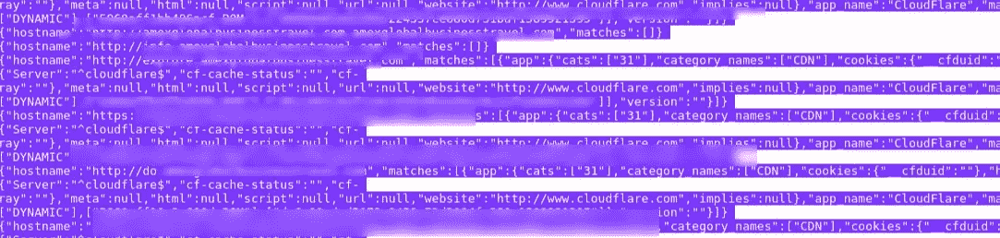
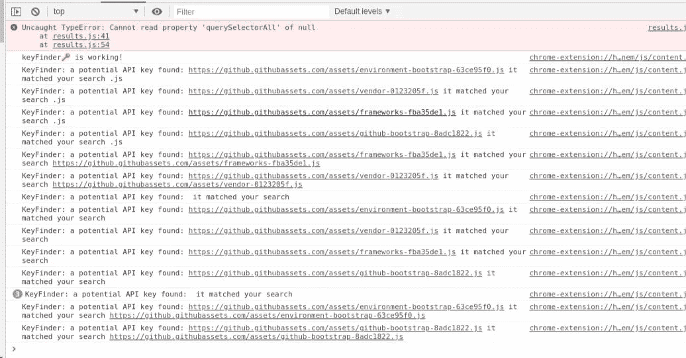

# 挖掘网络:重新定义硬编码数据发现的艺术

> 原文：<https://infosecwriteups.com/mining-the-web-redefining-the-art-of-hardcoded-data-finds-4fee0c8fd4f7?source=collection_archive---------3----------------------->

大家好，假设你们正在学习新的东西，提高自己。因为我们都住在家里，所以最好分享一些想法给社区。进一步计划，这个博客将描述一些在网站中查找硬编码数据的技术，例如:- API 密钥，令牌，登录凭证等。所以，我们开始吧！！

在深入之前，我们先了解一下什么是硬编码。**硬编码**是将数据直接嵌入到 [p](https://en.wikipedia.org/wiki/Computer_program) 程序或其他可执行对象的源代码中的过程，而不是从外部来源获取数据或在 [r](https://en.wikipedia.org/wiki/Run_time_(program_lifecycle_phase)) 时生成数据。硬编码的数据通常只能通过编辑源代码和编译可执行文件来修改，尽管可以使用 [d](https://en.wikipedia.org/wiki/Debugger) ebugger 或任何十六进制编辑器在内存或磁盘上修改。硬编码的数据通常代表不变的信息片段，例如物理内容、版本号和静态文本元素。

好吧，现在我假设你对硬编码有所了解。在 bug bounty 程序中，一旦我们寻找硬编码的数据，我们通常会阅读 JS 文件和 Json 文件。Chrome 和 firefox 开发者工具是最好的手动方式。我们需要做的是，简单地进入**检查元素(CTRL+SHIFT+I) >网络选项卡。**你会看到很多。js 文件和 json 文件。对于 json 文件，转到 **XHR** 部分。仔细阅读那些文件。如果有很多 js 文件，手动操作可能会花费一些时间，但是如果您想在那里寻找一些很酷的数据，这是值得的。它看起来像这样:-

如果你在那里得到一些有趣的东西，你可以手动检查每个文件。如果网站有多个访问点，你会发现很多有用的 js 文件。网站越大，机会越大:)

接下来，我们来谈谈硬编码的凭据。最近在一个网站上搜索时，我发现有时你也可以找到第三方应用程序的登录凭证。你只需要在文件中搜索关键字，即:-{用户名，密码，密码，管理员，值}。我读取了一个 jquery.js 文件，发现了一个第三方服务器的登录凭证。附上相同的图像。看看它:—

一旦文件被创建，开发者可能忘记删除数据，像我们这样的研究人员可以从中获利。你只需要专注地观察事物。此外，你也可以寻找一个网站的" **main.js"** 文件，你可能会在那里找到有趣的信息。

嗯，我相信手动操作，但是有一个工具叫做[**L**](https://github.com/udit-thakkur/AdvancedKeyHacks)**inkfinder**在查找隐藏的 js 文件时非常方便。这个工具是用 python 写的，运行得非常好。如果您想要一个工具来使您在 JS 文件查找中的工作更容易，这是一个完美的工具。它可以找到包括但不限于这些:-

> >完整网址([https://example.com/*](https://example.com/*))

> >绝对 URL 或点状 URL(/*或../*)

> >至少有一个斜杠的相对 URL(text/test . PHP)

> >不带斜线的相对网址(test.php)

下图描述了该工具的输出文件。

我真的会推荐这个工具给你的侦查过程。你可以在这里找到:-[https://github.com/GerbenJavado/LinkFinder](https://github.com/GerbenJavado/LinkFinder)

如果你正在寻找 API 键，只需打开一个 JS 文件，在其中搜索不同的关键字，例如:- {apikey=，apisecret=，value}。你可能会在那里找到很酷的东西。一旦你得到一个 API 密匙，你就可以检查它是否易受攻击。我发现了一个非常酷的 bash 脚本，作者是我的一个朋友，也是一个很有影响力的人。这个工具的名字是 **AdvanceKeyHacks** ，如果你想通过泄露的 API 密匙寻找简单的奖励，它可以帮你完成大部分工作。你可以在这里找到这个工具:-[https://github.com/udit-thakkur/AdvancedKeyHacks](https://github.com/udit-thakkur/AdvancedKeyHacks)。下面是我的一个 API 关键发现的图片，我用这个工具进一步开发了它，还有一个工具界面:)

此外，谷歌 chrome 有一个名为 **Keyfinder** 的扩展，可以帮助你找到泄露的 API 密钥。尽管它给出了一些误报，但您可能会找到可以进一步利用的键值。您需要将值和文件扩展名放在您希望找到潜在键的位置。它看起来像这样:-

如果你问我，我个人相信手动测试硬编码的东西，但另一方面，工具也可以自动完成你的任务。此外，如果你能自动化这些事情并编写一些 bash，你可以像我的朋友 Harsh Bothra 一样编写你自己的一行程序工具。我相信这本书对你们有帮助。如果你觉得有用，请点击下面的拍手图标，这给了我动力:)你也可以在 linkedin 上关注我:【https://www.linkedin.com/in/manas-harsh-05636a154/[。](https://www.linkedin.com/in/manas-harsh-05636a154/)

一如既往，我感谢你们每个人抽出宝贵的时间来尝试一下。我希望你们能继续学习，一旦你从中学到了什么，就去帮助别人。我们的社区是美丽的:)我真的很感谢 [Harsh Bothra](https://medium.com/u/54fa249211d2?source=post_page-----4fee0c8fd4f7--------------------------------) 和 [Udit Bhadauria](https://medium.com/u/9c6c10d7ecf5?source=post_page-----4fee0c8fd4f7--------------------------------) 给我的建议:另外，建议总是受欢迎的，如果你发现我需要补充什么，只需在我的 twitter 上 ping 我:)

不断学习新东西，保重！Adios❤

推特:-[https://twitter.com/manas_hunter](https://twitter.com/manas_hunter)