# 黑客盒子的 Mirai 未来组合

> 原文：<https://infosecwriteups.com/mirai-from-hackthebox-9729e648acbf?source=collection_archive---------4----------------------->

## Pi hole 默认凭证和文件系统取证

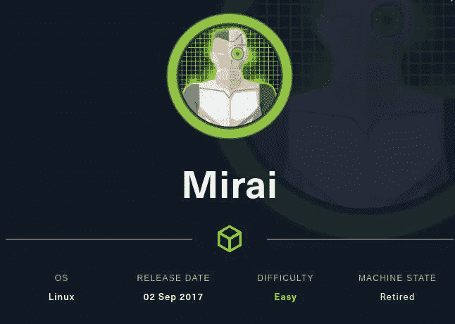

来源:hackthebox

大家好，我是 Hac，今天我们将为大家带来来自黑客盒子的 Mirai 未来组合。这是一个很容易退役的 Linux 机器，你需要做一些取证工作来获得根标志。所以，不浪费任何时间，让我们开始黑客攻击。

我们首先从 Nmap 扫描开始:-

```
#nmap -sS -sV -oA all_port -p- 10.129.179.164
Nmap scan report for 10.129.179.164
Host is up (0.17s latency).
Not shown: 65529 closed tcp ports (reset)
PORT STATE SERVICE VERSION
22/tcp open ssh OpenSSH 6.7p1 Debian 5+deb8u3 (protocol 2.0)
53/tcp open domain dnsmasq 2.76
80/tcp open http lighttpd 1.4.35
1691/tcp open upnp Platinum UPnP 1.0.5.13 (UPnP/1.0 DLNADOC/1.50)
32400/tcp open http Plex Media Server httpd
32469/tcp open upnp Platinum UPnP 1.0.5.13 (UPnP/1.0 DLNADOC/1.50)
Service Info: OS: Linux; CPE: cpe:/o:linux:linux_kernel 
```

> *我做了全端口扫描，对我来说有四个有趣的服务一个端口 22 ssh，第二个端口 80 http，它有最大的攻击面，端口 32400 运行 plex 媒体服务器，最后一个端口 53 我很快会告诉你为什么我认为它很有趣。*

*我访问了 IP 地址为 10.129.179.164 的 80 端口*

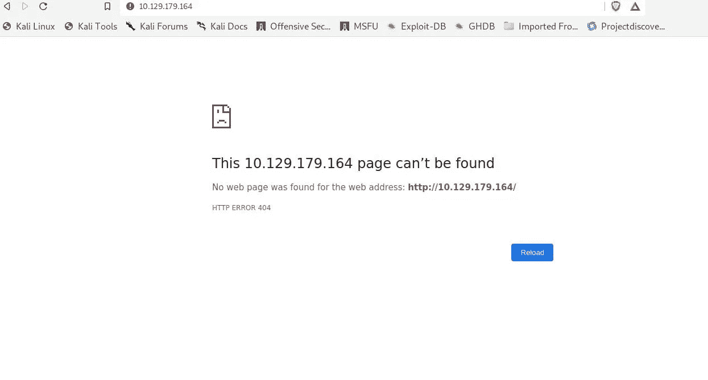

啊，现在端口 53 也就是 DNS 变得有趣了，我们可以在/etc/hosts 文件中添加 [mirai.htb](http://mirai.htb/) 。

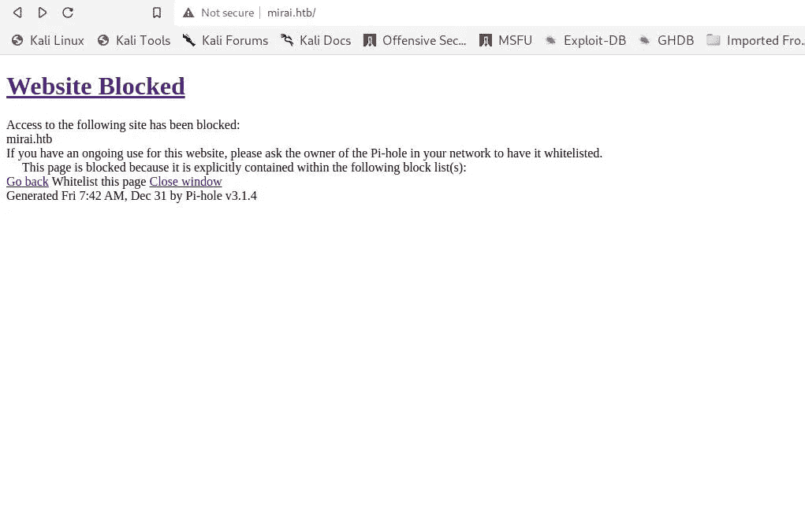

访问 mirai.htb 后

现在，当我们导航到 mirai.htb 时，我有点困惑地看到该网站被阻止的页面。为了确保我没有漏掉什么，我进行了搜索。

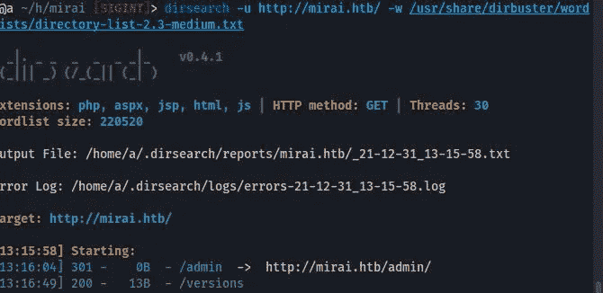

目录搜索结果

从 dirsearch 结果，我导航到 **/admin** 页面，整个管理控制台就在我面前

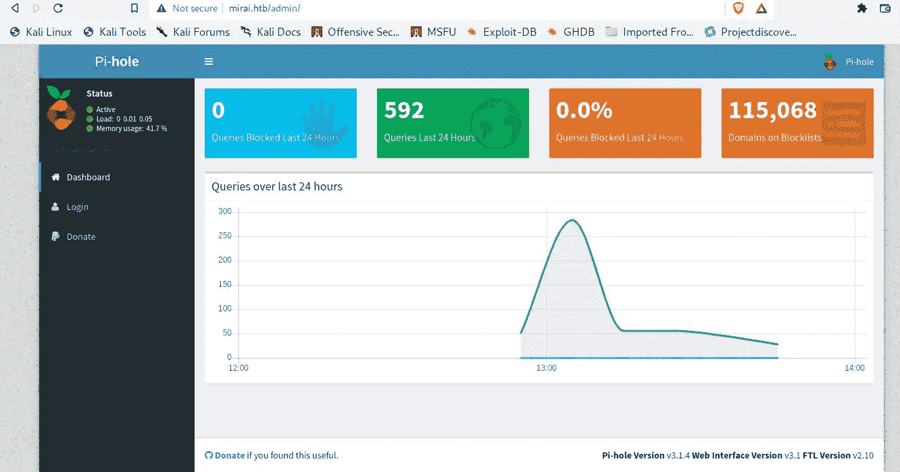

> 这是我第一次碰到 pi hole 管理控制台，所以我试着用弱信用 **admin:admin，admin:password，pi:raspberry** 登录。但是运气不好，在这里我有点不知所措，所以我访问了**端口 32400**

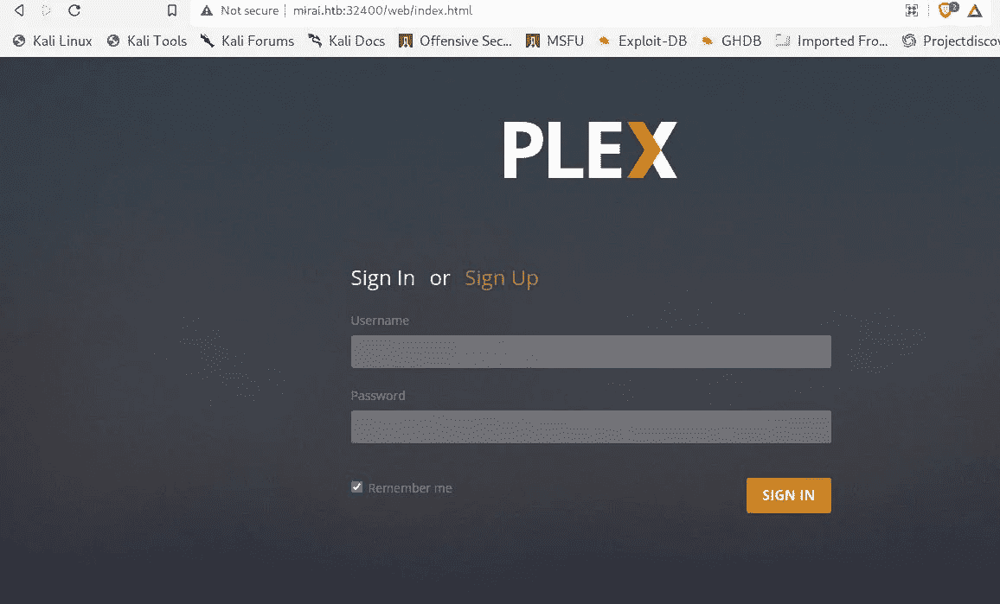

丛媒体页面

> 在这里，我再次尝试了默认信用，如 **admin:admin，admin:password** 再次不走运，但我们可以创建自己的帐户，但当我试图创建帐户时，它给了我一些错误(在编写这篇文章时，我可以创建帐户并登录)。所以对我来说，只剩下最后一个选项了，那就是 ssh。我知道这是个漏洞，所以我在 ssh 上尝试了它的默认凭证，然后我就进入了他们的系统。

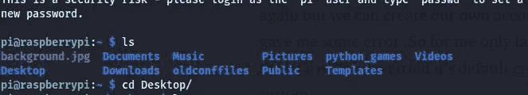

通过 ssh 登录 pi-hole

现在，我们需要做一些艰苦的工作来获得 user.txt，而你需要做这些艰苦的工作。目前，我们的主要目标是扎根。

> 所以每当我有了最初的立足点，我通常会检查 sudo 版本、sudo -l、内核版本和 crontab。

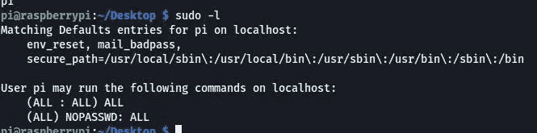

须岛一号

呜哇！！！！！很简单，我们可以运行任何命令，因为 root 只需要运行 **sudo su** 就可以成为这个机器上的 root。成为 root 很容易，但我们的主要目标是找到一个 root 标志，相信我，你会喜欢并学习到很多新东西。

我们将首先检查根标志的 **/root** 目录

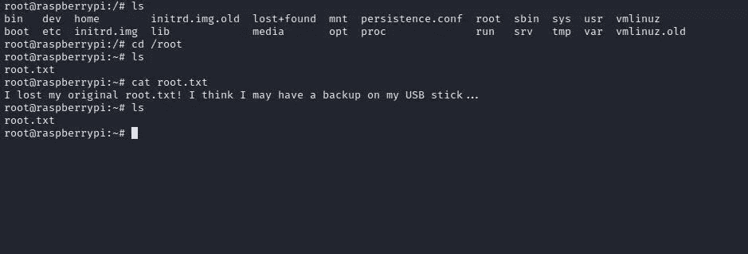

正在检查 root.txt 的/root 目录

> 哦，我们的 root.txt 文件被删除了，但他在 u 盘上做了备份。我们将使用 [**df**](https://www.geeksforgeeks.org/df-command-in-linux-with-examples/) (显示所有文件系统及其磁盘使用情况)。

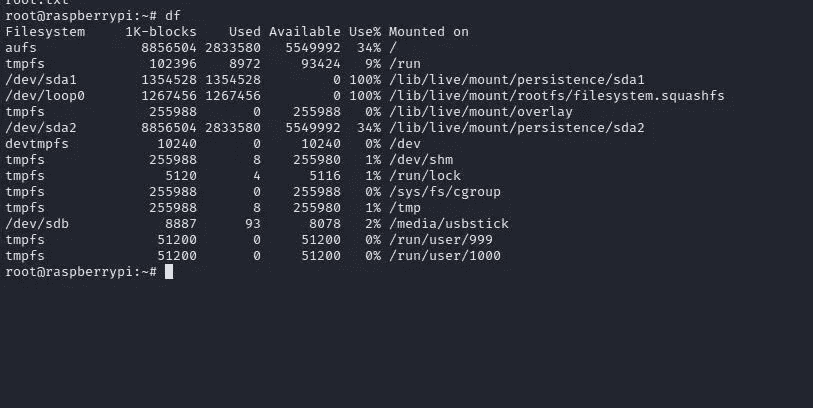

使用 df 命令

> 我们可以在 **/media/usbstick** 中看到我们的 USB stick(Linux 中的[一切都是文件](https://www.howtogeek.com/117939/htg-explains-what-everything-is-a-file-means-on-linux/)

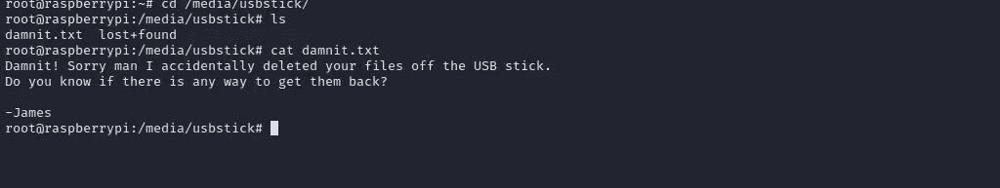

检查/媒体/USB 棒

不不。！！！！我们的根标志被删除。我对如何恢复文件做了一些研究，我将向您展示所有最简单的选项。

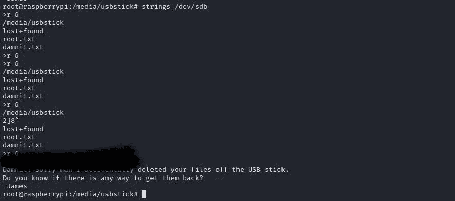

我们可以在/dev/sdb 中看到我们的标志

> 有许多其他方法来恢复这个文件，但我会请你做研究，这里有一些资源，这将是有帮助的，如果你正在做研究。[https://www . wikihow . com/Recover-Deleted-Files-from-Pen-Drive-in-Linux](https://www.wikihow.com/Recover-Deleted-Files-from-Pen-Drive-in-Linux)
> 
> [https://UNIX . stack exchange . com/questions/288059/how-can-I-safely-recover-deleted-data-from-a-a-USB-flash-drive](https://unix.stackexchange.com/questions/288059/how-can-i-safely-recover-deleted-data-from-a-usb-flash-drive)

**谢谢大家看完这个。我希望这能对你有所帮助。可以关注我的** [**推特**](https://twitter.com/Hac10101) **。**