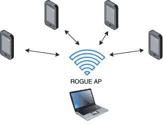
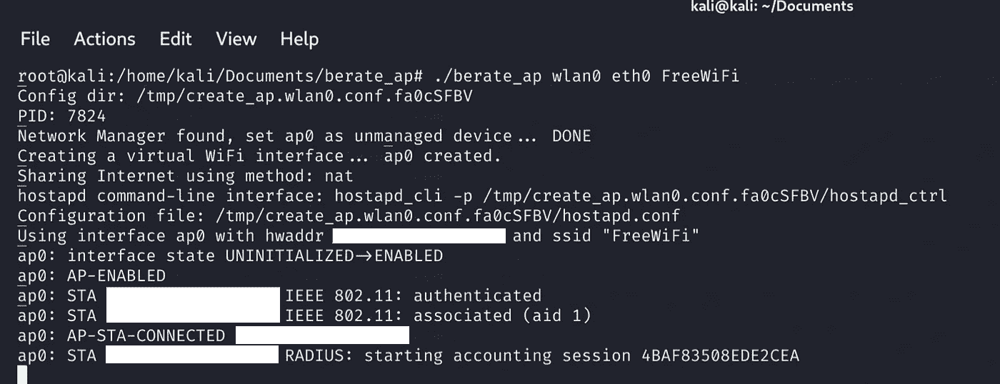
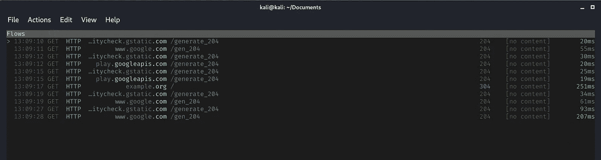
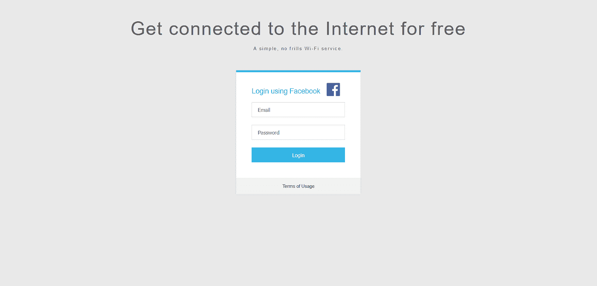
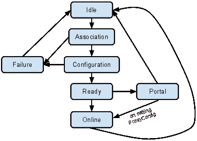
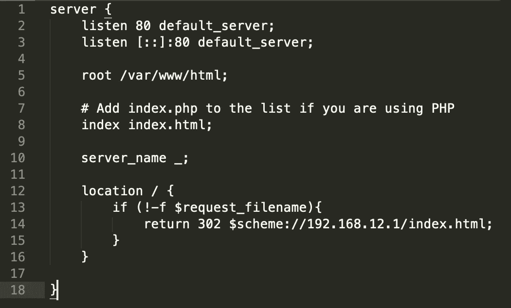

# 使用开放网络的 MITM WiFi 攻击

> 原文：<https://infosecwriteups.com/mitm-wifi-attacks-using-open-networks-7c0cc283524c?source=collection_archive---------2----------------------->

使用 berate_ap + mitmproxy 设置快速 WiFi MITM 场景

自从我开始工作，2013 年底左右，我总是发现有趣的 WiFi 安全。这些年来，我测试了几个执行 WiFi 安全攻击的工具，每个工具都有其优点和缺点。我经常喜欢进行的一种攻击是 MITM WiFi 攻击，这种攻击在我教一些课程或进行某些审计练习时会用到。所以这里有一个小教程，关于如何使用 [berate_ap](https://github.com/sensepost/berate_ap) 和 [mitmproxy](https://mitmproxy.org/) 建立一个 MITM 场景。


照片由[伯纳德·赫曼特](https://unsplash.com/@bernardhermant?utm_source=unsplash&utm_medium=referral&utm_content=creditCopyText)在 [Unsplash](https://unsplash.com/s/photos/free-wifi?utm_source=unsplash&utm_medium=referral&utm_content=creditCopyText) 上拍摄

# WiFi 安全的一点介绍

但在进入设置之前，我认为最好解释一些基本概念。除了典型的 WPA2 或 WEP 攻击，还有很多事情与 WiFi 安全相关，这也是我写这篇文章的动机之一。客户端是 WiFi 安全的重要组成部分，有很多攻击都是针对客户端的。此外，攻击 WiFi 客户端会导致我们获取 WiFi 和用户凭据。有几种涉及客户端的可能性，这里我们将看到一个基本场景，提供一个开放网络作为流氓接入点(AP)。

## MITM 袭击

在网络安全中，中间人(MITM)攻击是一种攻击类型，攻击者可以拦截并修改双方之间的通信。



我们的场景

实现这个场景一个简单的方法是提供一个开放的网络。我们可以设置一个名为免费 WiFi 或公司免费 WiFi 的 WiFi，然后等待有人连接。另一种可能性是建立一个 WiFi 网络，客户端通过探测请求来请求该网络，这里有两种可能性:

1.  客户端正在请求开放的 WiFi 网络
2.  客户端正在请求一个非开放的 WiFi 网络，一些网络使用像 WPA2 PSK 凭据。

如果有人请求开放的 WiFi 网络，我们可以创建一个具有相同网络名称的网络，然后客户端将自动连接。另一方面，第二种情况可能会导致我们从客户端窃取明文和加密的 WiFi 凭据。我们可以建立一个 WPA2 网络，然后赶上 WPA2 握手。由于智能手机客户端如何与 WiFi 网络配合工作，这通常非常成功。

# 贝拉特 _ 美联社

执行这种攻击的第一步是建立 WiFi 网络。为此，我们需要一个 WiFi 天线，我个人推荐的是一款[阿尔法 AWUS036NHA](https://www.amazon.com/Alfa-Network-AWUS036NHA-Adaptador-conector/dp/B004Y6MIXS) 。我推荐使用两根 WiFi 天线。通常我在笔记本电脑上玩这种攻击，使用内部网络天线上网，使用 Alfa 天线广播 WiFi 网络。

从电脑上设置 WiFi 网络有多种可能，但我最喜欢的是 [berate_ap](https://github.com/sensepost/berate_ap) 。Berate_ap 是一个开源项目，由网络安全公司 [Sensepost](https://sensepost.com/) 创建和维护。Berate_ap 使用了一个被称为 [hostapd-mana](https://github.com/sensepost/hostapd-mana) 的 [hostapd](https://w1.fi/hostapd/) 的修改版本。事实上，我们可以使用 hostapd 执行所有这些网络设置，但是 berate_ap 简化了许多配置。此外，使用 hostapd-mana 可以执行一些特定的 WiFi 攻击，而不仅仅使用 hostapd。

为了使用 berate_ap，我们需要做的第一件事是下载 hostapd-mana。最简单的方法是从 https://github.com/sensepost/hostapd-mana/releases[下载预编译的二进制文件。](https://github.com/sensepost/hostapd-mana/releases)

下载完二进制文件后，我们必须将它们添加到我们的路径中。我们可以使用 export 将位置添加到路径中:

```
export PATH="$PATH:/path/to/hostapd-mana"
```

或者使用符号链接将二进制文件链接到/usr/bin:

```
cd /usr/bin
sudo ln -s /path/to/hostapd hostapd
sudo ln -s /path/to/hostapd hostapd_cli
```

在安装了 hostapd 之后，我们可以下载 berate_ap。

```
git clone https://github.com/sensepost/berate_ap
```

berate_ap 的用法真的很简单。例如，如果我们想要创建一个开放的 WiFi 网络并共享我们的互联网连接，我们只需启动:

```
sudo ./berate_ap wlan0 eth0 FreeWiFi
```

考虑到 wlan0 是我们的广播天线，eth0 是连接互联网的天线。如果您使用两根 WiFi 天线，您可能要启动的命令是:

```
sudo ./berate_ap wlan1 wlan0 FreeWiFi
```

记得使用 ip a 或 ifconfig 命令检查天线的名称。如果一切顺利，你应该看起来像下面这样。



使用 berate_ap 的其他可能性有:

*   建立 WPA2-PSK 网络

```
sudo ./berate_ap wlan0 eth0 *AccessPointName* *WiFiPassPhrase*
```

*   建立一个 WPE 网络并窃取凭证

```
sudo ./berate_ap --eap --mana-wpe wlan0 eth0 *EnterpriseNetwork*
```

您可以在 [berate_ap GitHub](https://github.com/sensepost/berate_ap) 中查看更多可能的配置，但是提供一个开放的 WiFi 网络会增加有人连接到我们网络的可能性，从而将这变成一个 MITM 场景。现在，我们可以启动或首选网络嗅探器，如 Wireshark，并开始查看客户端流量。但另一件事，我总是喜欢做的是涉及一个代理，以便能够执行更多的攻击，如注入或修改流量。

# MITM 代理

在我看来，具备进攻和分析能力的最佳代理是 [mitmproxy](https://mitmproxy.org/) 。mitmproxy 不仅仅是一个代理，它是一组工具，为 HTTP/1、HTTP/2 和 WebSockets 提供一个交互式的、支持 SSL/TLS 的拦截代理。

首先，要使用 mitmproxy，我们需要使用 iptables 重定向所有流量:

```
iptables -t nat -A PREROUTING -i **ap0** -p tcp --dport 80 -j REDIRECT --to-port 8080iptables -t nat -A PREROUTING -i **ap0** -p tcp --dport 443 -j REDIRECT --to-port 8080
```

输入-i 接口是 ap0，因为默认情况下 berate_ap 创建虚拟 WiFi 接口。重定向所有流量后，我们可以启动 mitmproxy 并开始拦截流量。我们需要在透明模式下运行 mitmproxy，因为我们不需要来自客户端的任何交互或配置。

```
mitmproxy --mode transparent --showhost
```



mitmproxy 拦截 Android 手机的网络流量

除了拦截流量，mitmproxy 还有许多提供更多功能的附加组件。但是我喜欢使用 mitmproxy 的一个主要原因是因为它的 SSL/TLS 解密功能。

## SSL 证书

自从 SSL 剥离和 [HTTP 严格传输安全(HSTS)](https://en.wikipedia.org/wiki/HTTP_Strict_Transport_Security) 和新的浏览器安全措施[(如 HSTS 预加载列表](https://www.chromium.org/hsts))的广泛使用以来，已经过去了很长时间[，使得几乎不可能解密 SSL/TLS 流量。目前，解密 SSL/TLS 流量最流行的方法是设法安装一个由我们控制的自定义认证机构(CA)。这实际上就是从事间谍活动的政府和公司的运作方式。例如，](https://en.wikipedia.org/wiki/Moxie_Marlinspike#SSL_stripping) [Firefox 添加并删除了一家名为 DarkMatter 的可疑公司](https://techcrunch.com/2019/07/09/darkmatter-firefox-certificates/?guccounter=1),该公司注册为可信 CA。

[mitmproxy 提供了这些功能](https://docs.mitmproxy.org/stable/concepts-certificates/)，只要客户端信任我们的自定义 CA，我们就可以动态解密加密流量。显然，这项技术的难点是欺骗用户安装我们的 CA。事实上，Android 使得执行这个过程变得非常困难，最新的 Android 版本会提示一条警告消息。


安装 CA 证书前的 Android 11 消息

因此，可能的受害者安装我们的自定义 CA，我们总是可以尝试使用一些社会工程技术。一种情况可能是提示一个强制网络门户，要求用户安装我们的 CA，如果他们需要互联网连接。然而，考虑到在每个客户端安装 CA 是一个困难的场景。

## 强制网络门户

要部署强制门户，我们可以使用像 [nodogsplash](https://github.com/nodogsplash/nodogsplash) 这样的开源解决方案，或者再次使用 berate _ ap)和 Nginx。

首先，我们需要部署强制网络门户。使用 Apache 或 Nginx，你可以建立任何网站。如果你不喜欢创建自己的强制门户网页，我真的很喜欢来自 wifi fisher 的[钓鱼网页。您可以使用其中的一些站点来窃取凭据，或者在执行一些修改后让用户安装您的 CA。](https://github.com/wifiphisher/wifiphisher/tree/master/wifiphisher/data/phishing-pages)



wifiphyser*假* [*OAuth 登录页面*](https://wifiphisher.org/ps/oauth-login/) *模板*

在本地主机上部署强制门户之后，我们需要对 Nginx/Apache 配置文件做一些修改。现代设备和浏览器会自动检测强制网络门户，我们可以将我们的网站配置为其中之一进行广播。



[铬网门户检测](https://www.chromium.org/chromium-os/chromiumos-design-docs/network-portal-detection)

最常用的方法之一是添加 302 重定向响应。在我们的/etc/nginx/sites-available/default 配置中使用以下代码，我们就可以实现这一点，然后连接到我们 WiFi 网络的每台设备都会收到我们强制网络门户的提示。



最后，我们可以启动 berate_ap 将所有流量重定向到我们的计算机。-n 选项将禁用互联网访问，请记住，您希望强制受害者与强制网络门户进行交互，但这是可选的。

```
berate_ap wlan0 **-n** --redirect-to-localhost FreeWiFi 
```

在一些成功的网络钓鱼或 CA 安装后，我们可以随时停止并重新启动具有互联网共享功能的 berate_ap。

# 结论

MITM 的 WiFi 场景并不难实现，主要是由于智能手机和用户如何处理 WiFi 网络。但是困难的情况是解密 TLS/SSL 流量。所有有趣的信息都将被加密，即使用户不使用 VPN。此外，这种情况为利用漏洞攻击我们的客户端提供了可能性。同样，这不是一个容易的情况，并且会根据设备的不同而有很大的变化，但这总是另一种可能性。

在我看来，最真实可行的情况是使用强制网络门户进行网络钓鱼攻击。使用一个假的 [*OAuth 登录页面*](https://wifiphisher.org/ps/oauth-login/) 将允许我们轻松获取多个凭证。

最后，让我们考虑一下 berate_ap 和 mitmproxy 允许许多不同配置和攻击类型。不要把自己局限在这篇博文中提出的场景中，用新的场景思考，用你的设备测试。

仅此而已；)，希望你喜欢这个帖子，想看更多网络安全相关内容就关注我吧。