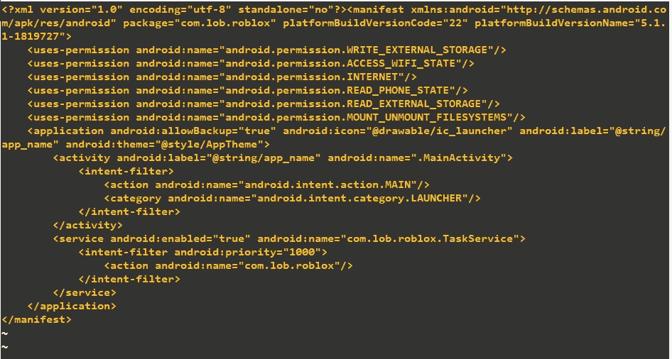
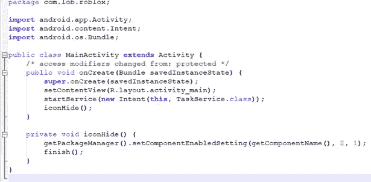
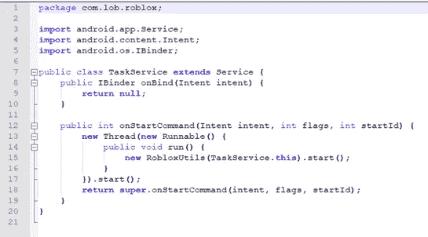
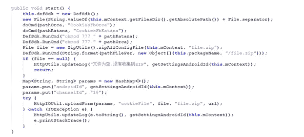
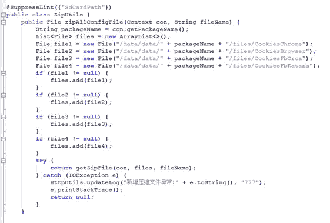
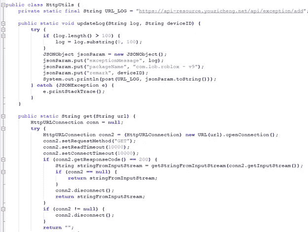

# 移动恶意软件分析-书面报告

> 原文：<https://infosecwriteups.com/mobile-malware-analysis-writeup-by-josue-martins-5574865ae0f1?source=collection_archive---------1----------------------->

# 恶意软件文件信息

*文件名:09024538768–1107749532 . apk*

*大小:0.12MB*

*MD5:65a 92 BAE FD 41 EB 8 C1 a9 df 6 c 266992730*

*SHA1:117 a2 BDB 1550534 c 0945 DD 210 C2 e 9 B1 e 58 c 50431*

*sha 256:60 df 17 A8 d 53 BF 179 c 5025 ba F9 b 0 fbfc 9 BD C4 CFB 483 b 059 ab 2c 58 bfdf 375 c8 c 76*

*App 名称:Roblox*

*包名:com.lob.roblox*

# 恶意软件的静态分析

上述恶意软件是通过下载用户安装在智能手机上的恶意应用程序从移动网络中提取的。

**应用程序是从下面的服务器分发的:**

[http://173 . 255 . 243 . 60/public/silent _ apk/2059/631023079870014 _ _ null _ _ 11880 _ _ v18 _ 2015 11 27/apk/2019/12/09024538768-1107749532 . apk](http://173.255.243.60/public/silent_apk/2059/631023079870014__null__11880__v18_20151127/apk/2019/12/09024538768--1107749532.apk)

# ANDROID 清单文件分析

Android 清单

阅读清单后，我注意到以下几点:

## 恶意软件请求以下权限:

— *让应用程序能够检查 wifi 的当前状态*。

## **以下所有权限都是危险权限，经常被恶意软件使用。**

*—使应用程序能够写入外部存储器。*

*—使应用程序能够连接到互联网并创建 socks。*

*—使应用程序能够检查智能手机的当前状态以及智能手机的其他详细信息。*

*—使应用程序能够从外部存储器读取文件，如 SDCARD 等。*

*—使应用程序能够在设备上安装和卸载文件。*

只要看一下这段代码，我们就可以假设这个恶意软件想要从设备中读取和写入，并且它使用互联网。

服务优先级

该应用程序还将此类“com.lob.roblox.TaskService”作为优先级为 1000 的服务运行。

这段代码" ***<【意向过滤 Android:priority = " 1000 ">***"用于使服务在后台以高优先级运行。

# 活性分析

正如我们从清单文件中看到的，我们可以看到主要的活动，让我们阅读 java 代码，看看它是如何工作的。

主要活动

主活动启动 TaskService 类，并在智能手机的菜单上隐藏应用程序的图标。

下面的代码运行 RobloxUtils 类的一个实例，RobloxUtils 类是恶意软件从智能手机中提取信息的地方。

任务服务

Cookie 提取

查看代码的第一行，很明显是提取脸书应用程序的 cookies。

下面的代码用提取的信息创建了一个 zip 文件。

File file = new ZipUtils()。zipAllConfigFile(this.mContext，“file . zip”)；

这是用于将信息上传到在 HttpUtils 类中找到的服务器“[https://api-resource.youzicheng.net/api/exception/add](https://api-resource.youzicheng.net/api/exception/add)”的代码，这就是调用下面的方法的原因。

开始方法

HttpUtils.updateLog(“文件为空，没有收集到 ZIP”, getSettingsAndroidId(this.mContext));

ZipUtils 用于从安装在智能手机上的浏览器中提取信息来创建 zip 文件，并通过以下方法(使用 HttpUtils.updateLog())上传到黑客的服务器。

HttpUtils 类在将信息上传到攻击者的服务器之前检查是否有连接，该服务器已经被声明为私有静态最终变量“【https://api-resource.youzicheng.net/api/exception/add】”。

# 概述静态分析

恶意软件使用的主要 java 类有:

1.  com/lob/roblox/HttpUtils.java

*—这个类用来与服务器通信。*

2.com/lob/roblox/main activity . Java

*—这是启动应用程序的主要活动。*

3.com/lob/roblox/robloxutils . Java

*—这个类用于将提取的信息上传到服务器(C & C)。*

4.com/lob/roblox/task service . Java

*—这是服务的绑定器类。*

5.com/lob/roblox/ZipUtils.java

*—这是一个用提取的信息创建 zip 文件的类，它还能够上传文件。*

6.com/sdk/def/DefSdk.java

*—这是一个运行命令的助手类。*

7.com/sdk/def/EXPSDK.java

*—这是提取设备信息的类，比如 IMSI、智能手机品牌等等。*

# 结论

这种恶意软件从脸书应用程序和安装在智能手机上的浏览器中提取 cookies。除了提取 cookie 之外，它还提取设备的标识符和 SIM(即智能手机的品牌、SDK 版本号和 IMSI ),以便正确关联信息。

应尽快在您的网络中阻止上述 C&C，因为提取的信息可用于各种恶意行为，如出售用户信息、利用 IMSI 作为参数进行各种 SS7 和 DIAMETER 协议攻击。