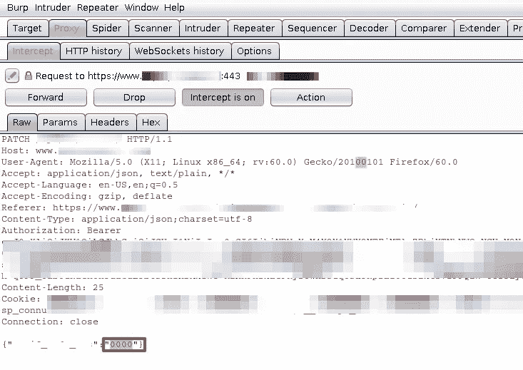
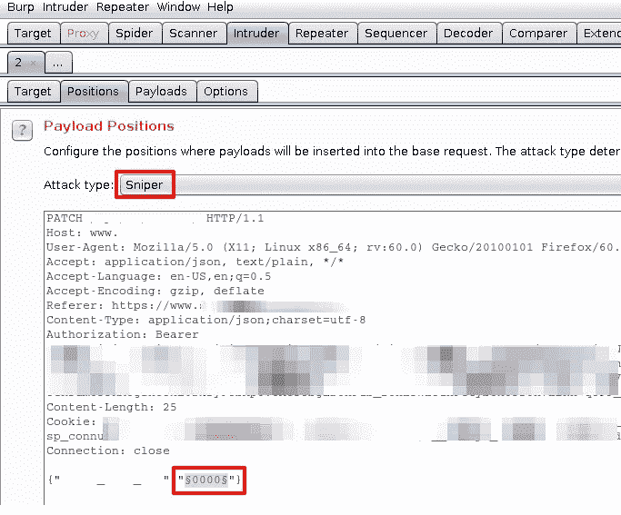
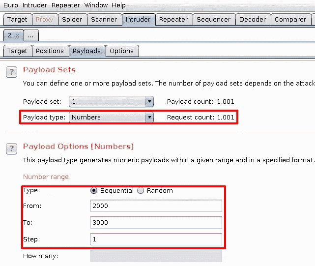
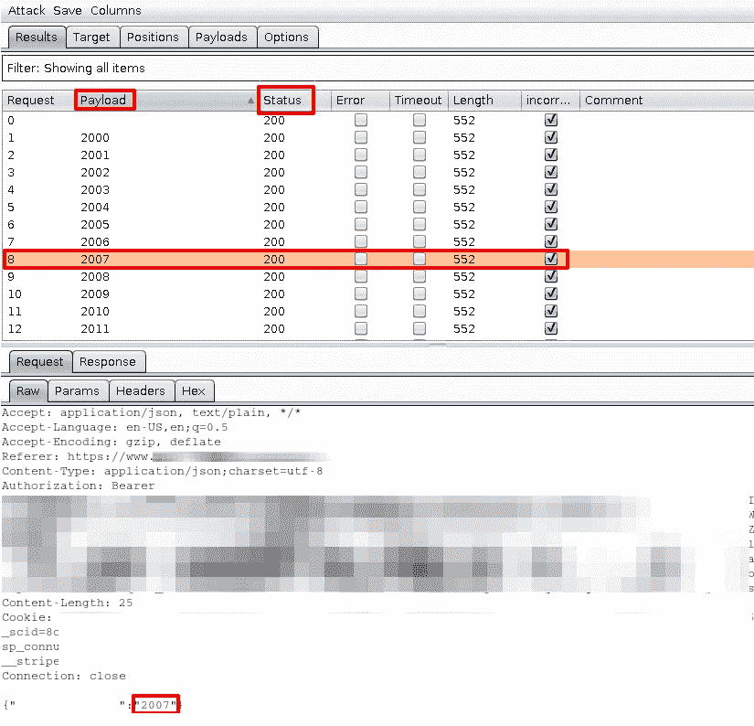
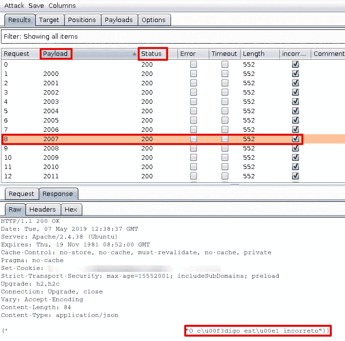
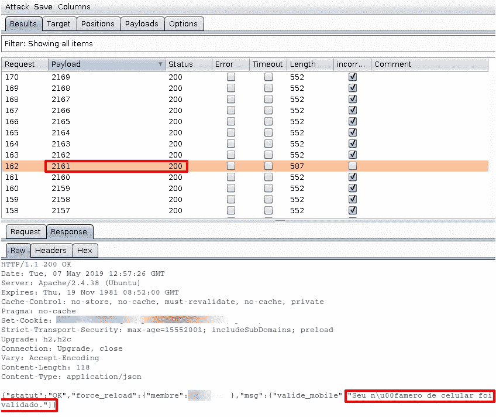

# 手机号码验证旁路

> 原文：<https://infosecwriteups.com/mobile-phone-number-verification-bypass-5a9c19c42de8?source=collection_archive---------0----------------------->

## 在这篇文章中，我将展示我是如何绕过网站中的电话号码验证过程的。我还将解释为什么这是可能的，以及我们可以做些什么来防止这种类型的攻击。

# 什么是电话号码验证

当你在一些网站上创建帐户时，有时他们会要求你验证你在注册过程中提供的电话号码。他们向您提供的号码发送短信，并要求您输入短信中的代码。这样他们就知道你告知的号码真的是你的。这样做意味着你的帐户现在与一个“官方”手机号码相联系，这个号码与你的名字相联系。这是身份验证的一种形式。

# 他们为什么要求验证电话号码

这些验证过程允许网站将账户与真实的人联系起来。他们这样做是因为他们想防止机器人创建大量帐户。这也有助于防止黑客使用这些帐户做坏事，因为如果他们这样做，他们的手机号码会附加到他们的帐户上，更容易识别他们。当然，有几种方法可以绕过这个问题。

# 实现电话号码验证的错误方法

为了实现这样的安全措施，我们首先必须知道什么是最佳实践，以及对于这种场景可能的攻击类型。

如今，不难找到针对数字验证过程的各种类型攻击的免费工具。基于此，我们必须记住，例如，通过短信发送的代码必须有多少位。如今，大多数网上银行应用程序使用七位、八位甚至九位数字代码登录网站，甚至授权交易。

例如，今天使用四位数字代码来验证电话号码是不安全的，我们马上就会看到这一点。这是因为互联网上有无数的工具能够轻松地暴力破解一万个数字(四位数的代码，从 0000 到 9999)。

网站必须记住的另一件事是当一个人提交代码时错误尝试的次数。我的意思是，我们必须确保网站不允许暴力破解代码。当一个人输入一个代码时，可以通过设置某种限制来防止这种情况。一种方法是强迫用户发送一个新代码，并在少量错误尝试后使之前的代码无效。

此外，我们可以使用一些验证码实现，如果方法正确，可以防止自动化。

# 概念验证

我在一个网站上为自己创建了一个新帐户，当我进入帐户设置区域时，我看到他们要求验证我的电话号码。我按照流程操作，他们给我的手机发了一条短信，几秒钟后我就收到了。密码是 2161，只有四个数字。当我看到这种情况时，我想“好吧，让我们验证我的号码并进行概念验证”。我做的第一件事是启动我的 Kali 和火打嗝套件。Burp 是一种对 web 应用程序进行安全评估的工具。这是一个强大的工具，即使是免费版本，也可以做很多事情。

Burp 就像一个代理，它站在你的浏览器和网络服务器之间。这样做可以让您在请求/响应到达目的地之前，看到浏览器生成的所有请求以及 web 服务器的响应。您还可以修改这些请求/响应来欺骗 web 服务器，有时绕过一些安全实现。

因此，我使用了 burp 提供的那些函数来查看我们在网站上输入代码后应用程序生成的请求是什么样子的。

拦截电话号码请求

正如我们在上面的图像中看到的，请求的最后一行带有数字“0000”，这是我在网站上键入的数字，以便强制它生成请求并将其发送到服务器。问题是这个请求从来没有到达 web 服务器，因为 burp 能够先拦截它。

# 强力过程

知道了请求是如何形成的，现在我们可以让 burp 发送数以千计的请求，这些请求看起来就像原始的请求，但不同之处在于每个请求的验证码都是唯一的。服务器将接收包并处理它们，寻找验证码并将它们与正确的验证码进行比较。如果一个代码是错误的，web 服务器用一个错误消息来回答这个请求，如果代码是正确的，它就验证这个电话号码。

为了暴力破解代码，我们将使用打嗝的“入侵者”标签。它允许我们将请求的特定部分标记为强制执行。我们将使用的攻击方法是狙击手，这是最简单的一种。

使用 Burp 的入侵者配置暴力任务

“入侵者”的“有效载荷”选项卡允许我们生成一个将在攻击中使用的数字列表。每个数字将被放入一个请求中，取代原来的“0000”。

使用 Burp 的入侵者配置暴力任务

在列表中，我选择从 2000 到 3000，因为我已经知道正确的代码，即 2161。这意味着我们只需要发送 162 个请求就可以得到正确的代码。但是在真正的攻击中，burp 会发送 10000 个请求，每个请求携带一个从 0000 到 9999 的代码。

当我们开始攻击时，我们可以看到 burp 开始向服务器发送请求，每个请求都有自己的代码。

强力任务请求的一个例子

我们还可以看到 web 服务器的响应，它返回一条错误消息:

无效验证码的响应示例:“代码不正确”

因此，过了一会儿，burp 向服务器发送正确的代码，我们可以看到现在的响应是不同的，确认代码工作。

验证成功的回应:“您的手机号码已通过验证”

所以我们知道服务器用正确的代码接受了我的请求。进入网页，我现在可以看到我的号码是绿色的，这意味着它是有效的。

电话号码通过暴力验证成功

嗯，就是这样。我会联系负责网站安全的人，告诉他们我的发现。我希望我能够以一种简单的方式解释这个过程和它背后的概念。下次见！

# uolayfirertruaesbeilhidubgscnoklyfurousauciacsssstusnoikhoylhoysauebmloec

# 🔈 🔈Infosec Writeups 正在组织其首次虚拟会议和网络活动。如果你对信息安全感兴趣，这是最酷的地方，有 16 个令人难以置信的演讲者和 10 多个小时充满力量的讨论会议。[查看更多详情并在此注册。](https://iwcon.live/)

 [## IWCon2022 - Infosec 书面报告虚拟会议

### 与世界上最优秀的信息安全专家建立联系。了解网络安全专家如何取得成功。将新技能添加到您的…

iwcon.live](https://iwcon.live/)