# 现代二进制开发文章-0x02

> 原文：<https://infosecwriteups.com/modern-binary-exploitation-writeups-ii-62c092f7f389?source=collection_archive---------0----------------------->

这是**现代二进制开发**课程的子部分 [RPISEC](https://rpis.ec/) 的**工具和基本逆向工程**的第二篇综述。

讲座链接:-[http://security.cs.rpi.edu/courses/binexp-spring2015/](http://security.cs.rpi.edu/courses/binexp-spring2015/)

所有的课堂材料和其他必要的文件都可以在上面的链接中找到。

[⬅️](https://medium.com/bugbountywriteup/binary-exploitation-5fe810db3ed4) **上一篇报道**_ _ _ _ _ _ _ _ _ _ _ _ _ _ _ _ _ _ _ _ _ _ _ _ _ _ _ _**下一篇报道** [➡️](https://medium.com/bugbountywriteup/binary-writeup-0x03-9a9546711ef2)

# crackme0x00b

**使用*文件*命令**收集信息

```
$file crackme0x00b
```

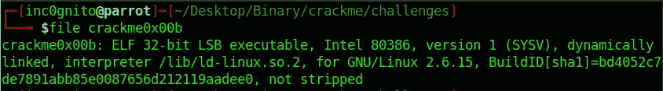

文件信息

使用 *rabin2* 工具收集信息。

```
$rabin2 -I crackme0x00b
```

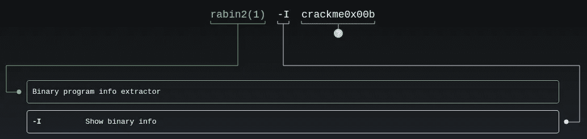

man rabin2

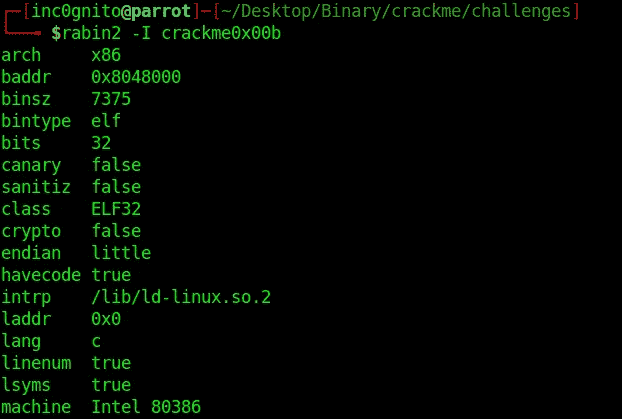

文件信息

给定的破解我是 32 位和小端，记下这一点，这将有助于找到破解的方法。

**使用字符串破解文件**

```
$strings -e L crackme0x00b
```

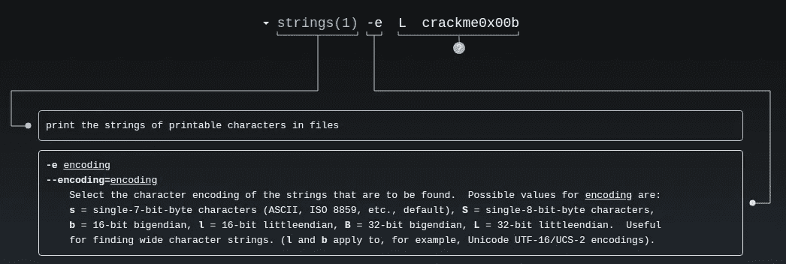

男子弦乐

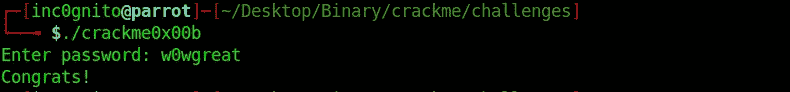

**使用 xxd 破解文件**

```
$xxd crackme0x0b
```


男人 xxd

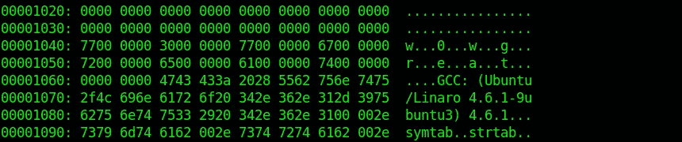

**使用 rabin2 破解文件**

```
$rabin2 -z crackme0x00b
```

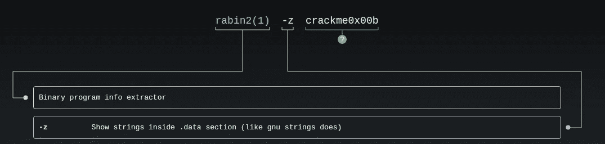

man rabin2

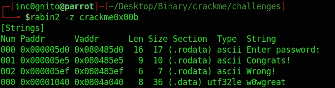

**使用 radare2 破解文件**

```
$radare2 crackme0x00a
 [0x080483e0]> aaa
 [0x080483e0]> pdf @ main
```

*   aa:-全部分析。
*   aaa:-用更多信息分析所有内容。
*   pdf:-打印反汇编功能。

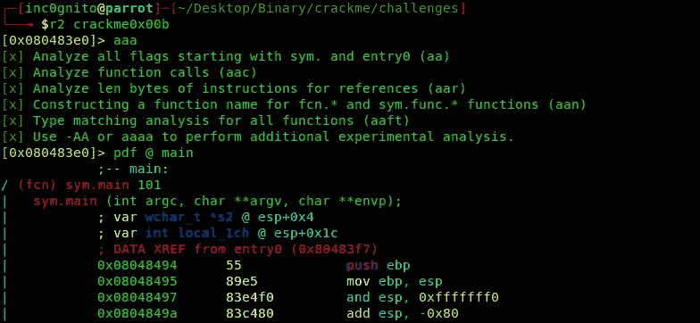

雷达 2

*wcscmp()* 使用*s1 和*s2 变量 s1 是指向 **w0wgreat** 和 s2 是输入字符串。

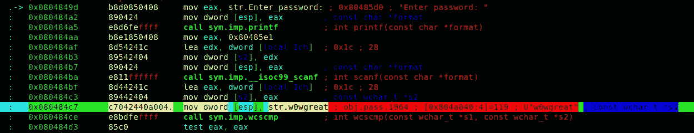

**使用 gdb-peda 破解文件**

gdb-peda 就像是 gdb 的一个插件，你可以从 [GitHub](https://github.com/longld/peda) 安装。

```
$gdb crackme0x00a
>gdb-peda$ disassemble main
```

反汇编 main 将显示二进制的主要功能。

```
gdb-peda$ break *0x080484ce
```

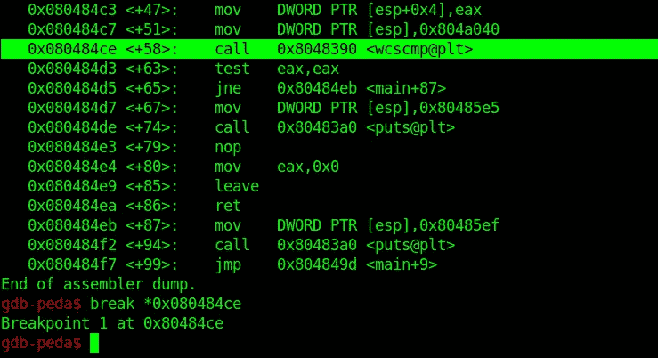

```
gdb-peda$ run
```

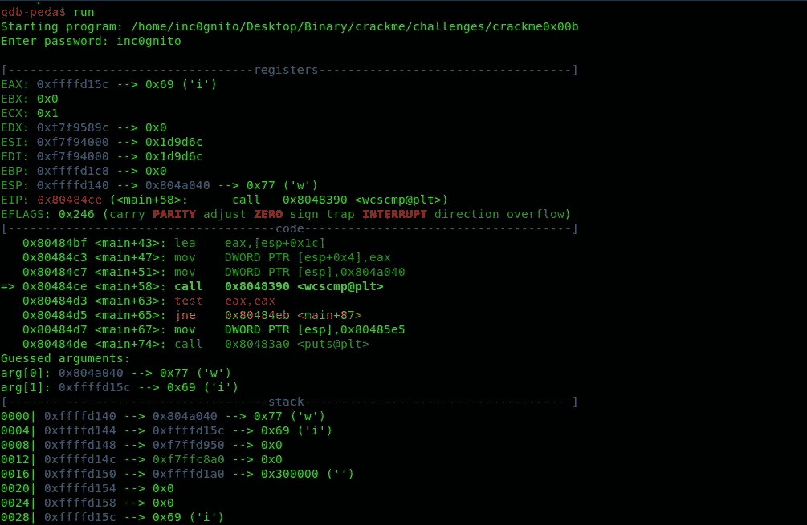

```
gdb-peda$ ni
```

*ni 或 nexti* —作为一条指令执行调用。

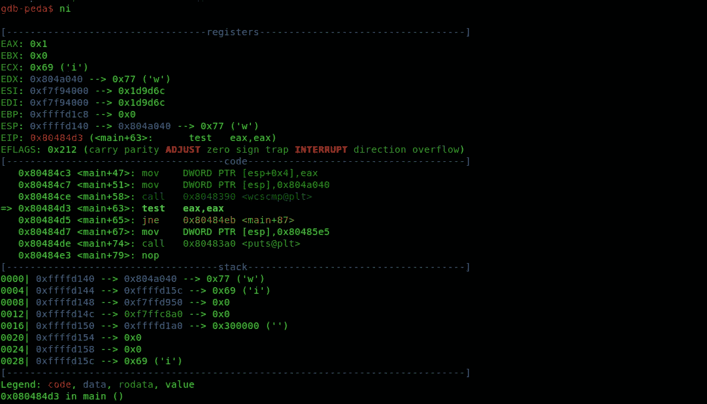

```
gdb-peda$ telescope $edx
```

telescope 视图显示堆栈值，并试图取消堆栈可能指向的指针的引用。

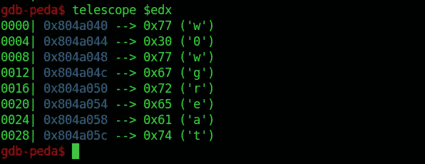

还有一种方法可以做上面事情

```
gdb-peda$ x/25s $edx
```

*x/ :-显示字节*

*25:-我们要显示多少个*

*s:——作为一根琴弦*

$edx:-这是指寄存器

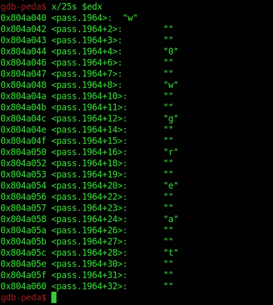

*感谢阅读！如果你喜欢这个故事，请点击**👏 ***按钮，分享*** *帮助别人！欢迎留言评论*💬*下图。有反馈？下面我们连线上* [*推特*](https://twitter.com/yashanand155) *。**

## *[寸宽](https://twitter.com/yashanand155)*