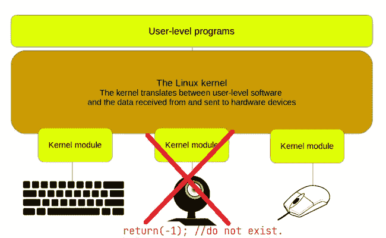
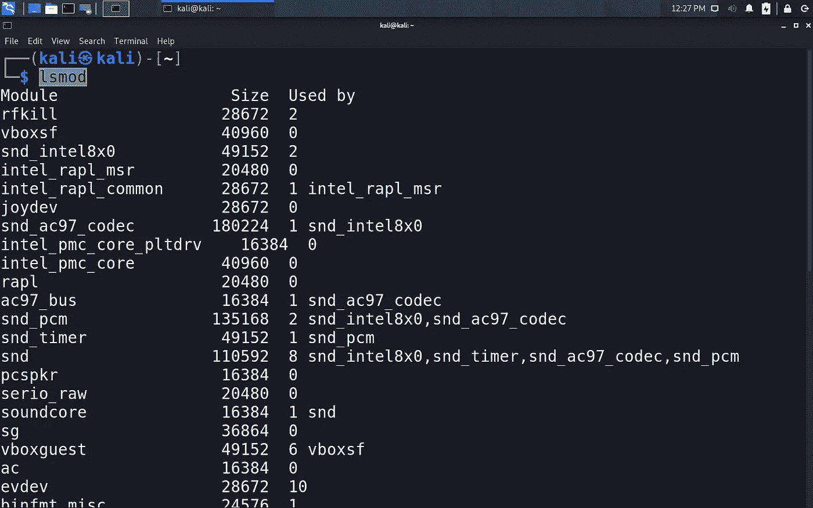
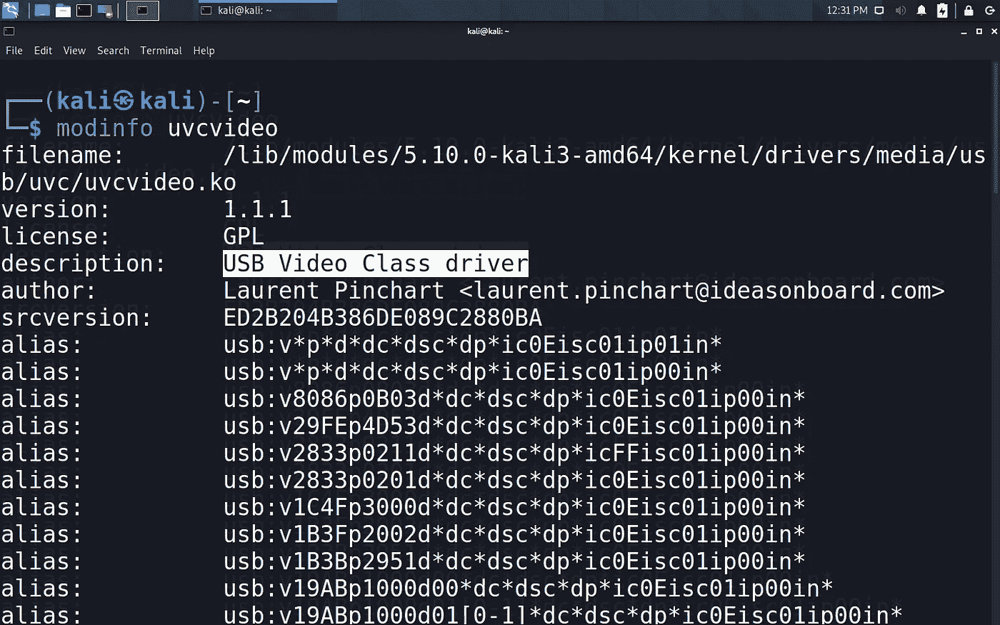
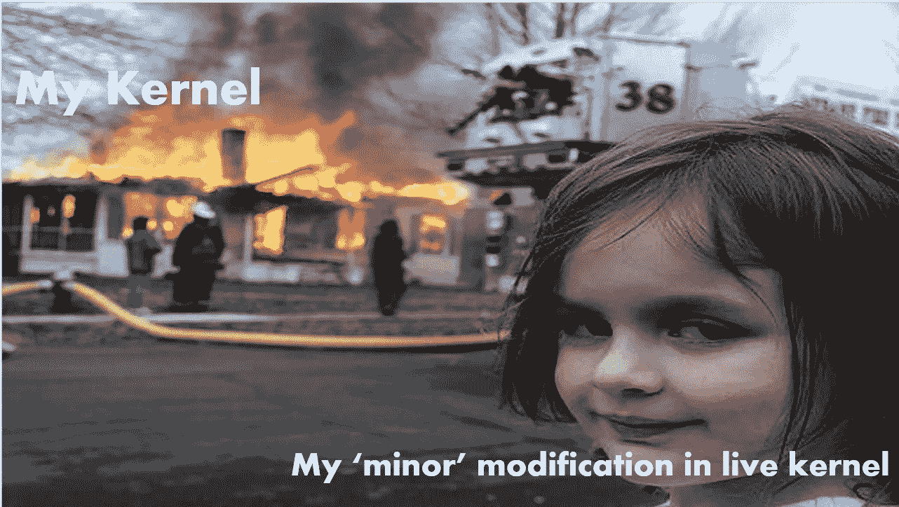

# “modprobe ”,数字安心🍃

> 原文：<https://infosecwriteups.com/modprobe-for-digital-peace-of-mind-86638e3a77be?source=collection_archive---------1----------------------->

在 Linux 内核中添加和删除模块以保护数字隐私。

## 你问什么是 modprobe？

> **modprobe** 智能地在 Linux 内核中添加或删除模块。modprobe 在模块目录 **/lib/modules/`uname -r`** 中查找所有模块和其他文件，除了 **/etc/modprobe.d** 目录中的可选配置文件。
> 
> ~(手册)页

## Linux 中的内核和内核模块

在 Linux 中，你可以通过“内核模块”为基本内核添加功能。这些程序可以在内核级加载，然后使用公开的 API 与您的资产进行通信。这就是大多数驱动程序在 Linux 中的工作方式，它们加载自己的内核模块并扩展内核的功能，以实现它们想要实现的功能，然后使用新公开的内核功能在用户级运行其余的代码。

## 内核模块和隐私

所以，我们知道内核模块被用来驱动设备，我们删除这些驱动程序并在内核级别禁用设备怎么样？

这正是我们要做的，关闭摄像头是一回事，但删除凸轮驱动程序本身有时是矫枉过正，但却是必要的邪恶。下图很好地形象化了这个想法。

kernels.png(opensource.com)

比方说，我们想阻止我们的摄像头，然后我们将删除(卸载)摄像头内核模块(驱动程序)这样做将禁用硬件和您的程序之间的唯一链接，因此禁止在未来使用摄像头饲料，除非您重新加载驱动程序，或者如果您根本不使用您的摄像头或相关设备是连接摄像头的生产机器，您可以直接将驱动器和模块列入黑名单，这将拒绝在引导过程中包含该模块。

## 基本卸载语法

使用`**modprobe -r <*module_name*>**`卸载任何模块，这将从当前运行的内核中移除该模块(该模块将在重启时再次加载)。

## 黑名单程序

要将模块列入黑名单-

1.  `**nano /etc/modprobe.d/blacklist.config**`(或者用你的 fav。文本编辑器)。
2.  在文件中添加`**blacklist <*module_name*>**`作为换行符并保存。

下次启动时不会加载该模块。

> 注意:黑名单模块可以通过`**modprobe <module_name>**`或`**insmod**` 工具手动加载。

# 如何禁用您的网络摄像头？

要禁用您的网络摄像头，您需要卸载`**uvcvideo**`模块，您可以在此阅读更多关于此模块的信息——

 [## 32.Linux USB 视频类(UVC)驱动程序——Linux 内核文档

### UVC 规范允许通过扩展单元(Xu)进行特定于供应商的扩展。Linux UVC 驱动程序…

www.kernel.org](https://www.kernel.org/doc/html/v4.13/media/v4l-drivers/uvcvideo.html) 

要用 modprobe 做到这一点，`**sudo modprobe -r uvcvideo**`应该做到。现在尝试打开任何使用相机的应用程序。为了形象化这一点，你做了类似于-

移除内核模块的可视化想法。

同样，你可以选择特定的驱动程序和模块，卸载它们或将其列入黑名单(对于相机模块，在`**/etc/modprobe.d/blacklist.config**` 中添加一行→ `**blacklist uvcvideo**` 并重启)。

## lsmod

要列出所有加载的内核模块，你可以使用`**lsmod**`

## 摩登信息

您也可以使用`modinfo`来获取关于模块的信息。

# 当心

卸载内核模块时要非常小心，一个错误的举动就会让你的整个系统陷入一场漂亮的崩溃！

# 结束语

这将保护你免受 90%的恶意软件的攻击和 100%的用户错误。

这不会保护你远离那些知道他们在做什么的人，但会增加他们的努力，并可能起到威慑作用。