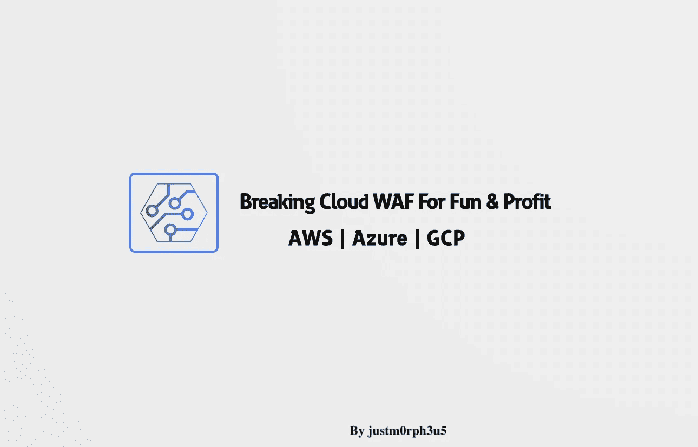
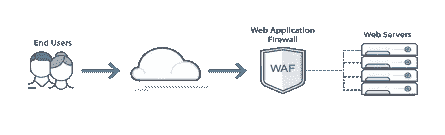

# 模块 1 |简介-测试和绕过 AWS/Azure/GCP 云 WAF 的乐趣和收益

> 原文：<https://infosecwriteups.com/module-1-introduction-pentesting-bypassing-cloud-waf-fun-profit-75f315951aa8?source=collection_archive---------1----------------------->

> 为什么你不应该相信云 WAF？



感谢[地米斯托克利](https://medium.com/u/ff26ea5d4b2c?source=post_page-----75f315951aa8--------------------------------)

## 简介和目标

web 应用程序防火墙(WAF)或 WAF 设备通过运行应用程序或服务来提供安全性，从而阻止不符合防火墙策略的恶意调用、输入和输出。今天，由于云架构的增加，多个云提供商正在提供他们自己的托管 WAF，该 WAF 与他们的技术(如负载平衡等)深度集成。

WAF 可以分为三大类:

1.  基于主机的 Web 应用程序防火墙
2.  基于网络的 Web 应用防火墙
3.  云和混合 Web 应用防火墙

第一类，基于主机的 web 应用程序防火墙(HWAF)是作为 web 服务器的模块安装的。与基于硬件的 WAFs 相比，这是一个非常便宜的解决方案，WAFs 是为小型 web 应用程序设计的。然而，存在大量的资源利用，因此会导致性能问题。

第二类是基于网络的 web 应用程序防火墙(NWAF ),传统上是基于硬件的，并且由于本地安装而具有减少延迟的优点。这意味着 NWAF 安装在靠近应用服务器的地方，很容易访问。

下一个类别与第一个和第二个有很多不同，是基于云的 WAFs，顾名思义，这些防火墙是基于云的。云 WAF 与常规 WAF 非常相似，但它用于防止对云环境的攻击。

> **这里我们将讨论基于云的 WAF。**

另外，[基于云的晶圆技术是](https://www.globaldots.com/resources/blog/what-is-cloud-based-web-application-firewall-waf/):

*   快速部署
*   易于设置
*   随增长付费的服务
*   管理起来不太复杂
*   易于集成
*   可扩展且有弹性
*   更好的监控
*   访问审计日志
*   分析学

通过使用云 WAFs，客户端不需要对其系统进行任何软件或硬件更改和调整，并且可以通过应用自定义规则和决定保护的积极程度来成功保护其网站免受威胁。

目前，有一种称为托管规则集的东西，由云提供商提供和管理，称为托管规则集。每个云提供商使用其自定义配置来运行云 WAF 规则引擎。因此，结果取决于不同的云提供商。

云 WAF 的安全特性:

*   针对可映射到 OWASP Top 10 的攻击的防护。
*   防范基于多层应用程序的攻击。
*   针对第 7 层 DDOS、SQL 注入、跨站点脚本和零日 web 应用攻击的地理位置攻击保护。
*   防范 HTTP(s)攻击。
*   基于 Bot 的攻击

## 网络服务器和晶圆放置



云 WAF 可以部署在 CDN 解决方案、应用负载平衡器、API 网关之上。例如，AWS WAF 与 Amazon CloudFront、4 我们的全球内容交付网络(CDN)服务以及用于弹性负载平衡的应用负载平衡器选项一起工作。

WAFs 可以在不同的模式下运行，包括黑名单方法(消极安全)、白名单方法(积极安全)和混合方法。

*   黑名单:这种方法保护 web 应用程序免受已知的攻击和特定的规则。通过使用基于规则的方法，这可以用来防止来自已知有效负载的攻击。例如:要构建黑名单规则，使用字符串匹配条件，然后在匹配时阻止请求。

```
If HEADER, User-Agent CONTAINS Mozilla/5.0 (Macintosh; Intel Mac OS X 10.15; rv:92.0) Gecko/20100101 Firefox/92.0
```

这种方法很容易被绕过，因为攻击者总是可以修改/欺骗有效载荷，而且它也不能防止任何类型的零日攻击。

*   白名单:这种方法也使用签名，但也应用逻辑决策，并允许符合特定规则/标准的流量。这意味着只有符合规则的指定流量才被允许，其他类型的流量(合法或无效)将被丢弃。这种方法需要不断修改，并且由于云提供的恒定规则/值，这被认为不是健康的方法。例如-允许重定向的域的白名单(如果没有列出匹配的值，则阻止请求)。

```
QUERY_STRING URL_DECODE CONTAINS target=https://example.com.
```

*   混合:据我所知，这被认为是最好的方法，因为它同时使用了黑名单和白名单方法，允许合法流量并以最小的误报阻止恶意流量。

## 结论

有多种测试方法可以对任何云提供商的 WAF 执行黑盒测试或灰盒测试。Web 应用程序防火墙根据规则对所有可能影响网络的潜在威胁做出智能响应。

> 云上的 web 服务正在增加，因此需要对云提供商提供和实现的 WAF 进行测试。同样，作为客户，每个客户都应该清楚他们所支付的保护级别。盲目地，我们不能在没有测试情况下支持任何晶片。因此，在渗透测试中理解 WAF 旁路变得非常重要。该解决方案必须在 HTTP/HTTPS 层保护 web 应用程序。我们将学习 cloud WAF 来检测/预防 OWASP 十大威胁。

在本系列的后面，我们将研究一种绕过 WAFs 的实用方法，作为我们渗透测试的一部分，当然，还有云 WAFs 中工作和缓解背后的理论。

**参考:**

*   [https://www . cloud flare . com/en-in/learning/DDOS/glossary/we B- application-firewall-waf/](https://www.cloudflare.com/en-in/learning/ddos/glossary/web-application-firewall-waf/)
*   [https://avinetworks.com/what-is-a-web-application-firewall/](https://avinetworks.com/what-is-a-web-application-firewall/)
*   [https://www . Radware . com/products/cloud-waf-service/#:~:text = Radware 的% 20Cloud % 20WAF %提供%20enterprise、evolving % 20 threats % 20 和%20protected%20assets](https://www.radware.com/products/cloud-waf-service/#:~:text=Radware's%20Cloud%20WAF%20provides%20enterprise,evolving%20threats%20and%20protected%20assets) 。
*   [https://www . radware . com/get attachment/a 7598 BDF-f1 D2-4 e09-acbe-53fd 60 e 315 EB/26d 695 B1-b4a 3-41d 8-ab4e-01e 705 ea 9638 . pdf . aspx](https://www.radware.com/getattachment/a7598bdf-f1d2-4e09-acbe-53fd60e315eb/26d695b1-b4a3-41d8-ab4e-01e705ea9638.pdf.aspx)
*   其他参考资料将在后面分享。
*   感谢[地米斯托克利](https://medium.com/u/ff26ea5d4b2c?source=post_page-----75f315951aa8--------------------------------)，我将会继续维护这个以及未来的博客。