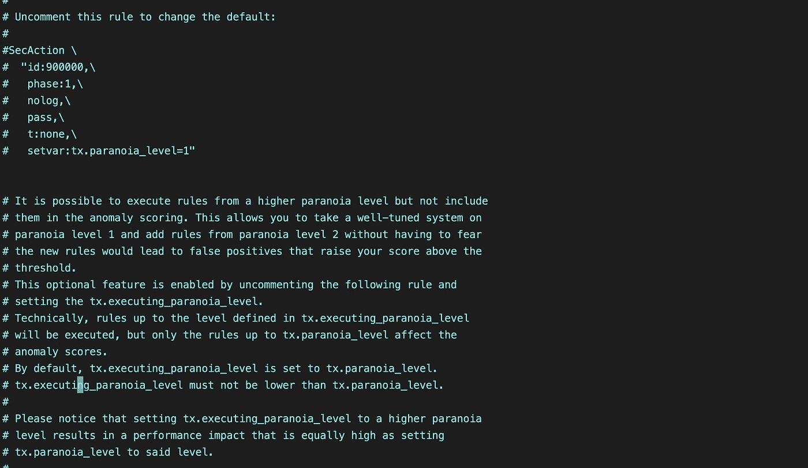
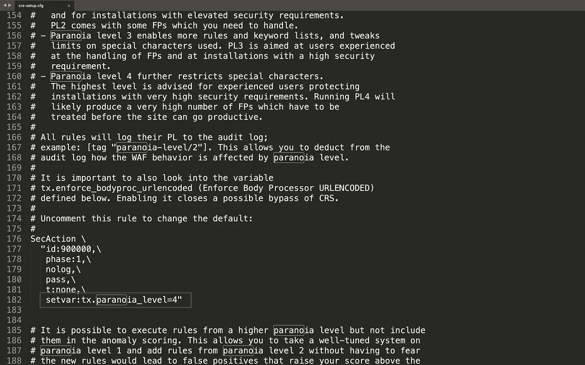
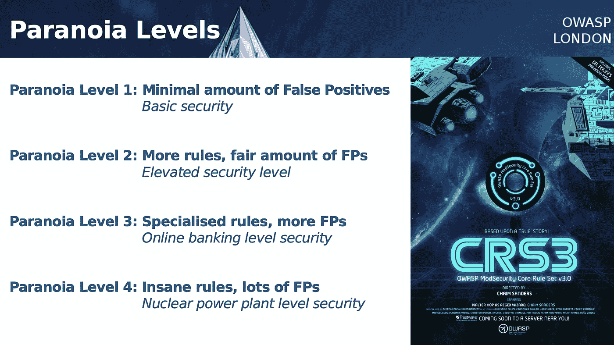
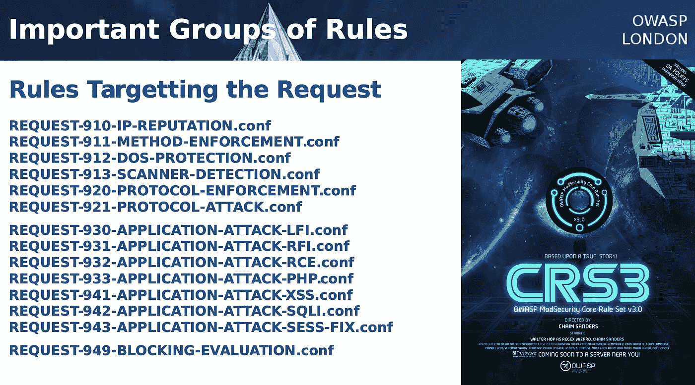
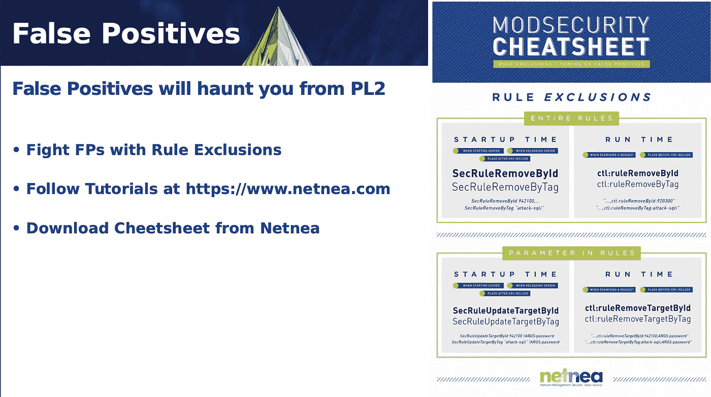
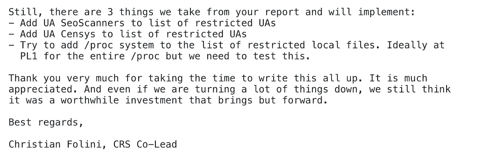
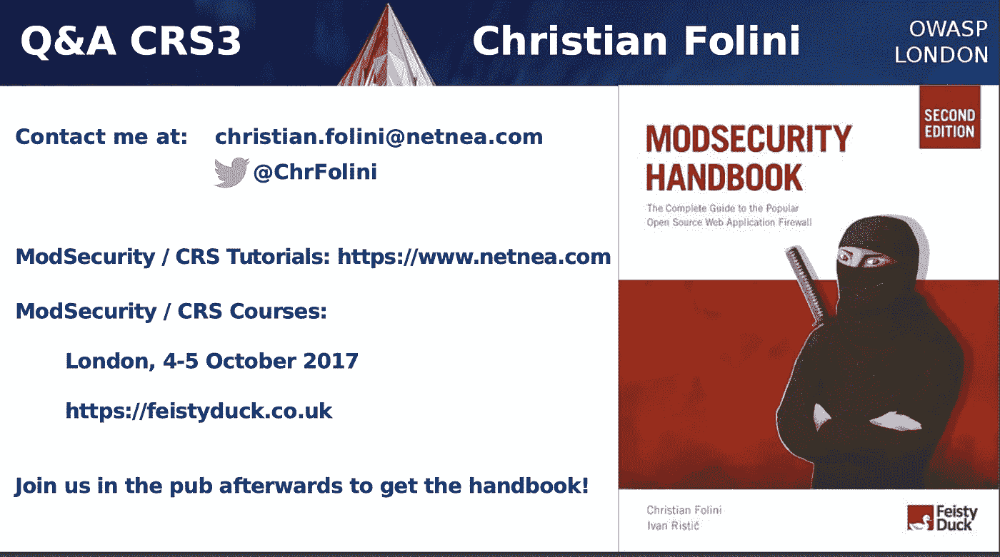

# 模块 2 |简介-测试和绕过 AWS/Azure/GCP 云 WAF 的乐趣和收益

> 原文：<https://infosecwriteups.com/module-2-introduction-pentesting-bypassing-aws-azure-gcp-cloud-waf-fun-profit-9c87b6276fe7?source=collection_archive---------5----------------------->

> 问:什么是核心规则集&为什么它被所有的云 waf 所利用？
> 答:我们将尝试了解更多关于核心规则集及其工作原理，并将尝试在 apache 服务器上实现 mod 安全性，并了解为什么它被主要的 WAFs 所利用。


感谢[地米斯托克利](https://medium.com/u/ff26ea5d4b2c?source=post_page-----9c87b6276fe7--------------------------------)

## 介绍

在开始在云上设置 WAF 之前，我们需要了解我们将在云 WAFs 中启用的核心规则集。由于 CRS 是开源的，我向**security@coreruleset.org**报告，报告中的一些内容被拒绝，其余的被接受，这在博客中有所提及。

稍后，我将展示未被接受的安全缺陷，以及为什么我认为它们是有效的原因，我还将设置云 WAF 并绕过 CRS 规则。

## 目标

*   ModSecurity & OWASP ModSecurity 核心规则集的定义。
*   核心规则集的工作。
*   为什么使用 OWASP CRS。
*   在 Apache 上实现 CRS。
*   CRS 配置和偏执水平？
*   CRS 和云晶圆
*   摘要

## 描述

*   **ModSecurity** :它是一个开源的、跨平台的 web 应用防火墙(WAF) **引擎**，适用于 Apache、IIS 和 Nginx。每个引擎都需要一套规则和条例来执行操作。
*   **OWASP CRS** : OWASP 核心规则集是一组通用攻击检测规则，用于 ModSecurity 或兼容 Web 应用防火墙(WAF)。任何兼容的 WAF 都可以使用 CRS 规则，因此所有云提供商都使用这些通用规则集在云上提供 WAF。
    CRS 可以保护 web 应用程序免受各种安全风险的影响，并在适当调整时将误报率降至最低。

## 为什么使用 OWASP CRS？

这些规则本质上是通用的，任何兼容的 WAF 引擎都可以使用 CRS，因此所有主要的云提供商，如亚马逊 AWS、微软 Azure、谷歌云、Akamai 等。都有某种形式的 CRS 服务。

因此，在将 CRS 用于生产应用程序之前，我们需要了解它的工作原理。

## 1.CRS 的实施

1.1:在 Debian/Ubuntu 上安装带有 Apache 的 ModSecurity

*   Apache 的 ModSecurity 模块包含在默认的 Debian/Ubuntu 存储库中。要安装它，请运行

```
sudo apt install libapache2-mod-security2
```

*   然后启用该模块。

```
sudo a2enmod security2
```

*   重启阿帕奇。

```
sudo systemctl restart apache2
```

1.2:配置 ModSecurity

*   在配置文件的`/etc/apache2/mods-enabled/security2.conf`中，有一行提到了`IncludeOptional /etc/modsecurity/*.conf`，因此我们需要如下所述将`IncludeOptional /etc/modsecurity/*.conf modsecurity.conf-recommended`复制到`modsecurity.conf`。

```
sudo mv /etc/modsecurity/modsecurity.conf-recommended /etc/modsecurity/modsecurity.conf
```

*   然后编辑这个文件。

```
sudo vim /etc/modsecurity/modsecurity.conf
```

*   将下面一行`SecRuleEngine DetectionOnly`改为`SecRuleEngine On.`
    ModSecurity 将检测并阻止网络攻击，因为我们将模式从仅检测改为仅检测。

```
SecRuleEngine On
```

*   然后把 SecAuditLogParts 改成 ***ABCEFHJKZ。***

```
SecAuditLogParts ABCEFHJKZ
```

*   保存并关闭。然后我们将重启 Apache。

```
sudo systemctl restart apache2
```

1.3:安装 OWASP 核心规则集(CRS)

*   为了让 ModSecurity 保护 web 应用程序，我们需要定义规则来检测恶意活动并阻止它们。我们可以使用现有的规则集和配置，也可以根据需要进行定制。 **OWASP 核心规则集** (CRS)是 ModSecurity 使用的标准规则集。
*   从 GitHub 下载最新的 OWASP CRS。

```
#wget [https://github.com/coreruleset/coreruleset/archive/refs/tags/v3.3.2.tar.gz](https://github.com/coreruleset/coreruleset/archive/refs/tags/v3.3.2.tar.gz)
```

*   提取文件。

```
tar xvf v3.3.2.tar.gz
```

*   创建一个目录来保存 CRS 文件。

```
sudo mkdir /etc/apache2/modsecurity-crs/
```

*   将提取的目录移动到`/etc/apache2/modsecurity-crs/`。

```
sudo mv coreruleset-3.3.0/ /etc/apache2/modsecurity-crs/
```

*   转到该目录。

```
cd /etc/apache2/modsecurity-crs/coreruleset-3.3.2/
```

*   重命名`crs-setup.conf.example`文件。

```
sudo mv crs-setup.conf.example crs-setup.conf
```

*   我们需要编辑`/etc/apache2/mods-enabled/security2.conf`文件。

```
sudo vim /etc/apache2/mods-enabled/security2.conf
```

*   更改下面提到的加载默认 CRS 文件的行。

```
IncludeOptional /usr/share/modsecurity-crs/*.load
```

*   将其更改为以下内容，以便使用最新的 OWASP CRS。

```
IncludeOptional /etc/apache2/modsecurity-crs/coreruleset-3.3.2/crs-setup.conf
IncludeOptional /etc/apache2/modsecurity-crs/coreruleset-3.3.2/rules/*.conf
```

*   检查语法，然后重新启动 Apache。

```
sudo apache2ctl -t
sudo systemctl restart apache2
```

您可以看到 OWASP CRS 可以在两种模式下运行:

*   **异常评分模式**。这是 CRS v3.x 中使用的默认模式，基于“协作检测”和“延迟阻止”的概念。ModSecurity 将根据所有规则检查 HTTP 请求，并为每个匹配的规则添加一个分数。如果达到阈值，则 HTTP 请求被视为攻击，将被拦截。
*   **独立模式**。这是最基本的操作模式，所有的规则都是“独立的”。ModSecurity 将立即阻止 HTTP 请求，并停止评估剩余的规则。

> 入站请求的默认分数为 5，出站响应的默认分数为 4。

当在异常评分模式下运行时，有 4 个偏执水平。

*   一级妄想症
*   妄想症 2 级
*   妄想症 3 级
*   妄想症 4 级

随着妄想症级别的提高，CRS 会启用额外的规则，为您提供更高的安全级别。然而，更高的偏执水平也增加了由于错误警报而阻止一些合法流量的可能性。



> 为了测试[，Christian Folini](https://twitter.com/ChrFolini)(OWASP[@ core ruleset](http://twitter.com/CoreRuleSet)项目共同负责人)提供了偏执等级为**4 的配置。**



在使用 CRS 之前，您需要理解这两个基本概念。现在我们可以关闭文件了。各个 CRS 规则存储在`/etc/apache2/modsecurity-crs/coreruleset-3.3.2/rules/`目录中。每个匹配规则都会增加异常分值。

异常分值将根据触发的规则不断增加，并开始阻止恶意流量。这可以通过云 WAF 日志在事件中检查。

> 注意:显然不会有任何请求体，只有 GET 请求 URL 会出现在日志中。因此，一旦 WAF 在生产中实施，减少假阳性将非常棘手。
> 
> 在实现 CRS 时，我能够实现零误报，尽管我不得不禁用一些规则，因为在云中不可能调整配置。然后我创建了自定义规则。

*   偏执等级基本就是规则的严格程度。

[](https://owasp.org/www-chapter-london/assets/slides/OWASPLondon20170330_ModSecurity_CRS_v3_Intro.pdf)

*   对于一些基本规则，请参考云提供商的文档以获得规则列表。

[](https://owasp.org/www-chapter-london/assets/slides/OWASPLondon20170330_ModSecurity_CRS_v3_Intro.pdf)

*   云 WAF 上的误报率很高，因为无法修改配置。
    因此，应遵循混合方法(黑名单&白名单)方法。

[](https://owasp.org/www-chapter-london/assets/slides/OWASPLondon20170330_ModSecurity_CRS_v3_Intro.pdf)

# 调整 CRS

CRS 绝对可以防御大量的恶意流量，阻止大多数安全扫描和所有基于自动化/脚本小子的 HTTP 攻击。
通用方法会出现误报，因为 WAF 提供商正在提供定制配置，因此一家云提供商的 WAF 可能与另一家不同。此外，根据测试云 WAF 时触发的规则，自定义规则会有所不同。
这种默认的云 WAF 会带来很多误报，每个 WAF 都需要根据其实施的应用进行测试。

**这意味着 ModSecurity 和 CRS 充当第一道防线，为您赢得时间，并防止遵从。**

> 这是核心规则集的基础，接下来我将展示在不同的云提供商上设置 WAF 以及如何测试 WAF。然后，我们将编写基于日志的自定义规则。

# 摘要

偏执等级设置是一个重要的部分，但最重要和最棘手的功能是异常评分。异常评分意味着 CRS 不会立即阻止请求。相反，它将检测与阻塞决策分开。当规则因遇到请求中的特定模式而触发时，它会提高请求的异常分值。然后运行一个单独的规则来检查总异常分数。该单独的规则基于异常阈值执行阻止决策。

这将根据云发生变化，并且该异常评分将基于云 WAF 的配置方式。

## 由于云提供商使用开源 CRS，因此建议向 CRS 团队报告。因此，从我的报告中接受了 3 件事，这将在下面提到。

我的报告中有三点:😁

*   将 UA SeoScanners 添加到受限 UA 列表中
*   将 UA 许可系统添加到受限 UA 列表中
*   尝试将/proc system 添加到受限本地文件列表中。理想情况下，整个/proc 都在 PL1，但我们需要对此进行测试。



> 就 Christian Folini 自己而言，Modsecurity CRS 是第一道防线，这意味着在默认安装中，许多攻击和绕过都不会被检测到。这并不理想，但是一个合理的妥协，因为对于我们的用户来说，另一种选择是根本没有规则集。

*   **联系**[**Christian folini**](https://twitter.com/ChrFolini)**因为如果您想测试/报告 CRS 的任何问题，他会很快响应并提供帮助。
    向**[](https://www.netnea.com/cms/tutorials/)**举报 CRS 中的安全问题。**

**[](https://www.netnea.com/cms/tutorials/)

摘要** 

## **参考**

*   **[https://www . Linux babe . com/security/modsecurity-Apache-debian-Ubuntu](https://www.linuxbabe.com/security/modsecurity-apache-debian-ubuntu)**
*   **[https://Kemp technologies . com/blog/Kemp-owasp-CRS-load-balancer/](https://kemptechnologies.com/blog/kemp-owasp-crs-load-balancer/)**
*   **[https://www . net nea . com/CMS/Apache-tutorial-7 _ including-modsecurity-core-rules/](https://www.netnea.com/cms/apache-tutorial-7_including-modsecurity-core-rules/)**
*   **[https://owasp . org/www-chapter-London/assets/slides/owasplondon 2017 03 30 _ ModSecurity _ CRS _ v3 _ intro . pdf](https://owasp.org/www-chapter-london/assets/slides/OWASPLondon20170330_ModSecurity_CRS_v3_Intro.pdf)**
*   **感谢[地米斯托克利](https://medium.com/u/ff26ea5d4b2c?source=post_page-----75f315951aa8--------------------------------)，我将会继续维护这个以及未来的博客。**