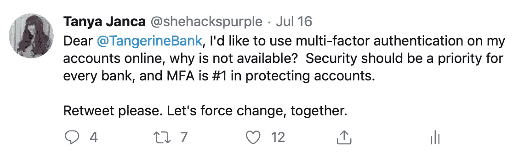
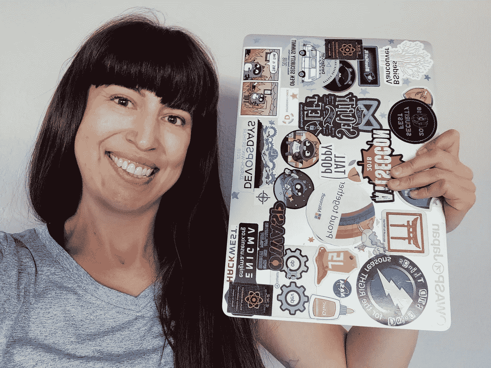
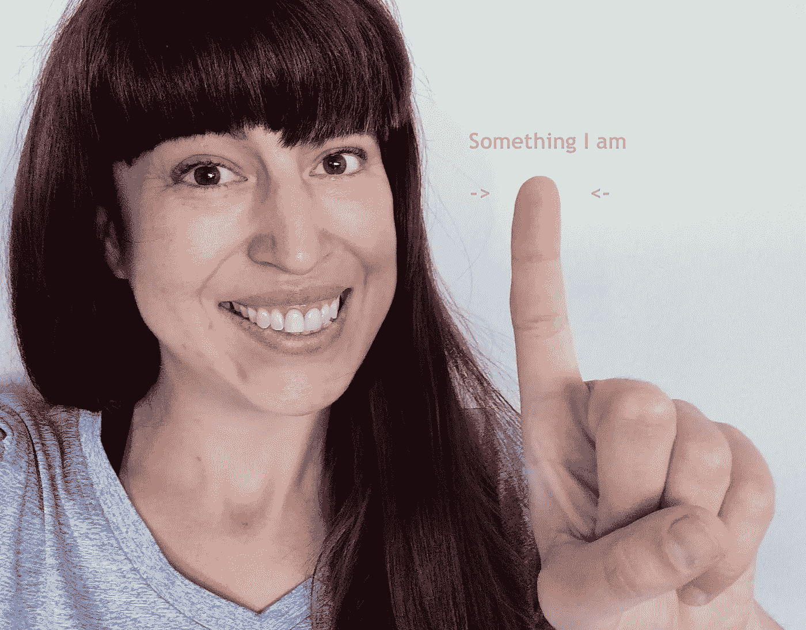
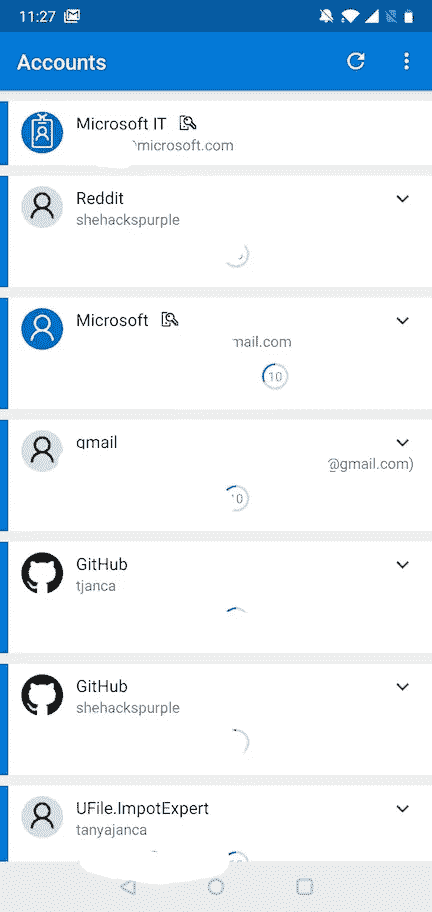

# 多因素身份认证(MFA)

> 原文：<https://infosecwriteups.com/multi-factor-authentication-mfa-add5009eeb04?source=collection_archive---------0----------------------->

**本文面向安全初学者或其他 IT 人士，而非安全专家。:-D

最近，你可能已经注意到我指出了几家加拿大银行不允许用户在他们的网上银行账户中添加多因素认证(MFA)。这篇博文将详细说明我这么说的意思，为什么它很重要，以及我为什么要推动它。

> 更新:你可以通过标签 **#MFAally 在线关注这个主题的社区活动。**

我和一家加拿大银行争论他们没有 MFA

双因素或多因素身份验证(2FA 或 MFA)意味着使用多个因素来证明您是真实可信的您。认证的一个“因素”是向计算机证明你是谁的一种方法。目前只有 3 种类型:你*有的*，你*有的*，你*知道的*。

*   你拥有的东西可能是电话、电脑、代币或你的工作证。一些只有你才能拥有的东西。

“您拥有的东西”可以是您的笔记本电脑、手机、生成代码的令牌、您的徽章等等。

*   **你是什么样的人**可能是你的指纹、虹膜扫描、你的步态(你走路的方式)或你的 DNA。对你来说身体上独一无二的东西。

“你是什么”可以是你的指纹、虹膜扫描、你走路的步态、你的 DNA 等等。

*   **你所知道的东西**可能是一个密码、一个通行短语、一个模式或几条信息的组合(通常被称为“安全问题”)，比如你母亲的娘家姓、你的出生数据和你的社会保险号。这个想法是，这只是你知道的事情。

当我们仅使用用户名和密码登录帐户时，我们只使用了一个身份验证“因素”,这比使用两个或更多因素更不安全。很多时候，帐户被闯入或数据被盗，往往是由于有人只使用一个因素。

当密码被破解时，具有第二身份验证因素的用户仍然受到保护。当有人试图暴力破解启用了 MFA 的系统或帐户时，即使他们最终获得了密码，他们也不会有第二个因素来进入。使用第二个因素会使你的在线账户更难被侵入。

[微软认证器应用](https://www.microsoft.com/account/authenticator?WT.mc_id=medium-blog-tajanca)

当云壳把我从 ***注销到*** (好尴尬！)去年冬天在香港的 [#MSIgniteTheTour](https://www.microsoft.com/ignite-the-tour/?WT.mc_id=medium-blog-tajanca) 上，我使用了我的用户名和密码(我知道的两件事，意思是同一因素的两件事)，加上[微软认证应用](https://www.microsoft.com/en-us/account/authenticator?WT.mc_id=medium-blog-tajanca)(我有的东西)，在我的手机上(我有的其他东西)，它要求我的指纹(我就是这样的东西)。这意味着我使用认证的所有三个因素**重新登录。尽管我知道它无意中制作了一个我正在使用的微软产品的演示，但在演示过程中被注销还是很尴尬的...**

先不说演示-失败，先来说说 MFA 是什么，不是什么，为什么**这么重要**。

## 多种纤维织物的例子

多因素:输入您的用户名和密码，然后必须使用第二个设备或物理令牌来接收代码进行身份验证。用户名和密码是一个因素(你知道的东西)，使用第二个设备是第二个因素(你有的东西)。

不是多因素:用户名和密码。这是同一个因素的两个例子；他们都是你知道的东西。多因素认证意味着你拥有 ***多个不同类型的因素*** 的认证，而不是一个或多个 ***相同类型的*** 。

不是多因素:使用用户名和密码，然后回答安全问题。这是两个相同的事实，你知道的。

我试图证明“你知道的东西”

> 我们行业中的许多人不同意使用您的手机接收带有 pin 的 SMS(文本消息)是否是 MFA 的“好”实现，因为 SMS 协议及其一些实现中存在已知的安全缺陷。我(可能不受欢迎)的观点是，我宁愿有一个相当好的第二身份验证因素，而不是只有一个因素，如果这是说服普通用户采用 2FA 的折衷(便利性与完美的安全性)，我赞成使用 SMS 作为第二个因素。

Azure 安全中心 给任何人和所有人的第一条安全建议是对您的所有订阅启用多因素身份验证；保护你的(云)王国的钥匙是最重要的。事实上，启用多因素身份验证(简称为 MFA 或 2FA)是行业最佳实践，安全专业人员经常向技术人员和非技术人员这样描述他们所有的重要客户。然而奇怪的是，在谷歌和其他流行平台上，只有不到 10%的账户启用了 2FA。为什么？

我怀疑原因是 2 折；1)这并不总是方便的，2)公众根本不了解这种风险。虽然我们大多数人无法改变第一，但我们每个人都可以努力改变第二。

亲爱的读者，我想呼吁你，试着向你生活中、工作中或家里的人解释 MFA，并请他们在他们的重要账户上启用它。我还想请你在家里和工作中为自己启用 2FA，如果你还没有的话。它可能会让你或你爱的人免于严重的心痛。

# **关于这个和更多，请查看我的书，** [**爱丽丝和鲍勃学习应用安全**](https://aliceandboblearn.com/) **和我的在线培训学院，** [**我们黑紫色**](https://academy.wehackpurple.com/) **！**

## 我有一个邮件列表，请订阅，这是免费的！

*关注* [*Infosec 报道*](https://medium.com/bugbountywriteup) *获取更多此类精彩报道。*

 [## 信息安全报道

### 收集了世界上最好的黑客的文章，主题从 bug 奖金和 CTF 到 vulnhub…

medium.com](https://medium.com/bugbountywriteup)