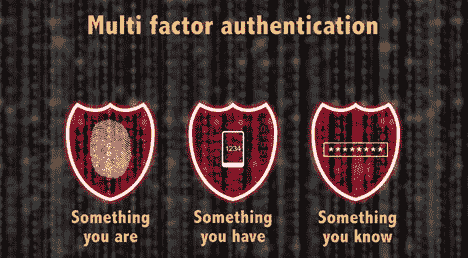
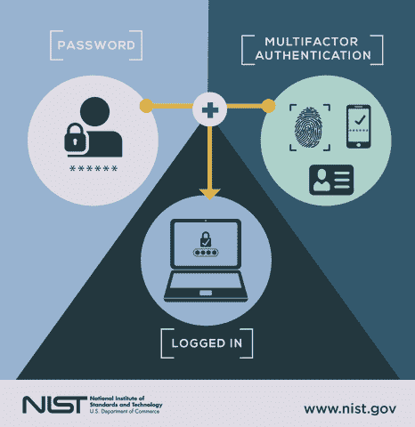

# 使用 SAML 的多因素身份验证(MFA)和集成

> 原文：<https://infosecwriteups.com/multi-factor-authentication-mfa-and-integration-using-saml-8ec0f8b41296?source=collection_archive---------2----------------------->

在上一篇文章中，我已经分享了我对 SAML 的了解，它背后的历史，以及它的工作机制。但事情并没有就此结束，我想进一步了解它，然后我发现它在配置和集成 MFA 解决方案和 IDP 时也使用了，作为身份验证机制的附加层。所以我们来多了解一下。

## 首先，什么是 MFA(多因素认证)？

多因素身份认证只不过是一种额外的身份认证级别，我们需要再提供一个因素，可能是 OTP、来自应用程序的数字代码(Google Authenticator)或声明我们是谁的硬令牌。这不仅会提高安全性，还会降低身份盗窃的风险。

## MFA 是如何工作的？

MFA 的工作机制类似于用户密码机制。在上图中，我们可以看到一个链接。首先，用户需要输入他的凭证。一旦他的身份得到验证，他需要再次以 MFA 的形式提供他的身份，这可以是来自应用程序或设备的 OTP 或令牌。

与用户凭证存储在数据库中并用于验证的方式一样，拥有自己的唯一设备 id 作为标识符的 MFA 设备也需要配置到用户配置文件中，以便验证用户的身份。

## 多种纤维织物的类型

对于要进行身份验证的用户，密码是身份验证的一个强制因素。当涉及到附加层时，传统的方法是以一次性短信的形式发送到我们的电子邮件和移动设备上。

MFA 以硬令牌和软令牌的形式出现。

*   硬令牌:硬令牌是一种使用物理设备进行身份验证的形式，如生物特征、OTP 身份验证令牌等。最好的例子是 RSA 安全认证令牌。
*   软令牌:软令牌是使用“电话作为令牌”的一种形式。一般来说，使用移动应用程序或设备被用作软令牌。最常见的是 Google authenticator 和 Microsoft authenticator，它们有 OTP，也可以作为软令牌推送通知。

## 如何配置 MFA

一些网站要求其用户在访问网站时配置 MFA。这些网站中的大多数都支持一些 MFA 软令牌，如 Google Authenticator。

*   **使用软令牌应用的 MFA**

用户需要通过使用移动设备扫描 QR 码或设备链接码来配置此 MFA。然后，Google Authenticator 的唯一设备 ID 将链接到用户的个人资料。

而企业根据需求使用不同的方法来配置 MFA。如果企业使用 Azure active directory 解决方案，Azure 会提供在门户中直接配置 MFA 的功能，可以是短信、电话或微软认证器推送通知的形式。这在启用单点登录(SSO)时增加了一层额外的安全性。

*   **使用 SAML 配置的 MFA**

正如在之前的[文章](https://adithyathatipalli.medium.com/what-is-saml-and-how-it-is-useful-for-sso-24d83b98185a?source=your_stories_page-------------------------------------)中提到的，SAML 用于认证，也有助于启用 SSO。SAML 还可以用于在不同设备之间配置 MFA。

在企业中，多个主机使用不同的 sp。通过使用 SAML，我们可以通过以下任何方式实施 MFA。

*   无 MFA
*   基于主机到主机的 MFA
*   所有人的 MFA。

在某些情况下，当具有高安全性要求的应用程序需要重新认证时，我们可以使用 SAML 来中断 SSO 会话并启动重新认证。

结论:

通过在企业应用程序和设备之间实施 MFA，可以更好地管理用户身份并降低身份被盗的风险。MFA 可以直接在企业的 Active Directory 中实施，或者在作为联邦身份连接的应用程序中实施。此外，我们可以使用 SAML 配置联邦连接。

感谢您阅读本文:)

如果你喜欢我的作品，请支持我。

其他资源:

 [## 如何配置多因素和强制认证应用程序

### 简介斯坦福的身份提供商(IdP)提供进行 Web 单点登录所需的认证服务…

uit.stanford.edu](https://uit.stanford.edu/service/saml/mfa)  [## Azure AD 多因素身份验证概述

### 多因素身份认证是一个过程，在此过程中，用户在登录过程中会被提示提供其他形式的…

docs.microsoft.com](https://docs.microsoft.com/en-us/azure/active-directory/authentication/concept-mfa-howitworks)  [## 多因素身份认证实施

### 第 1075 号出版物,《联邦、州和地方机构税务信息安全指南》( Pub。1075)要求…

www.irs.gov](https://www.irs.gov/privacy-disclosure/multi-factor-authentication-implementation)  [## 思杰和微软之间的 SAML 认证与 Azure MFA-Deyda.net

### 由于项目越来越多，这里有一点如何与我以前的文章总结。

www.deyda.net](https://www.deyda.net/index.php/en/2020/04/02/saml-authentication-between-citrix-microsoft-with-azure-mfa/)