# 多因素身份认证漏洞

> 原文：<https://infosecwriteups.com/multi-factor-authentication-vulnerabilities-7a4b647a7b09?source=collection_archive---------1----------------------->

嗨，我的名字是 Hashar Mujahid，在这篇博客中，我们将讨论 MFA 和最常见的可能出现的 MFA 漏洞。


所以首先要做的是

**什么是多重身份认证？**

许多网站和组织依赖单因素身份验证，用户可以仅使用密码登录其帐户，无需任何额外的安全和验证层。但是，随着社会工程攻击变得越来越复杂，迫切需要一个额外的安全层，如多因素身份验证。在多因素身份认证中，当用户输入其密码以登录时，web 应用程序会向用户的验证电子邮件地址发送一个临时代码，只有当用户输入该代码时，他才能与其帐户进行交互。

**什么是双因素身份认证令牌？**

用户经常从某种物理设备上读取验证码。许多高安全性网站现在提供了一种特定的设备来实现这一功能，例如 RSA 令牌或键盘设备，您可以用它来访问您的网上银行或工作笔记本电脑。这些专用设备除了专门为安全性而构建之外，还提供了立即生成验证码的额外好处。出于同样的原因，网站通常会使用特定的移动应用程序，如 Google Authenticator。

现在，我们必须讨论在实施多因素身份认证时可能出现的一些漏洞。

## **完全跳过验证过程:**

当用户输入密码，网站提示他输入 MFA 代码时，您是否可以跳过 MFA 过程直接访问该帐户是值得检查的。

例如:

让我们假设用户在`/login`页面输入他的密码，然后网站将用户重定向到`/mfa-verification`，你可以尝试将 URL 从`/mfa-verification`改为`/dashboard`。

[**实验室:2FA 简易旁路**](https://portswigger.net/web-security/authentication/multi-factor/lab-2fa-simple-bypass) **:**

我们必须绕过外交部进入受害者(卡洛斯)的账户页面。

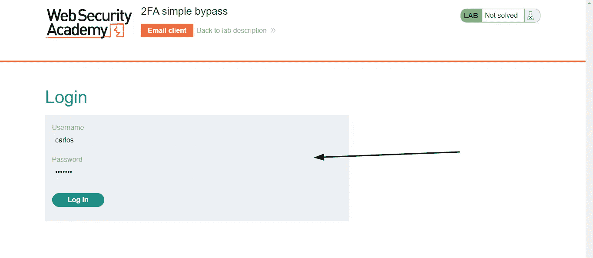

让我们使用提供给我们的凭据登录。

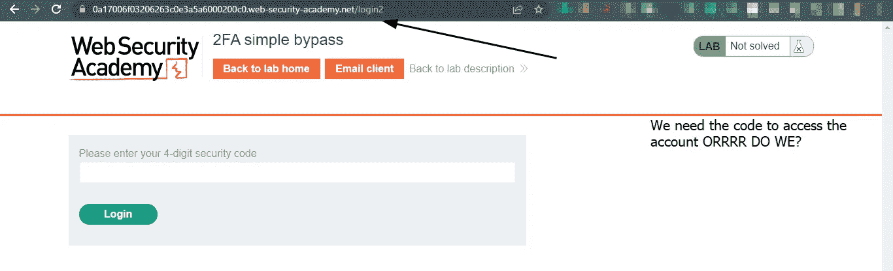

让我们把`/login2`改成`/`。

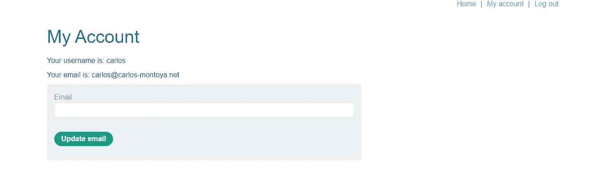

我们可以看到我们完全登录了。

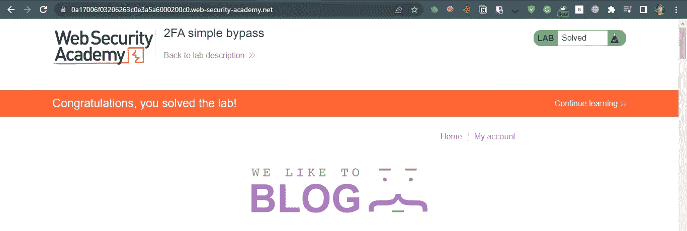

# 有缺陷的双因素验证逻辑:

当双因素身份验证逻辑有缺陷时，网站可能无法正确验证同一用户在完成第一步后正在完成第二步。

例如:

在第二步中，用户使用密码登录，应用程序分配一个 cookie 来跟踪该操作是否由同一用户执行。

```
HTTP/1.1 200 OK 
Set-Cookie: account=carlos ==> **Pridictable value.** 
```

攻击者可以使用他的帐户启动有效的登录过程，但是将 cookie 值更改为受害者，并以受害者的身份登录。

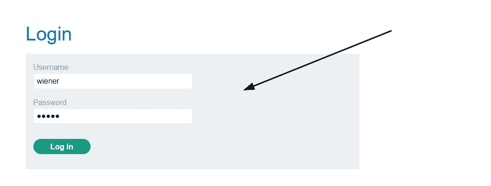

登录后，我们将在电子邮件客户端收到一个代码。

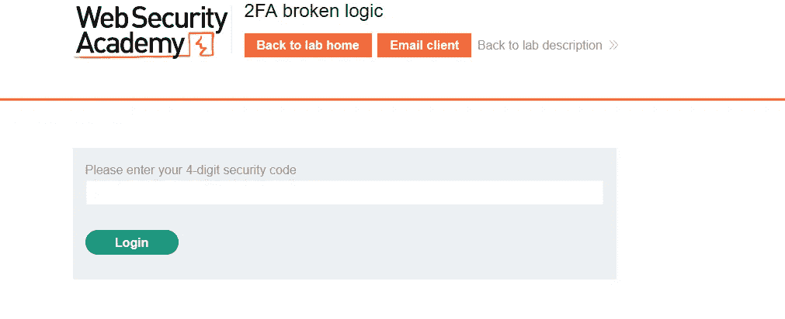

输入代码，用 burp suite 拦截请求。

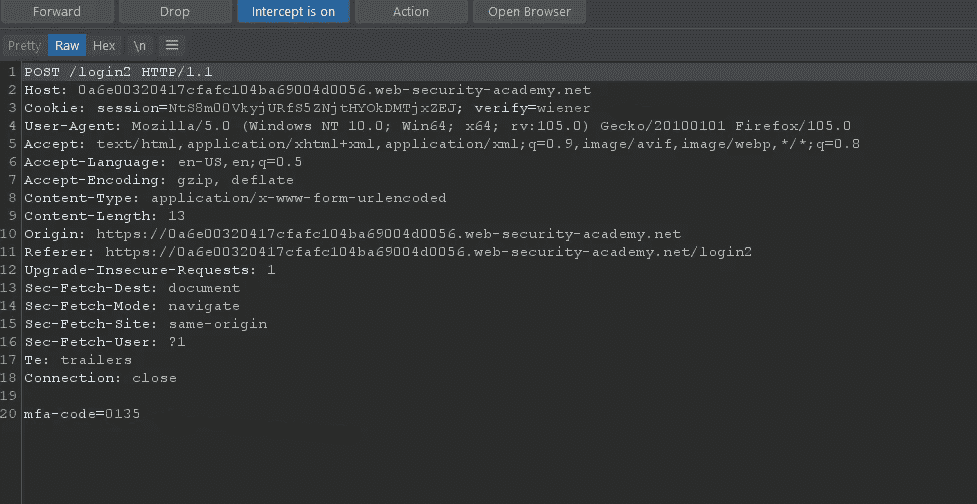

现在将这个请求发送到中继器，并更改请求方法，将验证 cookie 更改为 Carlos，这样就为 Carlos 生成了一个 MFA 代码。

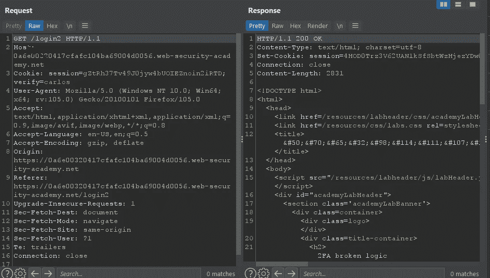

现在，我们只需要强行破解那个 MFA 代码。

转到登录页面，输入您的用户名和密码。然后，提交无效的 2FA 代码。把帖子`/login2`发给入侵者，把验证改成卡洛斯。暴力破解 MFA 代码。

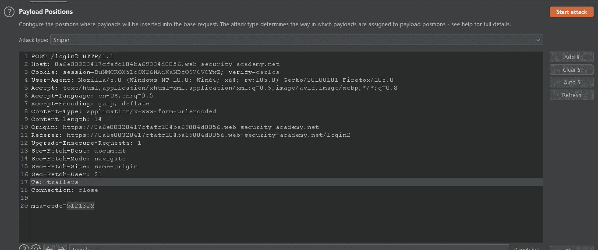

开始蛮力攻击。

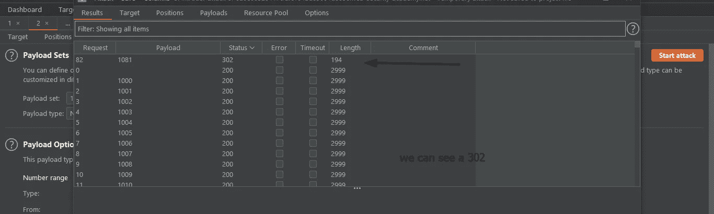

我们可以复制会话并用当前值替换它。

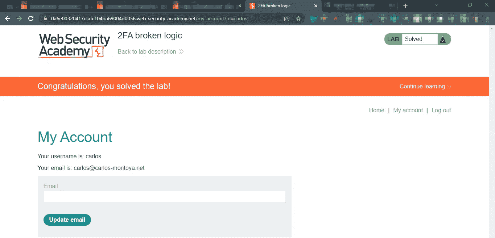

在下一部分，我们将学习一些绕过 MFA 系统的高级技术

我强烈推荐 solving portswiggers 实验室来练习这些技术。

在那之前，快乐的黑客❤

## 来自 Infosec 的报道:Infosec 每天都有很多内容，很难跟上。[加入我们的每周简讯](https://weekly.infosecwriteups.com/)，以 5 篇文章、4 个线程、3 个视频、2 个 GitHub Repos 和工具以及 1 个工作提醒的形式免费获取所有最新的 Infosec 趋势！