# 一个程序中的多个错误导致€1500

> 原文：<https://infosecwriteups.com/multiple-bugs-in-one-program-leads-to-1500-c35fcde06bc7?source=collection_archive---------1----------------------->

大家好，今天我要谈谈我在同一个程序中发现的三个基本漏洞，我获得了 1500€的奖励。

因为这三种方法都是相似的，所以将漏洞联系在一起是非常容易的。让我们称之为编辑，因为该公司运行一个私人的错误赏金计划。所以让我们开始吧。

> **一、参数变更& HTTP 响应操纵导致客户端管理员 PII 泄露**

在编校的应用程序中，用户不能访问客户端的“访问”面板，因为他们没有授权。“访问”按钮包含客户端用户的信息，并允许我们查看哪些用户被授权或未被授权。

我们无权访问的客户端实例。只有“属性”选项出现，但我们不能点击它，我们不能访问任何按钮。

无访问客户端示例。

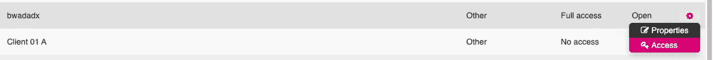

完全访问客户端示例。

现在，我们将能够通过更改参数和使用 HTTP 响应来访问不可访问的客户端的“访问”按钮。这将向我们显示哪些用户拥有什么权限。此外，它将披露用户的 PII 信息，如电子邮件，公司，角色。

首先，我进入列出客户的部分，在搜索按钮中输入一个随机的字母。我抓住了请求，面临以下情况。

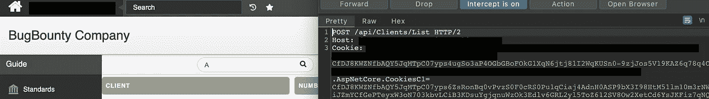

整个请求包含要列出的所有客户端的信息。我查了第一个客户。

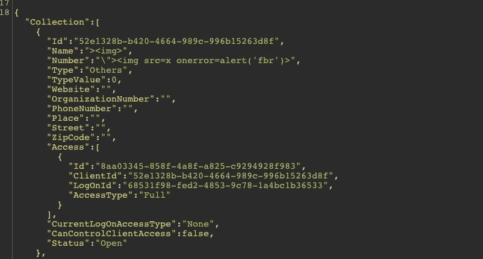

第一个客户的数据

在这个部分中，两个参数“CurrentLogOnAccesType”:None 和“CanControlClientAcces”:false 引起了我的注意。我想到了像在其他完全访问客户端示例中看到的那样编辑参数。

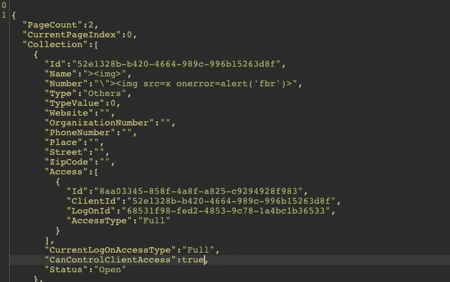

我把参数分别改成了“满”和“真”。同样的信息可用于对请求的响应，我做了同样的事情。我发了请求。

后来，当我回到页面时，我看到目标客户端已经更改为“完全访问”。“访问”按钮处于活动状态，当我单击它时，我可以看到所有用户的权限。

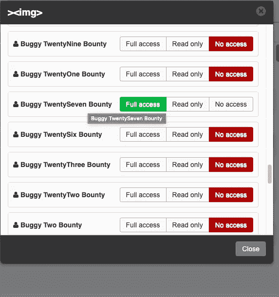

后来，由于用户信息在 Access 部分被返回，我在单击 Access 按钮时再次捕捉到请求，并查看了请求的响应。

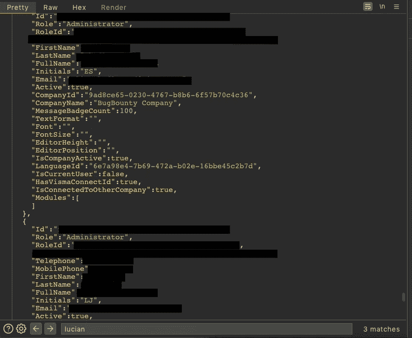

因此，攻击者可以激活客户端想要的“访问”功能，尽管没有授权，并且可以看到所有用户的授权。它还可以泄露用户的 PII 信息，包括管理员和授权用户。

> **二世。“/api/Missions？ClientId= "请求导致泄露没有访问客户端的任务**

在“Client”部分列出客户端时，我们无法单击“No Access”客户端。在正常情况下，单击具有完全或只读权限的客户端后，我们会被定向到“任务”部分。因此，我们看不到任务和其他信息，因为我们无法点击禁止访问客户端。
但是，我发现了一个请求，它将允许我们访问不允许访问的客户的任务和其他信息。漏洞基本上是 IDOR。

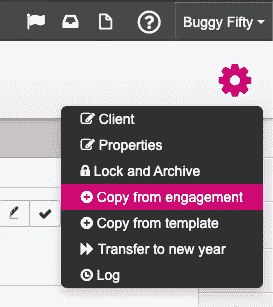

在查看完全访问客户端的任务时，设置按钮引起了我的注意。我逐一查看了备选方案，并在“从约定复制”部分找到了漏洞。我点击了按钮，捕捉到了请求。

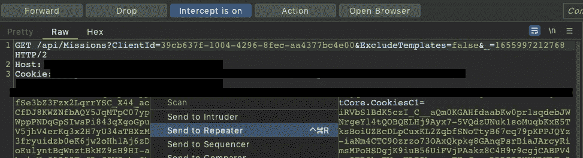

看到 ClientID 参数后，我将请求发送到中继器，并开始查找 No Access 客户机的 ID 信息。

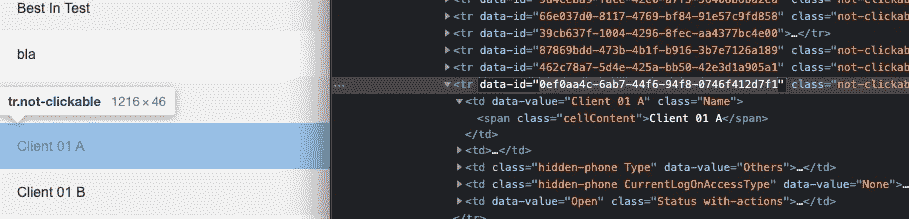

我转到第一份报告中列出的客户端部分，打开了 DevTools。我可以看到那里客户的身份证。

然后我回到 Repeater，用目标 ID 替换我复制的 GUID 信息。

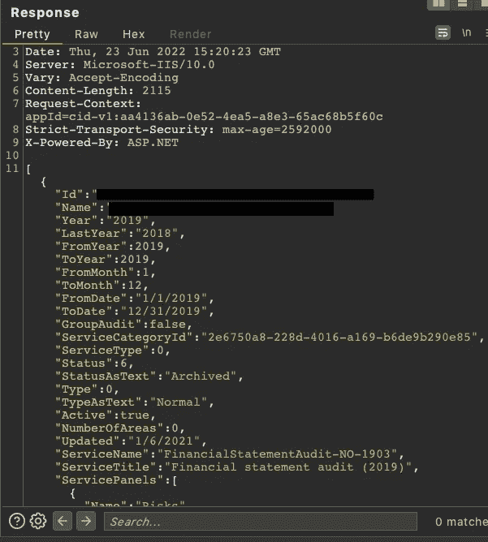

作为回应，我看到了任务名称和信息，客户日期(此信息无法访问，因为没有访问权限)。
请求直接公开任务信息。我们可以将 No Access 客户端读为只读。

> **三。攻击者可以给没有权限的客户端添加任务**

我找到了一种方法来添加随机或有针对性的任务给客户端，即使我在编校的应用程序上没有访问权限(没有访问客户端)。

通常，当我们想在任务部分创建一个新的任务时，我们只能选择某些客户端。这些客户端只是我们拥有完全访问权限的客户端。

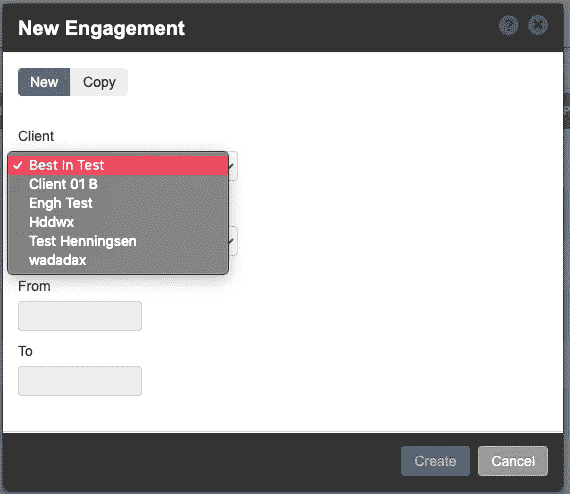

如您所见，我们只能选择完全访问权限的客户端。

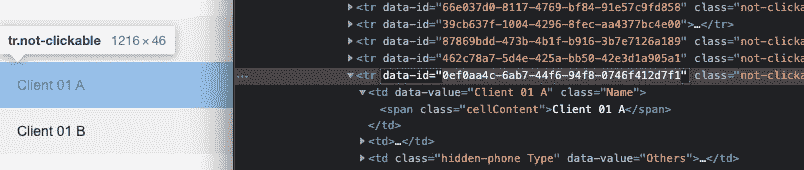

第二步，我做了与上面报告中 id 复制过程相同的操作。我复制了一个不准入客户的 ID。

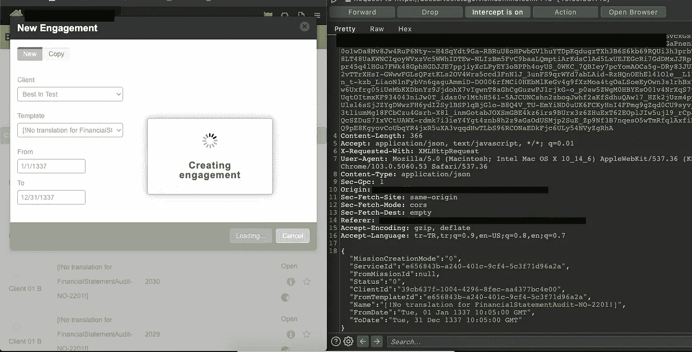

然后回到第一集。我创建了一个新的客户端并保存了请求。我用复制的 GUID 替换了“ClientId”参数。即使您没有 Name 参数，也可以更改它。这意味着攻击者也可以添加他们没有的随机任务名称。

通常我们看不到任务，因为我们无法访问目标客户端。但是使用第二次报告中的请求(/api/Missions？ClientId=)我确定我的请求是否成功。

因此，这里存在一个漏洞，使得攻击者能够将任务随机插入目标客户端。此外，如您所见，攻击者可以在第二个报告中看到他们使用请求发送的任务。

目前就这些。感谢阅读。下次再见了！

你可以在推特上关注我:[https://twitter.com/canmustdie](https://twitter.com/canmustdie)

来自 Infosec 的报道:Infosec 上每天都会出现很多难以跟上的内容。 [***加入我们的每周简讯***](https://weekly.infosecwriteups.com/) *以 5 篇文章、4 个线程、3 个视频、2 个 Github Repos 和工具以及 1 个工作提醒的形式免费获取所有最新的 Infosec 趋势！*