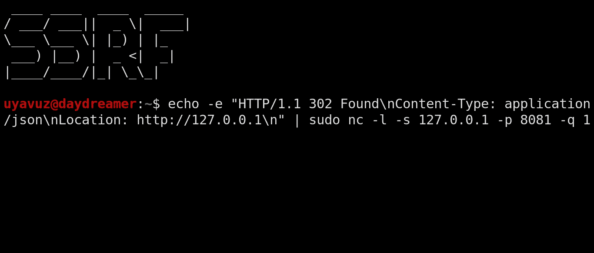
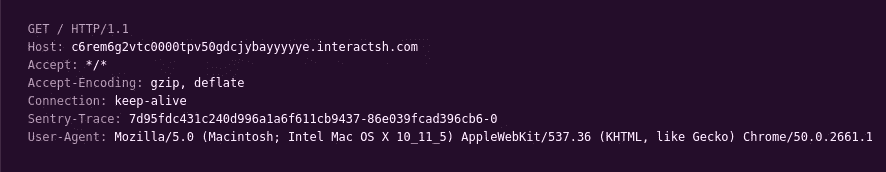

# 多个 HTTP 重定向绕过 SSRF 保护

> 原文：<https://infosecwriteups.com/multiple-http-redirects-to-bypass-ssrf-protections-45c894e5d41c?source=collection_archive---------3----------------------->

你好黑客们，

我需要同时利用许多已知的 SSRF 技术来成功利用同一家公司的许多终端。在发现之后，我将其应用于所有使用攻击者控制的 URL 的功能，发现了 2 个盲读和 1 个全读 SSRFs。这是一个 bug 赏金计划，所以盲 SSRFs 作为 dup 关闭，另一个被接受。



## 关于目标

这家公司为其他企业提供营销服务。他们的应用程序可以让您创建和管理营销活动。有许多功能需要测试，但应用程序本身很慢，我不喜欢测试臃肿的应用程序。所以，在学会在应用程序中做一些基本的东西后，我决定不花太多时间，在找到一些漏洞后通过程序。
该应用程序与 URL 有很大关系。因此，它引起了我的注意，我决定主要寻找 SSRFs。

报告本身没有披露。因此，我将它命名为“【company.com】T2”，我不会分享任何来自应用程序本身的图片，也不会改变 URL 结构。

## 开发过程

1.  API 需要用户通过应用程序的身份验证，并使用 cookies 来完成这项工作。

2.我们有一个 API 调用，例如

```
https://www.company.com/api/campaign/v3/check-snippet?url=http://example.com/
```

3.`url`参数是我们的注入点。我尝试的第一件事是向我的 [interactsh](https://github.com/projectdiscovery/interactsh) 处理程序发出请求，以获取请求的 HTTP 头和 IP 地址。提出了以下请求。



4.该请求来自 AWS EC2 IP 地址，并且没有任何打开的端口。也没有有用的 HTTP 头泄露。

5.应用程序发出任何传出请求。所以，我的目标是击中内部主机。这是一个盲目的请求，因为它没有泄露给我它得到的回应。但是，如果成功发出对攻击者控制的 URL 的请求，此功能将以 JSON 的形式返回完整的 URL。

6.域和直接 IP 都被允许。我已经在我的 Linux VPS 上运行了 netcat HTTP server，并尝试向它发出请求，它成功了。然而，当我试图向" **127.0.0.1** "发出请求时，却没有成功。然后，我尝试了“ **localhost** ”，但也没有成功。

7.我曾试图滥用 URL 解析器，在“ **http://127.0.0.1/$FUZZ** ”、“$ **FUZZhttp://127.0.0.1** ”和“ **http://local$FUZZhost** ”中将 00 模糊化为 FF，但没有任何结果。然后，我尝试了[这个](https://github.com/cujanovic/SSRF-Testing/blob/master/ip.py)漂亮的脚本，它可以生成许多有效载荷。同样，没有任何工作。我有在任何地方模糊所有 UTF-8 的倾向。通过这种方式，我在 web 应用程序中发现了许多奇怪的行为。

8.我有像“127.0000000.000000.000001”和“127.1”这样的有效载荷。没起作用

9.我尝试在 DNS A 记录查询中使用返回“127.0.0.1”的子域。没用。

10.当我试图绕过 SSRF 保护时，我总是使用两个 github repos。

```
[https://github.com/swisskyrepo/PayloadsAllTheThings/tree/master/Server%20Side%20Request%20Forgery](https://github.com/swisskyrepo/PayloadsAllTheThings/tree/master/Server%20Side%20Request%20Forgery)
[https://github.com/cujanovic/SSRF-Testing](https://github.com/cujanovic/SSRF-Testing)
```

11.我想看看 API 是否遵循 HTTP 重定向。所以，我做了我以前一直做的事情，使用了一个自动将 302 重定向到 URL 中设置的 IP 地址的网站。它看起来像这样:

```
https://make302redirect.io/127.0.0.1
```

12.我已经使用这个有效载荷获得了一个请求，但是它不起作用。结果是，应用程序基本上搜索了像“localhost”和“127.0.0.1”这样的关键字，如果这些关键字存在于用户提供的 URL 中，它就会被阻止。

13.因此，我尝试在我的 VPS 上运行一个简单的 Netcat HTTP 服务器，它可以对发送给它的任何请求进行 302 重定向。该命令如下所示:

```
echo -e "HTTP/1.1 302 Found\nContent-Type: application/json\nLocation: [http://127.0.0.1\n](http://127.0.0.1\n)" | sudo nc -l -s 64.227.116.98 -p 8080 -q 1
```

> *(我现在不用那个 IP 地址了。请不要辱骂当前用户)*

14.我在下面提出了 API 请求。

```
https://www.company.com/api/campaign/v3/check-snippet?url=http://myIP/
```

15.没用。

16.此时，我绝望了。该应用程序基本上使用了类似“localhost，127.0.0.1”的关键字，并遵循 HTTP 重定向。因此，在用 [pleorqy](https://medium.com/u/a37e2352fa39?source=post_page-----45c894e5d41c--------------------------------) 尝试了一些其他有效负载后，我在不同的端口运行了两个 netcat 服务器，并将第一个服务器重定向到本地主机。它看起来像这样:

```
Vulnerable server ---> my server on port 8080 ---> my server on port 8081 ---> localhost
```

17.这一次成功了。

## 结论

如果我使用类似`**127.0.0.1.nip.io**` 的服务，我永远不会发现这个漏洞，因为应用程序不接受任何包含****127 . 0 . 0 . 1**的内容。
应用程序检查了第一个 HTTP 302 重定向中报头`**Location**`的值。然而，它没有检查第二个。这就指向了 SSRF。**

**我在不同的 API 端点中使用了这些方法，总共发现了 3 个这样的错误。其中之一是一个完整的 SSRF，让我发现内部资产。**

# **🔈 🔈Infosec Writeups 正在组织其首次虚拟会议和网络活动。如果你对信息安全感兴趣，这是最酷的地方，有 16 个令人难以置信的演讲者和 10 多个小时充满力量的讨论会议。[查看更多详情并在此注册。](https://iwcon.live/)**

**[](https://iwcon.live/) [## IWCon2022 - Infosec 书面报告虚拟会议

### 与世界上最优秀的信息安全专家建立联系。了解网络安全专家如何取得成功。将新技能添加到您的…

iwcon.live](https://iwcon.live/)**