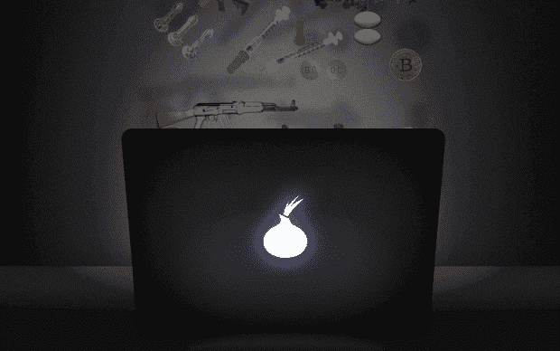
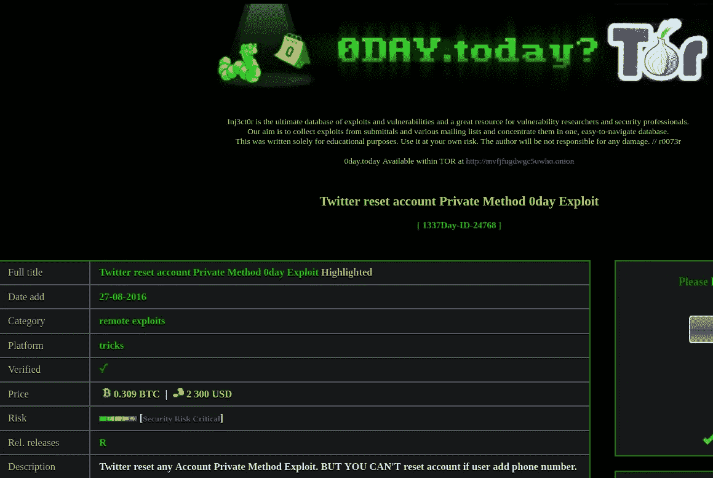
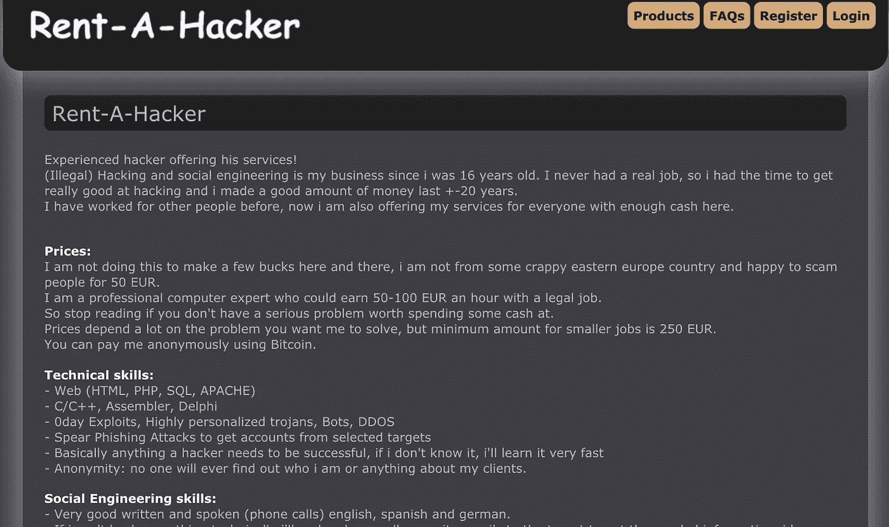
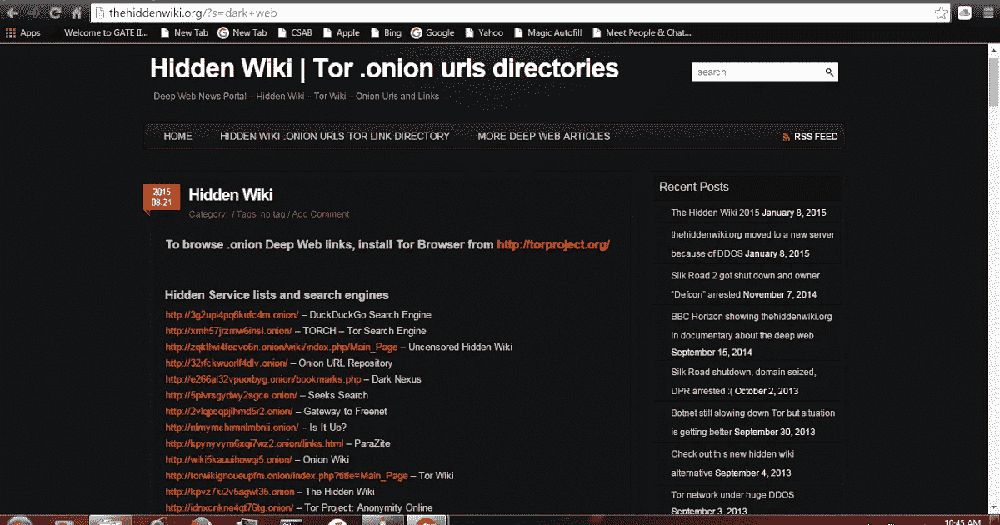
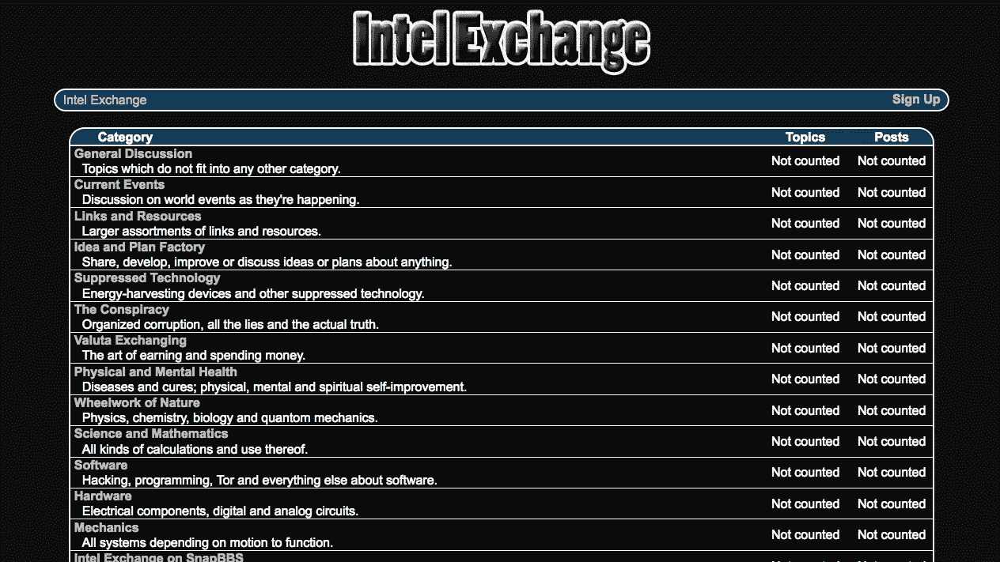
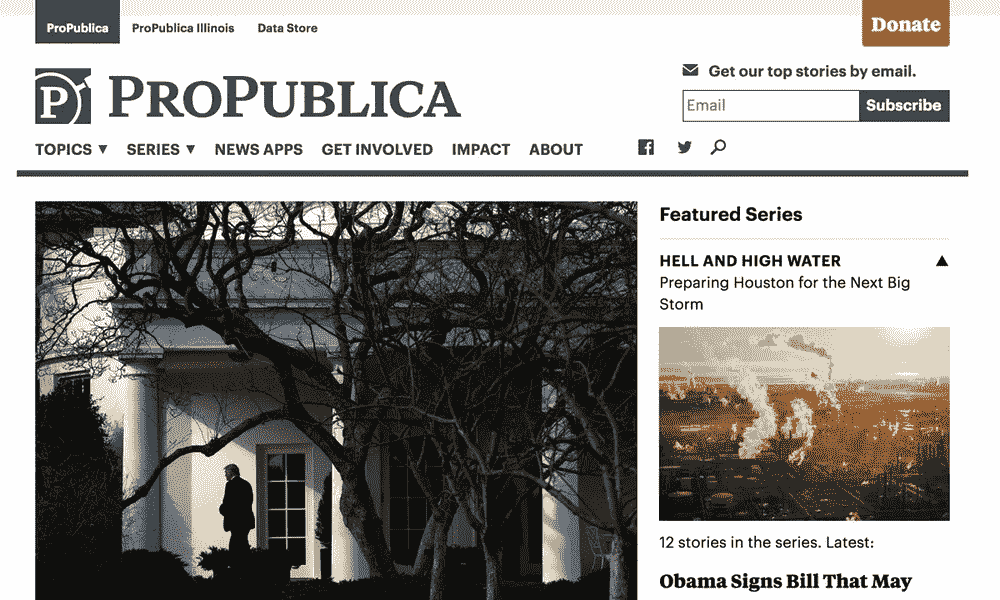
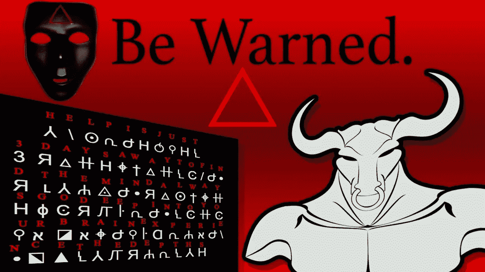

# 必须看到来自黑暗网络深处的网站！

> 原文：<https://infosecwriteups.com/must-see-sites-from-the-depths-of-dark-web-5bc42ab4b179?source=collection_archive---------0----------------------->

deep web 是互联网中不被搜索引擎索引的部分。深层网络的一部分是暗网，它存在于分层代理网络中，即所谓的暗网。在这些暗网中，Tor 是最大的。

**暗网市场**是被称为 tor marketplace 或 deepweb markets 的网上商店，提供各种非法商品和服务，如枪支、窃取的信用卡信息、类固醇、假护照等。不同的暗网市场提供在线购买非法药物，如迷幻药、大麻、可卡因等。，在黑市上很容易买到。

**免责声明:这里分享的每一件事都是为了“教育目的”，我也不打算促进或鼓励使用 deep web 来获取和/或参与 deep web 上的任何非法活动。请避免下载任何可能含有恶意软件**的东西。

# 今天是第几天

[链接-[mvfjfugdwgc 5 uwho . onion](http://mvfjfugdwgc5uwho.onion)]它是最大的漏洞数据库和 0 day market——The Underground，是世界上最受欢迎和最全面的计算机安全网站之一。家庭和企业用户、大学、政府和军事机构每天都会访问他们的数据库。他们由安全专业人员组成，专门提供必要的信息来保护应用软件。他们通过在互联网上发布新的安全建议来实现这一目标。

0day .今天，1337day 的员工由一群高技能的专业人员组成，他们都直接从事计算机和软件安全领域的技术工作。Inj3ct0r 为执行渗透测试、IDS 签名开发和漏洞研究的人员提供了有用的信息。创建这个项目是为了提供关于漏洞利用技术的信息，并为漏洞利用开发者和安全专业人员创建一个有用的资源。本网站上的工具和信息仅用于法律安全研究和测试目的。我的一个朋友也在这个网站 XD 上有他的 0 天功绩，只要在搜索栏里搜索“Postbird”你就会找到它。

# 租一个黑客

“出租黑客”网站似乎是由一名黑客管理的，该黑客发表了以下声明:

*“经验丰富的黑客提供他的服务！(非法)黑客和社会工程是我的生意，因为我从 16 岁开始，从来没有真正的工作，所以我有时间真正擅长黑客，我在过去的+-20 年里赚了很多钱。我以前为其他人工作过，现在我也为这里有足够现金的每个人提供服务。*

洋葱网站的网址是:

*   [http://haker5tkaylm5jm6.onion/](http://haker5tkaylm5jm6.onion/)
*   [http://5eme2auqilcux2wq.onion/](http://5eme2auqilcux2wq.onion/)
*   http://gepcpf7kbng5jjyg.onion/

这名黑客解释说，他是一名专业黑客，专门从事非法黑客服务，他提供这些服务是为了“破坏一些业务或一个人的生活”。“根据他的描述，这似乎是专门从事网站黑客攻击的，可能他管理着一个僵尸网络，它提供 DDoS 攻击。

黑客还解释说，他能够运行间谍活动和在线跟踪 pedos。在他提供的服务中，也有收集任何个人的私人信息，无论如何，每一次尝试都可以通过支付大约 100 美元的每小时费用来完成，当然价格取决于许多因素，包括分配给专家的任务的复杂性。

**产品** **价格:**电子邮件、脸书等小工。黑客 200 欧元(0.95 BTC，在我写这篇文章的时候)中等规模的工作，毁人，间谍，网站黑客等。500 欧元(我写这篇文章的时候是 2.30 BTC)。当然，支付是匿名的，通过比特币虚拟货币进行。

# 隐藏的维基

你如何发现搜索引擎达不到的内容？就像过去的互联网一样，暗网维护着大量的网站索引，就像隐藏的维基一样。(链接)-[http://zqktlwi4fecvo6ri.onion/wiki/index.php/Main_Page](http://zqktlwi4fecvo6ri.onion/wiki/index.php/Main_Page)

这个由社区编辑的维基包含了一系列链接，这些链接指向运行在黑暗网络上的各种各样的服务和资源。其中许多链接已经失效，甚至更多的链接指向诈骗或潜在的非法活动。谨慎点击！这个隐藏的维基曾经以托管，或者至少是索引一堆恋童癖网站而闻名，因此成为了 FBI 和 Anonymous 网络攻击的目标。隐藏维基的许多模仿者和衍生产品也被创造出来。维基也有文章和指南、商店、阴谋论和黑暗网络历史的简短年表。

# 英特尔交易所

你对黑暗网络论坛有多怪异感到好奇吗？在 Intel Exchange 里，你可以找到有争议的，甚至是灵异的话题。

例如，你可以找到一些帖子，在那里人们分享练习心灵遥感的方法，其他人寻求帮助来创建量子计算机，分享阴谋论，不明飞行物和教派秘密，禁地，关于行星 X 的信息，光明会，据说证明希特勒逃脱的联邦调查局文件等等。

# 支持公共事业

虽然你不相信，但仍然有可靠的新闻编辑室，其中之一是 ProPublica。该网站的内容由 75 名独立记者提供，致力于揭露政府、公司和任何涉及腐败案件的机构的弊端。**链接到 ProPublica:**【https://www.propub3r6espa33w.onion/ 

ProPublica 成立于 2007 年，他们的工作已经获得了四次普利策奖。此外，他们的努力有助于阻止美国反对言论自由的法律。该门户网站有关于政治、商业、环境、技术、健康、移民和教育的专题部分。ProPublica 是一家非营利性新闻机构，由读者捐款支持。

# 神秘的谜题

黑暗网络上的红三角谜题

我个人在黑暗网络上发现了大量的密码术难题。很多都是普通人为了好玩和学习而做的，但是很多至今还没有解决。一些流行的是红三角拼图和蝉 3301(被认为是最难的)。黑客、密码破译者和计算机爱好者经常组成团队来解决这种难题。据说制作《蝉 3301》谜题的人/团体正在寻找具有密码学和计算机安全技能的潜在成员。他们要么是政府的秘密组织，要么是黑帽黑客组织。

下面是一些有趣的链接，你可以查看了解更多，并尝试这样的难题:

*   【https://www.reddit.com/r/deepwebpuzzles/ 
*   [https://www.youtube.com/watch?v=HHyLLvgrW7g](https://www.youtube.com/watch?v=HHyLLvgrW7g)
*   [http://wnrlovexkl 6 C4 bw 4 vehnrd 7k 6 d6b 5 fsan 376 x 72 NH 3 e 6 rijmvxrumvad . onion/](http://wnrlovexkl6c4bw4vehnrd7k6d6b5fsan376x72nh3e6rijmvxrumvad.onion/)

我希望你能从这篇文章中学到一些东西。还有很多其他有趣的网站，但我会让你去探索。只是要小心，不要下载任何东西，安全地在这些网站上冲浪，如果你想这样做的话，请确保你在这个平台上关注我，以获得更多关于网络安全的信息性文章。别忘了订阅我的 youtube 频道——ZeusCybersec

*   **宙斯**

## 来自 Infosec 的报道:Infosec 每天都有很多内容，很难跟上。[加入我们的每周简讯](https://weekly.infosecwriteups.com/)以 5 篇文章、4 个线程、3 个视频、2 个 GitHub Repos 和工具以及 1 个工作提醒的形式免费获取所有最新的 Infosec 趋势！