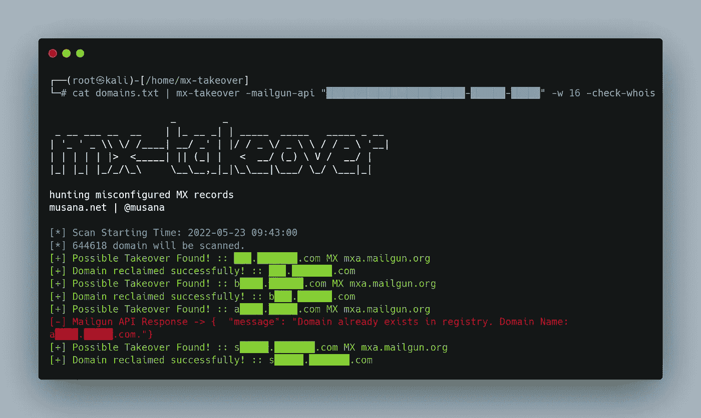

# MX 接管自动化|子域接管

> 原文：<https://infosecwriteups.com/mx-takeovers-automated-subdomain-takeover-64e658fc4fb7?source=collection_archive---------2----------------------->

子域接管是一个需要熟悉的重要漏洞，尤其是作为一个 bug 赏金猎人。

## 介绍

当一个子域(例如`blog.example.com`)指向一个攻击者不再能控制的服务(例如`blog.example.com`托管在像 WordPress 这样的博客平台上)时，就会发生子域接管。

当子域的原始所有者停止使用服务或取消他们的帐户，但忘记更新 DNS 记录以反映这一点时，可能会发生这种情况。

## 安全风险

然后，攻击者可以注册被放弃的服务帐户，并获得子域的控制权。这可能会让他们托管恶意内容、利用网络钓鱼获取用户信息或将流量重定向到自己的网站。

MX 接管是一种特定类型的子域接管，当攻击者获得对组织的电子邮件子域的控制时，就会发生这种情况。这使得攻击者能够拦截、阅读并可能修改发送给组织或从组织发出的电子邮件。

## 补救

为防止子域接管，组织定期检查其 DNS 记录并确保所有子域仍在使用且配置正确非常重要。

MX Takeover 是一个有帮助的工具，它是 GitHub(【https://github.com/musana/mx-takeover】T2)上的一个 Go 脚本。该工具可以扫描子域列表，并检查潜在的 MX 接管漏洞。

防止子域接管是整体网络安全卫生的一个重要方面，因为它可以帮助保护组织的敏感数据并防止恶意内容的传播。

通过使用 MX Takeover 之类的工具，组织可以主动识别和解决其子域中的潜在漏洞。

喜欢这篇文章吗？留下拍手，关注，分享这篇文章！

推特:【https://twitter.com/AdamJSturge 

如果你喜欢阅读这样的故事，并想支持我成为一名作家，可以考虑报名成为一名媒体成员。一个月 5 美元，你可以无限制地阅读数千篇文章，包括我自己的。如果你使用[我的链接](https://adamjsturge.medium.com/membership)注册，我会赚一小笔佣金，不需要你额外付费。