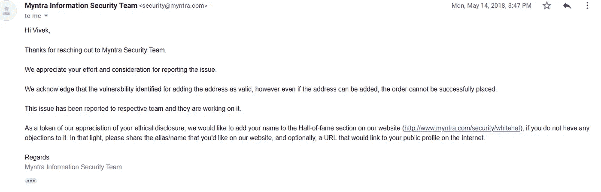
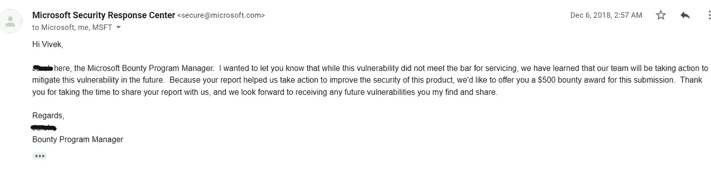

# 我的昆虫赏金之旅。想要一切免费的中产阶级男孩。

> 原文：<https://infosecwriteups.com/my-bug-bounty-journey-the-mind-of-a-middle-class-boy-who-wanted-everything-for-free-1456e160817c?source=collection_archive---------1----------------------->

大家好，

我叫维维克。我目前在一家私企做软件开发。

**简介**

“黑客”——我还是个学生的时候就接触到了这个术语。我出生在一个中产阶级家庭。我想要免费的一切。每当我看到一些我买不到的昂贵的东西，我总是会想出一些愚蠢的想法，用我自己的东西来建造它。还记得我有过用笔、纸和纸板造一台电脑的想法。计算机从未让我兴奋过，直到我在高中选修了计算机科学。我试过在中学考试中作弊，因为我讨厌“它”这个科目。

2006 年，我哥哥设法从他的一个朋友那里买了一部二手手机。那是 GPRS 时代。我们想要一个互联网连接，这样我们就可以下载游戏。但是我们的零花钱不够买 Airtel 充值卡。

然后，有一天我在玩手机，我注意到一个文件，标题是“黑客免费上网 Airtel”。我一看到‘免费’两个字就激动了。这是关于一些代理设置，这将允许我们欺骗 Airtel 和免费访问互联网。我想那是我第一次听说‘黑客’这个词。对我来说，“黑客”就是从那以后免费上网。

在 2000-2007 年期间，我对学习计算机和编程语言产生了浓厚的兴趣。我活跃在几个论坛上。2007 年，我加入了一所工程学院的“信息技术”专业。我以前读了很多关于网络的书，一有空就开始编写计算机病毒。这完全是出于好奇。2011 年，我加入了一家软件公司，担任初级软件开发员。当时我是一名 windows 应用程序开发人员。然后我开始反转应用程序来破解它们。有一次，我在 TeamViewer 应用程序中发现了一个漏洞，可以让我无限制地免费使用它。所有这些都增强了我的信心。

2015 年晚些时候，我听说了虫子赏金的事。但直到 2017 年，我才投入太多时间，因为当时我是一名高级 web 开发人员。然后我开始学习 web 应用程序漏洞，并阅读了大量的文章。我在 HackerOne 注册，开始寻找漏洞。但是我在任何应用程序中都没有发现一个错误。但是我继续学习。所以我养成了一个习惯，每当我访问一个网站时，我都会查看它的网页请求和网页回复，以发现任何有趣的东西。

**第一个 Bug :**

经过一番挣扎，我在电商平台 Myntra 报告了我的第一个 bug。这是一个 CSRF 问题，可以让我们改变任何用户的地址。在病毒被分类后，他们有一两个星期没有回复我。我非常沮丧，失去了耐心。我开始每天要求他们更新。但是他们没有回应。我不再要求联系他们。我是一个真正的国际象棋选手，有一天我在国际象棋比赛后回家。我很难过，因为我输掉了比赛。我坐在公交车上，漫不经心地查看我的电子邮件。我很高兴看到 Myntra 的回复，他们已经解决了这个问题，并希望将我的名字列入他们的名人堂页面。我无法控制我的快乐。

**第二个 bug 和第一个赏金:**

在我得到 Myntra 的赞赏后，我又开始寻找漏洞。我的公司使用的是微软的社交网络“Yammer”。幸运的是，我在产品中发现了一个漏洞，使得网络内部的攻击者能够更改用户以评论/消息形式发布的图像。用户可以通过在评论区粘贴图片的 URL 来发布图片。yammer 将从该 URL 获取图像，并为该 URL 和图像创建一个 objectId。我能够使用 web 请求更新该 objectId 的内容。但微软回应说，这个问题没有资格获得奖金，因为他们正在使用第三方服务来实现这一功能。但我很高兴，因为他们把我列入了他们的名人堂页面。被列入微软的名人堂页面无论如何都不是一件小事。该问题随后被关闭。

但是 3 个月后，他们通知我这个发现有资格获得奖金，并奖励我 **500 美元。**那天晚上我没有睡觉。

这就是我如何开始我的昆虫赏金之旅，我还在学习。我将很快在这里发表更多的评论。