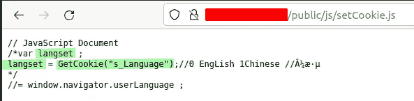
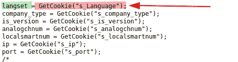
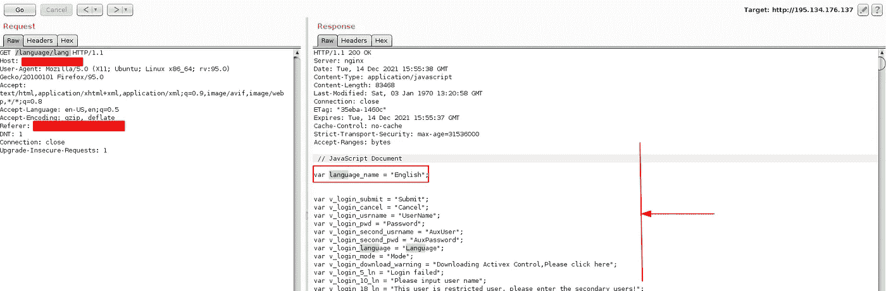
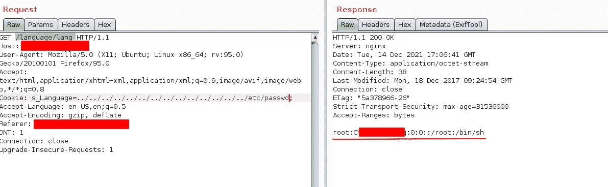
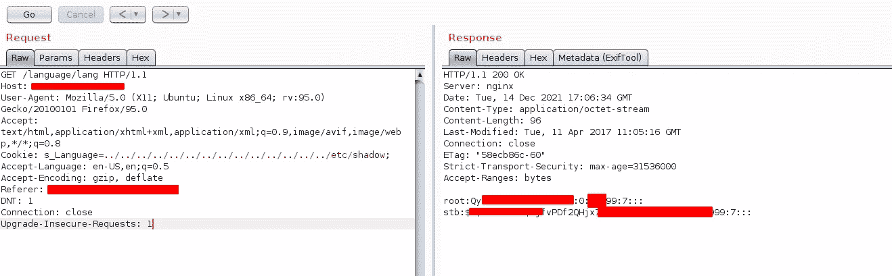
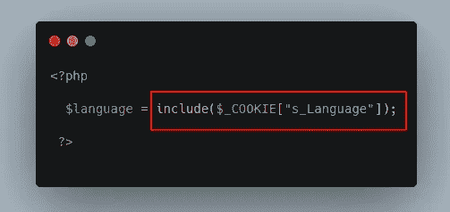
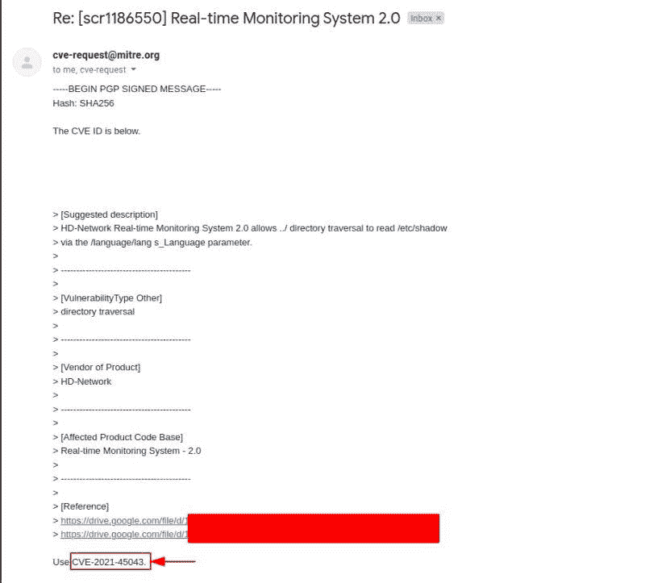

# 我的[CVE-2021–45043]LFI 报道

> 原文：<https://infosecwriteups.com/my-cve-2021-45043-lfi-write-up-441dad30dd7f?source=collection_archive---------3----------------------->

嘿，黑客和猎人们，

今天将是一篇不同的关于我的新[CVE-2021–45043]的文章，它是在(高清网络实时监控系统 2.0)中发现的。这个 CVE 签名的本地文件包含漏洞，它允许我通过错误配置读取服务器中的敏感内部文件，稍后将在这篇文章中解释。

首先，我选择了一个产品，以便开始我的安全研究之旅，所以我决定从(高清网络实时监控系统 2.0)产品开始，然后我想搜索/收集一些使用该系统的主机，所以我开始在一些目标上做一些指纹，我发现两个指纹应该可以让我过滤我的结果，以便只给我只使用该系统的主机。

1.  与本产品配合使用的所有产品的名称是:

2.此外，当您浏览应用程序时，您会看到您查看了应用程序源代码，您会发现一个 JavaScript 文件名:`setCookie.js`因此，在查看该脚本后，我看到有一段代码引起了我的注意，它是:

正如你所看到的，这是一个注释代码，但它让我理解了这个 web 应用程序的逻辑，现在你可以看到开发人员使用了一个函数来获取包含首选用户语言的 cookie `s_language`值，然后最终基于这个 cookie 值生成内容语言，所以我尝试继续搜索另一个可能对我有用的 JavaScript 文件，例如我在一个名为`common.js` 的文件中发现了以下代码:

现在我想更深入地了解一下，我想知道服务器与哪个端点进行交互以获得用户的语言偏好，所以我打开了 burp-suite spider 并在 web 应用程序中开始爬行，直到我获得一个有吸引力的端点:`/language/lang`，一旦打开它，您会发现以下内容:

因此，它定义了应用程序翻译过程和其他应用程序功能中使用的所有变量，所以我认为应用程序已经设置了一个名为`s_Language`的 cookie 参数，JavaScript 处理该参数值，以便为用户提供具有首选语言的应用程序，现在端点`/language/lang`似乎是真正定义翻译过程将如何在应用程序中进行的端点。 所以我想为什么不手动添加 cookie: `s_Language`然后尝试一些路径遍历，看看应用程序是否从前端脚本导入语言？ ，所以我这样做了，抓住你了！：

如你所见，这个服务器中唯一存在的用户是`root`用户，所以我想到为什么不看看影子是否可访问？让黑客妈妈吃惊的是:

如您所见，我能够访问影子文件，因为`root`是此服务器中的唯一用户，因此没有`www-data`或任何其他服务器用户可以在此管理此 web 应用服务器。发生这种错误配置是因为产品为翻译/语言函数提供了对该函数输入的不安全处理，因为如果代码是这样的:

这意味着服务器将包括 cookie 参数`s_Language`中存在的任何文件，而不是从后端放入特定文件，以避免对该文件的操作，这非常简单，但你应该知道在哪里搜索。

> 总是聪明地工作而不是努力地工作

最后是 alhamdulilah:

