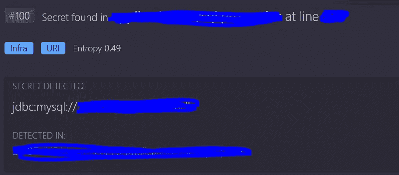
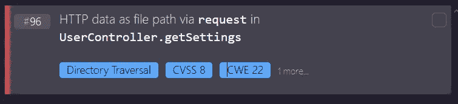
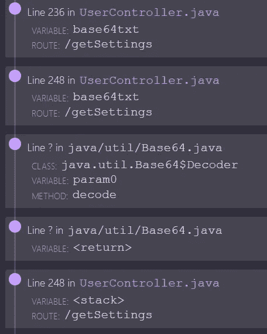

# 我的第一次自动化代码分析

> 原文：<https://infosecwriteups.com/my-first-automated-code-analysis-17770f34821e?source=collection_archive---------3----------------------->

编写安全的代码，不正是我们都想要的吗？我通过运行 ShiftLeft 代码分析器来测试我自己的代码。跟随我踏上消灭虫子的旅程吧！

在 [Unsplash](https://unsplash.com?utm_source=medium&utm_medium=referral) 上 [engin akyurt](https://unsplash.com/@enginakyurt?utm_source=medium&utm_medium=referral) 拍摄的照片

啊，写代码的乐趣。当我说我们，开发人员，对编写代码有一种又爱又恨的关系时，我想我可以代表我们所有人。有些日子，我起床奔向我的电脑，而另一些日子，那些我无法消灭的虫子在我试图入睡时控制了我的思想。当编写代码时，我们的情绪会从高兴变成愤怒。我们代码的质量也会波动。你可能是最有安全意识的开发人员，但是你仍然可能让一些漏洞潜入你的代码库。

起初，我对自动工具搜索代码中的漏洞有点怀疑。我想几乎每个人都有同感。我有“如果我看不到任何更多的安全问题，一个工具肯定找不到任何更多的”-感觉，但男孩哦男孩，我不能有更多的错误。

我是最好的迷因

我扫描了什么项目？一年前，我用 Java 编写了一个 API，它被我曾经编写的一个 Android 应用程序所使用。该应用程序名为“了解你的邻居”，旨在疫情期间拉近邻居之间的距离。你可以和你所在地区的人一起玩游戏，并且有本地化的排名。由于复杂性，它从未被广泛使用，这就是为什么我觉得分享 ShiftLeft 发现的问题很舒服。

了解你的邻居标志

哦不，那个密码，不应该再在那里了。是的，ShiftLeft 在我的代码中发现了一个明文密码，我知道我为什么把它放在那里。我有时很懒，当我想快速测试时，最简单的方法就是硬编码一个密码。我只是后来忘了删除它，这就是为什么它会出现在我的公共存储库中。我有点不好意思分享这个，因为这只是一个愚蠢的错误，但话说回来，我们都是人，人类在愚蠢方面是出了名的优秀。这是一个大学项目，当我写它的时候，我显然没有想到安全性。最后期限的到来只会让事情变得更糟。但是指责和羞辱已经够多了，是时候解决问题了！从存储库中移除东西实际上是不可能的。嵌套在这些提交的深处，人们将能够找到它。因此，让我们让这个密码留在这个中断的项目的历史中，但让我们确保这个密码不再有任何用处。更改您使用密码的任何地方，并确保永远不再使用它！

哇，那个秘密不应该在那里！

发现安全问题从来都不好玩。总感觉你是个失败的开发者。然而，找到它们并修复它们是一件好事。这是你从错误中学习并成为更好的开发者的机会。所以，让我们从错误中吸取教训。

我的资料库里有敏感数据。这是怎么发生的？我们如何防止这种情况发生？虽然有许多奇特的技术，比如使用 git-crypt，但是防止暴露敏感数据和秘密的最好方法是根本不要在源代码中使用它们。将它们保存在权限非常严格的单独文件或目录中。提交时请留意并更新 gitignore 文件。

除此之外，我的应用程序非常安全。我还是有点尊严的！但是现在我有了这个神奇的工具，让我们来玩玩它吧。我很快做了一个新的资源库，写了一些易受攻击的代码。当然，我不应该让 ShiftLeft 代码分析器太容易得到这个！我的函数将接受一个 base64 格式的用户名。它通过拆分名称，使其变成小写字母来玩弄名称，目的是迷惑扫描仪！它将使用该名称从文件系统中获取一个包含用户设置的文件。这里会出什么问题呢？嗯，我“不小心”犯了一个小错误，忘记做适当的输入验证…让我们看看工具是否找到它！

看起来这很容易。印象深刻！这是我们看到这个工具的全部力量的地方。它现在告诉我们漏洞存在于哪个文件的哪一行。看看下面的截图。ShiftLeft 能够在整个应用程序中完全跟踪用户输入。它甚至遵循了 base64 解码。通过这种方式，它可以识别出来自用户的数据何时被以不安全的方式使用！太令人印象深刻了！

在 ShiftLeft 界面中可以找到更多的东西。您可以将漏洞分配给某人或将其标记为已修复。您可以获得更多关于该漏洞的信息，甚至可以阅读一篇关于该漏洞的交互式入门文章，太棒了！

我的结论？我相信像 ShiftLeft 的代码分析器这样的工具会变得很平常。我知道他们不会发现每个漏洞，他们也远非完美，但我还没能想出使用它的缺点。当一个公司雇佣一个渗透测试人员时，他们也不应该期望这个人能找到每一个漏洞。当一个公司有一个 bug 奖励计划时，他们不应该期望每个问题都能被发现。仍然会有 bug 存在，在我看来，任何有助于识别它们的东西都应该被使用。对于公司来说，像 ShiftLeft code analyser 这样的工具比雇佣攻击性的安全人员要便宜得多。将它们添加为 GitHub 操作，您将会看到您接受的每个 PR 的结果摘要。你还想要什么？

经常有人问我是否害怕自动化工具会夺走红队的工作。我可以全心全意地回答这个问题，说我一点也不害怕。这个工具的存在让我欣喜若狂，因为我知道它将有助于创造一个更安全的网络空间。我居住和热爱的这个空间。我祖父母害怕的互联网。我的亲人用来保持联系的互联网。作为一名有道德的黑客，我们都应该尽我们所能让互联网变得最安全，工具可以给我们很大的帮助。不要担心你的工作，工具会让它变得更有趣。他们会支持你，而你正在寻找那些需要惊人创造力的弱点！

希望你喜欢这篇博文。如果你想了解更多关于 ShiftLeft 的信息，请访问 [https://www.shiftleft.io](https://www.shiftleft.io/?utm_source=influencer&utm_medium=advertising&utm_content=blog&utm_campaign=influencer_blog_pinkdraconian&utm_term=&sfdc_campaign_id=7011I000000RzXmQAK) ！

我还制作了两个关于代码分析器的视频。在第一个例子中，我在一个演示应用程序上使用了它:【https://youtu.be/nVAASO75Ln0[。第二个视频讲述了如何创建一个 GitHub 动作来自动运行每个 PR:【https://youtu.be/28AXtLftzHs】](https://youtu.be/nVAASO75Ln0)。如果你喜欢这类东西，就去看看吧！

那都是乡亲们！