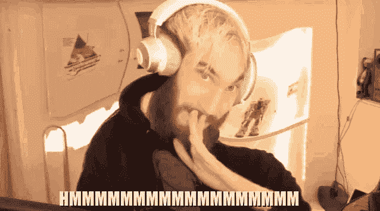
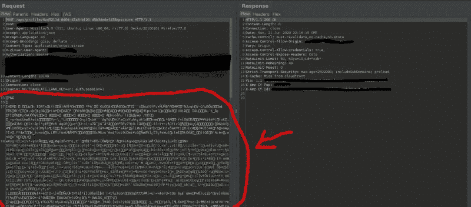
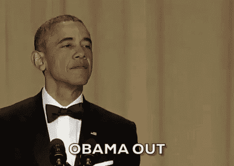

# 我的第一个错误:盲目的 SSRF 通过个人资料图片上传

> 原文：<https://infosecwriteups.com/my-first-bug-blind-ssrf-through-profile-picture-upload-72f00fd27bc6?source=collection_archive---------0----------------------->


照片由[岩田良治](https://unsplash.com/@ryoji__iwata?utm_source=medium&utm_medium=referral)在 [Unsplash](https://unsplash.com?utm_source=medium&utm_medium=referral) 上拍摄

大家好！这是为我的第一只虫子写的，一只 SSRF！

我的下一篇文章很可能是关于我学习 bugbounty hunting 的具体方法，我希望这对新手有很大的帮助。欢迎在 medium 或 twitter 上关注我的最新消息。都是:[@ sway thinking](https://medium.com/u/3e3753492422?source=post_page-----72f00fd27bc6--------------------------------)

# 概述:

*   对新 bug 猎人的激励和建议…
*   我第一个 bug 的故事！
*   学分和额外资源…

# 对于初学者:

在我发现这个甜蜜的 bug 之前，我连续几天/几周攻击了 11 个不同的目标(大部分是私人程序)。随着我的进步，有一件事我一直记在心里，即使我没有得到我一直想象中的 bugbounty 会是什么样子，我也从每个目标身上获得了一些新的东西。

每次我坐下来开始研究一个新的目标时，我都会遇到一些新的有趣的东西，这激发了我的好奇心。这促使我去搜索、询问、阅读和了解这一切。这就像是一只猎犬，捕捉到一种气味，毫不留情地跟踪它，直到你找到它。

> "我们总是通过**发现**我们怀疑的东西来为我们的怀疑付出代价."—亨利·D·T

通过所有这些尝试，我了解了很多不同的漏洞，比如 JWT、伊多、XXE，还有我的第一个漏洞 SSRF。

有一点我想对那些没有动力的黑客们说清楚，不要把你的奖金或者被分类/解决的错误作为衡量你成功的标准，而是你学到了什么新的东西，你建立了什么新的在线联系，以及你帮助过的其他人。

# 我第一个 bug 的故事！

## 我是如何发现这个 bug 的:

有一天，我通过 CTF 在 Hackerone 上收到了一个私人节目邀请。但是这一天，当我接受邀请时，我有了一个锦囊妙计。我打算花一周的时间专注于这个项目，而不去黑任何其他项目。

两天之内我就提交了这个 bug 的报告。

我认为有几件事对我特别有帮助。首先，在入侵这个程序之前，我确保我有一些入侵程序的方法和思维导图。前一天我在 whimsical.com 做了一个，这对我的结构真的有帮助。

**第一天:**

我清单上的第一个 bug，也是我花了整个五月学习的一个 bug 是 SSRF。

所以我开始搜索。我发现了一堆带有 URL 参数和外部链接的可疑端点，所有这些通常都会导致 SSRF。然而，重点是我感觉到程序中有几个范围内的域，并且我收获了一些可疑的端点。

**第二天:**

在其中一个域上，我发现它们在 POST 请求中严重依赖 XML HTTP 请求。



*利息水平飙升*

所以我决定，为什么不呢，让我们尝试 XXE 的方法而不是 SSRF。我把请求的主体改成了一堆不同的 XXE 有效载荷，但是什么也没有。最后，我决定尝试黑进我的头像的个人资料图片上传。

这就是有趣的地方。当我看到 POST 请求上传我的图片时，我意识到这只是一个内容类型的请求，并且主体中有原始图片。



我的帖子请求

所以我用一个 SVG 来代替它，看看服务器是否会接受它，并用它来获得更大的攻击面。这是我恶意的 SVG 图片:

```
<svg xmlns:svg="[http://www.w3.org/2000/svg](http://www.w3.org/2000/svg)" ae kc" href="http://www.w3.org/2000/svg" rel="noopener ugc nofollow" target="_blank">http://www.w3.org/2000/svg" xmlns:xlink="[http://www.w3.org/1999/xlink](http://www.w3.org/1999/xlink)" width="200" height="200"> 
<image height="30" width="30" 
xlink:href="https://controlledserver.com/pic.svg" /> 
</svg>
```

在 SVG 中，使用 xlink:href 属性，以便服务器请求带有任何提供的 URL 的图像。引号内的任何图像 URL 都将作为 svg 图像上传。通过这一点，我获得了盲目的 SSRF 在互联网上的任何网址与图像扩展端点。


实际上是我。

## 你如何证明影响力？

通过上传恶意图片，我能够:

*   将 GET 请求作为它们的服务器发送到任何结尾带有图像扩展名的 HTTPS URL。
*   通过放入到 URI 的内部路径，对他们的库进行指纹识别，这样我就可以上传内部服务器文件。
*   用一个静态的 XXE 覆盖我的图像，在上面写下我想写的任何东西。
*   与此同时，我还能够执行臭名昭著的[十亿次大笑攻击](https://medium.com/@swaysthinking/kill-em-with-laughter-the-billion-laughs-attack-through-image-uploads-4e9c57ca6434)，尽管 DOS 很遗憾地超出了范围。查看我的博客了解更多信息！

# 学分和额外资源

本博客的修改归功于:

> [卢修斯·福克斯](https://medium.com/u/bc01c676b36f?source=post_page-----72f00fd27bc6--------------------------------)

**作者结论:**

抱歉，如果这看起来很短！这是我的第一个 bug，所以我想写一篇关于它的文章。这里有一些额外的资源，如果你感兴趣的话，可以随意查看。



和平了，你们所有人…冷静思考

对于那些想比我解释的更深入一点的 bugbounty 猎人来说，看看这个惊人的[报告](https://hackerone.com/reports/223203)关于 [hackerone](https://hackerone.com/reports/223203) 关于我所做的事情的精确复制。

[](https://hackerone.com/reports/223203) [## HackerOne 上披露的 shopify:SVG 服务器端请求伪造(SSRF)

### 我发现一个问题似乎是以下问题的倒退:https://hackerone.com/reports/97501。似乎…

hackerone.com](https://hackerone.com/reports/223203) [](https://medium.com/@swaysthinking/kill-em-with-laughter-the-billion-laughs-attack-through-image-uploads-4e9c57ca6434) [## 用笑声杀死他们:“十亿个笑声”通过图片上传攻击

### 黑客总是笑到最后。

medium.com](https://medium.com/@swaysthinking/kill-em-with-laughter-the-billion-laughs-attack-through-image-uploads-4e9c57ca6434) [](https://portswigger.net/web-security/xxe/lab-exploiting-xxe-to-perform-ssrf) [## 实验室:利用 XXE 实施 SSRF 攻击|网络安全学院

### 这个实验有一个“Check stock”特性，它解析 XML 输入并在响应中返回任何意外的值。实验室…

portswigger.net](https://portswigger.net/web-security/xxe/lab-exploiting-xxe-to-perform-ssrf)