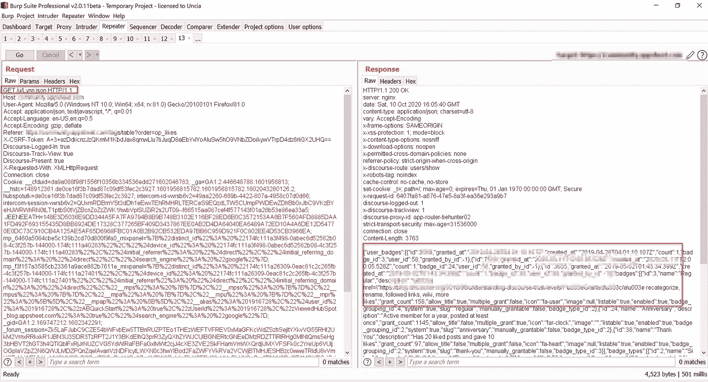
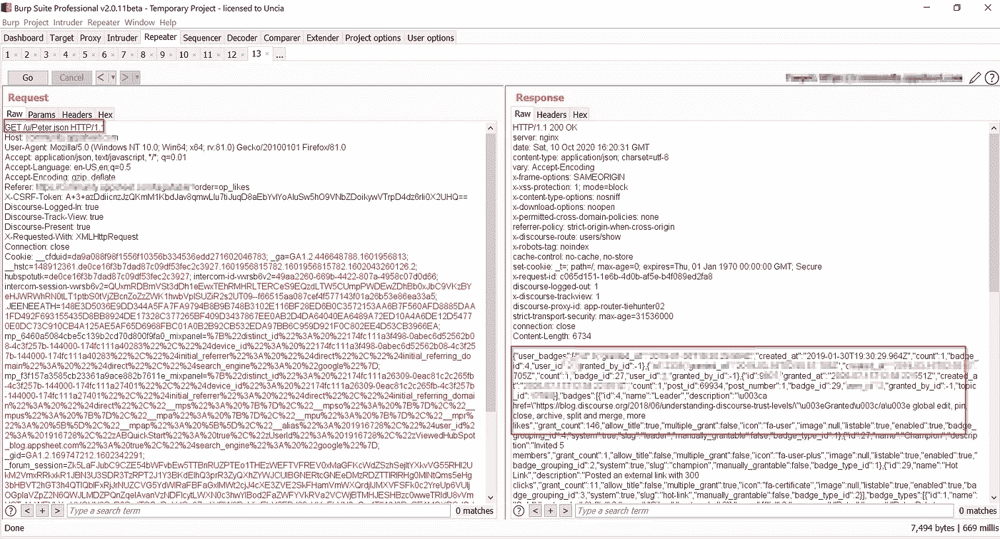

# 我在谷歌上的第一个 bug

> 原文：<https://infosecwriteups.com/my-first-bug-on-google-observation-wins-1a13d0ea54b0?source=collection_archive---------1----------------------->

## 看的越清楚，赢的越好！

所以，这次我试着在谷歌上搜索，看看是否能找到感兴趣的东西。我花了 20 天的时间进行收购，最后我在那里发现了一些有趣的东西。这是其中一个故事:)

在我测试几乎所有东西的时候，我看到一个 URI 在打嗝，提供一些用户数据，包括他们的用户 id 和用户名。大概是这样的:*。这引起了我的注意，所以我开始搜索一些信息，在那里我可以尝试其他用户的用户 id 或用户名。*

*最后，我找到了一个显示我的帐户数据的端点。终点是这样的:-【redected.com/u/yourusername.json】*。嗯，这是我一直在寻找的终点，也是我们作为黑客所需要的！我把用户名改成了我从另一个端点找到的用户名，然后 **BOOM** ！我也能看到其他用户的 PII。我把其中的一些概念放在下面**

********

**一旦你得到了终点，就很容易找到了。我花了时间，它得到了回报。我想提一下“没有一个目标是安全的”。你需要创造的是这种心态。一旦你有了它，就把它们全部黑掉吧！此外，你投入多少时间真的很重要。大目标，实际上是巨大的目标需要时间来开发。坚持下去，最终会有所发现的:)**

**我希望这能帮助人们更好地观察目标。就这样，我将在这里结束这篇文章。如果你喜欢这个，在 ***twitter 上关注我。*** 还有，鼓掌会很赞赏:)**

**昂起你的头，抬高你的肩膀！**

**黑客快乐！再见，❤**

**LinkedIn:-[https://www.linkedin.com/in/manas-harsh-05636a154/](https://www.linkedin.com/in/manas-harsh-05636a154/)**