# 我的第一篇 CTF 报道:毕马威 2019 年网络安全挑战

> 原文：<https://infosecwriteups.com/my-first-ctf-writeup-kpmg-cyber-security-challenge-2019-a42a64db04d8?source=collection_archive---------1----------------------->

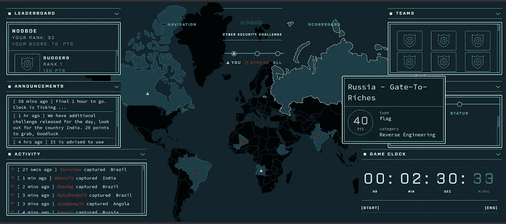

毕马威 2019 年网络安全挑战

# CTF:学习黑客的有趣方式

几个月前，我发现了有关 CTFs 或 Capture Flags 的信息。CTF 是一种计算机安全竞赛。有不同类型的 CTF，但 jeopardy 风格是 CTF 最常用的，玩家面临许多安全挑战，涉及各个领域，如法医或逆向工程，并需要尽可能快地解决问题。每解决一个挑战都会根据难度得到一定的分数奖励，分数最高的玩家获胜。

我发现 CTF 是学习网络安全的一种非常有趣的方式。当你使用了你学到的真正的利用或策略，并且看到它真的起作用(你已经黑了一些东西)或“啊哈！”当你最终找到解决办法的时候，这才是 CTF 真正有趣的地方。

# 我的第一个 CTF

当我第一次发现这项活动时，我立即加入了马来西亚的毕马威网络安全挑战 2019。与黑客马拉松相比，CTF 在马来西亚仍然是一个罕见的事件(这里的黑客马拉松几乎每周举行一次)。因此，我抓住了这个难得的机会。不幸的是，这是一场 4 人的团队比赛，在我的 3 名队友中，只有 1 人可以参加比赛。

遗憾的是，我的团队在 60 多个团队中排名第 32 位，未能通过资格赛。但尽管如此，我玩得很开心，学到了很多东西，总体来说这是一次很棒的经历。我个人认为这个结果并不太糟糕，因为我几周前才知道 CTF，我失去了两个成员。

# 挑战

资格赛没有很多问题，大约有 7 个问题，只包括隐写术、法医和逆向工程挑战。我设法解决了 3 个挑战，每个领域 1 个。我很难解决其他的 RE 挑战，因为他们给了 Windows 可执行文件，而我期待的是 ELF 文件。所以，事不宜迟，我们开始吧。

# 密写

隐写术是隐藏数据的艺术，例如在图像中嵌入秘密消息。这在安全方面的一个应用例子是恶意软件隐藏。

## 安哥拉——最小重大失败

首先，我们得到一个 zip 文件的链接。

```
Least_Significant_Failures_95988b81547c2be1431cfd83199c573c.zip
```

所以我们只是解压它，使用解压命令。

```
$ unzip Least_Significant_Failures_95988b81547c2be1431cfd83199c573c.zip
```

我们将得到一个图像文件`kanye.png`。

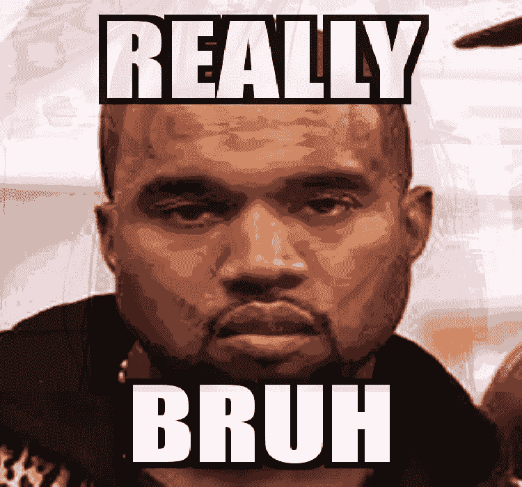

在我们做任何事情之前，我们应该使用`file`命令检查扩展名是否正确，因为文件有时会具有欺骗性，而且它确实是一个 png 文件。由于这是一个隐写术挑战，从 zip 文件的名称来看，这似乎是使用 LSB 技术来隐藏图像内某处的旗帜。所以首先，我们使用了`zsteg`，这是一个通常会使用 LSB 技术显示隐藏在图像中的文本的程序。

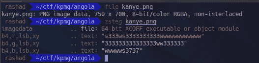

然而，这只会产生如上图所示的乱码文本。

接下来，我们尝试使用 java 工具`Stegsolve.jar`，通过使用各种技术(反转颜色、异或等)处理图像来进行隐写。)或者滤镜。

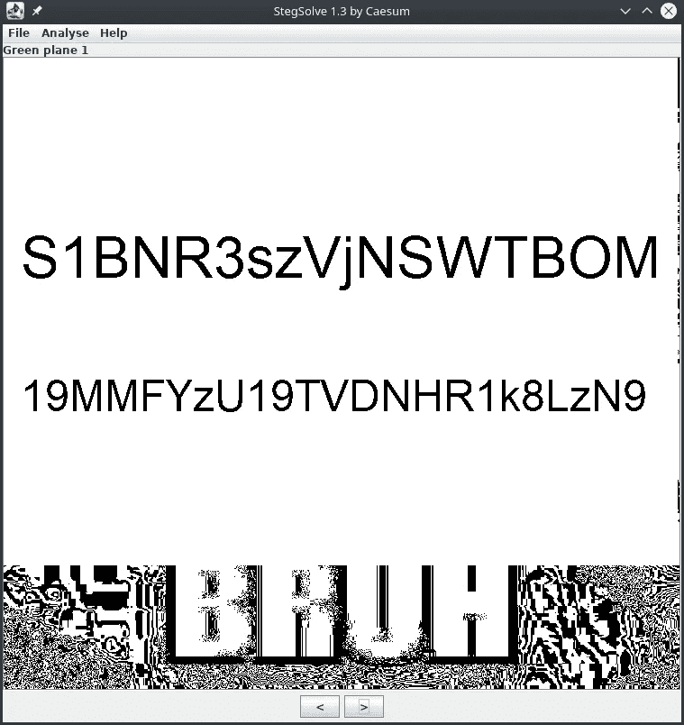

是的，我们在绿色飞机上发现了某种文字，但它看起来不像旗帜，所以它可能是加密的或密码。

然后我们开始尝试使用一些通用的在线解码器，但是它不给出标志。然后我们假设这可能是凯撒密码，并试图强行破解。

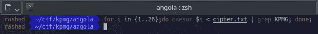

但都是徒劳无功，不给旗。最后，我们尝试将其解码为 base64。


是的。令人惊讶的是，我们拿到了旗子。

```
KPMG{3V3RY0N3_L0V3S_ST3GGY</3}
```

这很棘手，因为我们一开始没有想到它是 base64，因为它没有以通常的`==`填充结束。

# 法院的

取证是恢复留在计算机上的数字痕迹的艺术。在这种情况下，它与网络取证相关，我们试图在`.pcap`文件中找到标志。

## 加拿大 MH370 搜寻项目

首先，我们下载 zip 文件。解压后，我们将得到一个 pcapng 文件`Essence.pcapng`。然后我们用 wireshark 打开文件。在 wireshark 上，我们搜索任何可能给我们标记的字符串，如“KPMG”、“flag”、“ctf”、“pass”等。幸运的是，我们很快找到了一个压缩文件`CTF_Flag.zip`，其中可能包含国旗。

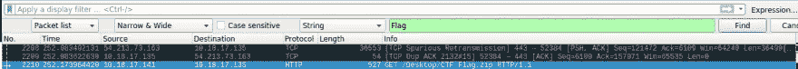

然后，我们继续尝试解压缩文件。然而，它是用密码锁定的。

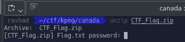

起初我们想用类似`fcrackzip`的破解工具强行破解密码，但幸运的是我们记得之前浏览`.pcapng`文件时看到了一个可能包含密码的`pass.txt`文件。

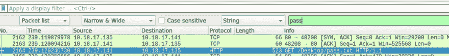

接下来，我们继续提取密码文本文件，并使用它来解压缩 zip 文件。

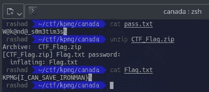

耶！通过使用密码`W@k@nd@_s0m3tim3s`来解压文件。我们拿到旗子了！

```
KPMG{I_CAN_SAVE_IRONMAN}
```

# 逆向工程

CTF 中的逆向工程通常是将编译好的(机器码、字节码)程序转换回更易于人类阅读的格式的过程。

通常这将涉及到反汇编一个程序，并试图理解产生的汇编文件。事实上，给出的一些 RE 挑战要求您反汇编 Windows PE 文件或可执行文件。但是，我并没有设法解决这些，而是解决了只需要一些 python 知识的简单问题。

## 俄罗斯—城市

首先，我们下载 zip 文件并将其解压缩，这将给我们一个 python 代码`GateToRiches.py`。通过查看代码。它会问一个用户名，并以某种方式计算标志。我们可以通过修改代码打印产生的标志`res`来轻松解决这个问题。

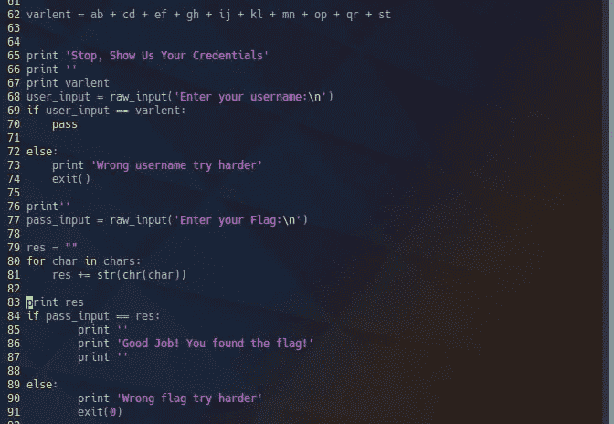

现在，当我们运行 python 脚本时，它会给我们一个标志。

```
KPMG{f00d}
```

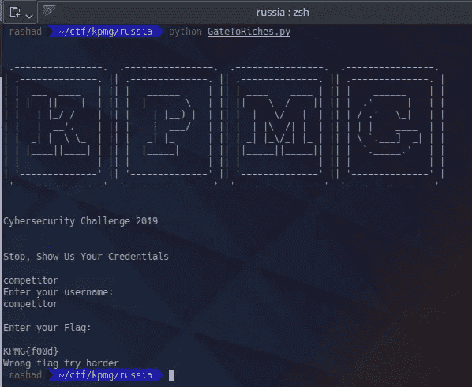

# 结论

我对结果有点失望，但我从比赛中学到了很多，将来肯定会加入更多的 CTFs。事实上，几周前我刚刚参加了另一个 CTF，不久我会写一篇关于它的文章。

对于那些对网络安全感兴趣的读者，我真的鼓励他们不管你的技术水平如何，都来玩玩 CTF 吧！你可以从 [picoCTF](https://picoctf.com/) 开始，一个初学者友好的 CTF。

这是我的第一篇文章，请随意留下关于我写作的反馈。