# 我第一次举办国家级夺旗比赛的经历

> 原文：<https://infosecwriteups.com/my-first-experience-in-hosting-a-national-level-capture-the-flag-competition-f274eb9db0f7?source=collection_archive---------0----------------------->

嘿黑客们！！！

我的名字是 Krishnadev P Melevila，欢迎来到我的专栏，我通常在这里张贴 bug bounty 专栏，但是今天我分享我主持国家级 CTF 的经验。

> **总结**

我 Krishnadev P Melevila 和我的朋友 Jerin Manoj 以及我们的 6 名志愿者与印度计算机学会 Viswajyothi 工程技术学院学生分会联合组织了一次名为 BUFF3R CTF 的国家级夺旗比赛，整个活动由 Redteam academy 赞助，Etlab Softwares 协办。

大约有 100 多个团队参加了在线预赛，前 10 名参加了线下决赛。

奖金是:20000 卢比

> **我的灵感来自哪里？**

这一切都是从 DomeCTF 开始的，没错！DomeCTF 是由 Beagle security 组织的 CTF 竞赛，是 C0C0N(国际网络安全会议，由喀拉拉邦警方 cyberdome 组织)的旗舰活动

2021 年，我第一次听说了 CTF，那是在 covid 疫情期间，所以 domectf 在那一年上线了。而由于好奇，我也加入并参与了 DomeCTF 2021。在 80 多个团队中，我获得了第 17 名。

2022 年，同样的 DomeCTF 在印度喀拉拉邦高知君悦酒店线下举行。我和朋友 Jerin 作为队友去了 DomeCTF 2022。我们在 60 多个团队中排名第 6。

这两个 CTF 给了我很多启发，主要是第二个。所以我们决定在我们学校也开始一场 CTF 竞赛…

所以在我们大学的技术节期间，菩提 22，我们进行了一个迷你 CTF，包括非常基本的加密和网络挑战。这是一次巨大的成功，对我大学里的许多学生来说是一次很好的学习经历。

在这之后，在 11 月的第一周，我们决定再次举办一次大学水平的 CTF，并让新学生(2022-2023 学年的新一批)了解网络安全。

但是后来我们决定把它转移到国家一级，在那个时候，我不知道它是否会工作。但我们冒了风险，继续实施国家级计划。

> **什么是起跑？**

首先，我们决定作为我们班(S3 CSE 2021-2025 批次)的一个项目来举办，但后来当我们考虑到国家级比赛的限制时，我们指出，作为班级组织的比赛来举办是不可行的。

因此，我们在任何组织中寻找一个我们的大学俱乐部，并选择了印度计算机学会作为我们的 CTF 旗帜。

Roshan Shaji，我们的学长是 CSI SB VJCET 的主席。于是我们联系了他，告知了他我们的事情。

他非常支持，但通常我们的大学俱乐部只会提供有限的资金来组织比赛，所以我们要求的是 20000 卢比作为一等奖，但 10000 卢比。20000 英镑不容易得到俱乐部的批准，因为我们以前没有组织活动的经验。

那么接下来呢，是的，现在是外部赞助商的时候了！！！！！！

> **我们如何联系赞助商？**

寻找赞助商对我们来说是一个令人兴奋的挑战，我们只有一个中等水平的 LinkedIn 个人资料，一些 bug bounty 文章，以及一次主持大学水平 CTF 的经历。

我们给许多公司发了冷邮件，甚至谷歌、HTB、Devfolio、TryHackME、亚马逊等等……收到了许多拒绝回复邮件……每封回复邮件都陈述了一个共同点->我们没有以前的经验。

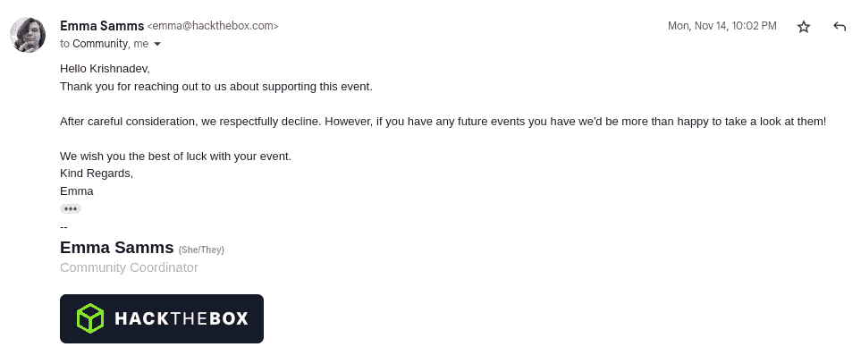

HTB 拒绝邮件

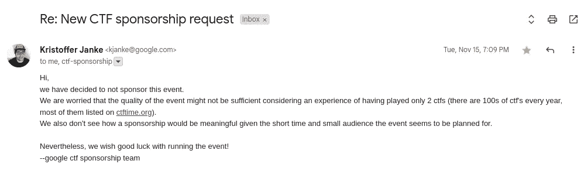

谷歌拒绝邮件

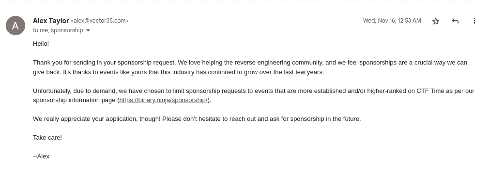

Vector35 拒绝邮件

所以我们从跨国公司转移到创业公司，所以我们想到了声誉良好的网络安全公司，谷歌搜索显示，红队学院是喀拉拉邦一个声誉良好的黑客学院。

我们刚刚在 whatsapp 上通过非官方程序向 Redteam 发送了我们的要求，他们告诉我们，他们将与我们会面并做出决定。

会议安排在网上，我们讨论了我们的总体要求。

Anagha 女士是我们 Redteam 的活动协调员。她对我们的计划深信不疑，并告诉我们，如果我们能将奖金减少到 20000 卢比，他们将继续执行我们的要求

我们同意了，赞助也准备好了！！！！！！

两天后，我收到了另一封来自 Etlab softwares 的邮件，表示他们也准备赞助我们，并给了一笔 5000 卢比的款项

> **学院批准和最终确定日期**

然后我们又联系了 CSI VJCET 的主席 Roshan，让他知道了这件事。

我们进入了下一个环节——大学审批！

学院的批准并不像我们想的那样顺利，是的，学术日程非常紧张，但我们仍然说服了我们的教员和工作人员。我们的团长非常支持我们，他和我们一起去见校长，征求他的同意。

最后我们得到了许可，现在我们准备启动它！！！！！

但是等等…我们总共只有 10 天。批准流程于 2022 年 11 月 14 日完成，我们需要在 2022 年 11 月 26 日之前推进第一轮比赛，在 2022 年 12 月 2 日之前推进第二轮比赛。

采取的计划:

就职典礼(在线):2022 年 11 月 26 日 19:00 IST

第一轮(在线):2022 年 11 月 26 日 19:30 IST 至 2022 年 11 月 27 日 19:30 IST

决赛(在 VJCET 校园离线):2022 年 12 月 2 日 09:30 IST 至 2022 年 12 月 2 日 15:30 IST

现在不眠之夜开始了！！！

> **品牌推广**

由于这是一个国家级的活动，我们需要为我们的活动进行品牌推广，正如我前面提到的，我们只有一次在我们学院的菩提 22 技术节期间举办大学级 CTF 的经历。那时候，我们的 CTF 就像 BodhiCTF 一样被打上了烙印。所以我们决定把它作为我们的品牌，我们为我们的活动制作了标识和第一张海报。

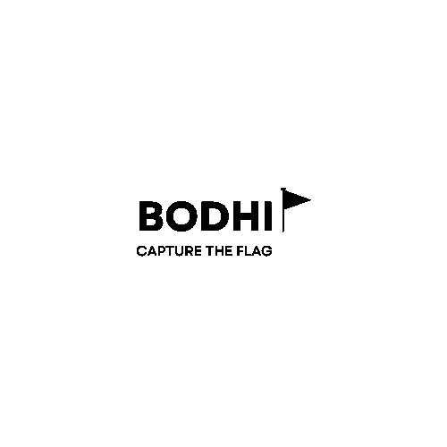

我们的第一个标志

但我们的导师建议我们更改名称，因为这可能会反映出将来与菩提科技节的一些名称冲突，所以我们接受了她的建议，将名称从菩提改为 BUFF3R。

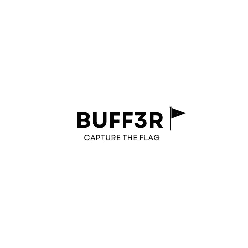

BUFF3R-CTF 标志

> **搭建平台**

我们的第一个大学级别的 CTF 是在 FBCTF 平台上托管的，这是脸书的一个开源项目，但目前它已被脸书弃用并存档。所以从我们上次的 CTF 中吸取经验，我们决定在 FBCTF 上举办。但当时是离线的，所以我们在本地托管。但这一次，我们预计大约有 50+个团队，需要在网上举办。

因此，在 wan 上部署 FBCTF 对我们来说是此次活动中最困难的任务。

我们花了几乎整整 3 个日夜来搭建平台。我们尝试了独立安装，流浪安装，快速安装。但是每一步都失败了。经过许多天的研究，我们从 github 获得了一个 docker 图像，有趣的是，我对 docker 完全陌生，我以前没有使用 docker 的经验，在许多阶段我都想放弃。但是由于对赞助商和学院的承诺，我们有责任成功举办这次活动。

在谷歌搜索、阅读教程、寻找演练、观看 youtube 视频等之后，我了解了 docker 平台并开始设置它。

最后我们设法在我们的 Azzure 服务器上托管了 FBCTF(由 Github 学生赞助)

> **制造挑战**

对我们来说，挑战普里利姆人很容易。因为它只包含简单的解密、加密、网络和杂项挑战，因为我们需要包括来自许多学院的最大数量的学生，并且每个人都需要参与并获得知识。

我们准备了 40 多项挑战。

> **促销活动**

我不擅长平面设计，但在这次事件后，我获得了使用 Canva 的中级经验。我们已经有了 Canva pro(来自 Github 学生赞助)

所以我们所有的推广海报和视频都是通过 Canva pro 制作的。

为了赞助商的推广，我们学院正在进行为期两天的学院级展览，我们联系了我们的团长，请他在展览中为红队提供一个空间，在展览期间放置一个推广展位。他支持并批准了我们的请求，Redteam 访问了我们的学院并推广了他们的内容。

对于我们的联合赞助商，我们在所有的推广视频和海报上展示了横幅广告和品牌 Etlab 标志。

> **注册阶段**

我们于 2022 年 11 月 19 日开始注册，我们预计参与者很少或很少。我们预计大约有 50 支队伍，但我们的宣传和炒作非常成功，我们学院的学生也非常支持在全国范围内散发海报。我们得到了拉贾斯坦邦、海德拉巴等地的注册信息…

我们在第一天就有 25 个以上的注册，第二天有 50 个以上，到 11 月 24 日，我们达到了 116 个团队和 232 个参与者

这是一个好消息…

> **准备工作**

我们知道全国总共有 116 支队伍，但是现在我有点担心服务器一次会处理这么多的请求。这是我第一次主持经验。因此，我们测试了负载，但是在测试过程中，我们发现服务器每秒钟可以同时处理 200 多个请求。

所以我们继续。

> **第一天:在线预赛——2022 年 11 月 26 日(24 小时)**

这一天来了！！！！！我们都很兴奋！！这一天，我们计划了一个在线会议，为活动揭幕，并为参赛者介绍平台，并告知规则和规定。

会议定于 IST 时间 2022 年 11 月 26 日 18:30 举行。我们计划将它作为活动的一个亮点。但是从这里开始一切都出错了！！！！

当我们在介绍平台的会议上透露我们的平台 URL 时，由于我们在活动前的大肆宣传，每个人都开始 ping URL，服务器收到大量请求，服务器响应 503 错误，我们被迫以意外的方式结束会议。那一刻我完全迷失了。100 条 whatsapp 信息，未知号码打来的电话，时间在流逝。

我非常难过、不安和紧张。我对负载平衡一无所知，我联系了我所有的技术朋友，他们告诉我许多复杂的步骤…我不能以匆忙的方式应用它。

电话来自我们的赞助商，他们询问此事…我告诉他们，我们正面临着大量的 ping，我们还没有采取必要的措施来克服它。但是他们一知道，他们的说话方式就让我更有信心了。他们非常支持，并推荐了一个新平台和一些其他替代措施。

采纳了他们和我朋友的建议，我们决定将平台转移到 CTFd，但是…需要时间……

然后，我们很快联系了我们的高级罗山，要求将活动推迟到至少 12 小时。现在时间是 IST 时间 21:30 左右。

按计划出发已经晚了，于是我们决定将活动推迟到 IST 时间 2022 年 11 月 27 日 07:00 至 IST 时间 2022 年 11 月 28 日 07:00。

我们被批准了，整个晚上给了我很多新的体验…我和 Jerin 那晚没有睡觉，

我们购买了价值 50 美元的 CTFd 订阅，我们还决定恢复我们失去的声誉，所以我们购买了价值 15 美元的 bufferctf.in 域名，现在我们建立了一个品牌！！！

然后我们做了 CTFd 的初始设置，在初始设置之后，时间大约是 IST 时间 01:20。

IST 时间 03:30 左右，我们将所有挑战从 FBCTF 转移到 CTFd，现在一切正常。

IST 时间早上 6:30，我们通知所有参与者在活动上注册，我们在 IST 时间 7:00 准时出发

从这里开始，一切都很顺利..我们没想到参与者会这么投入，我想几个小时后每个人都会累的。但是每一个参与者都非常积极地参与了整个 24 小时的比赛。

排行榜是不可预测的，每秒钟都在变动。这让我非常高兴。

预赛结束后，前 10 名的队伍如下

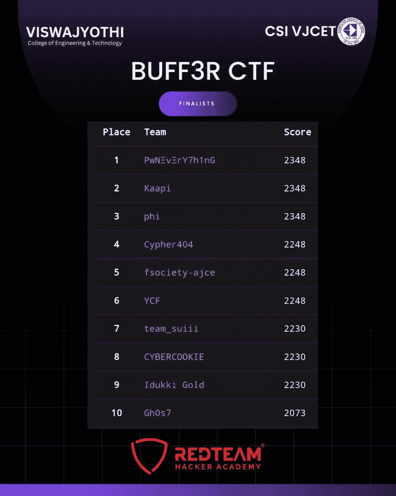

这些是在 VJCET 校园举行的第二轮比赛中被选中的团队

我们发布了第一轮反馈的谷歌表格，我们了解到这个 CTF 帮助大多数学生了解了网络攻击场景，大多数学生学到了很多新东西。

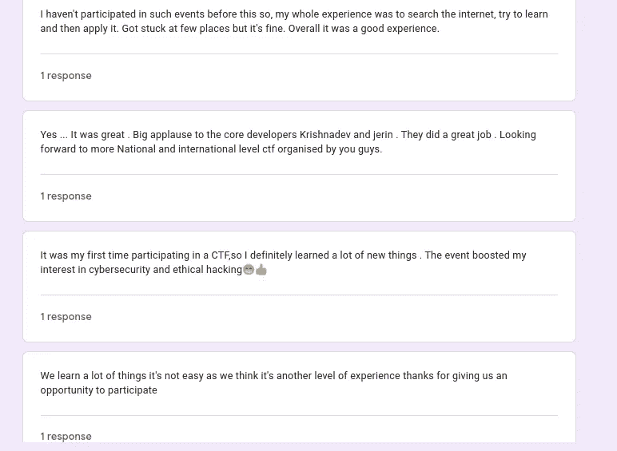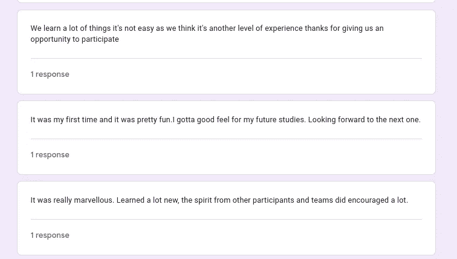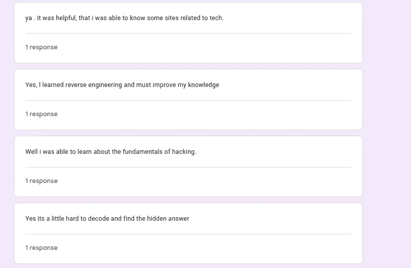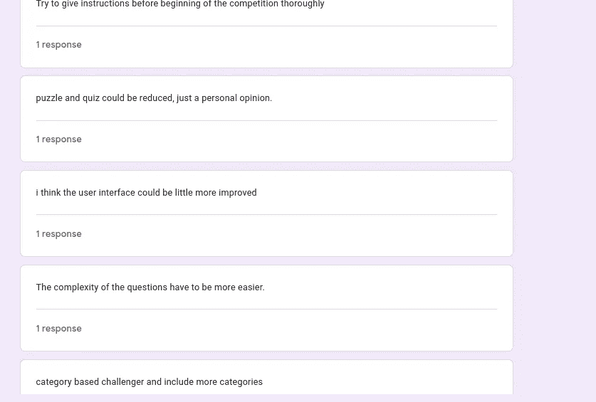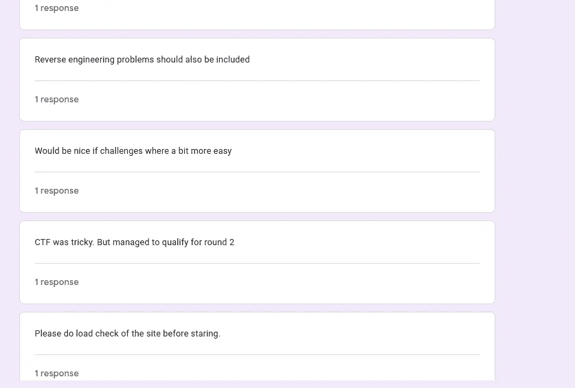

> **第二轮挑战开发**

在第一轮后，一些团队告诉我挑战很容易，所以我们的声望问题是建立更多的挑战，我们在预赛后不久就开始建立，我在 web 开发方面更有经验，所以我开始建立更困难的 web 挑战。我们在挑战中铺设了许多兔子洞，

首先，我不知道从哪里开始，后来我研究了许多 ctf 组织者的经验，发现我们需要使用容器安装一些易受攻击的 web 应用程序，并将其暴露给参赛者，他们会发现漏洞，利用它并拿走旗帜。

所以所有的挑战都已经准备好了，现在是时候知道谁是国王了！！！！！

> **第二天:线下决赛——2022 年 2 月 12 日(5 小时)**

第二天非常激动人心，来自喀拉拉邦各工程学院的队伍在那里比赛，许多队伍甚至来自相距 200 多公里的地方。

我们组织者和志愿者早早来到会场，开始为决赛选手做准备和安排。

我们 9:30 准时开始，15:30 准时结束

我们安排在 IST 时间 12:30 到 13:30 午休。在此期间，我们冻结了比分板，也隐藏了挑战。

前两个小时，记分牌是不可预测的，洗牌是严格的，但在最后 3 个小时，几乎可以清楚地看到，Cypher404，Kaapi，Pwneverything，G0S7 或 phi 中的一个将是赢家。

最终 Cypher404 抢到了宝座，成为赢家！！！！

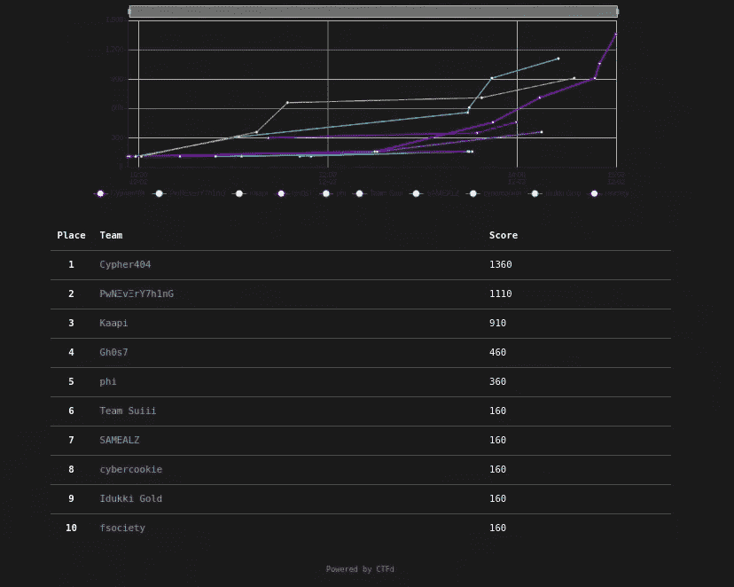

我们的赞助商无法参加闭幕式，因为他们的一名工作人员有医疗紧急情况。

我们的副校长和团长参加了颁奖仪式，并给获奖者发了奖金。

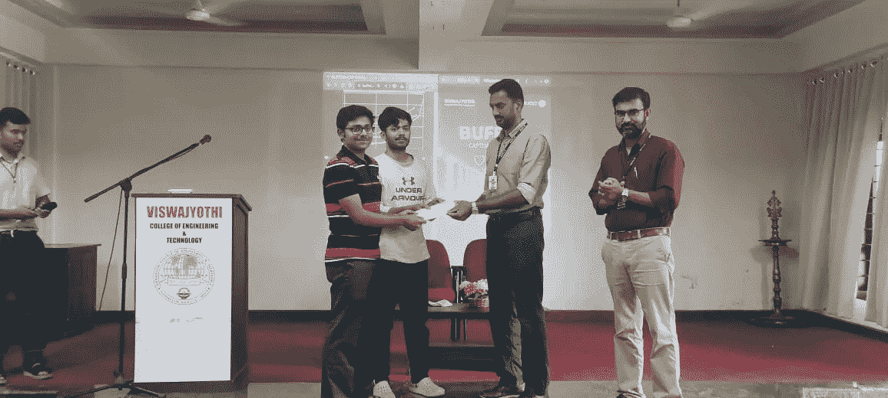

Cypher 404 团队—获胜者

> **整体体验如何？**

这是我生命中的一个里程碑，我可以自豪地向我的作品集展示这次活动的每一个步骤和过程。我们知道我们在整个活动中犯了很多错误，但除此之外，从参赛者的反馈中，我们了解到，参赛者能够学到很多新东西。选手们也提到了这次活动的组织和协调非常好，这让我非常高兴。

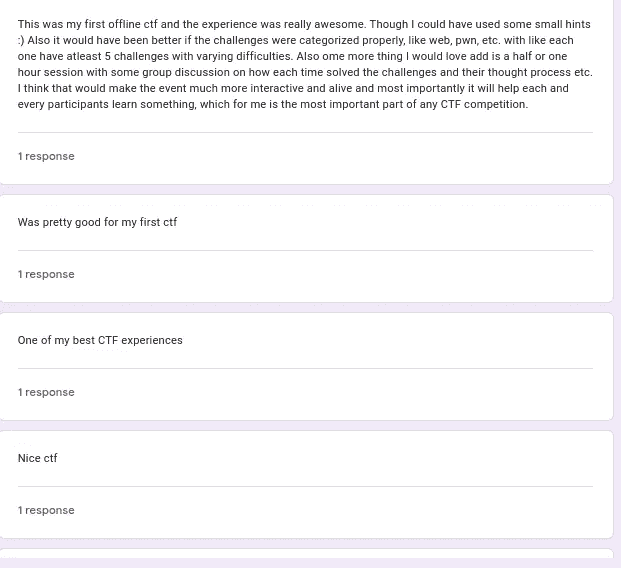

对于一个网络安全爱好者来说，举办这样的活动是一次很好的经历，真的学到了很多…实际上这些错误让我学到了它，预赛期间的第一个服务器问题教会了我压力管理，观众管理，情况处理等…

还有技术技能，如域映射、负载平衡思想、对接容器、Nginx 配置等…

我真的很喜欢主持这个活动。

以下是电影结束后的活动:

> 我们还会主办 BUFF3R CTF 吗？

BUFF3R CTF 2.0 即将推出……

***别忘了在 medium 和其他社交媒体上关注我。也请为这篇文章鼓掌 50 次，这是我写更多的灵感！！***

*我的 Instagram 手柄:*[*https://instagram.com/krishnadev_p_melevila*](https://instagram.com/krishnadev_p_melevila)

*我的 LinkedIn 句柄:*[*https://www.linkedin.com/in/krishnadevpmelevila/*](https://www.linkedin.com/in/krishnadevpmelevila/)

*我的推特句柄:*[【https://twitter.com/Krishnadev_P_M】T21](https://twitter.com/Krishnadev_P_M)

## 来自 Infosec 的报道:Infosec 每天都有很多内容，很难跟上。[加入我们的每周简讯](https://weekly.infosecwriteups.com/)以 5 篇文章、4 个线程、3 个视频、2 个 GitHub Repos 和工具以及 1 个工作提醒的形式免费获取所有最新的 Infosec 趋势！