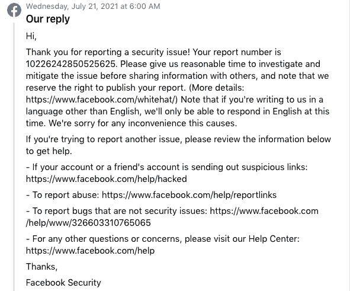
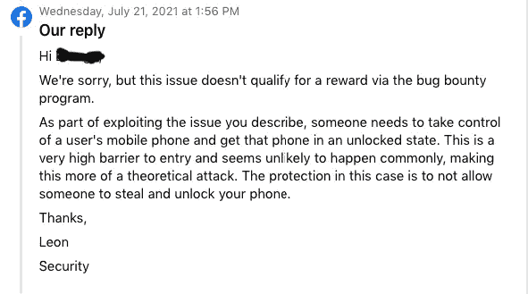
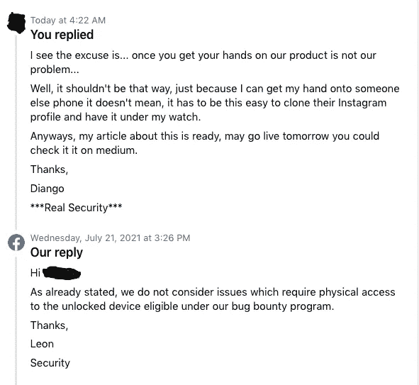

# 我的第一份 Instagram Bug 赏金报告

> 原文：<https://infosecwriteups.com/my-first-instagram-bug-bounty-report-682f39a45994?source=collection_archive---------1----------------------->

## 有总比没有好，即使不如人意。

由 [Unsplash](https://unsplash.com?utm_source=medium&utm_medium=referral) 上的 [Kvalifik](https://unsplash.com/@kvalifik?utm_source=medium&utm_medium=referral) 拍摄的照片

> 光是标题就足以让你兴奋了吧？好吧，拿上你的咖啡，跟我坦白。

## 介绍

几天前，在测试一个网站的漏洞时，我在一个标签页中打开了 Instagram。在某个时候，那个标签向它的服务器发送了一些数据，我的**代理**拦截了它，让我注意到一个有更高赏金机会的更好的目标。

> 有一个关于这个的 POC 视频，但是不知道怎么贴在这里。

经过几个小时试图找到一些弱点，我放弃了。就在那时，我收到了一封来自 **HackerOne** 的电子邮件，要求我提供关于几天前一份报告的更多信息，该报告涉及一个逻辑重置密码链接的缺陷。老实说，我不想尝试测试 Instagram 的这个相同的缺陷，因为我们都知道他们的安全性是最重要的，或者至少我是这么认为的。

## 《我的宝贝》

Instagram 的密码重置链接有一个奇怪的缺陷。这些是重现它的步骤。

1.  要求两个密码重置链接，在浏览器中打开它们。
2.  打开两个点击，在其中一个标签中，更改您的密码。
3.  更改密码后，转到您的设置并注销。
4.  现在，跳到第二个选项卡，再次更改密码，就像您之前做的那样。

问题来了，Instagram 未能杀死第二个未使用的*链接*。**这个漏洞让攻击者接管你的帐户**，因为让他们使用一个不应该工作的链接第二次更改你的密码。

## 真正的威胁

这个漏洞的更大问题不仅在于它让你使用一个不应该工作的链接重新设置密码。下面是我在测试它时了解到的一些更危险的事情。

1.  当您第一次更改密码时，您会收到一封电子邮件通知您。但是当你第二次做的时候，你将一无所获。
2.  继续打开你的手机原生 Instagram 应用程序会让你退出，就像它应该做的那样。但是当你试图使用上次设置的密码重新登录时，它不会让你这样做。它只接受使用这两个链接创建的第一个密码。
3.  不像大多数重置链接。这是很长的代码串，每次你得到一个新的链接时都会改变。这个只有一个 5/6 字母的单词，作为你账户的令牌。

## 结果和一个非常可能的攻击场景

**受害者；**
你向一个认识的人要电话，因为你一时不能用手机，所以要打电话或找东西。你上了这个人的 Instagram，看了一眼他的邮件，编了个故事说你被黑了，然后把他注销。

注销他的帐户后，要求两次密码重置链接。打开他的邮件 app，记住链接的 5/6 字母令牌。为了节省时间，您已经可以在自己的密码重置链接中打开手机浏览器标签。现在把你的**令牌**换成他的。

一旦那个人拿回他的手机，并试图进入他的个人资料，这并不保证会马上发生，他会注意到两件事，他的帐户被注销，一个新的密码重置电子邮件。此人的第一反应将是惊慌失措，并试图通过该电子邮件找回自己的个人资料。一旦进入他的个人资料，他会继续查看，看到 Instagram 上的故事说*你被黑了*，然后把它撤下来。

**攻击者；**
在原生应用中使用你自己的 Instagram 账户，你将在受害者账户上检查何时攻击的提示。暗示？我们之前做的 Instagram 的故事，甚至因为害怕更多的*“攻击”*而将账户转为私有。一旦得到提示，继续从打开的选项卡中更改密码。他不会收到电子邮件告诉他，而且他的密码仍然有效，以防他在你更改密码后注销。

看到这是一件严重的事情，我联系了脸书，告诉他们我的发现，以为我发现了一些有趣的东西。许多事情都没有正常工作，因为这是很可能发生的事情，即使是在会议或健身房这样的地方把手机放在看不见的地方，我自己也见过很多次。

## 他们的反应

他们回复我很快，但是说实话。我没想到会得到这样的回应。在最初的回复中，他们甚至不明白我用一个 **POC 视频向他们展示的是什么，**这就是为什么我和他们反复讨论，试图用文字向他们解释在一个视频和两张照片*facepalm*中非常清楚的东西

最后，当他们无法否认这个缺陷时，这就是他们的回应。

我读到这里感到很惊讶，因为我们都使用 WhatsApp，而且都知道他们不允许人们在两部不同的手机上使用 WhatsApp。为什么？因为任何人只要拿到你的手机，就可以“黑掉”你的账户，在不止一个地方使用。当然，使用他同样的逻辑，一些手机会被锁定，但至少对于 androids 用户来说，这不会阻止攻击者暴力破解你的手机，我甚至给他们发了一个视频。

他们没有试图在这里使用相同的 WhatsApp 逻辑。在他们看来，这是一次“**理论上的攻击**，因为他们不相信攻击者无法接触到受害者的手机甚至电子邮件。为了防止这些攻击，他们只让用户使用一个帐户。

## 不要对我们动粗

如此处所示，他们甚至不关心他们的缺陷，他们的借口是一旦你得到物理访问不是他们的问题。嗯，不应该是这样的，仅仅因为你可以得到一些东西并不意味着它应该这么容易被黑掉。

## 结论

这不是我第一次与脸书的傲慢打交道，他们只会在你向他们展示你能做一些真正的伤害时才会认真对待你，而不是在 deep web 上出售它，你转向他们并祈求奖励。

这就是为什么我从来没有向他们报告更大的事情，他们不值得。你可能是有史以来最白的黑客，但知道如何黑掉或恢复一个用户的账户总是好的。😈