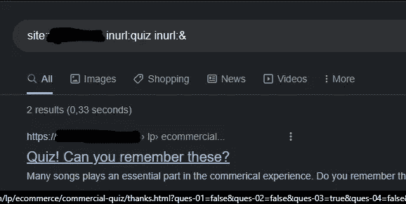
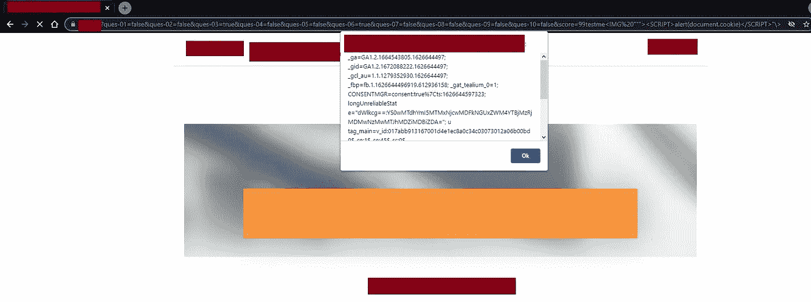
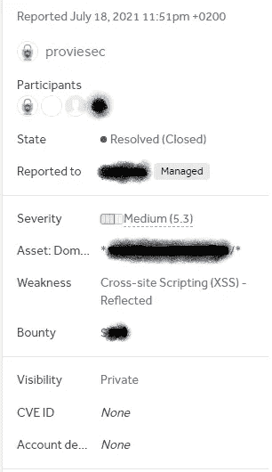

# 我的第一个反映 XSS 虫赏金——谷歌呆子——XXX 美元

> 原文：<https://infosecwriteups.com/my-first-reflected-xss-bug-bounty-google-dork-xxx-92ac1180e0d0?source=collection_archive---------0----------------------->

今天我将分享一个我向安全团队报告的 XSS 漏洞，这是他们在 Hackerone 的 bug bounty 计划的一部分。我是通过我的一个谷歌呆子意识到这个 XSS 的缺陷的。

# 是什么反映了 XSS？

跨站点脚本(XSS)是一个 web 应用程序漏洞，使得攻击者能够将代码(通常是 HTML 或 JavaScript)注入外部网站的内容。当受害者在网站上查看被感染的页面时，注入的代码将在受害者的浏览器中执行。因此，攻击者绕过了浏览器的同源策略，能够窃取受害者的私人信息。

# 什么是谷歌呆子

Google Dorking 基本上是一个使用高级搜索查询来查找网站上不容易找到的信息的搜索。它们是搜索字符串，你可以在谷歌搜索中输入这些字符串来寻找某些漏洞。

Google Dorking 其实挺简单的。你只需要知道一些关于呆子的基本知识，就能给你你需要的信息。

```
intitle:"index of" 
intext:"Index of /" +.htaccess
filetype:log
site:medium.com
```

在这里你能找到更多的:【https://github.com/Proviesec/google-dorks】T2

谷歌黑客数据库中有很多谷歌呆子，他们可以找到漏洞或 CVE 的迹象:【https://www.exploit-db.com/google-hacking-database】T4

# 我是如何发现 Bug 的:

1.  我在谷歌上搜索过这个笨蛋:`site:redacted.com inurl:quiz inurl:&`
2.  然后，我在谷歌搜索中只找到了 2 个结果，并深入查看了第一个结果。



## 后续步骤:

1.  去 https://www . redated . com/LP/ecommerce/commercial-quiz/thanks . html？ques-01 = false & ques-02 = false & ques-03 = true & ques-04 = false & ques-05 = false & ques-06 = true & ques-07 = false & ques-08 = false & ques-09 = false & ques-10 = false & score = 99
2.  将参数分数更改为`99testme%3CIMG%20%22%22%22%3E%3CSCRIPT%3Ealert(document.cookie)%3C/SCRIPT%3E%22\%3E`
3.  弹出一个值为 document.cookie 的警告框。
4.  然后我试着把这个 bug 和其他 bug 结合起来。但两天后，我只报告了 XSS 的错误，并为此获得了三位数的奖金。



## 以下是简短的黑客报告:



## **时间线:**

*提交*:2021 年 7 月 18 日

*受理*:2021 年 7 月 20 日

*审判日*:2021 年 7 月 23 日

*已解决*:2021 年 7 月 25 日

*关闭*:2021 年 11 月 8 日

# 工具/报告

你怎么能找到 XSS？

## 工具:

*   我最喜欢的工具，xs strike:[https://github.com/s0md3v/XSStrike](https://github.com/s0md3v/XSStrike)
*   [https://github.com/hahwul/dalfox](https://github.com/hahwul/dalfox)
*   [https://github.com/ssl/ezXSS](https://github.com/ssl/ezXSS)
*   https://github.com/Proviesec/xss-payload-list/ XSS 有效载荷列表:
*   你也可以在我的 Github 页面上找到新工具，包括 XSS 工具。我只包括可以通过网站或手机访问的工具:[https://provie . github . io/Provies-Bug-Bounty-Dorking-Site-PBBDS/# XSS](https://provie.github.io/Provies-Bug-Bounty-Dorking-Site-PBBDS/#XSS)

## 类似报告:

*   [https://hackerone.com/reports/191810](https://hackerone.com/reports/191810)/3000 美元/uber.com
*   https://hackerone.com/reports/840759/3000 美元/新遗迹
*   [https://hackerone.com/reports/176754](https://hackerone.com/reports/176754)/2500 美元/推特
*   [https://hackerone.com/reports/470206](https://hackerone.com/reports/470206)/1500 美元/购物

# 摘要

> 提示:“旧程序，许多报告，大范围”不要让这个困扰你。尝试找到越来越多的参数，并全部测试。

在测试 XSS 之前做好你的研究。不要在每个参数上射击有效载荷。先思考，再测试参数。例如，查看输入是否被反射。并在使用它来应用有效负载之前检查每个参数。

这是我的个人资料:[https://hackerone.com/proviesec](https://hackerone.com/proviesec)

请随时问我，并建议我下次应该考虑的更改。不管怎样，谢谢你的阅读👋。

你需要另一篇好文章吗？->[https://infosecwriteups . com/broken-link-jacking-404-Google-play-store-XXX-bounty-96e 79 A8 DFD 71](/broken-link-hijacking-404-google-play-store-xxx-bounty-96e79a8dfd71)

# 🔈 🔈Infosec Writeups 正在组织其首次虚拟会议和网络活动。如果你对信息安全感兴趣，这是最酷的地方，有 16 个令人难以置信的演讲者和 10 多个小时充满力量的讨论会议。[查看更多详情并在此注册。](https://iwcon.live/)

[](https://iwcon.live/) [## IWCon2022 - Infosec 书面报告虚拟会议

### 与世界上最优秀的信息安全专家建立联系。了解网络安全专家如何取得成功。将新技能添加到您的…

iwcon.live](https://iwcon.live/)