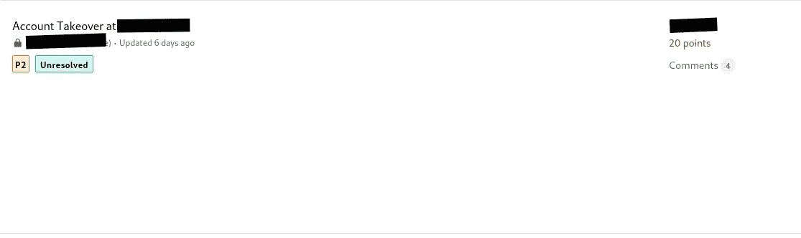

# 我的第四个账户通过密码重置接管

> 原文：<https://infosecwriteups.com/my-fourth-account-takeover-through-password-reset-28a36dfebaf?source=collection_archive---------1----------------------->

大家好，

我是**奥马尔·哈姆迪** **【海员】**，今天我将解释我在 **Bugcrowd** 的私人程序中发现的最酷的 bug 之一

我们开始吧，

我有一个私人程序，姑且称之为**redacted.com，**经过一段时间对程序的侦察，我开始检查我最喜欢的功能密码重置，通常我会寻找类似(ATO，主机头注入)的漏洞。

简单地说，当用户想要重置他的密码时，他输入他的电子邮件，然后一个密码重置链接将被发送到他的电子邮件。

我为我的帐户申请了密码重置，密码重置链接是:

[**https://**](https://www.winwin.com/update-password/02db2ca0-cbc3-44ec-9871-85ac6390d863/1621264272) **编校** [**。com/update-password/12d 52 cat CBC 344 EC-9871-85ac 6390d 863/1621264272**](https://www.winwin.com/update-password/02db2ca0-cbc3-44ec-9871-85ac6390d863/1621264272)

密码重置链接由两部分组成:用户 ID 和一个随机的 10 位代码。

我发现非常有趣的是，这 10 位数字代码是一个序列代码，因此不会生成随机值，而是一个序列值，这意味着如果您请求重置您帐户的密码，并且代码是" **1618963** 650 "，那么您请求重置受害者帐户的密码将是代码" **1618963** 720 "， 其中只有最后 3 个数字不同，允许我们进行强力攻击并获得最后 3 个数字，其中概率比将从 100 到 999。

现在的问题是，用户 ID 没有公开，我花了两天多的时间搜索任何泄露这个 ID 的端点，我用了 Google Dorks，一无所获。

该网站的部分理念是用户可以在网站上发布文章，并且有一个向用户报告特定文章的功能，我发现如果你向用户报告一篇文章，你会发现用户的 ID 正在请求中被泄露。

**复制**的步骤:

1-为您的帐户请求密码重置。

2-请求重置受害者账户的密码。

3-然后将您的 ID 更改为受害者 ID，并使用相同的 10 位代码，只对最后 3 位数字执行暴力攻击，操作将成功完成。

4-对此链接执行强力攻击，并指定 10 位代码的最后 3 位

[**https://**](https://www.winwin.com/update-password/02db2ca0-cbc3-44ec-9871-85ac6390d863/1621264272) **编校** [**。com/update-password/12d 52 cat CBC 344 EC-9871-85ac 6390d 863/1621264272**](https://www.winwin.com/update-password/02db2ca0-cbc3-44ec-9871-85ac6390d863/1621264272)

今天就到这里，感谢阅读:)

在 twitter @seaman00o 上关注我

跟我来看 https://www.facebook.com/profile.php?id=100028277354125 的脸书