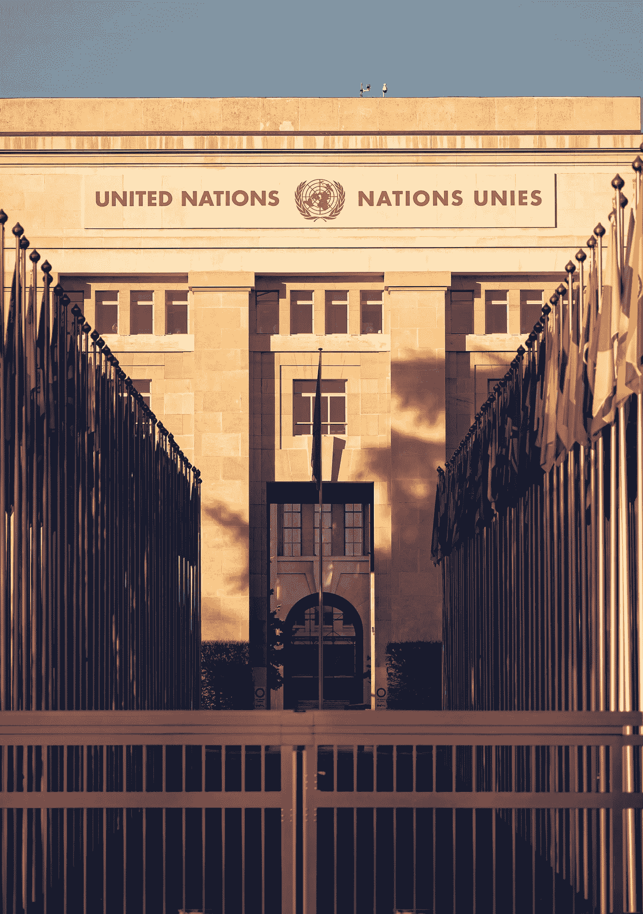

# 我是如何作为一名 18 岁的道德黑客进入联合国名人堂的！

> 原文：<https://infosecwriteups.com/my-hall-of-fame-at-united-nations-success-story-97675232aed7?source=collection_archive---------7----------------------->

对于任何渴望在网络安全领域建立职业生涯的人来说，名人堂发挥着重要作用，就像任何人一样，作为一名年轻的有抱负的道德黑客，这也是我的梦想，当它有一天成为现实时，我感到很惊讶。以下是我如何实现梦想的。

如果你认为联合国名人堂很重要，进入联合国名人堂需要非凡的技能！这是给你的。

Jonathan Ansel Moy de Vitry 在 [Unsplash](https://unsplash.com/?utm_source=unsplash&utm_medium=referral&utm_content=creditCopyText) 上拍摄的照片

进入联合国总部很难吗？

简单的答案是否定的。

如果进入联合国是你的目标，这一点都不重要，继续探索漏洞，如在联合国网站上很常见的点击劫持，并试图增加其严重性，并向 infosec@un.org 的[报告，这只是耗时，并不难，但真正的乐趣是做一些有趣和新的事情，证明你在**名人堂**， 以下是我如何通过在联合国拥有的一个子域名中找到 XSS 而进入联合国名人堂的故事。](mailto:infosec@un.org?subject=Security%20Vulnerability)

照片由 [Max Bender](https://unsplash.com/@maxwbender?utm_source=unsplash&utm_medium=referral&utm_content=creditCopyText) 在 [Unsplash](https://unsplash.com/s/photos/hacker?utm_source=unsplash&utm_medium=referral&utm_content=creditCopyText) 上拍摄

在任何**域**中寻找任何漏洞的核心步骤是**子域**枚举，我个人使用 **amass、** **subfinder** 和 **sublist3r** 你可以使用你选择的任何工具，但是结合所有这些工具的优点是一个更好的主意，这样你就不会错过任何子域。如果你是一个绝对的初学者，你可以尝试在线工具，如 [**DNSDumpster**](https://dnsdumpster.com/) ，[**virus total**](https://www.virustotal.com/)**或任何此类在线枚举工具。关于枚举，我得到了很多活跃的子域，已经有一段时间了，我猜大约有 8000 个子域。一个域名引起了我的注意:https://mdgs.un.org**T21[，我继续深入探索，并尝试强行打开这些目录。](https://mdgs.un.org/query.asp)****

****现在我发现了一些惊人的东西，****

****[**https://mdgs.un.org/query.asp**](https://mdgs.un.org/query.asp)****

****这给了我一些希望，这是有一些果汁在里面！****

****我在搜索栏上尝试了各种 XSS 有效载荷，最终有一个有效载荷为我工作，****

******有效载荷**:**x " on mouseover = alert(1)x = "******

****成功执行有效负载后，**我发现每次鼠标光标经过搜索字段时都会弹出一个警告。******

******那是一个 XSS 的倒影！！！！！******

********

****照片由 [Fauzan Saari](https://unsplash.com/@fznsr_?utm_source=unsplash&utm_medium=referral&utm_content=creditCopyText) 在 [Unsplash](https://unsplash.com/s/photos/achivement?utm_source=unsplash&utm_medium=referral&utm_content=creditCopyText) 上拍摄****

****我在 1 月 19 日向 infosec@un.org[联合国](mailto:infosec@un.org?subject=Security%20Vulnerability)报告了这个漏洞，等了将近两个月。****

****3 月 16 日，我的名字终于被添加到名人堂。****

********

****最后，我的名字被加入了信息安全名人堂****

******在这里找到我的名字:** [名人堂|信息与通信技术办公室](https://unite.un.org/content/hall-fame/list)****

****非常感谢您的阅读，请在 medium 和 [LinkedIn](https://www.linkedin.com/in/joshuaarulsamy/) 上关注我，了解更多精彩内容！****

## ****来自 Infosec 的报道:Infosec 每天都有很多内容，很难跟上。[加入我们的每周简讯](https://weekly.infosecwriteups.com/)以 5 篇文章、4 个线程、3 个视频、2 个 GitHub Repos 和工具以及 1 个工作提醒的形式免费获取所有最新的 Infosec 趋势！****