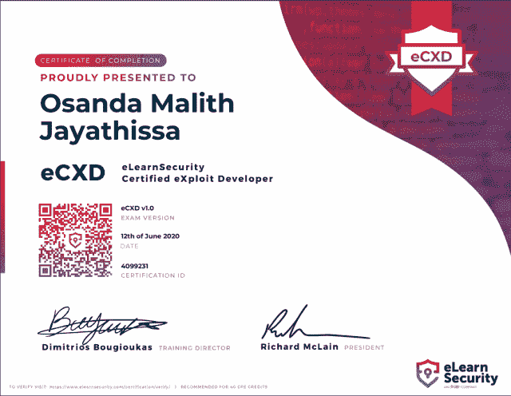

# 我的电子安全认证漏洞开发者之旅— eCXD

> 原文：<https://infosecwriteups.com/my-journey-into-elearnsecurity-certified-exploit-developer-ecxd-da9d01060305?source=collection_archive---------1----------------------->

首先，我要感谢 eLearnSecurity 开设了这样一门关于漏洞利用开发的课程。我一直是 Windows 操作系统的忠实粉丝。在过去的几年里，我花了很多时间在 Windows 逆向工程、Windows 内部和 Windows 上的漏洞开发上。然而，我最喜欢这门课程的一点是它在 Windows 和 Linux x86 和 x86_64 上的多样性。我花了相当多的时间学习 Linux 开发和内部，我完全喜欢理解这些概念，不管它们有多难掌握。我无法解释这种感觉😊

我将分享我对每个部分的想法。

# Linux 漏洞开发

# 模块 1: Linux 堆栈粉碎

像往常一样，这是一个介绍性模块，在这里您将很好地理解 Linux 内部和基于堆栈的缓冲区溢出的基础知识，并识别它们。

本模块包括的实验有:

*   隐藏功能
*   Linux 基本堆栈溢出
*   Linux x64 基本堆栈溢出

# 模块 2: Linux 漏洞利用对策和旁路

本节是一个关于绕过 Linux 漏洞利用缓解技术的强化模块。下面通过示例进行了深入介绍。我相信这是本节中最大的模块。在*nix 的世界里，我在这个模块里学到了很多内部的东西，理论，新的东西。

*   （同 nonexpendable）非消耗品
*   ASLR
*   堆叠 Cookies
*   雷洛
*   馅饼
*   RPATH

# 模块 3:面向 Linux 返回的编程

本模块解释了面向返回编程(ROP)的概念，以及如何利用这种技术绕过反利用机制。我建议先学习与反利用机制相关的模块 2，然后继续学习本模块并做实验。因为你在实验中需要这两个模块的理论。

这两个模块的实验包括:

*   Linux NX 旁路(ret2libc)
*   克服 ret2libc 限制
*   Linux x64 ASLR 旁路
*   Linux x64 堆栈 Canary、NX 和 ASLR 旁路
*   Linux x64 NX 旁路(ret2libc + ROP)

# 模块 4: Linux 外壳编码

这个模块解释了开发 Linux 外壳代码和一些概念，比如 Egghunters，当堆栈空间不足时，它可以检测内存中的外壳代码。用套接字内部解释了 32 位反向 TCP 外壳代码的完整演练。此外，还解释了在 Linux 上开发 64 位外壳代码。

本模块包括的实验室是:

*   Linux 外壳编码

# 模块 5: Linux 高级开发

要学习本模块，请确保您已经很好地学习了前面的所有模块。本模块深入解释了如何利用格式字符串漏洞，以及如何滥用它来绕过反利用机制。还包括绕过加固系统。本模块有一些紧张的实验，理解开发过程非常具有挑战性。我非常喜欢这个模块，因为这些类型的漏洞可以被滥用来绕过现代的反利用机制，并且仍然在商业应用程序的真实世界中被报告。

*   Linux NX 和 ASLR 旁路(格式字符串开发+ ROP)
*   严格的防火墙旁路(格式字符串利用+套接字重用外壳代码)

# Windows 漏洞开发

# 模块 1: Windows 堆栈崩溃

本模块解释了在 Windows 系统中利用基于堆栈的缓冲区溢出的基础知识。您将学习不同的工具来自动化某些任务和内部。

本模块包括的实验有:

*   Windows 基本堆栈溢出

# 模块 2:基于 Windows SEH 的溢出

本模块解释了在 Windows 系统下滥用结构化异常处理机制的软件。这些实验将让你更实际地了解它在调试器下是如何工作的。

本模块包括的实验有:

*   Windows SEH 溢出(MP3 工作室)
*   Windows SEH 溢出(EasyChat)

# 模块 4: Unicode 缓冲区溢出

本模块说明创建 venetian 外壳代码并在 Unicode 缓冲区溢出漏洞利用中利用它的过程。如果应用程序在翻译时更改了用户输入，这种技术就很有用。

# 模块 5: Windows 外壳编码

这个模块解释了 Windows 中外壳编码的艺术。本文还深入研究了在 Windows 平台上开发与位置无关的外壳代码。这个模块还包括一个套接字重用外壳代码和关于后门的 PE 文件

本模块包括的实验有:

*   Windows 外壳编码

# 模块 6:面向 Windows 返回的编程

本模块解释了 Windows 上面向返回的编程(ROP)理论。本模块也很紧张，因为它深入到手动 ROP 链。我真的很喜欢这个模块，因为我学到了很多关于开发我自己的手动 ROP 链。

本模块包括的实验有:

*   Windows ROP(场景 1)
*   Windows ROP(场景 2)

# 模糊视窗软件

这是另一个解释道钉引信用法的实验练习。

# 考试

这次考试很有挑战性。这是三天，另外两天是为报告准备的。因为有 3 天时间，我没有那么大的压力。对于 Windows 和 Linux 环境 x86 和 x86_64，总共有 5 项挑战。没有选择题，这是一个完整的实践考试。你应该为每个挑战开发一个概念证明，并记录下你的过程、使用的工具等。课程中的所有内容都教得很好，如果你学习了材料并做了实验，你通过考试的机会很高。

考试中将评估以下知识领域。

*   Windows 和 Linux 内部
*   逆向工程(x86 和 x64 平台)
*   软件调试
*   外壳编码
*   Windows 和 Linux 漏洞开发(包括脚本知识)
*   绕过现代反利用机制(RELRO 馅饼，栈饼干，NX/DEP，RELRO 等)。)
*   利用加固的主机并克服限制

非常感谢 uka SZ miku za 创建了这个课程并评估了我的考试报告。特别感谢 eLearnSecurity 的 Dimitrios Bougioukas🙂

更多 XDS 课程信息:[https://www . elearnsecurity . com/Course/exploit _ development _ student/](https://www.elearnsecurity.com/course/exploit_development_student/)

*原载于 2020 年 6 月 25 日*[*【https://osandamalith.com】*](https://osandamalith.com/2020/06/25/my-journey-into-ecxd-elearnsecurity-certified-exploit-developer/)*。*