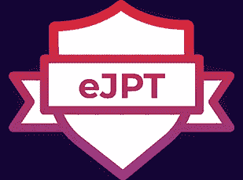

# 我的 eJPT 之旅

> 原文：<https://infosecwriteups.com/my-journey-of-ejpt-fbef63ccda00?source=collection_archive---------2----------------------->

嗨嗨！！最后，当我成为于 2021 年 6 月 8 日结束的 **eJPT** ( **电子安全初级渗透测试员**)时，我下定决心在旅途中写作。

我将带你了解我的旅程，这一切是如何开始的，我是如何了解 **INE** 和 **ELS** ( **电子安全**)的，我是如何为考试而学习和练习的，结果我得到了什么。开始吧:)

所以这一切要追溯到 2021 年 4 月，当时由 **HackTheBox** 主办的**网络启示录 CTF 2021** 正在进行。这是一场**夺旗**活动，在活动中你会遇到一种类型的挑战(有很多种类型，例如 pwn 或 reverse engg、web、misc .等),我们必须解决这些挑战才能获得积分并在排行榜上向上移动。当然，我们不是在单打独斗。每个人都有一个团队(最多 10 名成员)，我也是。我是我的团队的队长，我的团队名称是 **DOTexe** ，我们共有 6 名成员，他们的技能水平和年龄各不相同，因为这次 CTF 活动，我们联系了 5 天。老实说，这次 CTF 对我来说非常具有挑战性和艰难，因为这是我第一次参加 CTF，我不知道如何解决任何问题，甚至没有解决过一个挑战，但我从这次 CTF 中获得的经验无法用语言表达。

因此，第一天过去了，我的团队解决了 42 个挑战中的 5 个(这个数字看起来很小，但 5 个对我们来说意义重大，因为它们的难度很高)。第二天，我和一名队友，我们两人就如何解决这一挑战进行了 vc，并讨论了解决问题的方法，因为这位队友从过去的 CTF 中获得了一些经验，他非常优秀。凌晨 2 点左右，我们开始闲聊，最终从他那里，我知道这种认证也是存在的。所以，我等着 CTF 事件过去，虽然我尽了最大努力去解决挑战，但一个也解决不了(我是个菜鸟)。最后，我们放心了，我们的团队已经完成了 7/62 项挑战，我们的排名是 1089/4740。看完之后我真的很惊讶，但是我们真的很开心。

现在是我真正了解 INE 和 ELS 的时候了，那是我在网络安全社区和一些伟大的人一起做关于不和的风险投资，从他们那里一个被认证为 eJPT 的人告诉了我关于 INE 和 ELS 的事情。我了解到 https://my.ine.com INE[提供的](https://my.ine.com) [**PTS**](https://my.ine.com/) ( **渗透测试学员**)课程是为通过 eJPT 考试而设计的。此外，PTS 课程的优点是它完全免费(包括课程材料+动手实验)。该课程的设计方式是，即使是一个完全的初学者也能理解导师试图教授的内容(但同样，这取决于个人的技能水平)。课程材料和实验室是钻石，每个教授的主题都有自己的实验室，这样学生可以在学习后练习。

所以，我开始了 PTS 课程，最终，当五月即将结束时，我计划开始考试过程。最后，在我完成了课程，做了两倍于 T9 的实验后，我对自己有信心，我现在有能力参加考试，而且会一次通过。

因此，我访问 https://elearnsecurity.com ELS(电子安全)网站[购买价值 200 美元的 eJPT 考试代金券。在阅读了关于 eJPT 考试的主页后，我真的很兴奋能够开始这个考试。考试时间为 3 天。我真正喜欢 eLearnSecurity 的一点是，如果学生没有通过考试，他们会提供免费的重考机会。然后在 6 月 6 日周日，我购买了考试代金券(他们接受用**信用卡**或 **PAYPAL** 付款)。我计划在即将到来的周末开始考试，但我不能等 4 天(因为我计划从周五，周六，周日开始考试)。所以，我又完成了所有的实验，直到周一，并做了一个小抄，这在考试中非常方便，因为我不必一遍又一遍地查看我的笔记来查找我必须执行的命令(尽管我在参加 PTS 课程之前就知道大多数命令)。](https://elearnsecurity.com/)

最后，在周一晚上 10 点左右，我开始了我的考试，我不敢相信每个问题都来自 PTS 课程，这真的令人印象深刻。所以，我花了一整天来完成我的考试，当我提交我的考试时，我立刻得到了我的结果，我被认证为 eJPT。那一刻还在我脑海里。我从未想过这一切会发生，但是的，一切都很顺利。我真的很高兴在证书上看到我的名字，因为我真的为自己感到骄傲，我已经实现了我的决定。

现在，我已经告诉你我的旅程，让我们来看看技术部分。我会告诉你关于 PTS 课程，它的结构和途径，以及关于 eJPT 考试。我还会添加合适的链接。

关于 PTS 课程，是为能够通过 eJPT 考试的完全初学者设计的，但是，在我看来，从解决来自 **HackTheBox** 、 **TryHackMe** 和 **VulnHub** 的几个 CTF 中获得的预先知识似乎更有用(就我而言)，因为 PTS 课程所遵循的方法论对每个 CTF 都是一样的。所以，在奔向考试之前，这确实是一个打磨技能的好机会。课程长度为**38 小时 13 分钟**，但我认为它很慢，因为我做了适当的笔记，拍了很多很多的截图。本课程分为 3 节，分别是**渗透测试先决条件**、**渗透测试:初步技能&编程**、**渗透测试基础**。此外，这些部分又分为包含相关学习主题的子部分，每个主题都有实验操作。完成课程后，你有 3 个实验，实际上比实际考试要难，所以，解决它们就是赚钱！！然后在 THM 上解决几个房间会派上用场，比如**蓝色**、**冰**、 **Metasploit** 以及一些**旋转**和**端口转发**部分与 **metasploit** 。

现在，关于持续 3 天的 eJPT 考试，当开始时，我们将收到 20 个 MCQ 问题，我们必须通过在虚拟化环境中实际执行并回答所有问题以及具体发现来解决这些问题。此外，在开始考试后，我们会收到 LOE(聘书),这是学生必须阅读的，因为它会给出所有成功参加考试的说明。此外，考生必须设置自己的 vpn 凭据，以便他们可以访问考试网络。现在，学生们都准备好开始考试了。学生可以休息、睡觉、吃饭等。考试不会监考，学生可以使用任何工具或脚本来完成该考试，次数不限。如果你在考试之间被卡住了，你可以复习所有的笔记并再读一遍。提交考试后，成绩会在几秒钟内立即显示在屏幕上。如果你得了 75%以上或者答对了 15 道题，那么你就通过了考试，否则就不及格。万一你考试不及格，你还有其他宝贵的机会重新参加考试，因为考试是免费的。这使得 ELS 考试变得有价值。

在放下笔写这篇博客之前，我把链接添加到我为自己做的备忘单上，这样我就不必在我的整个笔记中搜索特定的命令，相信我，它们会派上用场的。这是我的 Github 库的链接。

现在，我想，我已经提到了我所知道和记得的一切。但是，如果你有疑问，请通过我的不和谐处理**地狱火#3915** 联系我。感谢阅读:)。

现在，我将提到一些链接，

 [## 国际网工程备忘录

### 编辑描述

my.ine.com](https://my.ine.com/)  [## 国际网工程备忘录

### PTS 课程

my.ine.com](https://my.ine.com/CyberSecurity/learning-paths/a223968e-3a74-45ed-884d-2d16760b8bbd/penetration-testing-student)  [## 网络安全认证-电子安全

### 受到全球人力资源部门的信任，我们的认证是基于场景的考试，可以证明您的网络安全…

elearnsecurity.com](https://elearnsecurity.com/)  [## eJPT 认证

### eJPT 名称代表 eLearnSecurity 初级渗透测试仪。eJPT 是一个 100%实用的认证…

elearnsecurity.com](https://elearnsecurity.com/product/ejpt-certification/)  [## 黑盒子:最佳个人和公司黑客培训

### 加入一个动态增长的黑客社区，通过最…

www.hackthebox.eu](https://www.hackthebox.eu/)  [## 设计脆弱~ VulnHub

### 该网站使用“cookies”为您提供最佳、最相关的体验。使用这个网站意味着你对…

www.vulnhub.com](https://www.vulnhub.com/)  [## 网络安全培训

### TryHackMe 是一个免费的学习网络安全的在线平台，使用动手练习和实验室，通过您的…

tryhackme.com](https://tryhackme.com/)  [## TryHackMe |蓝色

### 利用常见的错误配置问题，部署并侵入 Windows 机器。

tryhackme.com](https://tryhackme.com/room/blue)  [## 冰

### 部署&侵入一台 Windows 机器，利用一个非常不安全的媒体服务器。

tryhackme.com](https://tryhackme.com/room/ice)  [## TryHackMe | Metasploit

### 学习使用 Metasploit，这是一种探测和利用网络和服务器漏洞的工具。

tryhackme.com](https://tryhackme.com/room/rpmetasploit)