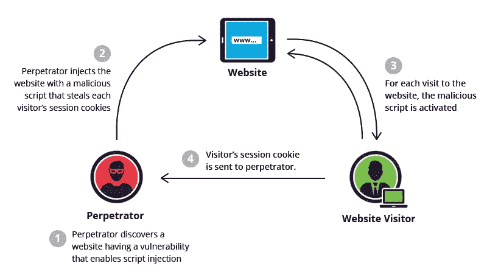

# 我最新的 XSS 发现，向初学者解释|臭虫赏金

> 原文：<https://infosecwriteups.com/my-latest-xss-finding-explained-to-beginners-bug-bounty-8674fa3626e7?source=collection_archive---------1----------------------->

我已经有一段时间没有写文章了，所以我认为为初学者写一篇文章是明智的。

所以首先我想回答一些问题，什么是**跨站点** **脚本(XSS)？**



imperva.com

**跨站点脚本(XSS)** 是一个众所周知的漏洞，它的出现是因为应用程序以不安全的方式接收用户输入。还有其他类型的 XSS 漏洞，但今天我要谈谈**反射** **跨站点脚本。**

许多想成为 bug 赏金猎人的人认为 xss 只是到处复制粘贴**并期望看到屏幕上弹出一个。xss 真正关心的是上下文。假设 XSS 上下文是一个 HTML 标签的属性值，你可以终止这个属性值，关闭这个标签，然后创建第二个标签来存储你的有效负载。不幸的是，在大多数情况下，尖括号将被阻止或编码。

**但是**如果您了解 XSS 上下文，您仍然可以终止属性值并创建一个新的属性来存储您的有效负载。即

```
" autofocus onfocus=alert(document.domain) x="
```

最后，我要谈谈我的发现。

我在 webarchive 上发现了一个错误页面，在 url 中有一个名为 result 的参数，但是站点没有显示任何内容。因此，我认为查看网站的源代码是明智的，幸运的是，参数反映在脚本标记内。如果您只是将*">*粘贴到参数中，您不会看到任何弹出窗口。您需要首先关闭脚本标记，并创建一个新的标记来存储您的有效负载。我在报告中用作概念验证的最终有效负载是

```
</script>">
```

**报告日期:2022 年 11 月 10 日**

审判日期:2022 年 11 月 11 日

**$$$赏金支付日期:2022 年 11 月 15 日**

在一天内审判，我在一周内得到了$美元的赏金。这是最快的付费报告之一。

## 来自 Infosec 的报道:Infosec 每天都有很多内容，很难跟上。[加入我们的每周简讯](https://weekly.infosecwriteups.com/)以 5 篇文章、4 个线程、3 个视频、2 个 GitHub Repos 和工具以及 1 个工作提醒的形式免费获取所有最新的 Infosec 趋势！