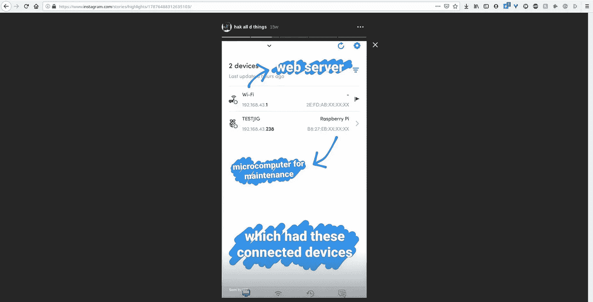
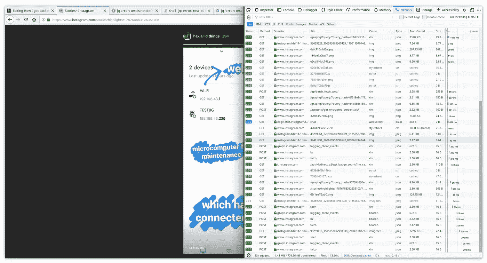
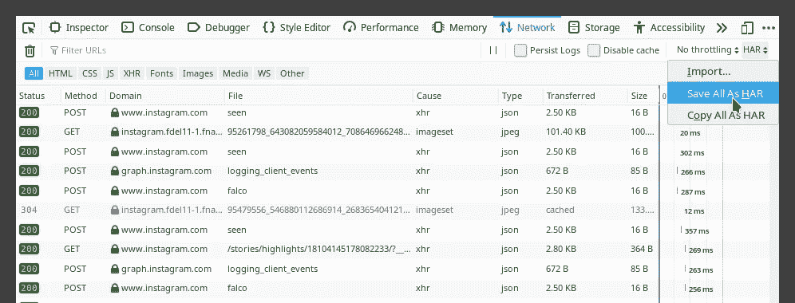
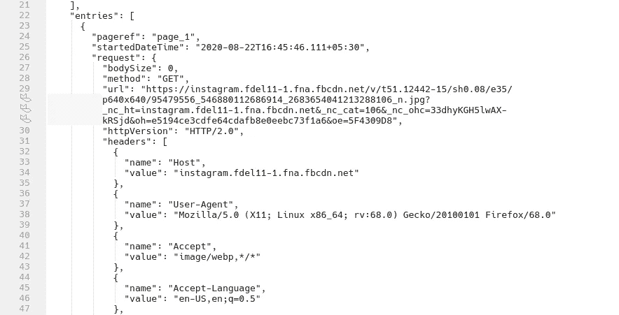
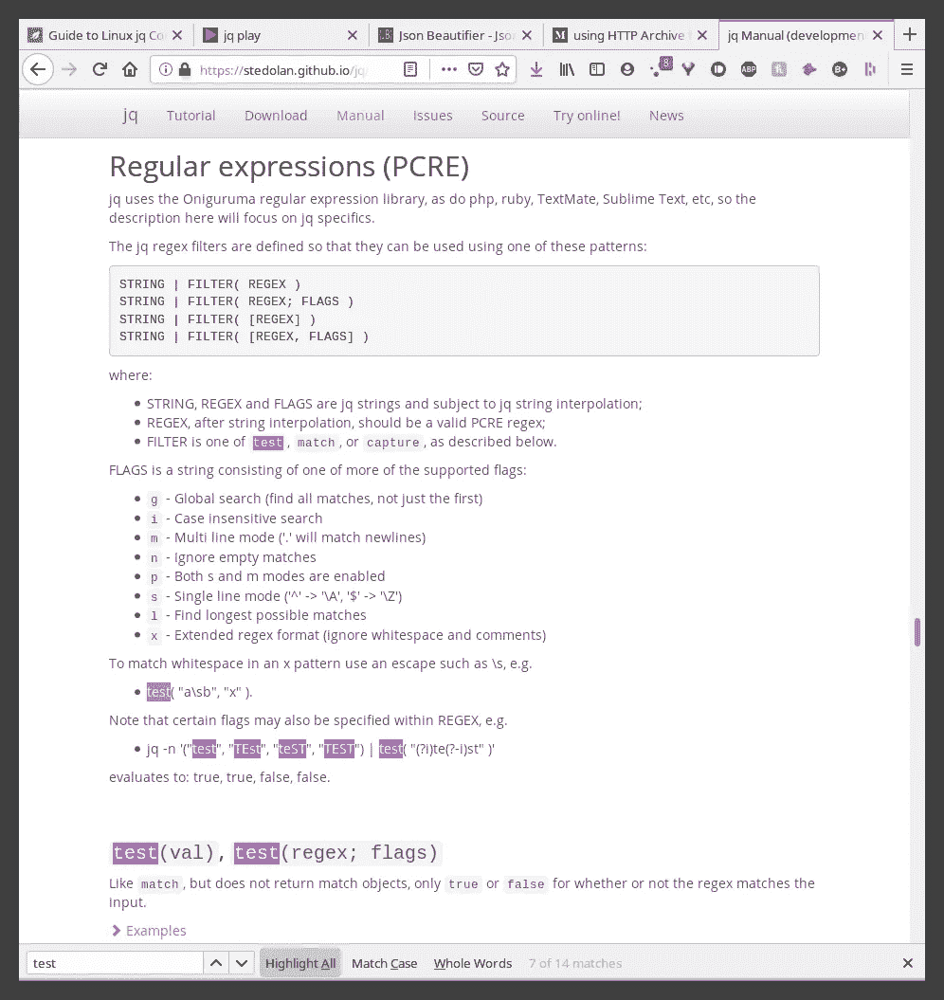
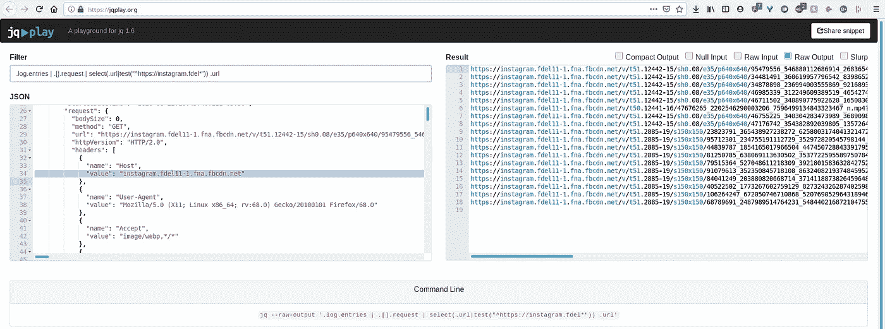

# 解决问题实际上是什么样子

> 原文：<https://infosecwriteups.com/my-personal-ctf-challenge-4016e9c176b3?source=collection_archive---------3----------------------->

## 自动售货机黑客的概念验证图像丢失。我是怎么把它们拿回来的？

诚实的博客横幅

**2020 年 8 月 9 日:**当我打开 Google 相册寻找概念验证的图片时，我开始拼凑我上周的帖子。不幸的是，我再也找不到它们了。然后，我记得工厂重置我的手机两个星期后，所以他们必须被删除，因为我不记得备份他们。但是你看了我上一篇文章，里面有那些图片。我是怎么把它们拿回来的？！…通过一个 **HTTP 存档**文件和一些令人惊叹的 Linux 工具。

我在 Instagram stories 上发布了一些大约 4000 年前黑客攻击的照片。幸运的是，我也将它们添加到了个人资料的高亮部分。

4000 年前

既然它们已经存储在 Instagram 服务器上，我只需要想办法把它们放到我的电脑上，因为应用程序菜单中没有“保存到设备”选项。我很快登录 Instagram web，看看他们是否有高亮显示功能，如果有，我可以使用最神奇的黑客软件获得这些图片的链接……开发者工具。

请注意域和文件类型

我打开控制台，查看带有源图像请求 URL 的 GET 请求。厉害！我现在可以下载图片了，…但是我应该下载吗？它们是九张图片，九个需要点击并手动保存的链接。数学太多了！我决定寻找一个自动化程度更高的解决方案，以防需要扩大规模。进入 HAR。

 [## HAR(文件格式)

### HTTP 存档格式，或 HAR，是一种 JSON 格式的存档文件格式，用于记录 web 浏览器的交互…

en.wikipedia.org](https://en.wikipedia.org/wiki/HAR_%28file_format%29) 

从未将它用于其原始目的，但这是一个良好的开端

这个 HTTP 存档文件可以从 Networks 选项卡中导出，它是一个 JSON 文件，包含关于浏览器加载的网页的详细性能数据。这将包括我感兴趣的图像请求 URL。我一直在寻找一种像这样收集请求 URL 的方法，并且我最终在这个约定中找到了它。

服务器一直在变化，所以这个 HAR 在几天后就过时了

在分析了 JSON 结构之后，我找到了我需要的请求 URL 值。就是主机为' insta gram . fdel 11–1 . FNA . FB cdn . net '的那个。我使用 jq 解析这个 JSON 数据，总共 15，566 行。我考虑过使用 grep 或 awk 或 sed，但我认为它们需要更多的调整。另外，我想在 jq 上做得更好，因为我以前只用过一次。

寻找字符串匹配技术

我花了一些时间研究如何遍历数组，为匹配 URL 的 T2 字符串创建一个正则表达式，并试图解决一个重复出现的“错误:测试未定义”。让我知道如果你设法解决这个问题，因为我不能让它在我的终端上工作。所以我求助于使用他们的[在线游乐场](https://jqplay.org/)进行测试……一个从 HAR 文件中提取直接图像 URL 的单行 bash 命令。另一个下载它们。

18 个网址，因为我不小心点击聊天时加载了个人资料图片

此时，我已经拥有了我需要的一切，包括一个 bash 脚本来检查 URL，并使用 wget 下载图像。因为剧本里一切看起来都很酷？！看看你的实验乐趣:p

只是它在我的机器上不能用。还没有。

这是现实世界中解决问题的一个例子。利用现有的随机知识，有时也学习新的知识，并以一种巧妙的方式将它们联系起来以获得结果。点击下面查看我上周的帖子，在那里我用这些图片来证明概念。

 [## 我是如何黑进你的自动售货机的

### 对我 4000 年前所做的一件事的详细记述

medium.com](https://medium.com/bugbountywriteup/its-not-hard-to-hack-smart-73c928a5276b)