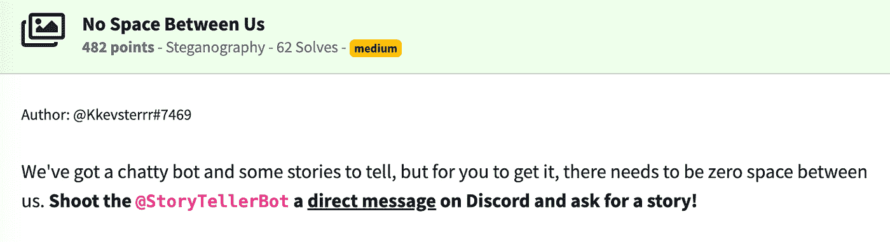
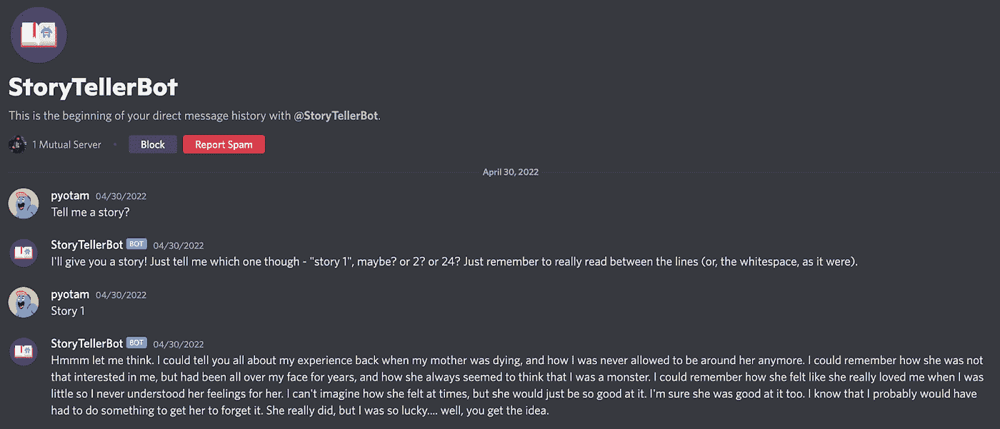
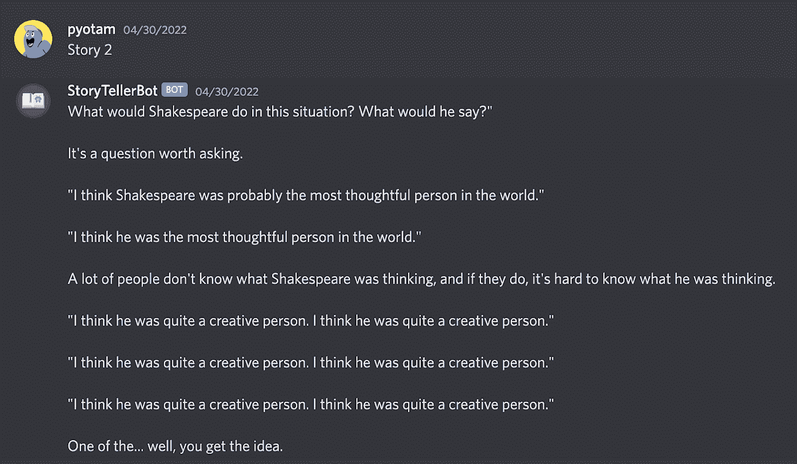
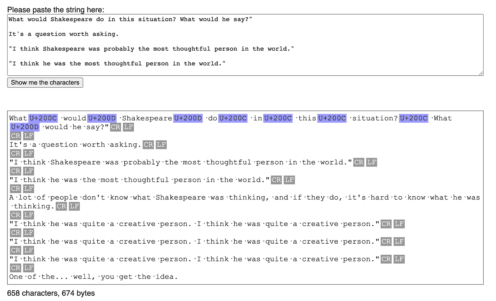
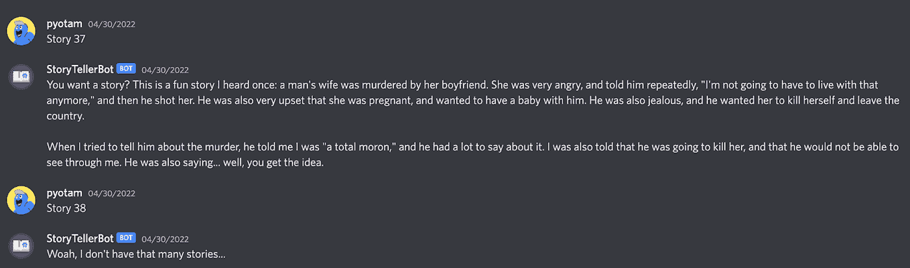
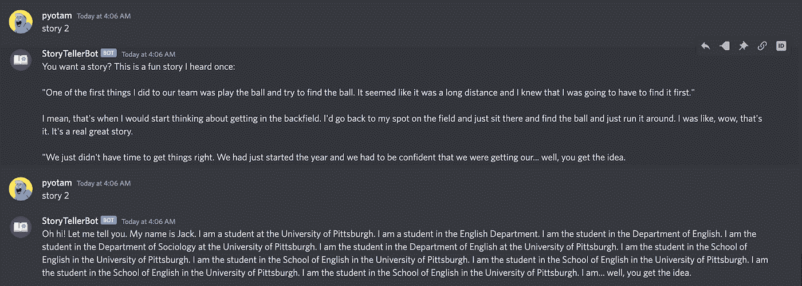
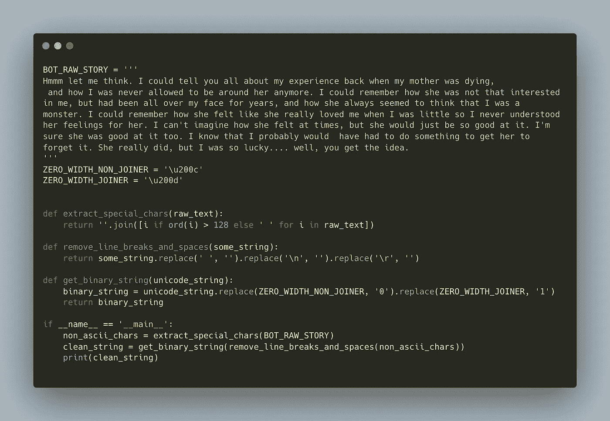
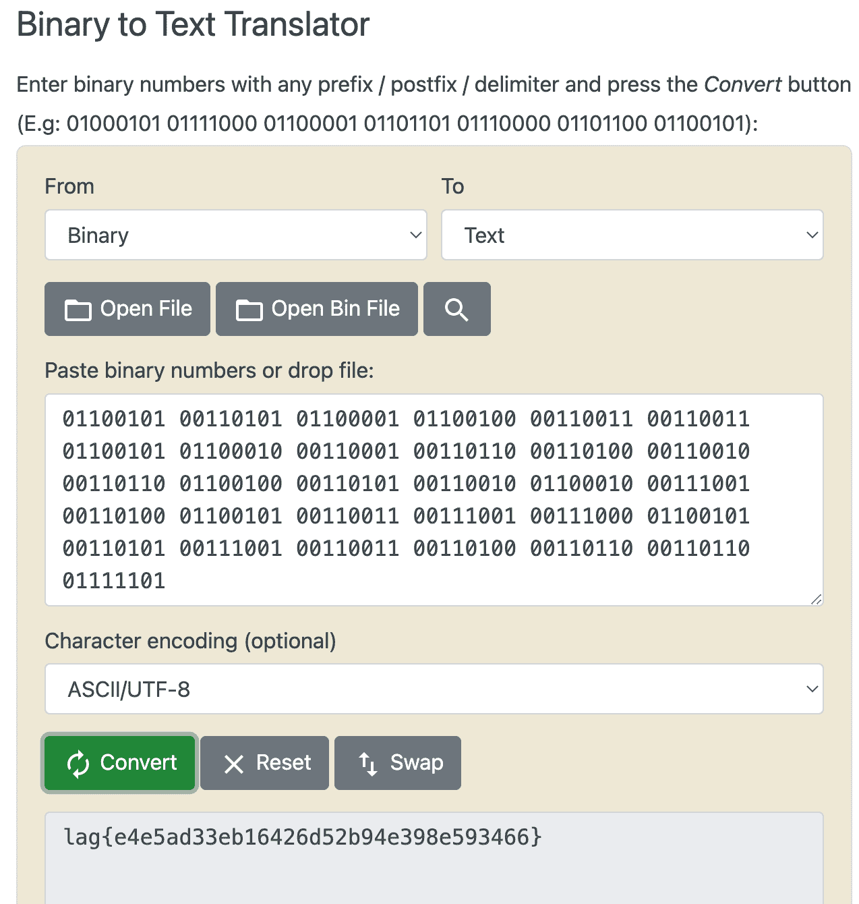

# NahamCon 2022 CTF 报道:“我们之间没有空间”挑战

> 原文：<https://infosecwriteups.com/nahamcon-2022-ctf-write-up-no-space-between-us-challenge-887965280f77?source=collection_archive---------0----------------------->

## 作为 2022 年 CTF naham con 的一部分，我解决“我们之间没有空间”挑战的方法和经验。参加 CTF 的 4000 多支队伍中，只有 62 支队伍解决了这一特殊挑战。

我最近参加了棒极了的 2022[CTF 纳哈姆康](https://ctf.nahamcon.com/)大会，这是由 [STOK](https://twitter.com/STOKFredrik) 、[约翰哈蒙德](https://twitter.com/_johnhammond)和[纳哈姆 Sec](https://twitter.com/NahamSec) 主办的[纳哈姆康](https://www.nahamcon.com/) **免费**虚拟安全会议的一部分。

这是我第一次参加 CTF，我只有几个小时的时间，所以我没能参加所有的挑战。我能够尝试的挑战是巨大的，我学到了很多。

在这篇博文中，我将分享我对**“我们之间没有空间”**挑战的解决方案(由 [@Kkevsterrr](https://twitter.com/kkevsterrr) 撰写)，并尝试描述我的思维过程，希望它能在你面临类似挑战时有所帮助。

## 让我们开始吧…

# 我们之间没有空间——穿行

挑战描述

正如你在挑战描述中看到的，在 CTF 的不和谐服务器中似乎有一个有创意的讲故事机器人，但描述中有趣的部分是句子的第二部分:
*“我们之间需要零空间”。*

在这一点上，我去了不和谐和 DM 的机器人。

作者照片

乍一看，我们看不出第一个故事有什么可疑之处。
当我向机器人询问故事#2 时，我注意到有多个换行符(行与行之间的空格)，这使得我认为对挑战的描述可能与解决方案有关。

作者照片

此时，我决定将这些故事复制到一个简单的基于网络的工具[中，该工具允许查看不可打印的字符(vim 也可以):](https://www.soscisurvey.de/tools/view-chars.php)

作者照片

我们可以看到确实存在换行符，但更有趣的是，我们还可以看到出现了几次``U+200C``和``U+200D`` Unicode 字符。

快速谷歌搜索发现，这些字符代表**零宽度加入者**和**零宽度非加入者**，它们都是[零宽度空格](https://en.wikipedia.org/wiki/Zero-width_space#:~:text=The%20zero%2Dwidth%20space%20(%E2%80%8B,but%20after%20which%20there%20may)的实例。

好的，从挑战的描述来看，我们似乎已经走上了正轨，但是我们怎样才能从这些角色身上得到一面旗帜呢？？

在这一点上，我不确定如何进行，所以我测试了一些基本假设。首先，我想知道这个机器人有多少故事？与机器人的快速互动显示它有 37 个故事:

作者照片

接下来，我想看看这些文字是有意义的还是随机的。当两次询问同一个故事时，我知道机器人每次都讲述不同的故事，但是零宽度字符序列保持不变。

作者照片

这意味着文本是不相关的，我们需要的只是特殊的 Unicode 字符。然而，我仍然不知道如何从这些特殊字符序列得到一面旗帜。

> **CTF 提示**:每当你觉得你在 CTF 挑战赛中有了一个好的方向，但你不确定如何继续，试着用“CTF”这个词和你认为你已经有的线索在谷歌上搜索一下。有时候，从其他类似的挑战中学习可以给你一个正确的方向。

在这种情况下，我做的搜索是: *`CTF 隐形空白`*。

作者照片

正如你所看到的☝️，第二个结果是一个链接到约翰·哈蒙德的 YouTube 视频。)，解释如何使用零宽度空格来隐藏秘密消息。

**宾果！**

看完视频，才知道特殊字符代表的是二进制位。因为我们在每个故事中有八个这样的字符，所以每八个二进制位的序列可能代表一个 ASCII 字符。如果我们将每个故事中的 8 位序列的 ASCII 表示组合起来，就有希望得到我们的标志。

是时候编写一些脚本来验证我们的假设了。
我编写了以下 Python 脚本，该脚本将原始的机器人故事文本作为输入，从中提取特殊字符，并将这些字符转换为二进制位序列:

作者照片

例如，对于☝️这个故事，脚本打印出以下二进制序列:`01101100`。

对所有的故事运行这个逻辑，并将结果粘贴到一个简单的基于 web 的二进制到 ASCII 的转换器[中](https://www.rapidtables.com/convert/number/binary-to-ascii.html)就能得到这个标志！
**大获成功！**

作者照片

正如你在截图中看到的，在这一点上，我从单词`flag`中漏掉了字母``f``。这让我意识到我错过了一个额外的故事——故事 0。
剩下的就是提交旗帜:`flag{e4e5ad33eb16426d52b94e398e593466}`

## 最终注释

我希望我已经能够传达我在解决这个挑战时所经历的思考过程，并且你喜欢阅读这篇文章。

我希望在不久的将来为我感兴趣的其他挑战写一些额外的博客帖子，我觉得从中可以学到一些东西。

我想借此机会对 CTF 组织者和挑战赛建设者所做的努力表示感谢。整个活动组织得非常好，我玩得很开心！

如果您有任何问题，请随时联系我们。

推特: [@pyotam2](https://twitter.com/pyotam2)