# NahamCon CTF 2022 报道:点击我！安卓挑战

> 原文：<https://infosecwriteups.com/nahamcon-ctf-2022-write-up-click-me-android-challenge-63ccba7cb663?source=collection_archive---------0----------------------->


约翰·哈蒙德 &很少有其他人在这个周末举办 CTF。我解决了 Android 挑战，这些挑战真的很有趣。我决定写下这个。

**挑战**

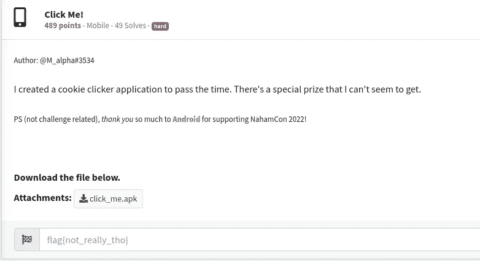

让我们下载并运行 **click_me.apk**

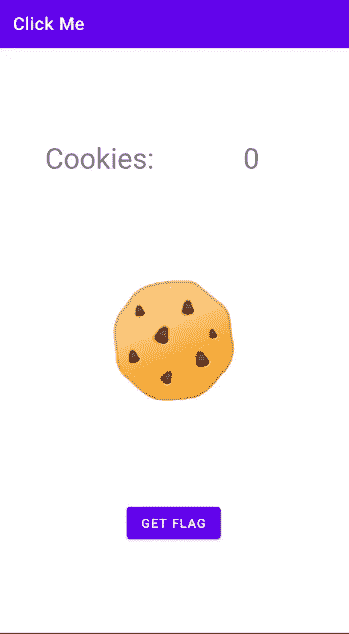

我们看到了这个屏幕，让我们单击 GET FLAG 按钮看看会发生什么。

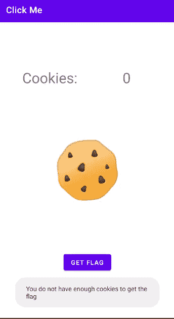

吐司上写着“你没有足够的饼干拿到旗子”。现在的问题是如何获得足够的饼干？

要回答这个问题，我们需要看看代码。

让我们用 [Jadx-GUI](https://github.com/skylot/jadx) 打开这个应用程序，并导航到 com . example . click me . main activity

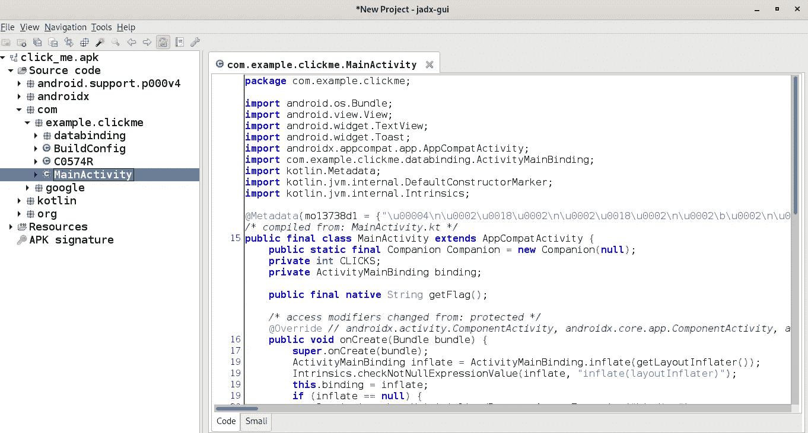

**主要活动**有两个我们感兴趣的功能。

**有趣的函数#1: getFlagButtonClick()**

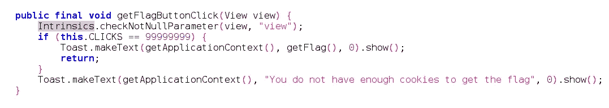

根据这个功能，我们需要点击按钮 99999999 次，以获得标志，否则我们会看到这条消息“你没有足够的 cookies 来获得标志”。

**有趣的函数#2: cookieViewClick()**

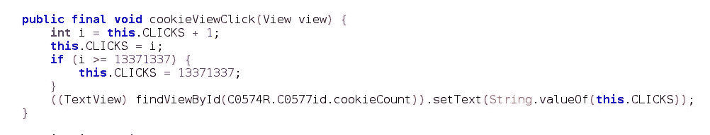

现在，该函数正在计算点击**获取标志**按钮的次数。但是如果我们看一下 if 条件，它不会让我们超过来自 1337133 号的点击次数。一旦我们点击超过 13371337 次，它将重置回 13371337。

因此，这是一个永无止境的条件，即使有人决定坐下来点击按钮几个小时！

当然，我们不会去那里。有什么简单的方法？

现在，可能有多种方法来解决这个挑战。使用 [FRIDA](https://frida.re/) 脚本或修改 [smali 代码](https://stackoverflow.com/questions/30837450/what-is-smali-code-android)。

这次我选择玩 smali 代码。

如果我们看看主活动的简单表示，它看起来像这样。

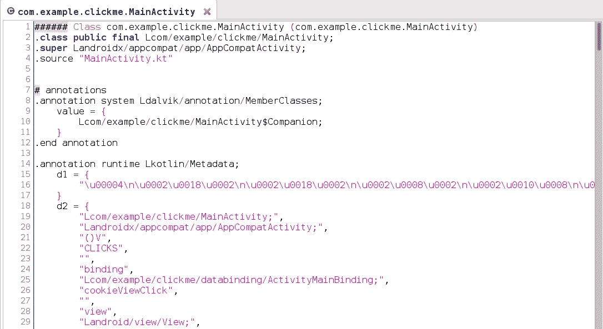

我们的目标仍然是这段代码中的 **getFlagButtonClick()** 方法。

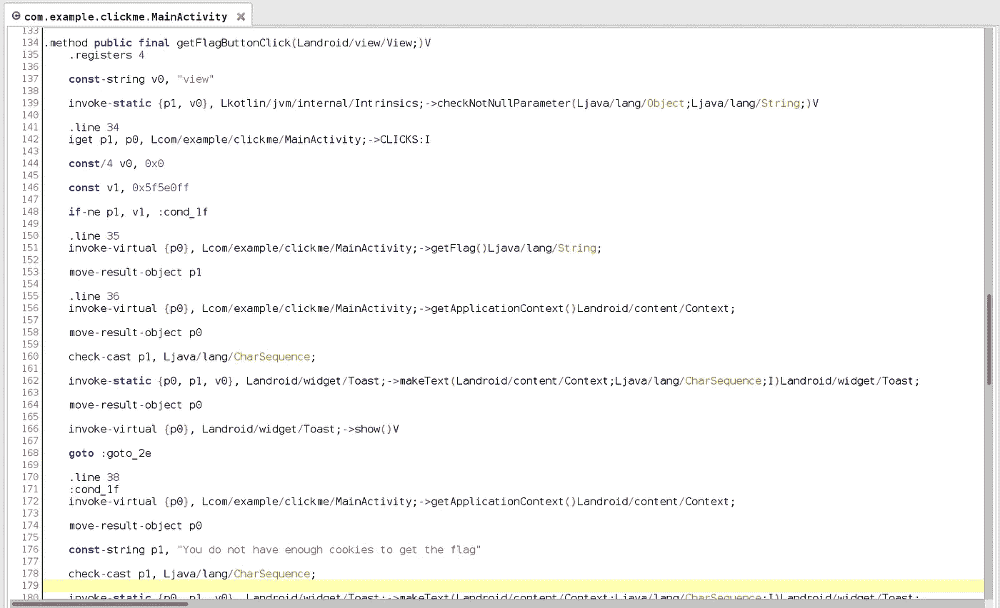

回到 **getFlagButtonClick()** 方法的 java 表示。


If-condition 表示按钮点击次数应该等于 99999999，以打印标志或“您没有足够的 cookies”将显示消息。

从技术上来说，可以从上述代码中的任何地方调用 **getFlag()** 方法。如果我们将 **getFlag()** 方法放在“您不…”消息的位置会怎么样？只要两者都是字符串，就不会有问题。

像这样..

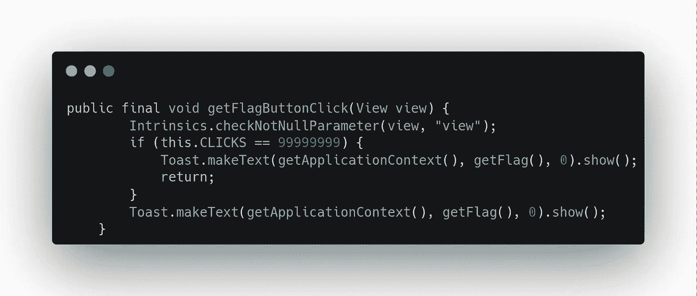

现在，每次都将打印该标志，而不检查任何条件。

但是我们不能在 java 中这样做，所以我们需要在 smali 代码中进行精确的修改。要修改 smali 代码，我们必须使用 APKTOOL 反编译应用程序。

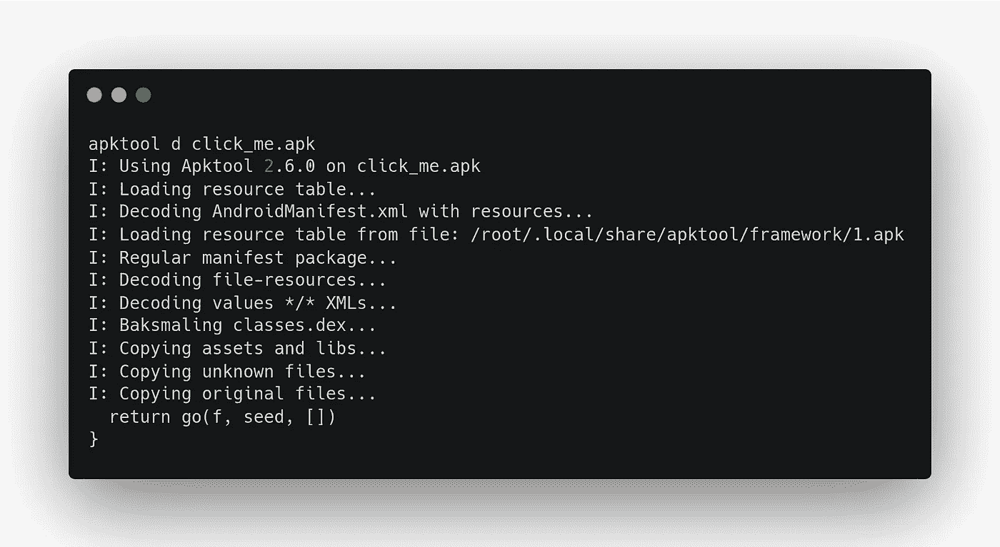

让我们打开 MainActivity.smali 并理解下面几行。

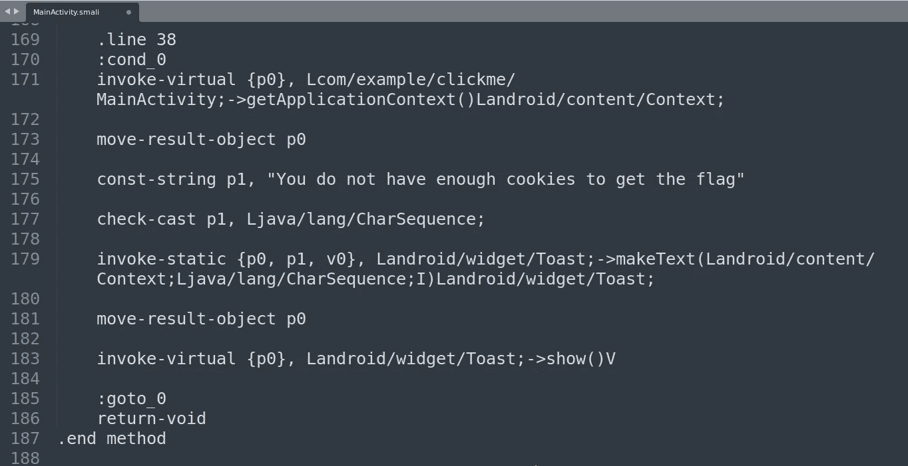

```
const-string p1, “You do not have enough cookies to get the flag”
```

这一行表示 p1 寄存器有字符串“你没有…”

```
invoke-static {p0, p1, v0}, Landroid/widget/Toast;->makeText(Landroid/content/Context;Ljava/lang/CharSequence;I)Landroid/widget/Toast;
```

上面一行将显示保存在 p1 寄存器中的值。

我们的目标是用 getFlag()方法的结果替换 p1 寄存器的值。

我们将添加下面一行来调用 getFlag()方法。

```
invoke-virtual {p0}, Lcom/example/clickme/MainActivity;->getFlag()Ljava/lang/String;
```

让我们将 getFlag()方法的输出存储到 p1 寄存器中。

```
move-result-object p1
```

最后，我们需要注释将预定义消息添加到 p1 寄存器的那一行。

```
# const-string p1, “You do not have enough cookies to get the flag”
```

修改后的代码将如下所示..

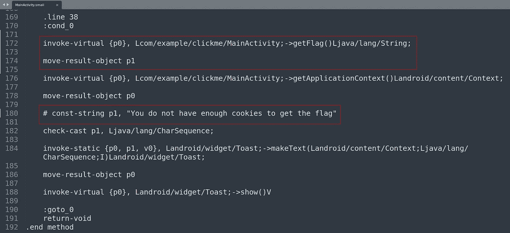

更改完成后，让我们重新构建 apk。

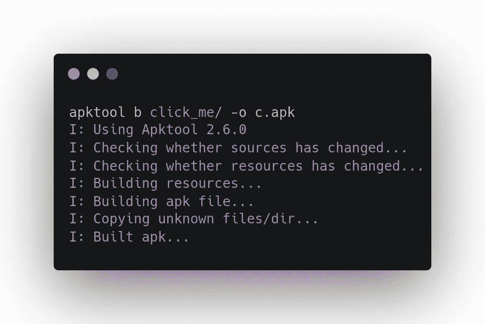

该应用程序需要重新签名，然后我们才能安装它。

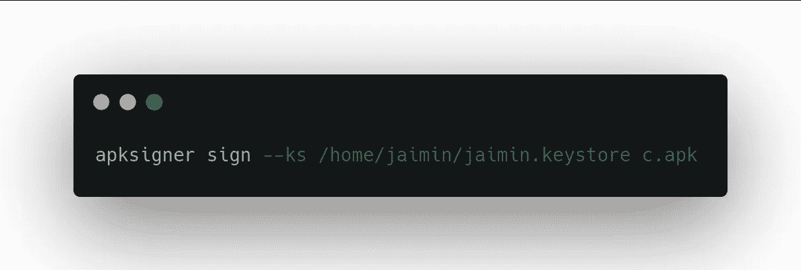

安装和运行修改后的应用程序。

` adb 安装 c.apk '


只要我们点击获取标志按钮，而不是消息，我们的标志将会显示。

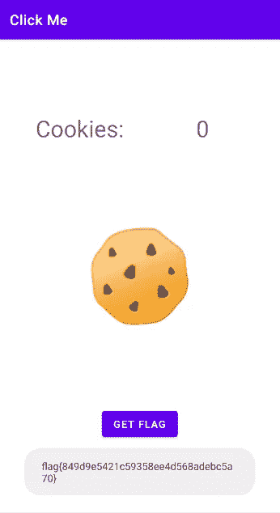

## 挑战解决了！

我喜欢写这篇文章，我希望你也喜欢阅读它。

**保持安全，快乐黑客:-)**

推特:[@ jaimin _ gohel](https://twitter.com/jaimin_gohel)
LinkedIn:[@ jaimin-gohel-440 a4 a52](https://www.linkedin.com/in/jaimin-gohel-440a4a52)