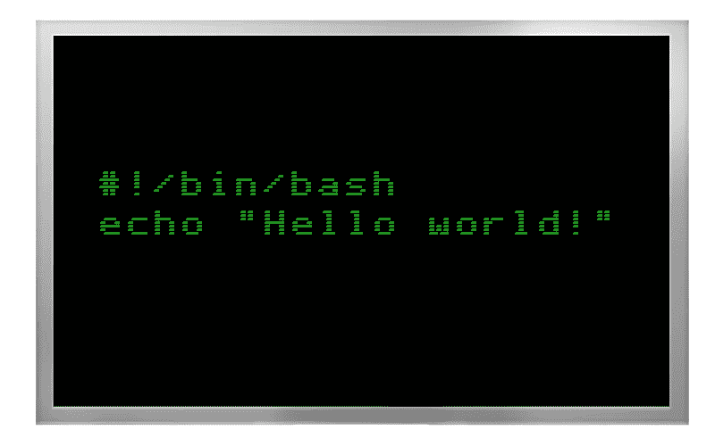
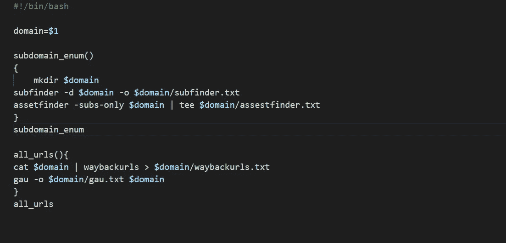

# 用 Bash 实现自动化:核心概念和实现

> 原文：<https://infosecwriteups.com/nailing-automation-with-bash-core-concepts-and-implementations-95a05a613a44?source=collection_archive---------0----------------------->

来源:谷歌图片

嗨，兄弟们，我希望你们都做得很好，每天都在学习新的东西。最近，我在 Twitter 上发布了一个 bash oneliner，它解决了你的一些自动化问题，我收到了很多关于如何使用 bash 的问题。许多人觉得很难理解，这完全没关系，没什么可担心的。这就是我写这篇博客的原因，如果它能帮助一些人理解 bash 自动化的基本概念。

那么，什么是 bash 脚本？Bash 是一个命令语言解释器。它在各种操作系统上广泛可用，并且是大多数 GNU/Linux 系统上的默认命令解释器。这个名字是'**B**ourne-**A**gain**SH**ell '的缩写。Shell 是一个宏处理器，它允许交互式或非交互式的命令执行。**脚本**是编写一个程序供外壳执行，而**外壳脚本**是外壳将要执行的文件或程序。这是对我们在这里所做的事情的基本理解。如果你想了解更多，我强烈推荐你关注这个博客: [**点击这里:**](https://medium.com/sysf/bash-scripting-everything-you-need-to-know-about-bash-shell-programming-cd08595f2fba#:~:text=Bash%20is%20the%20improved%20version,nano%20to%20edit%20a%20file.)

这个博客并不是要定义 bash 是如何工作的，也不是整个编程概念。它完全专注于奖金和东西的 Bash 自动化。在我们深入探讨之前，让我们看看一些需要记住的命令:

*   **Echo** : **echo** 是一个**命令**，它输出作为参数传递的字符串。
*   **Grep** : Grep **是**用来搜索指定文件中的一串字符串。文本搜索模式称为正则表达式。当它找到一个匹配时，它打印结果行。
*   **Sed** : Sed 对输入流(一个文件或来自管道的输入)执行基本的文本转换，只需通过流一次，因此非常高效。然而，sed 在管道中过滤文本的能力使其与其他类型的编辑器特别不同。
*   **AWK** : Awk 命令在文件中搜索包含模式的文本。当一行或文本匹配时，awk 对该行/文本执行特定的操作。
*   **Xargs:** Xargs 可用于构建和执行来自标准输入的命令。有些命令像 grep 可以接受输入作为参数，但是有些命令接受参数，这就是 xargs 的用武之地。

这些是我们将在本文中使用的一些命令。还有很多类似 **sort、tee、uniq、cat** 这样的命令，但是在这些命令的帮助下，我们可以做很多工作。我还将包括一些包含我们日常使用的自动化工具的一行程序。

那么，一个问题出现了，我们可以在哪里使用 bash 自动化？最好的地方是侦察部分。通过自动化许多事情和合并许多工具，您可以节省大量时间，这样您就不必单独使用每一个工具。下面是一个简单 bash 脚本的好例子:

这只是向您展示如何将多个工具合并在一起，以在一个地方获得所需的输出。这不是一个非常奇特的方法，但它肯定会节省你的一些时间。

另一个例子是，您可以编写一个简单的一行程序，并为此创建一个别名。*别名*是一个(通常很短的)名称，shell 将其翻译成另一个(通常更长的)名称或命令。别名允许您通过用字符串替换简单命令的第一个标记来定义新命令。例如，假设您有这样一个简单的单行脚本:

**echo " target . com " | nucleus-t/tools/nucleus-templates-o output . txt**

我们可以为这个 oneliner 创建一个别名，下一次，我们只需要提供一个目标，我们的工具就会处理它。如果你想了解更多关于别名的知识，这里有一篇文章可以帮到你: [**点击这里:)**](https://linuxize.com/post/how-to-create-bash-aliases/) 简单了解一下，打开你的**。bashrc** 文件，并像这样添加您的别名:

**别名域名= sub finder-d target.com-o output . txt**

把这个存进去之后。bashrc，当我们在终端那里输入**域**的时候，我们会得到和**sub finder-d target.com-o output . txt 一样的输出**这是别名的基本概念。还有更多的事情需要探索，我把如何提高自己的技能留给了你。让我告诉你，在别名的帮助下，你可以运行用 Python、Go 或任何其他语言编写的工具。只要定义好目录和清晰的语法，你就可以开始了。

我多次收到另一个问题，比如我们如何用 bash 创建一行程序，并在日常自动化中使用它们。嗯，这取决于您想创建哪种用途的一行程序。假设您想要获取所有的 URL，并且想要过滤其中的一些特殊单词，这个简单的 oneliner 将会有所帮助:

**cat target.txt | grep "？url=" | sort -u | tee output.txt**

在这里，它会抓取所有包含**的网址？url=** 参数。之后，我们将得到一个独特的排序输出文件，我们可以在那里做进一步的事情。在这里，如果您不知道**管道(| )** ，它会将您的输出传递给另一个命令进行进一步处理，这样我们就可以得到最后一个使用的命令的输出。 **tee** 命令通常用于分割程序的输出，这样它既可以显示，也可以保存在文件中。

以上是 bash 的一些基本用法。让我们看看其他一些命令，就像我们在博客前面讨论的那样。让我们举个例子:

**sed 's/ab/abc/g' file.txt**

这是一个非常基本的 **sed** 命令的例子。我们在这里所做的是，我们正在替换 file.txt 中所有的 **ab** 到 **abc** 。如果你深入思考，这在你为蛮力者创建一个 oneliner 时会非常方便。sed 中的 **s** 字符代表**替代**,**g**代表**全局**。现在，如果你理解了这个游戏，我们可以写一个小的单行程序来做一个子域蛮干:

**echo " target . com " | sed 's#^#**[**http://# '**](http://#')

在这里，^用于标记一行的第一个字符。

你也可以使用 awk。正如我已经提到的 awk 的作用，让我们看一个使用 awk 的简单 bash 一行程序:

**cat file.txt | awk '{print NR，length($ 0)；}'**

awk 在这里要做的是，它将打印行号和每行的字符数。所以现在你可以弄清楚如何用 awk 来自动化你的侦察工作。这些是您可以用来提高自动化技能的一些命令。

现在，这里有一些非常有用的一行程序示例:

**cat domains . txt | gau | cut-d "/"-f 4，5 | sed 's/？。*//' | sort -u**

这个 oneliner 将从 domain.txt 中获取所有数据，通过 gau 传递，并制作一个大的目录列表。稍后，你可以找到一些有用的。我们使用了切割命令，该命令从线中切割零件，并将输出发送到 sed。我们已经使用 sort -u 对唯一的进行了排序。

这个 oneliner 包含已经可用的工具，我们使用管道将一个工具的输出发送到另一个工具:

**echo " domain . com " | waybackurls | httpx-silent-time out 2-threads 100 | gf redirect | anew**

这个小的一行程序要做的是，它将把 domain.com 发送到 [**waybackurls**](https://github.com/tomnomnom/waybackurls) ，在那里我们将获得 waybackmachine 上所有可用的 URL。之后，它使用一个名为 [**httpx**](https://github.com/projectdiscovery/httpx) 的工具来查看哪些域是活动的，哪些是不活动的。然后 httpx 数据将被发送到 [**gf**](https://github.com/tomnomnom/gf) 工具，带有 [**模式**](https://github.com/1ndianl33t/Gf-Patterns) 用于检查重定向。最后，最终的输出将被转换成新的行，用 [**重新**](https://github.com/tomnomnom/anew) 帮助你在文件中添加新的行。

现在，最精彩的部分来了。你可以创建一个 **recon.sh** 脚本，它将包含这里提到的所有一行程序，一旦它被执行，你将节省很多时间。不仅如此，你可以为他们中的每一个创建一个别名或者任何你想要的方式。主要目的是，编写一些一行程序，用它们创建一个脚本并一次性运行。没有火箭科学。是的，为了更好地理解 bash，我强烈建议学习它。如果你也希望如此，udemy 的这门课程可以提供帮助，最棒的是它完全免费:[**Bash scripting**](https://www.udemy.com/course/linux-unix-shell-scripting-tutorial/?ranMID=39197&ranEAID=JVFxdTr9V80&ranSiteID=JVFxdTr9V80-zbiIwb8MzzF4I.S0JKla_w&LSNPUBID=JVFxdTr9V80&utm_source=aff-campaign&utm_medium=udemyads)**。你也可以查看 JavaTpoint 的 bash learning。**

我希望这篇博客能教你一些 bash 的基本概念。如果你想深入了解，我把它作为一项任务留给你，因为博客不可能涵盖所有内容，我也不想把它搞得太大。这只是为了让您理解如何在自动化中使用 bash 的基本思想。另外， **sed 和 awk 本身就很庞大**，它们包含了很多用途。事实上，awk 是一个完整的工具，可以在 bash 中单独使用。然而，你有足够的时间访问谷歌，探索那里的东西。老实说，学习 bash 并在黑客中实现它也非常有趣和令人惊奇。我敢打赌，一旦你学会了一些 bash，你就会开始爱上它。

这将是这个博客，我希望你喜欢它。如果您对此有任何疑问、问题或建议，请在 [*twitter*](http://twitter.com/manasH4rsh) :)上给我发个 dm，我将永远乐意协助/学习。

保重，快乐黑客！

Adios❤

推特: **@manasH4rsh**

领英:[**https://www.linkedin.com/in/manasharsh/**](https://www.linkedin.com/in/manasharsh/)