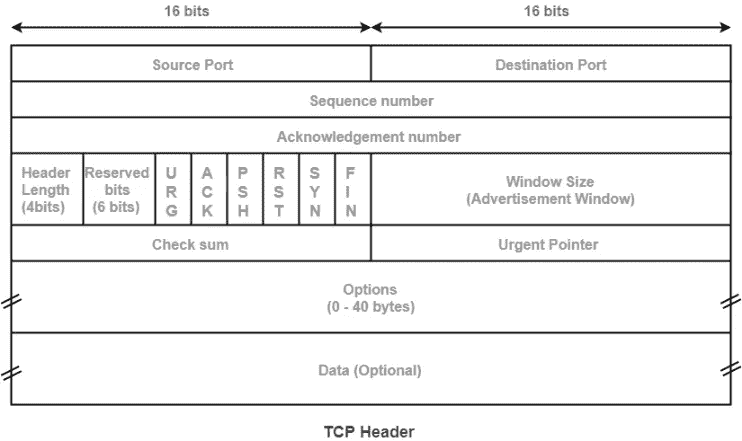

# 理解 NMAP 方法—第一部分

> 原文：<https://infosecwriteups.com/network-mapping-part-1-112116ce6555?source=collection_archive---------1----------------------->

## 从初级到高级理解 NMAP 方法论

## 描述:

我们将在多篇文章中从初级到高级学习 Nmap 网络映射。今天，我们将讲述基本扫描，并了解 Nmap 实际上是如何在幕后工作的。


网络映射

在您开始之前，**您可以加入我们的 discord 服务器，与志同道合的人交流，分享您可以与他人分享的一切，以帮助他们，并让人们回答您的问题。**

[](https://discord.gg/VKJSmqDN5P) [## 加入赛博空间不和谐服务器！

### 查看 Discord 上的 CyberVerse 社区——与 106 名其他成员一起玩，享受免费语音和文本聊天。

不和谐. gg](https://discord.gg/VKJSmqDN5P) 

# 了解基础知识

## 手抖

在开始 Nmap 和扫描之前，了解网络实际上是如何工作的很重要。当我们访问任何网站或访问互联网上的任何服务时，我们的浏览器会访问该网站并询问:**“我能与你连接吗？”**如果网站或服务可用，它会说:**“是的，请你可以。”**然后我们的浏览器会说，**“谢谢。”它将加载网站。用专业术语来说，一个**“握手”**过程在幕后发生。**

## 什么是 TCP 报头？

TCP 报头包含有关连接和通过连接发送的当前数据的信息，包括源端口、目的端口、标志、数据等等。这里重要的部分是在扫描主机时设置标志。



握手过程是通过设置数据包报头中的标志来完成的。服务或主机给出的响应可以通过它们设置的标志来识别，并且通过理解该过程，人们可以非常容易地理解网络扫描过程。

## 什么是端口？

端口是计算机或计算机外围设备之间进行通信和连接以传输信息和数据的逻辑或物理接口。计算机或计算机外围设备中有 65，535 个可能的端口号。

# 基本扫描

现在我们知道了连接过程和握手过程是如何工作的。现在我们可以继续下去，看看 Nmap 是如何在幕后工作的。

# 1.TCP 连接扫描

TCP 连接扫描是一种面向连接的扫描，遵循三次握手过程来确定给定端口是否打开。

```
nmap -ST <ip># -ST : TCP connect scan
```

当我们使用上述命令时，Nmap 在几个端口上向指定的 IP 发送 SYN(同步)数据包。如果一个端口是开放的，那么它将使用 SYN/ACK(同步/确认)数据包进行响应，表明服务或端口已准备好连接和开放。然后，Nmap 发送 ACK 数据包来确认连接。

如果端口没有打开，那么我们将收到一个带有 RST(重置)数据包而不是 SYN/ACK 数据包的响应，这表明端口已关闭。这就是 TCP 连接扫描的工作原理。但是这种类型的扫描会在目标主机上留下指纹。

# 2.TCP SYN(秘密)扫描

TCP SYN 扫描不遵循三次握手过程。这降低了扫描被记录的几率。

```
nmap -sS <ip># -sS : TCP SYN stealth scan
```

当使用上述命令时，Nmap 在几个端口上向指定的 IP 发送 SYN(同步)数据包。如果一个端口是开放的，则它将使用 SYN/ACK(同步/确认)数据包进行响应，该数据包指示服务或端口已准备好连接并开放，但 Nmap 不是发送 ACK 数据包，而是发送 RST(重置)标志并重置连接。这就是 TCP SYN 扫描的工作原理。

# 3.UDP 扫描

与 TCP 不同，UDP 是一种无连接协议。作为无连接协议，它在建立到目标的连接时不遵循握手。

```
nmap -sU <ip># -sU : UDP scan
```

无法保证监听 UDP 端口的服务会响应我们的数据包。如果收到的数据包是 ICMP 端口不可达，则该端口关闭，如果没有响应，则我们可以认为它是一个开放或过滤的端口。

这就是今天的文章。如果你觉得它有趣且有启发性，那就和你的朋友分享吧。谢谢你读到这里。让我知道你的问题或者你想在回复部分阅读的文章的主题。

> part-2:[https://medium . com/@ sudo 0x 18/understanding-the-nmap-methodology-part-2-3d 0442 f1 c 482](https://medium.com/@sudo0x18/understanding-the-nmap-methodology-part-2-3d0442f1c482)

你可以在这里的社交媒体上关注: [LinkedIn](https://www.linkedin.com/in/jay-vadhaiya-3b74531b1/) ， [Instagram](https://www.instagram.com/mr.jv_2407/) ， [Twitter](https://twitter.com/sudo0x18)

## 来自 Infosec 的报道:Infosec 每天都有很多内容，很难跟上。[加入我们的每周简讯](https://weekly.infosecwriteups.com/)以 5 篇文章、4 个线程、3 个视频、2 个 GitHub Repos 和工具以及 1 个工作提醒的形式免费获取所有最新的 Infosec 趋势！