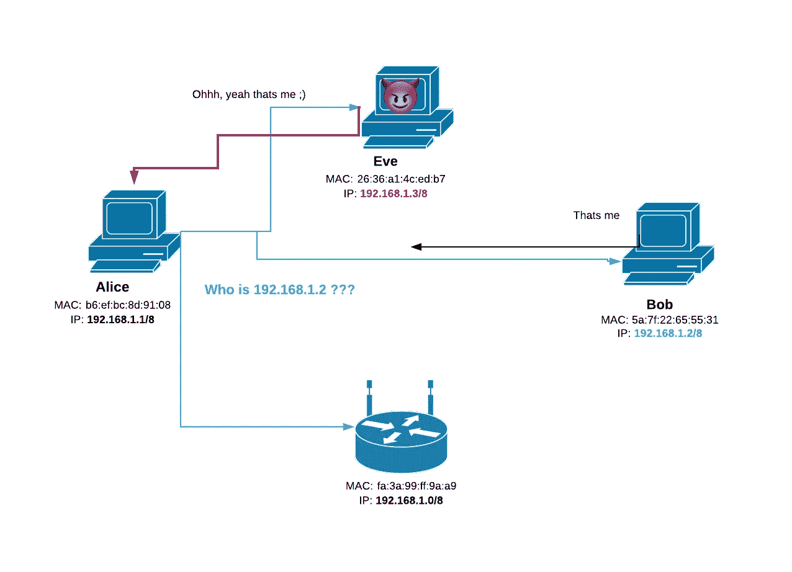
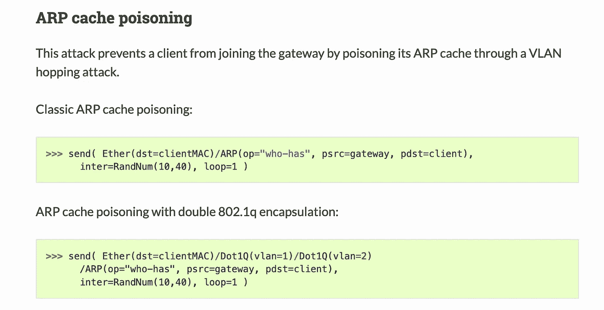
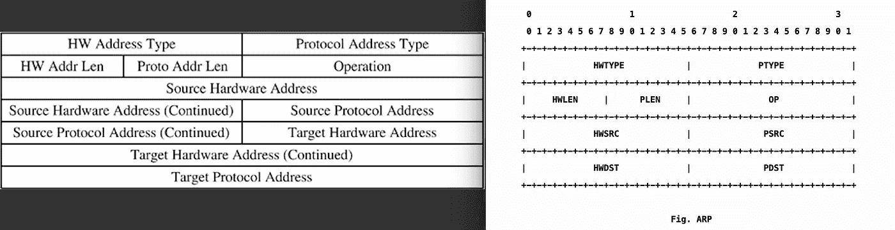

# 网络基础:什么是地址解析协议，如何破解

> 原文：<https://infosecwriteups.com/networking-basics-what-is-the-address-resolution-protocol-and-how-to-hack-it-96c30ccea14c?source=collection_archive---------0----------------------->

## 使用 Python 的 ARP 介绍和 ARP 欺骗/代理攻击教程

## 地址解析协议(ARP)简介

ARP 代表地址解析协议，是网络用来将系统的 IP 地址映射到计算机上的物理地址(也称为 MAC 地址)的协议。

您可以将 MAC 地址视为唯一的序列号，用于在世界上标识您的机器。它通常是 42 或 64 位标识符，需要通过 WiFi 或以太网在本地连接上进行通信。

而互联网协议(IP)地址可以被认为是唯一的系统标签，用于标识您在网络中的位置，以便其他计算机知道如何通过其他网络与您通信。IP 地址通常是动态的，这意味着当你进入一个网络时(例如打开你的笔记本电脑访问工作 WiFi),[DHCP](https://www.lifewire.com/what-is-dhcp-2625848)将为你提供一个新的 IP 地址(并不总是这样！).你可以在这里阅读更多关于静态和动态 IP 地址的信息:【https://whatismyipaddress.com/dynamic-static[。](https://whatismyipaddress.com/dynamic-static)

> “为了进一步解释，我们假设您的 MAC 地址是您的物理邮箱，您的 IP 地址是您的邮政地址，互联网是您的邮局，路由器是您的邮政运营商。现在你的邮局会知道你的邮政地址，并能够给你发送一封邮件。然后你就可以通过邮递员接收邮件了。由于您的邮箱和邮政地址都在邮件的接收端，我们可以说邮政承运人知道您的地址和邮箱，但您的邮局不知道，除了您的邮政地址。”—[https://they difference . com/difference-a-MAC-Address-and-a-IP-Address/# IP _ Address](https://theydiffer.com/difference-between-a-mac-address-and-an-ip-address/#IP_Address)

## 如果 MAC 地址是唯一的，为什么我们需要 IP 地址？

要让网络将数据包(数据)传送到您的计算机，它必须知道如何在每个外部网络之间传输，以将信息传送到您的本地网络，然后最终传送到您的物理机。诸如 [BGP](https://medium.com/bugbountywriteup/bgp-the-weak-link-in-the-internet-what-is-bgp-and-how-do-hackers-exploit-it-d899a68ba5bb) 之类的路由协议使用 IP 地址来确定外部网络之间数据包的下一个目的地。这是通过查看 IP 地址并确定最长的前缀匹配来完成的。与 IP 地址不同，MAC 地址没有层次结构；因此，网络不知道将数据包转发到哪里。

## **ARP 是如何工作的？**

这个视频很好地解释了 ARP 是如何工作的，但是对于那些想要快速运行的人来说，请继续阅读。

**场景**:电脑 A、B、C、D 都在同一个局域网内(比如你家)。计算机 A 希望向计算机 b 发送信息，让我们看看这是如何做到的。

1.  计算机 A 检查其 ARP 缓存，以确定它是否可以将目标 IP 地址映射到 MAC 地址(也称为计算机 B)。*(注:运行* `*arp -an*` *)检查你机器的 ARP 缓存*
2.  如果地址没有列在 ARP 缓存中，那么计算机 A 通过整个网络发送广播消息，询问该 IP 地址的所有者。(*注意:广播消息是用 FF-FF-FF-FF-FF-FF 的 MAC 地址*创建的)
3.  然后，该 IP 地址的所有者将包含与该 IP 地址相关联的 MAC 地址的 ARP 数据包发送回计算机 a。
4.  收到请求后，计算机 A 将 MAC 地址存储在其 ARP 缓存中，现在可以与计算机 B 通信，直到缓存过期。

## ARP 欺骗的基础知识

现在我们知道了两台计算机之间的通信是如何开始的，我们如何利用这一点呢？ARP 请求是一个未经验证的请求，这意味着任何设备都可以自由回复并声明自己是该 IP 地址的所有者。这将允许攻击者谎报 ip 地址的所有权，发回 ARP 回复，并导致发送者错误地更新其缓存，这意味着将来发送的信息将发送给攻击者，而不是预定的目标。这可能是执行拒绝服务(DOS)攻击的有效方式。或者，攻击者可以设置一个 ARP 代理，基本上是在两台计算机之间的任何通信中充当中间人，而它们中的任何一台都不知道。

## **如何进行 ARP 欺骗**

理论已经足够好了，让我们深入了解一下，并实际执行一次 ARP 欺骗攻击。为此，我将使用 python 3 作为语言选择，因为它有强大的 Scapy 库。

这个脚本将利用 Scapy 库。这是他们网站上对 Scapy 的描述:

> Scapy 是一个强大的基于 Python 的交互式包操作程序和库。它能够伪造或解码大量协议的数据包，通过网络发送它们，捕获它们，使用 pcap 文件存储或读取它们，匹配请求和回复，等等。

[https://scapy . readthe docs . io/en/latest/usage . html #简单的一行程序](https://scapy.readthedocs.io/en/latest/usage.html#simple-one-liners)

让我们试着理解这里发生了什么。从顶部的一行我们可以看到，我们发送了两个数据包。一个[以太网帧](https://www.networkworld.com/article/3225865/ethernet-frames-and-packets-whats-the-difference.html)正在被发送到目的 MAC 地址`clientMac`并且一个 ARP 数据包也正在被发送(该`/`被用来堆叠数据包)。但是在这个 ARP 数据包中使用的所有这些附加参数是什么呢？要理解这一点，我们需要了解 ARP 数据包是如何构造的，以及 Scapy 如何理解 ARP 数据包。

左边和右边的 ARP 数据包是 Scapy ARP 数据包

现在我们知道`psrc`是我们设置给`gateway IP`的源协议地址。`pdst`也表示被设置为`client IP`的目标/目的地协议地址。`op` param 是一个 enum，对于 ARP 请求(默认)它的值为 1，对于 ARP 回复它的值为 2。

最后，我们在`send`函数上设置了几个参数，即`inter`和`loop`。Inter 用于指定发送每个数据包的时间间隔(以秒为单位),而 loop 是不言自明的。

*注:见* [*此处*](https://scapy.readthedocs.io/en/latest/api/scapy.layers.l2.html#scapy.layers.l2.arpcachepoison) *有一个简单的函数可以毒化 ARP 缓存。*

## 创建 ARP 欺骗脚本

使用上面讨论的所有内容，并借助 scapy 的强大功能，我们可以创建一个脚本来欺骗本地网络和网关上的任何目标，让自己成为中间人。这是如何做到的:

ArpSpoofer.py

*免责声明:请勿将上述脚本用于任何非法活动。这纯粹是出于教育目的，我不负责因执行上述脚本而导致的任何损害。*

*关注* [*Infosec 报道*](https://medium.com/bugbountywriteup) *获取更多此类精彩报道。*

 [## 信息安全报道

### 收集了世界上最好的黑客的文章，主题从 bug 奖金和 CTF 到 vulnhub…

medium.com](https://medium.com/bugbountywriteup)